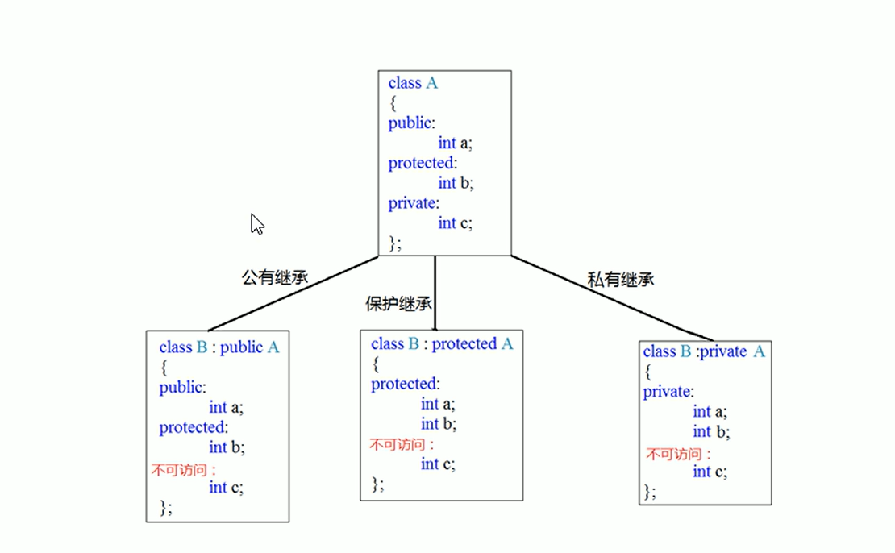

# 类和对象

## 创建类

```cpp
#include <iostream>
#include <string>
class Student {
    public:
    std::string name; // 使用 std::string 默认构造函数初始化为空字符串
    std::string id; // 同上
    void set_name(const std::string& c_name) {
        name = c_name;
    }
    void set_id(const std::string& c_id) {
        id = c_id;
    }
    void show_info() {
    // std::string 为空的检测应使用empty()函数
        if (!name.empty() && !id.empty()) {
            std::cout << "name: " << name << " id: " << id << std::endl;
        }
        else {
            std::cout << "the information of the student is not input!";
        }
    }
};
```

## 类的权限

1. public （公共，类内类外都可以访问）
2. protected （私有，子类可以继承）
3. private （私有，子类也不可以继承）

## 创建对象的方法

```cpp
class Person{
    Person(int age){
        m_age = age
    }
};
```

1. 括号法 `Person(10)`
2. 显示法 `Person a = Person(10)`
3. 隐式转换法 `Person a = 10 <==> Person a = Person(10)`

## 类包含的内容

```cpp
class Person{
    int age; //非静态成员变量，占对象空间
    static int height; //静态成员变量，不占对象空间
    void get_age(){
        std::cout << age << std::endl;
    } //非静态成员函数，不占对象空间
    static void get_height(){
        std::cout << height << std::endl;
    } //静态成员函数，不占对象空间
}
int Person::height;
```

## 常系列

1. 常函数只能修改含 mutable 的变量
2. 常对象只能调用常函数

## 运算符重载

- 加法运算符
- 递增运算符
- 赋值运算符
- << 运算符
- 括号运算符（仿函数）

## 继承

### 继承的实现语法

class 子类：关键词（publib， protected， private） 父类 {}；

### 继承的关键词的类型及含义



### 多继承

```cpp
#include <iostream>

class Egg{
    public:
    void egg(){
        std::cout << "add egg" << std::endl;
    }
};

class Rice{
    public:
    void rice(){
        std::cout << "prepare rice" << std::endl;
    }
};

class EggRice: public Egg, public Rice
{
    public:
    EggRice(){
        rice();
        egg();
        std::cout << "it's ok!" << std::endl;
    }
};

int main(){
    EggRice eggrice;
    return 0;
}
```

## 多态

多态：一个接口有多个形态
多态的主要目的在于能直接利用一个父类，然后利用指针指向不同的子类，从而来调用不同的方法。它能实现程序中的开闭原则：
开闭原则指的是可以添加新功能，但不能直接修改之前的代码。


## 纯虚函数和抽象类

```cpp
class animals{
    public:
    virtual void func() = 0;
    //纯虚函数的定义，有一个纯虚函数的类属于抽象类，抽象类不可以实例化对象。
    //抽象类的子类要重写父类中的纯虚函数，否则也属于抽象类。
};
```

## 多态的综合案例

```cpp
#include <iostream>

class Cpu{
    public:
    virtual void calculate() = 0;
};

class Gpu{
    public:
    virtual void display() = 0;
};

class Memory{
    public:
    virtual void storage() = 0;
};
class IntelCpu: public Cpu{
    public:
    virtual void calculate() {
        std::cout << "intel cpu is calculating..." << std::endl;
    }
};

class IntelGpu: public Gpu{
    public:
    virtual void display() {
        std::cout << "intel gpu is displaying..." << std::endl;
    }
};

class INtelMemory: public Memory{
    public:
    virtual void storage() {
        std::cout << "intel memory is memorying..." << std::endl;
    }
};
class IntelCpu2: public Cpu{
    public:
    virtual void calculate() {
        std::cout << "intel2 cpu is calculating..." << std::endl;
    }
};

class IntelGpu2: public Gpu{
    public:
    virtual void display() {
        std::cout << "intel2 gpu is displaying..." << std::endl;
    }
};

class INtelMemory2: public Memory{
    public:
    virtual void storage() {
        std::cout << "intel2 memory is memorying..." << std::endl;
    }
};
class Computer{
    public:
    Cpu* cpu;
    Gpu* gpu;
    Memory* memory;
    Computer(Cpu* cpu, Gpu* gpu, Memory* memory){
        this->cpu = cpu;
        this->gpu = gpu;
        this->memory = memory;
    }
    void start(){
        this->cpu->calculate();
        this->gpu->display();
        this->memory->storage();
    }
    ~Computer(){
        std::cout << "now is running ~Computer()" << std::endl;
        delete this->cpu;
        delete this->gpu;
        delete this->memory;
    }
};

int main(){
    Computer first_computer(new IntelCpu, new IntelGpu, new INtelMemory);
    Computer secend_computer(new IntelCpu2, new IntelGpu2, new INtelMemory2);
    Computer third_computer(new IntelCpu, new IntelGpu2, new INtelMemory2);
    first_computer.start();
    std::cout << "------------------------------" << std::endl;
    secend_computer.start();
    std::cout << "------------------------------" << std::endl;
    third_computer.start();
    std::cout << "------------------------------" << std::endl;
    return 0;
}
```
