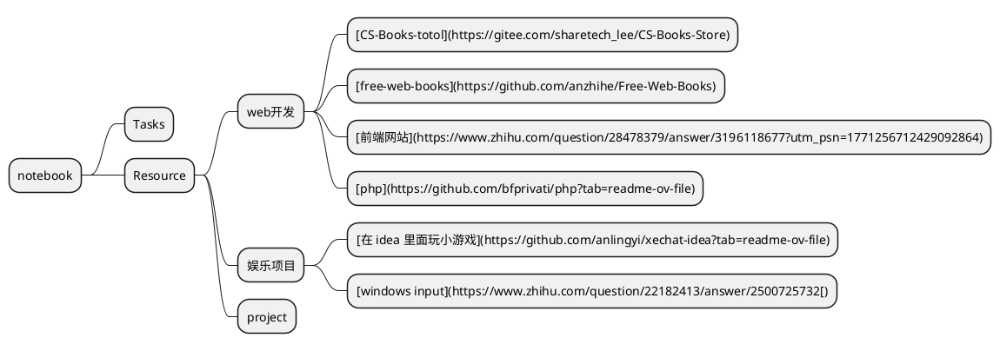

#  Tasks

- [ ] ...
- [ ] emacs-eaf安装使用
- [ ] 学习使用emacs写邮件以及发送邮件
- [ ] 学习js剩下的一些内容，主要涉及AJAX
- [ ] [学习这个系列的emacs配置教程](#专业 Emacs 入门（十）：笔记系统 org-mode)
- [x] [学习python-markdown](#python-markdown)
- [x] [学习nodejs](#运行环境)
- [x] 域名备案完成
- [ ] 银行卡认证
- [x] [阅读typora主题的配置文件](#typora 自定义 css)
- [ ] [learn mini video](#mini video)
- [x] [emacs web-mode](https://web-mode.org/)配置
- [x] [修改emacs配置文件](#emacs修改配置文件)
- [x] [学习正则表达式](#正则表达式)
- [x] [emacs写xhtml的插件的安装与使用](#emacs迈向xhtml)


# Resource

## web开发

### [CS-Books-totol](https://gitee.com/sharetech_lee/CS-Books-Store)

### [free-web-books](https://github.com/anzhihe/Free-Web-Books)

### [前端书库](https://github.com/qyf381389362/font-end-books/tree/master)

### [脚本之家电子书](http://www.jb51.net/books/)

### [脚本之家首页](https://www.jb51.net/)

### [前端网站](https://www.zhihu.com/question/28478379/answer/3196118677?utm_psn=1771256712429092864)

### [php](https://github.com/bfprivati/php?tab=readme-ov-file)

## 娱乐项目

### [在 idea 里面玩小游戏](https://github.com/anlingyi/xechat-idea?tab=readme-ov-file)

### [windows input](https://www.zhihu.com/question/22182413/answer/2500725732[)

## project

### [project from a github repo](https://github.com/Jackpopc/DevWeekly)

# ChatGPT

## [文心一言](https://yiyan.baidu.com/)

## [ChatGPT](https://chat.openai.com/)

## [Gemini](https://gemini.google.com/)

## Grok

grok 是 X 公司研发的一个模型，它有开源的版本

## [kimi](https://kimi.moonshot.cn/)

擅长长文本分析，可以达到二十万字

## 插件

### [推荐一款非常好用的 ChatGPT 插件 Superpower for ChatGPT](https://zhuanlan.zhihu.com/p/629361369)

<a name="Wolfram"> </a>

# Wolfram

## [程序员入门](https://www.wolfram.com/language/fast-introduction-for-programmers/zh/iterators/)

## 统计

### Tally

在 Mathematica 中，你可以使用 Tally 函数来统计列表中元素的出现次数。以下是一个例子：

```
mathematicaCopy codelist = {1, 2, 3, 1, 2, 1, 3, 4, 5};
Tally[list]
```

这将返回一个列表，其中每个元素是一个包含元素和它在原列表中出现的次数的列表。例如，对于上面的示例列表，输出可能是 `{{1, 3}, {2, 2}, {3, 2}, {4, 1}, {5, 1}}`，表示元素 1 出现了 3 次，元素 2 出现了 2 次，依此类推。

### BarChart

BarChart[new[[1 ;; 20  1, 2]], ChartStyle -> "Pastel", 
 ChartLegends -> new[[1 ;; 20 , 1, 1]]]

参考 web.nb

<a name="Neural-Network"> </a>

# Neural-Network

## 学习笔记

1. ### 预备知识

- #### 数据操作

numpy pandas os

- #### 数据预处理

把训练数据化成方便读取的格式

- #### 线性代数

Y = W*X+b, 其中 W 和 X 都是矩阵，它们满足矩阵乘法原则，b 是列矩阵，他按照 torch 的广播机制和前者相加

- #### 自动微分

自动微分需要再定义变量（比如 x）的时候再后面添加，require_grad, 还需要其他的函数进行显示的 backward()以后才会被计算，这时候可以使用 x.grad 来进行调用

- #### 概率

pytorch 中有一个方法可以自动的批量进行随机模拟，产生具体的样本

2. ### 线性神经网络

- #### 线性回归

线性回归指的是是使用线性模型来对模型进行拟合

- #### 线性回归的从零开始实现

1. 数据迭代器（data_iter）用于获取一定 batch_size 的数据
2. 网络（net）用于具体的计算
3. 损失函数（loss）用于评估训练的准确度
4. 梯度下降函数（sgd）用于根据计算得到的梯度更新 w 已经 b 的值
5. epoch 表示训练的轮数

- #### 线性回归的简洁实现

- #### softmax 回归

主要区别于线性拟合的地方，在于使用的函数不相同，softmax 可以将结果映射成分类后的结果，而线性拟合的结果是连续的

- #### 图像分类数据集

这里主要介绍了图像分类数据集的预处理操作，他把 28 *28 的很多张图片转化成了 784*$(照片张数)的数据，然后写了一个迭代器用于获取每一次的训练数据

3. ### 多层感知器

- 多层感知机

它对多层感知机做了一个简单的介绍，它主要突出了上面的层的概念。

- #### 多层感知器的简洁实现

它和之前线性回归的整体框架是类似的，主要区别只在于它中间的层级结构更多了一些，计算更复杂了一些

- #### 模型选择与欠拟合、过拟合

多项式维度低会欠拟合，而过高则会过拟合

- #### 权重衰减

- #### 向前传播

- #### 训练神经网络

以上述简单网络为例：一方面，在前向传播期间计算正则项 [(4.7.5)](https://zh-v2.d2l.ai/chapter_multilayer-perceptrons/backprop.html#equation-eq-forward-s) 取决于模型参数和 的当前值。 它们是由优化算法根据最近迭代的反向传播给出的。 另一方面，反向传播期间参数 [(4.7.11)](https://zh-v2.d2l.ai/chapter_multilayer-perceptrons/backprop.html#equation-eq-backprop-j-h) 的梯度计算， 取决于由前向传播给出的隐藏变量

的当前值。

因此，在训练神经网络时，在初始化模型参数后， 我们交替使用前向传播和反向传播，利用反向传播给出的梯度来更新模型参数。 注意，反向传播重复利用前向传播中存储的中间值，以避免重复计算。 带来的影响之一是我们需要保留中间值，直到反向传播完成。 这也是训练比单纯的预测需要更多的内存（显存）的原因之一。 此外，这些中间值的大小与网络层的数量和批量的大小大致成正比。 因此，使用更大的批量来训练更深层次的网络更容易导致 *内存不足*（out of memory）错误。

- #### 数值稳定性和模型初始化

梯度消失 当 sigmoid 函数的输入很大或是很小时，它的梯度都会消失, 因此，更稳定的 ReLU 系列函数已经成为从业者的默认选择（虽然在神经科学的角度看起来不太合理）

梯度爆炸 矩阵乘积发生爆炸。 当这种情况是由于深度网络的初始化所导致时，我们没有机会让梯度下降优化器收敛

- #### 参数初始化

- #####  默认初始化 使用正态分布来初始化权重值

- ##### Xavier 初始化 

- #### 分布偏移

训练集和测试集并不来自同一个分布。这就是所谓的分布偏移

在相应的假设条件下，可以在测试时检测并纠正协变量偏移和标签偏移。在测试时，不考虑这种偏移可能会成为问题

## mathematica 神经网络

mathematica 神经网络综述

https://reference.wolfram.com/language/tutorial/NeuralNetworksOverview.html

mathematica 神经网络简述

https://reference.wolfram.com/language/tutorial/NeuralNetworksIntroduction.html.zh?source = footer

## python 神经网络

李沐电子版教程

https://zh-v2.d2l.ai/

本地文件夹配套李沐教程

[文件夹](file:///home/yang/d2l-zh/pytorch/)

## pytorch 官网

官方文档

https://pytorch.org/docs/stable/index.html

官方网站

https://pytorch.org

## MXNet

[官方网站](https://www.nvidia.cn/glossary/data-science/mxnet/)

mxnet 是英伟达推出的一项机器语言学习框架，可以直接适用于英伟达的芯片，而且在 GPU 组训练上更加具有优势

## 相关比赛

### [kaggle](https://www.kaggle.com/)

这是一个当今流行举办机器学习比赛的平台， 每场比赛都以至少一个数据集为中心

#### 选手

[SZU Bayes](https://www.kaggle.com/bayes2003)

它来源于 [甲骨文公司](https://docs.oracle.com/cd/E28280_01/bi.1111/b32122/orbr_concepts1004.htm#RSBDR152)，它是房价预测比赛的第一名

## 专家

微信名称 望风

<a name="wechat-mini-program"> </a>

# wechat-mini-program

## [微信公众平台](https://mp.weixin.qq.com/)

## [微信开发者参考网站](https://developers.weixin.qq.com/doc/)

# emacs

[emacs-china](https://emacs-china.org/)

[emacs-eaf](https://github.com/emacs-eaf/)

## emacs图片插件

[image+](https://github.com/mhayashi1120/Emacs-imagex?tab=readme-ov-file)

当打开png图片的时候,运行下面的命令M-x
imagex-auto-adjust-mode
然后重新刷新buffer
revert-buffer

就能看到在窗口内看到大小合适的图片.


如果需要放大缩小, M-x

imagex-global-sticky-mode

然后用下面的快捷键进行缩放等操作
;; * C-c + / C-c -: Zoom in/out image.
;; * C-c M-m: Adjust image to current frame size.
;; * C-c C-x C-s: Save current image.

[这也是一个image的仓库，用于辅助上面的iamge+](https://github.com/abo-abo/hydra)

## [eaf](https://github.com/emacs-eaf/emacs-application-framework#install)

让emacs成为一个操作系统


### 安装gnome-extension

Gnome3 Wayland Native: You need to execute the command `cp -r emacs-application-framework/gnome-shell/eaf-wayland@emacs-eaf.org ~/.local/share/gnome-shell/extensions` and activate the `eaf-wayland@emacs-eaf.org` plugin in `gnome-extensions`
Gnome3 Wayland Native：您需要执行命令 `cp -r emacs-application-framework/gnome-shell/eaf-wayland@emacs-eaf.org ~/.local/share/gnome-shell/extensions` 并激活 `eaf-wayland@emacs-eaf.org` 插件 `gnome-extensions`

### [安装eaf-markmap](https://github.com/emacs-eaf/eaf-markmap?tab=readme-ov-file)

markmap是一个思维导图软件，它可以集成到VS-code,vim,以及emacs当中，这个是它的emacs版本。[它的官网地址是这个](https://markmap.js.org/repl)。[这个是它github仓库的地址](https://github.com/markmap/markmap?tab=readme-ov-file)。

## neotree插件

### M-x

neotree-toggle 打开或关闭

neotree-dir 制定打开的目录

### 通用操作

- `↑` 和 `↓`：上下移动光标选择文件或目录。
- `RET` 或 `TAB`：打开选定的文件或目录，或者展开/折叠选定的目录。
- `q`：退出 Neotree 文件树。
- `SPC`：在选定的文件或目录上进行标记或取消标记。
- `H`：显示/隐藏帮助菜单。
- `?`：显示 Neotree 的快捷键帮助信息。

## 操作命令

### 执行init.el eval-buffer

### 执行单行代码 C-x C-e

### 关闭buffer

在 Emacs 中，您可以使用 `kill-buffer` 函数来关闭一个或多个缓冲区。以下是一种方法：

1. **使用 `ibuffer`**：`ibuffer` 是 Emacs 中用于管理缓冲区的交互式界面。您可以使用 `M-x ibuffer` 命令打开它。
2. **标记要关闭的缓冲区**：在 `ibuffer` 界面中，您可以使用 `m` 键将要关闭的缓冲区标记为需要操作的缓冲区。按下 `m` 键会在缓冲区前面显示一个 `*` 标记。
3. **执行操作**：标记完所有要关闭的缓冲区后，按下 `D` 键执行删除操作，然后按下 `x` 键确认关闭标记的缓冲区。
4. 

## 用emacs编辑latex

### [AUCTex](https://www.emacswiki.org/emacs/AUCTeX)

## emacs自动保存桌面

### 保存桌面打开的buffer

你可以在 Emacs 启动时添加以下代码来启用 `desktop-save-mode`：

```
(desktop-save-mode 1)
```

你可以将这行代码添加到你的 Emacs 配置文件（通常是 `~/.emacs` 或 `~/.emacs.d/init.el`）中。

1. 配置保存会话信息的位置：

你可以配置保存会话信息的位置，例如：

```
(setq desktop-dirname "~/.emacs.d/desktop/")
(setq desktop-path (list desktop-dirname))
```

以上代码将会话信息保存到 `~/.emacs.d/desktop/` 目录中。

注意如果没有desktop文件夹的话需要先创建一个

### 保存桌面的窗口布局

[perspective](https://github.com/nex3/perspective-el)

The Perspective package provides multiple named workspaces (or "perspectives") in Emacs, similar to multiple desktops in window managers like Awesome and XMonad, and Spaces on the Mac.

### 设置桌面的主题

以下是一些在 GitHub 上备受欢迎的 Emacs 主题：

1. **Doom Emacs**：这是一个非常流行的 Emacs 配置框架，包括许多主题和配色方案，其中包括一些暗色主题。
2. **Spacemacs**：类似于 Doom Emacs，Spacemacs 也是一个 Emacs 配置框架，它提供了一些内置的暗色主题以及一些额外的主题插件。
3. **Solarized**：这是一个受欢迎的配色方案，提供了两个版本：Light 和 Dark。它在许多编辑器中都很受欢迎，包括 Emacs。
4. **Tomorrow Theme**：这是一个现代的配色方案，具有暗色和亮色版本。它有一些变种，适合不同的编程语言和环境。
5. **Dracula**：Dracula 是一个暗色主题，具有清晰的对比度和色彩饱和度，适合长时间的编程工作。

## 用emacs读源代码

### [技巧](https://stardiviner.github.io/Blog/How-to-Read-Code-in-Emacs.html#org8a5067d)

### 比较差异

在 Emacs 中，有一些工具可以帮助您比较文件之间的差异，并了解文档相对于之前的版本所做的修改。以下是一些常用的工具：

1. **Ediff**： `Ediff` 是 Emacs 的内置工具，用于比较文件之间的差异并进行合并。您可以使用 `M-x ediff` 命令来启动 Ediff，并选择要比较的文件。Ediff 将会以交互方式显示两个文件之间的差异，并允许您进行修改和合并。
2. **Diff Mode**： `Diff Mode` 是 Emacs 的一个内置模式，用于显示文件之间的差异。您可以使用 `M-x diff-mode` 命令来将当前缓冲区切换到 Diff Mode，并使用 `diff` 命令生成的补丁文件来查看文件之间的差异。
3. **Vc-diff**： 如果您正在使用版本控制系统（如 Git），Emacs 还提供了 `Vc-diff` 工具，用于比较版本控制中的文件的差异。您可以使用 `M-x vc-diff` 命令来查看当前文件在版本控制系统中的修改情况，并以交互方式浏览差异。

这些工具都是 Emacs 自带的，可以帮助您比较文件之间的差异，并了解文档相对于之前的版本所做的修改。您可以根据自己的需求选择适合的工具来进行文件比较和修改。

## use emacs to write js

### 安装自动补全插件

[tern](https://github.com/ternjs/tern/tree/master?tab=readme-ov-file)

[company-tern这是一个坑人的玩意，非常麻烦](https://github.com/kevinushey/company-tern?tab=readme-ov-file)

[tern使用也非常的麻烦](https://github.com/webpack/webpack/issues/15127)

在emacs中想配置直接执行js非常麻烦，暂时放弃

### [安装js2-mode](https://github.com/mooz/js2-mode)

### [安装indium](https://indium.readthedocs.io/en/latest/installation.html)

#### [配置indium](https://emacs-china.org/t/indium-emacs-javascript/7051)

#### [下载json-process-client](https://github.com/emacsmirror/json-process-client)

要注意顺序

#### [下载js2-refactor](https://github.com/js-emacs/js2-refactor.el)

#### [下载s包](https://github.com/magnars/s.el)

#### [下载multiple-cursors](https://github.com/magnars/multiple-cursors.el)

### [安装Chrome浏览器](https://support.google.com/chrome/a/answer/9025903?hl=en&ref_topic=9025817&sjid=17686342759721064849-AP)

我反复尝试了好久都没有成功，主要在于我对这个语言掌握的太少，我准备先用替代的方法，之后有机会再安装。

## use emacs to write html

### [常用软件写网页html,新手用什么软件写html网页比较靠谱](https://blog.csdn.net/weixin_31056947/article/details/117853448)

### [用emacs写html文件](https://blog.csdn.net/paul08colin/article/details/6443266)

 p { margin-bottom: 0.21cm; } 

C-c C-f :  光标移动到当前所在位置的下一个HTML 标签。

 C-c C-b :  光标移到到当前所在位置的上一个HTML 标签。 

C-c \<left>/\<right> :  跳到该标签的开始/ 结束。

 C-c DEL :  删除标签。 C-c 1~6 :  插入标题h1~h6 。

 C-c Enter :  插入段落标记\<p> 。 

C-c /  ：闭合b 标签。比如可以结合上一条使用，就会自动插入\</p> 。

 C-c C-c h :  插入超级链接标记。

 C-c C-c n :  插入anchor （锚标），便于在文档其他位置跳转到该位置。

需要在Mini-buffer 中输入锚标名称。

 C-c C-c u :  插入无序列表标记\<ul>\<li>\</ul> 。

 C-c C-c o :  插入有序列表标记\<ol>\<li>\</ol> 。

 C-c C-c l :  插入标记\<li> 。

 C-c C-c - :  插入水平线\<hr> 。 

C-c C-c i :  插入图像引用标记 \ 。

 C-c C-j :  插入换行符\<br>

 有时需要在html文本中显示html标记，比如\<p>，不能直接输入。可以这样： C-c C-n < ，然后输入 p ，然后再 C-c C-n >;。其实 C-c C-n 后输入的字符都不会被html解析而直接输出了。 

c-c c-t 跳过之后的标签 [C-M-j](https://emacs.stackexchange.com/questions/35378/html-mode-insert-tag-without-attributes)

### [使用emacs写html](http://blog.chinaunix.net/uid-7591142-id-112460.html)

### emacs迈向xhtml

#### [tidy](http://www.hollenback.net/index.php?EmacsTidy)

#### [nxml-mode](https://www.emacswiki.org/emacs/NxmlModeForXHTML#h5o-1)

#### emacs修改配置文件

emacs修改文件过程

1. 使用C-h k 或者C-h m找到函数的定义
2. 更具一个已知的函数反复搜索，找到map定义
3. 更改原来的定义，以及hook的内容
4. 修改完以后，需要用M-x byte-compile-file来重新编译文件（这一步主要针对内置的文件，因为内置的文件经过编译以提高运行速率）

## 模式

### [php-mode](https://github.com/emacs-php/php-mode?tab=readme-ov-file)

原来的包里面没有php-mode-autoloads.el，不建议直接安装

[推荐下载这个配置，然后从里面找到对应的内容](https://github.com/jstautz/.emacs.d/tree/4482419c653b823da622dedd471876399e77b1f8)

## 关于编辑器的一些议论

### [为什么还有人用VIM](https://www.zhihu.com/question/547708456/answer/2645630850?utm_psn=1768532068147818497)

### [Excalidraw](https://www.zhihu.com/question/465346075/answer/3091803862?utm_psn=1769031940265664512)

### [专业 Emacs 入门（十）：笔记系统 org-mode](https://zhuanlan.zhihu.com/p/633047823?utm_psn=1769030680720388096)

### [emacs配置文件参考](https://github.com/cabins/emacs.d)

### [这是一个linux的学习笔记，里面包含了很多配置vim的实际教程](https://github.com/cubxxw/awesome-cs-course/tree/master/linux)

### [这也是一个介绍vim优势的文章](https://www.zhihu.com/question/547708456/answer/2645630850?utm_psn=1768532068147818497)


# html-and-css

## 学习工具

### [headfirst html](file:///home/yang/ebooks/web/Head%20First%20HTML%E4%B8%8ECSS%E4%B8%AD%E6%96%87%E7%89%88.pdf)

### [tools](#use emacs to write html)

### [Documenting web technologies, including CSS, HTML, and JavaScript, since 2005.](https://developer.mozilla.org/en-US/)

### [Web 开发技术MDN中文网页](https://developer.mozilla.org/zh-CN/docs/Web)

## 网站编辑实时预览

类似于 Typora 这样的所见即所得（WYSIWYG）编辑工具，在 HTML 编辑方面并不是特别常见。然而，有一些编辑器提供了类似的功能，允许你在编辑 HTML 时实时预览效果。以下是一些可以考虑的工具：

1. **Adobe Dreamweaver：** Dreamweaver 是 Adobe 公司开发的一个功能强大的网页设计和编程软件，提供所见即所得的编辑功能，并且支持 HTML、CSS、JavaScript 等多种语言的编辑和预览。
2. **Microsoft Expression Web：** 这是一个微软开发的网络开发工具，提供所见即所得的编辑功能，适用于创建和编辑 HTML、CSS 和 JavaScript。
3. **BlueGriffon：** 这是一个开源的 WYSIWYG HTML 和 EPUB 编辑器，类似于 Dreamweaver，提供了可视化编辑和实时预览的功能。
4. **CKEditor：** CKEditor 是一个基于 Web 的富文本编辑器，可以集成到你的网站或应用程序中，提供了类似于 Typora 的实时编辑和预览功能。
5. **TinyMCE：** TinyMCE 是另一个流行的富文本编辑器，可以用于在网站或应用程序中创建和编辑 HTML 内容，并提供所见即所得的编辑功能。

对于 Ubuntu 或其他 Linux 系统，也有一些可用的所见即所得的 HTML 编辑工具。以下是一些常见的选择：

1. **Bluefish：** 这是一个功能强大的 HTML 编辑器，提供了实时预览功能，并支持多种编程语言的编辑。它可以在 Ubuntu 中通过软件包管理器安装。
2. **KompoZer：** KompoZer 是一个免费的 WYSIWYG HTML 编辑器，具有类似于 Dreamweaver 的界面和功能，可用于创建和编辑 HTML 页面。
3. **Quanta Plus：** Quanta Plus 是一个基于 KDE 的 HTML 编辑器，提供了所见即所得的编辑功能，并集成了代码编辑器、文件管理器等工具。
4. **BlueGriffon：** 此工具之前已经提到过，它也提供了 Linux 版本，可以在 Ubuntu 上使用。它是一个跨平台的 HTML 和 EPUB 编辑器，具有类似于 Dreamweaver 的界面和功能。
5. **Atom / Visual Studio Code / Sublime Text：** 虽然这些编辑器不是专门的所见即所得的 HTML 编辑器，但它们提供了丰富的插件和功能，可以安装插件来实现所见即所得的编辑和预览功能。

## 基础学习笔记

### html元素的种类

[HTML 元素参考](https://developer.mozilla.org/zh-CN/docs/Web/HTML/Element)

### cursor样式

在CSS中，`cursor` 属性定义了鼠标指针在元素上悬停时的外观。除了 `pointer`（通常表示链接或可点击的元素）之外，还有许多其他的 `cursor` 值。以下是一些常见的 `cursor` 样式：

1. **default**：默认光标（通常是一个箭头）。
2. **none**：不显示光标。
3. **context-menu**：显示上下文菜单的光标。通常显示为带有箭头的菜单图标。
4. **help**：显示帮助信息的光标。通常是一个带有问号的圆圈或箭头。
5. **progress**：表示程序正忙的光标。通常是旋转的圆圈或沙漏形状。
6. **wait**：与 `progress` 类似，但不太常见。
7. **text**：表示文本选择的光标（通常是I形光标）。
8. **crosshair**：十字线光标，用于精确选择。
9. **move**：表示对象可以移动的光标（通常是四个方向的箭头）。
10. **e-resize, ne-resize, n-resize, nw-resize, w-resize, sw-resize, s-resize, se-resize**：这些值表示光标指向的方向，并指示对象可以在该方向上调整大小。
11. **vertical-text**：表示垂直文本选择的光标。
12. **alias**：通常是一个小的带有箭头的圆圈，表示该对象可能有别名。
13. **cell**：表示单元格边界的光标。
14. **copy**：表示复制操作的光标，通常是一个带有加号的箭头。
15. **no-drop**：表示该元素不能接受放置操作的光标（例如，防止拖放操作）。
16. **grab, grabbing**：这些值用于表示拖动操作。`grab` 是未拖动时的光标，而 `grabbing` 是正在拖动时的光标。
17. **zoom-in, zoom-out**：表示放大或缩小的光标。

### 块元素与内联元素

在HTML中，元素可以分为块级元素（block-level elements）和内联元素（inline elements），它们在文档中的布局和显示行为有所不同。

**块级元素**：

1. 块级元素会在页面上以独立的块状区域显示，即元素会占据一整行或者一整个父容器的宽度。
2. 块级元素可以包含其他块级元素或者内联元素。
3. 常见的块级元素包括 `<div>`、`<p>`、`<h1>` - `<h6>`、`<ul>`、`<ol>`、`<li>`、`<blockquote>` 等。

**内联元素**：

1. 内联元素通常在行内显示，即它们不会独占一行，而是在同一行内随文本流动。
2. 内联元素只能容纳文本或者其他内联元素，不能包含块级元素。
3. 常见的内联元素包括 `<span>`、`<a>`、`<strong>`、`<em>`、``、`<br>`、`<input>` 等。

### css样式大全

[css样式](file:///home/yang/ebooks/web/css.pdf)

[这是google默认的字体css](https://fonts.googleapis.com/css?family=Open+Sans:400italic,700italic,700,400&subset=latin,latin-ext)

### 使用浏览器的开发者工具

浏览器的开发者工具具有非常强大的功能

- 增加或者取消css样式
- 查看样式的具体数值
- 获得具体的样式内容


### [在线颜色表](https://tool.oschina.net/commons?type=3)

## 加载html速度

### 提高性能

如果你的 HTML 文件太大导致加载缓慢，可以尝试以下几种方法来优化页面加载性能：

1. **压缩文件大小：** 使用压缩工具（如 Gzip）对 HTML 文件进行压缩，减小文件大小，从而加快加载速度。
2. **优化图片大小：** 如果 HTML 文件中包含大量的图片，请确保图片经过压缩和优化，以减小文件大小。你可以使用工具（如 Photoshop、TinyPNG）来优化图片。
3. **延迟加载：** 使用延迟加载技术（如懒加载或按需加载）来延迟加载 HTML 文件中的部分内容，只有当用户需要时才加载，而不是一次性加载所有内容。
4. **分页加载：** 如果可能的话，将大文件拆分成多个小文件，并使用分页加载技术来分批加载内容，从而减少单个页面的加载时间。
5. **异步加载：** 使用 JavaScript 来异步加载页面中的部分内容，例如使用 AJAX 技术加载动态内容或者使用模块化加载器加载模块化的 JavaScript 脚本。
6. **CDN 加速：** 将静态资源（如图片、样式表、脚本）部署到 CDN（内容分发网络）上，加速文件的下载速度。
7. **缓存优化：** 使用合适的缓存策略来优化页面的缓存效果，减少重复加载相同内容的次数，例如设置合适的缓存控制头和 ETag。
8. **优化网络请求：** 减少页面中的网络请求次数，合并和压缩文件，减小文件大小，优化 HTTP 请求。

### 形成缓存

通过结合以上多种优化方法，可以有效地提高页面加载性能，减少页面加载时间。

可以通过使用浏览器的缓存机制来实现让用户在第一次加载页面后形成缓存，从而在下次访问时快速加载页面。常用的缓存策略包括：

1. **HTTP 缓存控制头：** 使用合适的 HTTP 缓存控制头来指示浏览器如何缓存页面内容。常用的缓存控制头包括 `Cache-Control` 和 `Expires`。
2. **ETag：** 使用 ETag（实体标签）来标识页面内容的版本，当页面内容发生变化时，ETag 也会发生变化，浏览器可以通过比较 ETag 来确定是否需要重新加载页面内容。
3. **Service Worker：** 使用 Service Worker 技术来在浏览器中实现自定义的缓存策略，可以缓存页面内容、资源文件等，并在网络不可用时提供离线访问功能。
4. **LocalStorage 和 SessionStorage：** 使用浏览器的本地存储功能（如 LocalStorage 和 SessionStorage）来缓存页面数据，可以在用户关闭浏览器后仍然保存缓存数据，下次访问时直接加载。
5. **IndexedDB：** 使用浏览器的 IndexedDB API 来创建客户端的数据库，可以存储大量数据并提供高性能的读写操作，适用于需要持久化存储的数据。

通过结合以上多种缓存策略，可以实现在用户第一次加载页面时形成缓存，并在下次访问时快速加载页面内容。需要根据页面特点和需求选择合适的缓存策略，并进行相应的实现和配置。

## 页面宽度调整

[HTML适应手机浏览器宽度](https://blog.csdn.net/wusuopuBUPT/article/details/21941343)

## Chrome查看手机端样式

要使用 Google Chrome 的开发者工具查看网页在手机上的效果，可以按照以下步骤操作：

1. 打开 Google Chrome 浏览器，并进入你想要查看的网页。
2. 打开开发者工具：
   - 在 Windows 或 Linux 上，按下 `F12` 键或者 `Ctrl + Shift + I` 组合键。
   - 在 macOS 上，按下 `Cmd + Opt + I` 组合键。
3. 进入移动设备模拟器模式：
   - 在开发者工具的顶部菜单栏中，点击 Toggle Device Toolbar 图标（或者按下 `Ctrl + Shift + M`），即可进入移动设备模拟器模式。
4. 选择要模拟的设备类型：
   - 在工具栏的左上角，点击下拉菜单按钮，选择你想要模拟的移动设备类型，如 iPhone、iPad 等。
   - 或者点击 Responsive 按钮，手动调整视口大小和缩放比例。
5. 查看网页效果：
   - 此时，你会看到网页以模拟设备的尺寸和分辨率显示在开发者工具中。
   - 你可以在模拟器中与网页进行交互，查看在不同设备上的显示效果，并且可以检查调试网页中的元素和样式。


<a name="javascript"> </a>

# javascript

## 学习笔记

### 改变节点文本步骤


### javascript新建一个网页对象

使用jsdom虽然有好处，但对于初学者来说有点复杂，不太建议尝试，建议使用浏览器的环境来学习js，可以先创建一个标准的html模板，比如

```html
<!DOCTYPE html>
<html lang="en">
<head>
    <meta charset="UTF-8">
    <meta name="viewport" content="width=device-width, initial-scale=1.0">
    <title>Validation Example</title>
</head>
<body>
    <input type="text" id="inputField">
    <span id="helpText"></span>

    <script>
		//在此处引用你的脚本，用来测试js的效果
    </script>
</body>
</html>
```


```js
const http = require('http');
const { JSDOM } = require('jsdom');

// 创建一个HTTP服务器
const server = http.createServer((req, res) => {
  // 创建一个虚拟的DOM
  const dom = new JSDOM(`<!DOCTYPE html><html><head><title>Node.js Generated Page</title></head><body></body></html>`);

  // 获取虚拟DOM中的document对象
  const document = dom.window.document;

  // 在虚拟DOM中添加HTML内容
  const heading = document.createElement('h1');
  heading.textContent = 'Hello, world!';
  document.body.appendChild(heading);

  // 设置响应头
  res.writeHead(200, {'Content-Type': 'text/html'});

  // 发送HTML内容到浏览器
  res.end(dom.serialize());
});

// 监听端口
const port = 3000;
server.listen(port, () => {
  console.log(`Server running at http://localhost:${port}/`);
});
```


### 元素及其方法

[Element](https://developer.mozilla.org/zh-CN/docs/Web/API/Element)

**`Element`** 是最通用的基类，[`Document`](https://developer.mozilla.org/zh-CN/docs/Web/API/Document) 中的所有元素对象（即表示元素的对象）都继承自它。它只具有各种元素共有的方法和属性。更具体的类则继承自 `Element`。

例如，[`HTMLElement`](https://developer.mozilla.org/zh-CN/docs/Web/API/HTMLElement) 接口是所有 HTML 元素的基本接口。同样，[`SVGElement`](https://developer.mozilla.org/zh-CN/docs/Web/API/SVGElement) 接口是所有 SVG 元素的基本接口，而 [`MathMLElement`](https://developer.mozilla.org/zh-CN/docs/Web/API/MathMLElement) 接口则是 MathML 元素的基础接口。大多数功能是在这个类的更深层级的接口中被进一步制定的。

在 Web 平台的领域以外的语言，比如 XUL，通过 `XULElement` 接口，同样也实现了 `Element` 接口。

### 获取元素的方法

除了 `getElementById` 外，还有其他一些获取 HTML 中指定元素的方法，其中一些常见的方法包括：

1. **querySelector**：通过 CSS 选择器选择匹配的第一个元素。
   ```javascript
   var element = document.querySelector(".className"); // 通过类名选择
   var element = document.querySelector("#idName"); // 通过 id 选择
   var element = document.querySelector("tag"); // 通过标签名选择
   ```

2. **querySelectorAll**：通过 CSS 选择器选择匹配的所有元素，返回一个 NodeList 对象。
   ```javascript
   var elements = document.querySelectorAll(".className"); // 通过类名选择所有匹配元素
   var elements = document.querySelectorAll("tag"); // 通过标签名选择所有匹配元素
   ```

3. **getElementsByClassName**：通过类名获取所有匹配的元素，返回一个 HTMLCollection 对象。
   ```javascript
   var elements = document.getElementsByClassName("className"); // 通过类名获取所有匹配元素
   ```

4. **getElementsByTagName**：通过标签名获取所有匹配的元素，返回一个 HTMLCollection 对象。
   ```javascript
   var elements = document.getElementsByTagName("tag"); // 通过标签名获取所有匹配元素
   ```

5. **getElementsByName**：通过元素的 name 属性获取所有匹配的元素，返回一个 NodeList 对象。
   ```javascript
   var elements = document.getElementsByName("nameValue"); // 通过 name 属性获取所有匹配元素
   ```

这些方法各有不同的用途，可以根据需要选择适合的方法来获取 HTML 中的元素。

### 事件类型

以下是一些常见的事件类型：

1. **点击事件（click）**：当用户单击元素时触发。
2. **双击事件（dblclick）**：当用户双击元素时触发。
3. **鼠标按下事件（mousedown）**：当鼠标按钮被按下时触发。
4. **鼠标松开事件（mouseup）**：当鼠标按钮被释放时触发。
5. **鼠标移动事件（mousemove）**：当鼠标指针在元素上移动时触发。
6. **鼠标滚轮事件（wheel）**：当鼠标滚轮滚动时触发。
7. **元素获取焦点事件（focus）**：当元素获得焦点时触发。
8. **元素失去焦点事件（blur）**：当元素失去焦点时触发。
9. **元素的值改变事件（change）**：当元素的值发生改变时触发。
10. **元素内容变化事件（input）**：当元素的内容发生变化时触发。
11. **鼠标右键菜单事件（contextmenu）**：当用户右键点击元素时触发。
12. **元素加载事件（load）**：当元素加载完成时触发，例如图片加载完成或页面加载完成。
13. **元素卸载事件（unload）**：当元素被卸载（例如页面被关闭或刷新）时触发。
14. **触摸事件（touchstart/touchend/touchmove）**：当触摸屏设备上的用户触摸元素时触发。
15. **错误事件（error）**：当元素加载过程中发生错误时触发，例如图片加载失败或脚本加载失败。
16. **键盘按下事件（keydown）**：当用户按下键盘上的任意键时触发。
17. **键盘松开事件（keyup）**：当用户释放键盘上的任意键时触发。
18. **键盘按下并松开事件（keypress）**：当用户按下并松开键盘上的任意键时触发。
19. **滚动事件（scroll）**：当元素的滚动条滚动时触发。
20. **窗口大小变化事件（resize）**：当窗口大小发生变化时触发。
21. **表单提交事件（submit）**：当表单提交时触发。
22. **拖拽事件（drag）**：当元素被拖动时触发。
23. **播放事件（play）**：当音频或视频播放时触发。
24. **动画开始/结束事件（animationstart/animationend）**：当 CSS 动画开始或结束时触发。
25. **过渡开始/结束事件（transitionstart/transitionend）**：当 CSS 过渡效果开始或结束时触发。

这只是一小部分可用事件类型的示例。通过 `addEventListener` 方法，你可以为任何支持的事件类型添加事件监听器，以响应用户的交互和页面的变化。

在创建 input 元素并添加事件监听器时，应该先将 input 元素添加到 DOM 中，然后再添加事件监听器。这样才能确保 input 元素已经存在于 DOM 中，事件监听器才能正常工作。

### addEventListener

`addEventListener` 是 JavaScript 中用于向 HTML 元素添加事件监听器的方法。通过 `addEventListener` 方法，你可以指定当特定事件发生时，要执行的 JavaScript 函数。

语法格式如下：

```
element.addEventListener(event, function, useCapture);
```

- `element`：要添加事件监听器的 HTML 元素。
- `event`：要监听的事件的名称，比如 "click"、"mouseover"、"keydown" 等。
- `function`：当事件发生时要执行的 JavaScript 函数。
- `useCapture`：一个可选的布尔值参数，表示事件是否在捕获阶段触发。默认为 false，即在冒泡阶段触发事件。

### innerHTML

`innerHTML` 是 JavaScript 中用于获取或设置 HTML 元素内容的属性。它是 DOM（文档对象模型）中的一个属性，可以用于操作 HTML 元素的内容。

- 当你使用 `element.innerHTML` 时，它会返回指定元素内部的 HTML 标记和文本内容。
- 当你设置 `element.innerHTML = "some HTML content"` 时，它会将指定元素内部的 HTML 内容替换为新的 HTML 内容。

例如，在以下示例中：

```
<div id="example">This is some text.</div>
```

如果你使用 JavaScript 来获取 `example` 元素的 `innerHTML` 属性：

```
var content = document.getElementById("example").innerHTML;
console.log(content); // 输出: This is some text.
```

而如果你将 `example` 元素的 `innerHTML` 属性设置为新的 HTML 内容：

```
document.getElementById("example").innerHTML = "<p>This is new content.</p>";
```

那么 `example` 元素的内容将被替换为新的 HTML 内容 `<p>This is new content.</p>`。

### 段落内部内容读写
```html
<!DOCTYPE html>
<html>
<head>
    <title>Adjusting content inside <p> tag</title>
    <script>
        // 获取 <p> 标签内的内容并调整
        function adjustParagraphContent() {
            // 获取 <p> 元素
            var paragraph = document.getElementById("paragraph");

            // 获取 <p> 元素内的文本内容
            var paragraphContent = paragraph.textContent;
    
            // 在控制台输出原始内容
            console.log("原始内容：" + paragraphContent);
    
            // 在这里进行你想要的操作，比如替换文本、添加内容等
            // 这里只是一个简单的示例，将文本内容转换为大写
            paragraph.textContent = paragraphContent.toUpperCase();
       	    alert("paragraph.textContent is "+paragraph.textContent+".");
        }
    </script>
</head>
<body>
    <!-- 点击按钮调用 adjustParagraphContent 函数 -->
    <button onclick="adjustParagraphContent()">调整内容</button>

    <!-- 包含内容的 <p> 标签 -->
    <p id="paragraph">lsfjlsdjf。</p>
</body>
</html>
```

### document.createElement

`document.createElement()` 是 JavaScript 中的一个 DOM 方法，用于在文档中动态创建新的 HTML 元素。它的语法如下：

```javascript
document.createElement(tagName)
```

其中 `tagName` 是要创建的元素的标签名，比如 `"div"`、`"p"`、`"img"` 等。

使用 `document.createElement()` 方法可以在 JavaScript 中创建新的 HTML 元素，然后可以通过其他 DOM 方法和属性对其进行操作和设置。一般的步骤包括：

1. 调用 `document.createElement(tagName)` 创建一个新的元素节点。
2. 可以使用其他 DOM 方法（比如 `setAttribute()`）来设置元素的属性，比如 `id`、`class`、`src` 等。
3. 将创建的元素添加到文档中的某个位置，可以是文档的某个容器元素内部，或者是其他元素的子元素。

以下是一个简单的例子，演示如何使用 `document.createElement()` 创建一个新的 `<div>` 元素，并将其添加到文档中：

```html
<!DOCTYPE html>
<html lang="en">
<head>
    <meta charset="UTF-8">
    <meta name="viewport" content="width=device-width, initial-scale=1.0">
    <title>Create Element Example</title>
</head>
<body>
    <!-- HTML 中的一个容器元素 -->
    <div id="container"></div>

    <script>
        // 创建一个新的 div 元素
        var newDiv = document.createElement("div");

        // 设置新元素的一些属性
        newDiv.id = "newElement";
        newDiv.textContent = "This is a new element!";

        // 获取容器元素
        var container = document.getElementById("container");

        // 将新元素添加到容器中
        container.appendChild(newDiv);
    </script>
</body>
</html>
```

在这个例子中，JavaScript 创建了一个新的 `<div>` 元素，设置了它的 `id` 和文本内容，然后将其添加到文档中的一个容器元素内部。

### 产生4行7列的伪随机数

```js
arr = Array.from({ length:4}, () => Array.from({length:7}, ()=>(Math.random() >= 0.5)))
```


### 选择

#### if else

```js
if (curScene ==0) {
	    curScene = 1;
	    message = "Your journey begins at a fork in the road.";
	}
	else if (curScene == 3) {
	    if (option == 1) {
		curScene = 6;
		message = "Sorry, a troll lives on the other side of the bridge and you just became his lunch.";
	    }
	    else if {
		curScene = 7;
		message = "Your stare is interrupted by the arrival of a huge troll.";
	    }
	}
```


#### switch
```js
	  switch (curScene) {
	  case 0:
	      curScene = 1;
	      message = "Your journey begins at a fork in the end.";
	      break;
	  case 1:
	      if (decision == 1) {
		  curScene = 2;
		  message = "Take the path.";
	      }
	      else {
		  curScene = 3;
		  message = "Take the bridge";
	      }
	      break;
      }
```
### 循环

#### for循环

```js
for (let i = 0; i < showTime.length; i++) {
	console.log("The time is " + showTime[i] + " now.")
}
```

#### while循环

```js
var count = 10;
while (count > 0) {
    count--;
    console.log("you are stupid.")
}
console.log("sorry, you are smart!")
```


### 正则表达式

```js
> regex = /^[0-9a-zA-Z]{2}\/\d{2}\/\d{2,4}$/
> regex.test("kj/37/2389")
true

//^ 表示开头
//$ 表示结尾
//\d 表示数字
//\w 表示字母和数字
//[0-9a-zA-Z] 表示匹配符合条件的任何一个
//{min,max} 表示匹配的个数范围
//. 表示匹配任意一个除了"\n"的字符
//* 表示模式是可选的，可以出现一次或任意多次，也可以不出现
//()? 括号内的内容可以出现，也可以不出现
//()+ 表示括号内容可以出现一次或者多次
//(A|B) 表示出现A或者出现B

//组合拳
// /.+/ 匹配任意字符，但需要超过一次以上，也就是匹配非空
// /\w*/ 匹配空和任意字母数字
```


### 引入其他文件的内容

果您希望在 `myjs.js` 文件中定义的变量在其他文件中可用，您需要将它们导出。在 `myjs.js` 文件中，您可以使用 `module.exports` 导出 `showTime` 变量，使其在其他文件中可用。

下面是一个示例 `myjs.js` 文件如何导出 `showTime` 变量：

```
// myjs.js
let showTime = ["12:30", "2:45", "5:00", "7:15", "9:30"];
module.exports = showTime;
```

要在 Node.js 交互式命令行中使用您在 `myjs.js` 文件中定义的变量，您需要通过 `require` 函数将该文件导入到 Node.js 中。然后，您就可以在交互式命令行中使用该文件中定义的变量了。

`let myVar = require('./myjs.js');`

### 声明变量

在 JavaScript 中，`let`、`var` 和 `const` 是用于声明变量的关键字，它们有一些区别：

1. **var**:

   - 在旧版 JavaScript 中是声明变量的唯一方式。
   - 它是函数作用域的，而不是块级作用域。这意味着变量在声明它们的函数内部是可见的，而不管它们是在哪里声明的。如果在函数外部声明的变量，它们会成为全局变量。
   - 通过 `var` 声明的变量可以被多次声明而不会引发错误。

2. **let**:

   - 是 ES6（ECMAScript 2015）引入的新特性，用于声明块级作用域的变量。
   - `let` 声明的变量只在其声明的块或子块中可用，并且不会被提升到块的顶部。
   - 不能重复声明同一个变量。

3. **const**:

   - 也是 ES6 引入的，用于声明常量，其值在声明后不能再被修改。
   - 声明的变量也是块级作用域的。
   - 必须在声明时进行初始化，并且尝试重新分配常量会引发错误。

### 作用域

块级作用域和函数作用域是 JavaScript 中的两种作用域类型，它们决定了变量的可见性和生命周期。

1. 块级作用域
   - 在块级作用域中声明的变量只在当前块（由 `{}` 包围的代码段）中可见。
   - 块级作用域通常与 `let` 和 `const` 一起使用，因为它们会创建块级作用域的变量。
   - ES6 引入了块级作用域的概念，之前 JavaScript 中只有函数作用域。
   - 例如，在 `if` 语句、`for` 循环、`while` 循环、`switch` 语句等代码块内声明的变量只在该代码块内部可见。

```
{
    let x = 10; // 在块级作用域内声明的变量
    console.log(x); // 输出 10
}
console.log(x); // ReferenceError: x is not defined，因为 x 只在块级作用域内可见
```

1. 函数作用域
   - 在函数作用域中声明的变量只在函数内部可见。
   - 在 JavaScript 中，`var` 关键字声明的变量具有函数作用域，而不是块级作用域。
   - 在函数内部声明的变量会被提升到函数的顶部（变量提升）。
   - 例如，在函数内部声明的变量可以在整个函数范围内使用，而不管它们是在函数中的哪个位置声明的。

```
function myFunction() {
    var y = 20; // 在函数作用域内声明的变量
    console.log(y); // 输出 20
}

myFunction();
console.log(y); // ReferenceError: y is not defined，因为 y 只在函数作用域内可见
```

总的来说，块级作用域使得 JavaScript 中的作用域规则更加清晰和灵活，可以更好地控制变量的可见性和生命周期。

## 排查错误

### 命名方式

小驼峰法命名，getElementById 不是 getElementByid

## 运行环境

### [nodejs官方文档](https://nodejs.org/docs/latest/api/documentation.html)

|                                               | python       | javascript   |
| --------------------------------------------- | ------------ | ------------ |
| 脚本                                          | py脚本       | js脚本       |
| 运行环境                                      | python解释器 | nodejs解释器 |
| 包管理器（使用npm可以安装nodejs运行时的依赖） | pip          | npm          |
| 版本管理器（使用nvm可以安装不同版本的npm）    | conda        | nvm          |

#### nodejs包

##### [jsdom](https://github.com/jsdom/jsdom)

jsdom 是许多 Web 标准的纯 JavaScript 实现，特别是 WHATWG DOM 和 HTML 标准，用于Node.js。一般来说，该项目的目标是模拟足够多的 Web 浏览器子集，以便用于测试和抓取真实世界的 Web 应用程序。

##### vue.js

[一些vue的好用的组件](https://www.zhihu.com/question/504009271/answer/3374441308?utm_psn=1771049127276851200)

[尤雨溪自述维护vue感触](https://www.zhihu.com/question/36292298?utm_psn=1771067488010493952)

##### [leaflet](https://www.zhihu.com/pin/1770509062184140800?native=1&scene=share&utm_psn=1770712848286924800)

最流行 js 映射库之—-leaflet | Leaflet 仅仅用重约 39KB 的 JS，实现了大多数开发者所需要的所有地图功能。它能够在桌面和移动端上高效地工作，并且能够通过大量的插件进行扩展，而且其源代码非常简单易读。有创建地图需要的可以考虑一下该 js 库。	

### [Chrome浏览器](#安装Chrome浏览器)

### 重新安装npm以及nodejs

#### 卸载n

rm -rf ~/.nvm

exec "$SHELL"

dpkg -S /usr/bin/npm 查看npm是通过什么方式安装的

apt show npm 这将显示有关 `npm` 软件包的详细信息，包括版本、描述等。

sudo apt remove nodejs 卸载nodejs

#### 重新安装

[从该界面下载nvm](https://github.com/nvm-sh/nvm)

添加配置文件

```bash
(d2l2) yang@yang-HP-Pavilion-Laptop-14-dv0xxx:~$ curl -o- https://raw.githubusercontent.com/nvm-sh/nvm/v0.39.7/install.sh | bash
  % Total    % Received % Xferd  Average Speed   Time    Time     Time  Current
                                 Dload  Upload   Total   Spent    Left  Speed
  0     0    0     0    0     0      0      0 --:--:-- --:--:-- -  0     0    0     0    0     0      0      0 --:--:-- --:--:-- -100 16555  100 16555    0     0  22238      0 --:--:-- --:--:-- --:--:-- 22221
=> Downloading nvm from git to '/home/yang/.nvm'
=> 正克隆到 '/home/yang/.nvm'...
remote: Enumerating objects: 365, done.
remote: Counting objects: 100% (365/365), done.
remote: Compressing objects: 100% (313/313), done.
remote: Total 365 (delta 43), reused 165 (delta 26), pack-reused 0
接收对象中: 100% (365/365), 365.08 KiB | 1.03 MiB/s, 完成.
处理 delta 中: 100% (43/43), 完成.
* （头指针在 FETCH_HEAD 分离）
  master
=> Compressing and cleaning up git repository

=> nvm source string already in /home/yang/.bashrc
=> bash_completion source string already in /home/yang/.bashrc
=> Close and reopen your terminal to start using nvm or run the following to use it now:

export NVM_DIR="$HOME/.nvm"
[ -s "$NVM_DIR/nvm.sh" ] && \. "$NVM_DIR/nvm.sh"  # This loads nvm
[ -s "$NVM_DIR/bash_completion" ] && \. "$NVM_DIR/bash_completion"  # This loads nvm bash_completion
(d2l2) yang@yang-HP-Pavilion-Laptop-14-dv0xxx:~$ ema .bashrc
(d2l2) yang@yang-HP-Pavilion-Laptop-14-dv0xxx:~$ source .bashrc
(d2l2) yang@yang-HP-Pavilion-Laptop-14-dv0xxx:~$ nvm --version
0.39.7
(d2l2) yang@yang-HP-Pavilion-Laptop-14-dv0xxx:~$ nvm install node
Downloading and installing node v22.0.0...
Downloading https://nodejs.org/dist/v22.0.0/node-v22.0.0-linux-x64.tar.xz...
########################################################## 100.0%
Computing checksum with sha256sum
Checksums matched!
Now using node v22.0.0 (npm v10.5.1)
Creating default alias: default -> node (-> v22.0.0)

```

# php

## 学习笔记

### [在命令行使用PHP](https://www.php.net/manual/zh/features.commandline.usage.php)

1. 让 PHP 运行指定文件。

   ```
   $ php my_script.php
   
   $ php -f my_script.php
   ```

   以上两种方法（使用或不使用 **-f** 参数）都能够运行给定的 my_script.php 文件。注意，没有限制可以执行哪种文件， 特别是文件名也不必用 `.php` 作为扩展名。

2. 在命令行中直接传递 PHP 代码执行。

   ```
   $ php -r 'print_r(get_defined_constants());'
   ```

   必须特别注意 shell 变量的替代及引号的使用。

### 使用php连接数据库


### 向数据库中插入数据

```php
$query = "INSERT INTO aliens_abduction (first_name, last_name, when_it_happened, how_long, how_many, alien_description, what_they_did, fang_spotted, other, email) VALUES ('Sally', 'Jones', '3 days ago', '1 day', 'four', 'green with six tentacles', 'We just talked and played with a dog', 'yes', 'I may have seen your dog. connect me.', 'sally@gregs-list.net')";
$result = $conn->query($query) or die ('Error querying database');
```


## 安装php

**安装 PHP 解释器**：

- 在 Ubuntu 上，您可以使用以下命令安装 PHP：

  ```bash
  sudo apt update
  sudo apt install php
  sudo apt install php-mysqli #这个部分是为了安装mysqli，它负责建立与数据库的连接
  ```

**配置 Web 服务器**：

     - 如果您只需要在本地运行 PHP 文件而不是 Web 应用程序，则可以跳过此步骤。
    
     - 如果您计划在本地搭建 Web 应用程序，则需要配置 Web 服务器，例如 Apache 或 Nginx，并将 PHP 配置为 Web 服务器的模块或 FastCGI 进程。
    
     - 在 Ubuntu 上，您可以使用以下命令安装 Apache 和 PHP：
    
       ```
       sudo apt update
       sudo apt install apache2
       sudo apt install libapache2-mod-php
       ```
    
     - 在 Windows 上，您可以安装 WampServer、XAMPP 或直接在 IIS 上配置 PHP。

 **创建和运行 PHP 文件**：

     - 创建一个新的 PHP 文件，例如 
    
       ```
       hello.php
       ```
    
       并在其中编写 PHP 代码，例如：
    
       ```
       <?php
       echo "Hello, World!";
       ?>
       ```
    
     - 将该 PHP 文件放在您的 Web 服务器的文档根目录下（通常是 `/var/www/html` 或 `C:\xampp\htdocs`）。
    
     - 启动您的 Web 服务器，并在浏览器中访问该 PHP 文件的 URL（例如 `http://localhost/hello.php`）以查看 PHP 运行结果。

# SQL

## 学习笔记

### 创建一个新用户

要在 MySQL 数据库中创建一个新用户，你需要以 root 身份登录到 MySQL，并使用 CREATE USER 和 GRANT 语句来完成。以下是创建新用户的步骤：

1. 以 root 身份登录到 MySQL：

   ```bash
   mysql -u root -p
   ```

   然后输入你的 root 密码来登录。

2. 创建一个新用户。例如，创建一个名为 `newuser` 的用户并指定密码：

   ```sql
   CREATE USER 'newuser'@'localhost' IDENTIFIED BY 'password';
   ```

   这将创建一个名为 `newuser` 的用户，他只能从本地主机连接，并且使用 `password` 作为密码。请确保将 `password` 替换为你选择的实际密码。

3. 授予新用户所需的权限。例如，你可以授予新用户对所有数据库的全部权限：

   ```sql
   GRANT ALL PRIVILEGES ON *.* TO 'newuser'@'localhost' WITH GRANT OPTION;
   ```

   这将授予 `newuser` 用户对所有数据库的所有权限，并且允许他对这些权限进行授权。

4. 刷新 MySQL 权限：

   ```sql
   FLUSH PRIVILEGES;
   ```

5. 退出 MySQL：

   ```sql
   exit;
   ```

现在，你已经成功创建了一个名为 `newuser` 的新用户，并且授予了他适当的权限。记得将 `localhost` 替换为你的实际主机名，如果你希望该用户能够从其他主机连接。

### 基本数据库操作

1. **创建数据库**：

```sql
CREATE DATABASE database_name;
```


2. **显示当前的数据库**：

```sql
SHOW DATABASES;
```

这将列出 MySQL 服务器上当前存在的所有数据库。

3. **选择数据库**：

```sql
USE database_name;
```


4. **查看数据库中的表**：

```sql
SHOW TABLES;
```

这将列出当前活动数据库中的所有表。

5. **创建表**：

```sql
CREATE TABLE table_name (
    column1 datatype,
    column2 datatype,
    ...
);
```

例如，要创建名为 `users` 的表，具有 `id` 和 `username` 列：

```sql
CREATE TABLE users (
    id INT AUTO_INCREMENT PRIMARY KEY,
    username VARCHAR(255) NOT NULL
);
```

6. **删除数据库**：

```sql
DROP DATABASE database_name;
```

请小心使用此命令，因为它将永久删除指定的数据库及其所有内容。例如：

```sql
DROP DATABASE mydatabase;
```

这些是 MySQL 中最基本的数据库操作。根据您的需求，您可能还需要了解如何向表中插入数据、查询数据、更新数据和删除数据等更高级的数据库操作。

### 基本的 MySQL 表操作：

1. **创建表**：

```sql
CREATE TABLE table_name (
    column1 datatype,
    column2 datatype,
    ...
);
```

例如，要创建名为 `users` 的表，具有 `id` 和 `username` 列：

```sql
CREATE TABLE users (
    id INT AUTO_INCREMENT PRIMARY KEY,
    username VARCHAR(255) NOT NULL
);
```

2. **查看表结构**：

```sql
DESCRIBE table_name;
```

这将显示指定表的结构，包括列名、数据类型和其他属性。

3. **插入数据**：

```sql
INSERT INTO table_name (column1, column2, ...) VALUES (value1, value2, ...);
```

例如，向名为 `users` 的表中插入新的用户记录：

```sql
INSERT INTO users (username) VALUES ('John'), ('Alice'), ('Bob');
```

4. **查询数据**：

```sql
SELECT * FROM table_name;
```

这将返回指定表中的所有数据。

5. **更新数据**：

```sql
UPDATE table_name SET column1 = value1, column2 = value2 WHERE condition;
```

例如，更新名为 `users` 的表中 `id` 为 1 的用户的用户名：

```sql
UPDATE users SET username = 'Jane' WHERE id = 1;
```

6. **删除数据**：

```sql
DELETE FROM table_name WHERE condition;
```

例如，删除名为 `users` 的表中 `id` 为 2 的用户：

```sql
DELETE FROM users WHERE id = 2;
```

7. **删除表**：

```sql
DROP TABLE table_name;
```

请小心使用此命令，因为它将永久删除指定的表及其所有数据。例如：

```sql
DROP TABLE users;
```

这些是 MySQL 中最基本的表操作。根据您的需求，您可能还需要了解如何使用索引、约束、视图和存储过程等更高级的表操作。

## 安装mysql数据库及命令行工具

在Ubuntu命令行中安装MySQL数据库服务器和MySQL命令行工具可以使用以下步骤：

### **安装MySQL数据库服务器：**

```bash
sudo apt update
sudo apt install mysql-server
```

安装过程中会提示您设置MySQL root用户的密码，请根据提示完成设置。

安装完成后，MySQL服务器会自动启动，并且会随系统启动而启动。

### **安装MySQL命令行工具：**

```bash
sudo apt update
sudo apt install mysql-client
```

安装完成后，您可以使用以下命令连接到MySQL服务器：

```bash
sudo mysql -u root -p
```

其中，用户名是您在MySQL服务器上的用户名。输入此命令后，系统将提示您输入密码，输入与该用户名关联的密码即可登录到MySQL服务器。

您还可以使用其他MySQL命令行工具，例如`mysqladmin`、`mysqldump`等，它们通常随着`mysql-client`软件包一起安装。

### **禁止mysql自动启动**

如果您只想在需要时启动 MySQL，而不希望它在系统启动时自动启动，您可以禁用 MySQL 服务器的自动启动：

```
sudo systemctl disable mysql
```

这样做后，MySQL 将不会在系统启动时自动启动，您需要手动执行 `sudo systemctl start mysql` 才能启动它。


### mysql内部文件

在Ubuntu上，默认情况下，MySQL 数据库文件存储在 `/var/lib/mysql/` 目录下。这个目录包含了MySQL数据库的所有数据文件，包括数据库、表和数据，以下是具体的信息。

1. `auto.cnf`: 包含自动生成的 MySQL 配置信息。
2. `binlog.*`: 二进制日志文件，用于记录数据库的更改操作。
3. `client-cert.pem`, `client-key.pem`: 客户端 SSL/TLS 证书和密钥。
4. `debian-5.7.flag`: 一个标志文件，指示该 MySQL 实例是由 Debian 软件包管理器安装的。
5. `ib_buffer_pool`: InnoDB 存储引擎的缓冲池文件。
6. `ibdata1`: InnoDB 存储引擎的共享表空间文件。
7. `mysql`: MySQL 系统数据库，包含用户权限、配置等信息。
8. `performance_schema`: 用于存储 MySQL 性能监控数据的数据库。
9. `sys`: 用于存储 MySQL 系统表的数据库。
10. `undo_*`: InnoDB 存储引擎的 undo 日志文件。
11. `*.pem`: SSL/TLS 证书和密钥文件，用于安全连接。

# python

## python 程序包

### [EasySpider](https://www.zhihu.com/question/36292298/answer/3035289149?utm_psn=1771060801685999616)

EasySpider是一款[完全免费](https://www.zhihu.com/search?q=完全免费&search_source=Entity&hybrid_search_source=Entity&hybrid_search_extra={"sourceType"%3A"answer"%2C"sourceId"%3A3035289149})和开源的可视化爬虫软件，此软件可以让大家使用图形化界面，无代码可视化的设计和执行爬虫任务。

### [sympy](https://docs.sympy.org/latest/modules/vector/basics.html)

### [Python/Sympy 计算梯度、散度和旋度](https://blog.csdn.net/ouening/article/details/80712269)

### [python-markdown](https://github.com/Python-Markdown/markdown)

#### 我想通过下面的方法添加一个扩展

from markdown.preprocessors import Preprocessor
import markdown
import re

class AddIdToHeaders(Preprocessor):
    """ Add id attribute to headers starting with '#' """
    def run(self, lines):
        new_lines = []
        for line in lines:
            if line.startswith('#'):
                # Match the header text after '#' and remove any special characters
                header_text = line.strip('#').strip()
                # Determine the header level
                header_level = line.count('#')
                id_value = re.sub(r'\W+', '-', header_text.lower())
                # Add id attribute to the header tag
                new_lines.append(f'<h{header_level} id="{id_value}">{line.strip("#").strip()}</h{header_level}>')
            else:
                new_lines.append(line)
        return new_lines

 将自定义的预处理器作为扩展添加到 Markdown 转换中
extensions = [AddIdToHeaders()]

 读取 Markdown 文件内容
with open('your_markdown_file.md', 'r', encoding='utf-8') as f:
    markdown_content = f.read()

 将 Markdown 转换为 HTML，并应用自定义的预处理器
html_content = markdown.markdown(markdown_content, extensions=extensions)


## python 爬虫

### 12306 爬虫

12306 是被访问量最高的网站之一，有相当多的软件针对 12306 设计，它们可以自动化的实现很多 12306 上的任务，导致普通人难以直接买到票，官方为了解决这些问题，也做出了很多的努力，但上有政策，下有对策，这个问题一时之间还是难以解决。技术黄牛已然成为了提高普通人生活成本的一项重大因素。和这个类似的还有网购时的价格策略，千人千价，通过算法来剥削用户。

### 地图爬虫

地图爬虫主要分为高德地图和百度地图，爬取的范围比较广泛，需要使用对应的 api 接口，这在网站当中也是十分常见的，两种服务在咸鱼上都有售卖。

### 词频统计软件

把它放到这里，主要是它也是爬虫需要的一个部分，如果能处理爬虫的问题，那么一般来说词频统计一类的也都不是问题。

### 爬虫技术

我学过一些爬虫的技术，比如 request 和 beautifulsoup 组合爬取网页的内容，也学习过使用包模拟登录浏览器的程序，我倒是成功打开浏览器了，但是没有能够进一步操作，我觉得最方便的是 scrapy 这个包，它可以充分的和浏览器的开发者工具结合，直接锁定页面里面对应的内容，功能非常的强大。但是随着 [网站验证技术的提高](#网站验证), 导致爬虫的技术难度也逐渐提高，不过总有高手可以解决问题。

## python 微信自动化工具

### [wxpy](https://github.com/youfou/wxpy/releases)

已经不行了，微信不支持网页版

### itchat

基本框架

### pywin

现在的主要方法，使用按键模拟的方法进行控制

<a name="broswer"> </a>

# broswer

## 插件

### [user-agent](https://chromewebstore.google.com/detail/user-agent-switcher-for-c/djflhoibgkdhkhhcedjiklpkjnoahfmg?hl=zh-CN&utm_source=ext_sidebar)

### [Immersive Translate](https://immersivetranslate.com/en/)

### vimium-模拟vim控制浏览器

### [**TimeYourWeb**](https://chromewebstore.google.com/detail/timeyourweb-time-tracker/kfmlkgchpffnaphmlmjnimonlldbcpnh?hl=zh-CN&utm_source=ext_sidebar)

### [Adblock-最佳广告拦截工具](https://chromewebstore.google.com/detail/adblock-%E2%80%94-%E6%9C%80%E4%BD%B3%E5%B9%BF%E5%91%8A%E6%8B%A6%E6%88%AA%E5%B7%A5%E5%85%B7/gighmmpiobklfepjocnamgkkbiglidom?hl=zh-CN&utm_source=ext_sidebar)

### [篡改猴](https://chromewebstore.google.com/detail/%E7%AF%A1%E6%94%B9%E7%8C%B4/dhdgffkkebhmkfjojejmpbldmpobfkfo?hl=zh-CN&utm_source=ext_sidebar)

### [dark-mode](https://chromewebstore.google.com/detail/dark-reader/eimadpbcbfnmbkopoojfekhnkhdbieeh?hl=zh-CN&utm_source=ext_sidebar)

## 油猴脚本

### 常用油猴脚本

#### [无缝翻页](https://greasyfork.org/zh-CN/scripts/419215-%E8%87%AA%E5%8A%A8%E6%97%A0%E7%BC%9D%E7%BF%BB%E9%A1%B5)

#### [知乎增强](https://greasyfork.org/zh-CN/scripts/419081-%E7%9F%A5%E4%B9%8E%E5%A2%9E%E5%BC%BA)

#### [CSDN 增强](https://greasyfork.org/zh-CN/scripts/378351-csdngreener-csdn%E5%B9%BF%E5%91%8A%E5%AE%8C%E5%85%A8%E8%BF%87%E6%BB%A4-%E5%85%8D%E7%99%BB%E5%BD%95-%E4%B8%AA%E6%80%A7%E5%8C%96%E6%8E%92%E7%89%88-%E6%9C%80%E5%BC%BA%E8%80%81%E7%89%8C%E8%84%9A%E6%9C%AC-%E6%8C%81%E7%BB%AD%E6%9B%B4%E6%96%B0)

### 创作油猴脚本

[这是油猴脚本的中文论坛](https://bbs.tampermonkey.net.cn/)

[使用油猴脚本流氓网站nodejs.cn不断弹窗的问题](https://blog.csdn.net/returndbf/article/details/135346731)

## 内部探索功能

[**多线程下载**功能](https://www.zhihu.com/question/42060324/answer/2070784188)

[chrome导出数据，包括历史记录](https://support.google.com/accounts/answer/3024190?sjid=10552904774300950020-AP)


# linux

## 创建桌面图标

### 生成icon图片大小256*256px


### 撰写`.desktop`文件

```bash
(base) yang@yang-HP-Pavilion-Laptop-14-dv0xxx:/usr/share/applications$ cat upload.desktop
[Desktop Entry]
Type=Application
Name=upload-resource
Comment=Run the Typora script located in ~/typora/
Exec=/bin/bash -c "~/typora/run.sh"
Icon=/home/yang/typora/upload.png
Terminal=false
Categories=Utility;
```

### 运行`update-desktop-database`重新加载桌面数据

### 建立符号链接显示到桌面

`ln -s /usr/share/applications/run-typora.desktop ~/Desktop/run-typora.desktop`

### 设置图标在桌面显示的位置


## 下载

### wget

wget 是一个在命令行下用来下载文件的工具，它支持断点续传功能。下面是一些 wget 命令的基本使用方法和断点续传的操作：

1. **基本使用方法**：

   ```
   wget [options] [URL]
   ```

   例如，要下载一个文件，你可以使用以下命令：

   ```
   wget http://example.com/file.zip
   ```

2. **断点续传**：

   要使用 wget 进行断点续传，你需要添加 `-c` 或 `--continue` 选项。当你重新下载一个已经存在的文件时，wget 会检查文件的大小和本地文件的大小，如果它们不同，wget 将会继续下载缺少的部分。

   ```
   wget -c http://example.com/file.zip
   ```

   如果下载过程中意外中断，你可以再次使用相同的命令来继续下载文件，wget 将会从上次中断的地方继续下载。

## sed

[sed使用教程](https://www.runoob.com/linux/linux-comm-sed.html)

[sed使用案例](file:///home/yang/typora/mindmap.sh)

```bash
#!/bin/bash
cd /home/yang/typora/
cp resources.md mindmap.md 
# 输入文件路径
input_file="mindmap.md"

# 输出文件路径
output_file="mindmap.puml"

# 使用 grep 筛选以 # 开头的行，并保存到输出文件中
grep -E '^#{1,3} ' "$input_file"  > "$output_file"
# 在输出文件的首行前添加 @startmindmap
# 在输出文件的末尾添加 @endmindmap
sed -i '$a\@endmindmap' "$output_file"
sed -i 's/#/\*/g' "$output_file"
sed -i 's/^\*/\*\*/g' "$output_file"
sed -i '1i\* notebook' "$output_file"
sed -i '1i\@startmindmap' "$output_file"
echo "制作完成完成"

plantuml $output_file
silence mindmap.png
```


## 系统修复的方法

进入recovery mode里面的root输入命令来修复，这是最稳妥的方法。

## 输入

### 输入法

感觉ubuntu24.04里面输入法是一个很麻烦的事情，我还按照sogou官方给的教程安装输入法，但是出现了闪屏的问题，[我找到了一个之前的问题，但这个是23.10版本的，我尝试之后并没有解决问题](https://blog.csdn.net/hsyxxyg/article/details/137676045)，[然后从这里面找到了一个说法，说是搜狗输入法需要fcitx5,然后我就把之前的fcitx卸载了，重新安装了fcitx5,在语言支持那里作了切换，但这个时候又出现了新的问题，就是我再dpkg -i sogou.deb的时候，它说需要fcitx，于是我又下回了之前的那个，反复几次都没有妥善的解决。](https://forum.ubuntu.com.cn/viewtopic.php?t=494350)目前官方还没有给从妥善的解决方法，我觉得最好的办法还是用ubuntu默认的ibus输入法，这个输入法一般不会有什么问题，[这是一个在命令行安装中文输入法的教程](https://juejin.cn/post/7274626136328552500)，当然也可以直接从右上角的ibus设置那里安装。如果新安装ibus的话（比如我之前把ibus卸载了然后安装的fcitx），可能右上角不会出现ibus的配置图标，重启一下电脑就出现了。

## 设置默认窗口最大化

在 Ubuntu 中，你可以使用 CompizConfig 设置来实现窗口默认最大化的功能。以下是具体步骤：

1. **安装 CompizConfig 设置管理器**：如果你还没有安装 CompizConfig 设置管理器，请在终端中运行以下命令安装：

```
sudo apt update
sudo apt install compizconfig-settings-manager
```

1. **打开 CompizConfig 设置管理器**：打开终端，运行以下命令：

```
ccsm
```

1. **在 CompizConfig 设置管理器中找到窗口管理器**：在 CompizConfig 设置管理器的搜索框中搜索 "窗口管理器"，然后点击 "窗口管理器"。
2. **设置默认最大化**：在 "窗口管理器" 设置中，找到 "开始最大化" 选项，勾选它以启用窗口默认最大化。
3. **保存设置**：关闭 CompizConfig 设置管理器，你所做的更改应该已自动保存。

## 键盘映射

### [修改配置文件](https://blog.csdn.net/L141210113/article/details/106616629)

先用xev工具获取键位的keycode的值，然后到`/usr/share/X11/xkb/keycodes/evdev`这个文件作出修改。

### [xmodmap工具](https://www.cnblogs.com/yinheyi/p/10146900.html)

首先也是通过xev工具获取keycode的值，然后写`.Xmodmap`文件。

### 配置emacs全局快捷键

我尝试过很多方法，以下是唯一一个成功的

[xkeysnail](https://github.com/mooz/xkeysnail?tab=readme-ov-file)

如果你没有使用conda环境的话，参考上面的教程就可以完成设置，如果你使用的话，可能会遇到一些小坑，可以往下看一下。

因为xkeysnail需要系统权限，必须用sudo才能启用，因此你必须有一个系统的python环境才可以。

1. 首先运行`sudo apt install python3-pip`安装sudo的pip环境
2. 这时候不可以直接运行`sudo pip3 install xkeysnail`,否则会产生下面的报错
3. 要运行`sudo /usr/bin/pip3 install xkeysnail --break-system-packages`这个才可以
4. [然后你把这个文件保存到本地的`~/config.py`](https://github.com/mooz/xkeysnail/blob/master/example/config.py),然后运行`sudo xkeysnail config.py`就可以了


### 获得活动窗口信息

[xprop](#https://blog.csdn.net/qq_43287763/article/details/121461656)

xprop实用程序用于在 X 服务器中显示窗口和字体属性。通过单击所需的窗口，使用命令行参数或可能在窗口的情况下选择一个窗口或字体。然后给出属性列表，可能带有格式化信息。

## ubuntu24.04双系统重装教程

[附一个archlinux启动盘制作的安装教程](https://zhuanlan.zhihu.com/p/405352705?utm_id=0)

[这是一个安装archlinux的教程](https://juejin.cn/post/7224418285797965884)

[制作**Ubuntu系统完整备份**](https://www.zhihu.com/question/66316139/answer/3486065028?utm_campaign=shareopn&utm_medium=social&utm_psn=1769729835855896576&utm_source=wechat_session)

### 刻录系统

### 进入BIOS模式使用usb启动

### 这里主要讲硬盘分区那里

由于我是双系统，所以在安装的的时候，就需要考虑在那里安装的问题

之前我的系统的硬盘划分是这样的

|      | 硬盘分区       | 内容                                 |
| ---- | -------------- | ------------------------------------ |
| 1    | /dev/nvme0n1p1 | Windows Boot Manager                 |
| 2    | /dev/nvme0n1p2 | 这一块是window系统预留的区域，比较小 |
| 3    | /dev/nvme0n1p3 | 这一块是Windows文件系统的区域        |
| 4    | /dev/nvme0n1p4 | 这一块是ubuntu20.04的系统的区域      |


这个是我配置好的一个界面

我是把之前的/dev/nvme0n1p4先按change那里的“-”移除，然后它就变成了“freespace”，之后把光标移动到freespace的地方，然后点击下面的+号，就可以重新划分硬盘的区域了。

我计划了三块区域。第一块是启动区域，他必须在nvme0n1p1，因为他在第一个块，不过你不要担心如果你这样会损害之前的Windows启动项，因为我这样做是成功的。第二块是交换内存，这块也可以不设置，不过我在这里设置了，它可以作为系统内存的扩展区域，在一定程度上可以提高性能。第三块是Linux文件系统的区域，它挂载系统的根目录。

### 其他的部分和安装其他系统的过程差不多，就不啰嗦了

### 下面是安装后的界面，大家可以参考一下


## 亮度条件

[亮度调节](https://blog.csdn.net/ftimes/article/details/119907899)

## ubuntu包管理器

在 Ubuntu 中，软件包管理器会根据一定的优先级顺序来确定要从哪个软件源下载软件包。这个顺序通常如下所示（从高到低）：

1. **本地源（Local Sources）：** 本地源的软件包会优先于远程软件源进行安装。这包括已经从 CD/DVD 或 USB 驱动器加载的软件包以及通过本地网络共享提供的软件包。
2. **PPA（Personal Package Archives）：** 如果你已经添加了个人软件包存档（PPA），系统会优先考虑从这些源中下载软件包。
3. **主要软件源（Main Repositories）：** 官方 Ubuntu 软件源的主要部分，例如 `http://archive.ubuntu.com/ubuntu/`。
4. **更新软件源（Updates Repositories）：** 包含更新的软件包，通常位于 `http://archive.ubuntu.com/ubuntu/` 的 `-updates` 子目录。
5. **安全软件源（Security Repositories）：** 包含针对安全漏洞的修复程序的软件包，通常位于 `http://security.ubuntu.com/ubuntu/`。
6. **后备软件源（Backports Repositories）：** 包含从后续版本的 Ubuntu 中提取的软件包，通常位于 `http://archive.ubuntu.com/ubuntu/` 的 `-backports` 子目录。
7. **宇宙和多元宇宙软件源（Universe and Multiverse Repositories）：** 包含社区维护的软件包和非自由软件包的软件源。

### snap商店

### dpkg （debain package manager）

dpkg --list

dpkg --remove

dpkg --purge

### apt（调用dpkg来完成）

添加源的方法

要向 `dpkg` 中添加软件包源，你需要编辑 `/etc/apt/sources.list` 文件或在 `/etc/apt/sources.list.d/` 目录中创建一个新的 `.list` 文件。以下是向 `dpkg` 添加源的一般步骤：

**编辑 `sources.list` 文件：**

打开终端并使用你喜欢的文本编辑器（如 `nano`、`vim` 或 `gedit`）编辑 `/etc/apt/sources.list` 文件。在文件中添加新源的行，格式如下：

Types: deb
URIs: http://mirrors.tuna.tsinghua.edu.cn/ubuntu/
Suites: noble
Components: main restricted universe multiverse
Signed-By: /usr/share/keyrings/ubuntu-archive-keyring.gpg

其中，`http://repository.example.com/ubuntu` 是软件包存储库的 URL，`distribution` 是发行版的代号（如 `bionic`、`focal`），`component1`, `component2` 等是软件包的组件（如 `main`, `contrib`, `non-free`）。

**添加 PPA：**

使用 `add-apt-repository` 命令添加 PPA。例如：

```
sudo add-apt-repository ppa:example/ppa
```

这里的 `ppa:example/ppa` 是 PPA 的名称。在命令中使用实际的 PPA 名称。

### [使用appimage](https://github.com/AppImage/AppImageKit/wiki/FUSE)

参考上面的教程下载即可，可以给应用创建一个.desktop的图标，便于之后使用

## 创建应用图标

### 应用图标路径

~/.local/share

### 应用图标例子

[Desktop Entry]
Encoding=UTF-8
Name=Joplin
Comment=Joplin for Desktop
Exec=/home/yang/.joplin/Joplin.AppImage  %u
Icon=joplin
StartupWMClass=Joplin
Type=Application
Categories=Office;
MimeType=x-scheme-handler/joplin;
X-GNOME-SingleWindow=true // should be removed eventually as it was upstream to be an XDG specification
SingleMainWindow=true

## 邮件系统

MTA（Mail Transfer Agent）是用于发送和路由电子邮件的软件。常见的 MTA 包括 Postfix、Sendmail、Exim 等。以下是一般步骤来设置和使用 MTA：

1. **安装 MTA**：首先，你需要安装一个 MTA。在 Ubuntu 和 Debian 等 Linux 发行版上，你可以使用包管理器来安装，例如：

   ```
   sudo apt-get update
   sudo apt-get install postfix
   ```

   上述命令会安装 Postfix MTA。

2. **配置 MTA**：安装完成后，你需要对 MTA 进行一些配置。Postfix 的配置文件通常位于 `/etc/postfix/main.cf`。你可以编辑这个文件来配置域名、邮箱别名、邮件转发规则等。

3. **启动 MTA 服务**：配置完成后，你需要启动 MTA 服务。在大多数情况下，安装完成后 MTA 会自动启动，你可以使用以下命令来确认服务是否正在运行：

   ```
   sudo systemctl status postfix
   ```

   如果服务没有运行，你可以使用以下命令来启动：

   ```
   sudo systemctl start postfix
   ```

4. **测试发送邮件**：配置完成后，你可以测试 MTA 是否正常工作。你可以使用命令行工具 `mail` 来发送测试邮件：

   ```
   echo "This is a test email" | mail -s "Test Email" recipient@example.com
   ```

   替换 `recipient@example.com` 为你自己的邮箱地址。如果一切正常，你应该会收到一封来自你的服务器的测试邮件。

5. **查看日志**：如果遇到问题，你可以查看 MTA 的日志文件来排查。Postfix 的日志文件通常位于 `/var/log/mail.log` 或 `/var/log/maillog`。

## 静默打开

silence() {
    open $1 >/dev/null 2>&1 &
}

[参见这里](file:///home/yang/.bashrc)

## 复制

`xclip` 是一个在 Linux 系统中用于与剪贴板进行交互的命令行工具。要使用 `xclip` 复制文件到剪贴板，你可以使用以下命令：

```
xclip -selection clipboard -t <MIME_type> -i <file_path>
```

其中：

- `-selection clipboard` 表示选择剪贴板作为目标。
- `-t <MIME_type>` 指定要复制的数据的 MIME 类型。对于文件，通常可以使用 `application/octet-stream`。
- `-i <file_path>` 指定要复制的文件的路径。

例如，要将文件 `example.txt` 复制到剪贴板，可以运行以下命令：

```
xclip -selection clipboard -t application/octet-stream -i example.txt
```

运行这个命令后，文件 `example.txt` 的内容将被复制到剪贴板中。你可以在其他应用程序中使用粘贴操作（通常是使用 Ctrl+V）来粘贴这个文件的内容。

## 执行定时任务

### 查看定时任务(当前用户)

crontab -l	

### 编辑定时任务

crontab -e

m h m d y /home/yang/typora/run.sh

### 检查定时任务的执行效果

/var/log/syslog 中存放着系统执行文件的记录，可以从里面查看执行情况

使用 `grep CRON /var/log/syslog` 可以筛选出定时文件的执行情况

## 自动启动程序

### 通过gnome的开机启动项目来自动启动

除了使用systemctl以外，还可以使用gnome自带的一个开机启动项目来进行设置，如下图所示，感觉这个执行的效果也不错


### **桌面环境的自启动目录**

 桌面环境通常提供了一个专门的目录，用于存放用户登录后要自动运行的程序。例如，在 GNOME 桌面环境中，可以将脚本放置在 `~/.config/autostart/` 目录中。这样，在用户登录后，桌面环境会自动运行该脚本，它和上面的应用的效果是一样的。

注意里面的一个开关，X-GNOME-Autostart-enabled 只有把这个设置成true，程序才会在开机的时候自动启动


### systemctl

#### [官方教程](https://systemd.io/)

#### [高级用法教程](https://ioflood.com/blog/systemctl-linux-command/#:~:text=It%20is%20a%20highly%20customizable,configure%20them%20to%20your%20needs.&text=In%20this%20example%2C%20we%20use,service%20)

#### 开机

在 Linux 系统中，您可以通过编辑启动脚本或者使用系统服务来实现在开机或关机时自动执行脚本的功能。

1. **使用启动脚本**： 您可以编辑 `/etc/rc.local` 文件，将您希望在系统启动时执行的命令或脚本添加到文件中。编辑完成后，保存文件并重新启动系统，系统启动时将会自动执行该脚本。

2. **使用 systemd 服务**： 在较新的 Linux 发行版中，通常使用 systemd 来管理系统服务。您可以创建一个 systemd 服务单元文件，并在其中指定要在系统启动时执行的脚本。以下是一个示例 systemd 服务单元文件的内容：

   ```
   plaintextCopy code[Unit]
   Description=My Script
   
   [Service]
   Type=oneshot
   ExecStart=/path/to/your/script.sh
   
   [Install]
   WantedBy=multi-user.target
   ```

   在这个示例中，`ExecStart` 指定了要执行的脚本的路径。编辑完成后，将该文件保存为 `.service` 后缀的文件（例如 `myscript.service`），然后将该文件移动到 `/etc/systemd/system/` 目录下。

   然后，运行以下命令来启用该服务并在系统启动时执行脚本：

   ```
   sh
   Copy code
   sudo systemctl enable myscript.service
   ```

   重新启动系统后，该脚本将会在系统启动时自动执行。

#### 关机

对于在 Linux 系统关闭时执行脚本的需求，您可以使用 systemd 的关机钩子（shutdown hook）来实现。关机钩子允许您在系统关闭时执行特定的命令或脚本。

以下是如何使用 systemd 的关机钩子来执行脚本的步骤：

1. 创建一个脚本文件，其中包含您希望在系统关闭时执行的命令。假设您的脚本文件是 `/path/to/your/shutdown_script.sh`。
2. 创建一个 systemd 单元文件，用于定义关机钩子。命名为 `your-shutdown-hook.service`，内容如下：

```
plaintextCopy code[Unit]
Description=Shutdown Hook
DefaultDependencies=no
Before=shutdown.target reboot.target halt.target
Requires=network.target
After=network.target

[Service]
Type=oneshot
ExecStart=/path/to/your/shutdown_script.sh

[Install]
WantedBy=halt.target reboot.target shutdown.target
```

在这个示例中，`ExecStart` 指定了要在系统关闭时执行的脚本的路径。

1. 将该文件保存到 `/etc/systemd/system/` 目录下。
2. 使用以下命令启用服务：

```
sudo systemctl enable your-shutdown-hook.service
```

这样，当系统关闭时，您的脚本 `/path/to/your/shutdown_script.sh` 将会自动执行。

## chmod

chmod是改变文件权限的方法

[Linux 系统误将 chmod 权限改成 了 000，如何恢复?](https://www.zhihu.com/question/590661860/answer/3288127626?utm_psn=1771052214779686912)

## 使用git

### 技巧

code 里面可以搜到相关的代码，有时候从repo中找不到可以从这里看看


### 上传代码

一旦您的 Markdown 文件准备好了，您可以使用 Git 工具将文件上传到 GitHub。以下是一个基本的上传流程：

- 首先，确保您已经在本地使用 Git 初始化了一个仓库，并将其与 GitHub 上的远程仓库关联。
- 将您的 Markdown 文件添加到 Git 中：`git add your_file.md`
- 提交更改：`git commit -m "Add your_file.md"`
- 推送到 GitHub：`git push origin master`

在上面的命令中，`your_file.md` 是您要上传的 Markdown 文件的文件名，`origin` 是您与 GitHub 关联的远程仓库的名称，`master` 是您要推送到的分支名称。

可以使用git commit -m "Add new feature - $(date +"%Y-%m-%d")"按日期更新

如果你想要舍弃本地的更改，并将本地仓库恢复到与远程仓库相同的状态，你可以使用 `git reset --hard` 命令。这个命令会将工作目录、暂存区和 HEAD 指针都重置到指定的提交（或分支），并且会丢弃所有未提交的更改。

在你的情况下，你可以执行以下命令来舍弃本地的更改并将本地仓库恢复到与远程仓库相同的状态：

```
git reset --hard origin/main
```

这个命令会将你当前所在分支（假设是 `main` 分支）重置为与远程 `main` 分支相同的状态，丢弃本地的所有更改。

### [run.sh](file:///home/yang/typora/my_try/run.sh)

这是一个自动上传的脚本

### [下载单个文件](https://worktile.com/kb/ask/210361.html)

```bash
git archive –format=zip –output=file.zip HEAD:path/to/file
```


### [删除仓库](https://worktile.com/kb/ask/261517.html)

要删除远程分支的文件，需要按照以下步骤进行操作：

1. 首先，使用以下命令查看当前的远程分支列表：

   git branch -r
   

   这将显示所有的远程分支列表，包括远程分支的名称和对应的远程仓库。

2. 然后，使用以下命令切换到对应的本地分支，用于进行文件删除操作：

   git checkout 


   这将切换到本地分支 。

3. 接下来，使用以下命令查看当前分支的文件列表：

   git ls-files


   这将显示当前分支的所有文件列表。

4. 然后，使用以下命令删除指定的文件：

   git rm 


   处填写要删除的文件路径。

5. 接着，使用以下命令提交删除的文件变更：

   git commit -m “Delete file: ”


   在 `` 处填写要删除的文件路径。

6. 最后，使用以下命令推送删除的文件变更到远程分支：

   git push origin 


   这将推送删除的文件变更到远程分支 ``。


## ssh使用方法

下面是使用 SSH 的一般操作步骤：

1. **生成 SSH 密钥对：** 在客户端生成 SSH 密钥对，包括公钥和私钥。你可以使用以下命令生成 SSH 密钥对：

```
ssh-keygen -t rsa -b 2048 -C "your_email@example.com"
```

这个命令会生成一个 RSA 类型的密钥对，并将其保存在默认的路径（通常是 `~/.ssh/id_rsa`）。

2. **将公钥添加到服务器：** 将生成的公钥（通常是 `~/.ssh/id_rsa.pub` 文件中的内容）添加到服务器的 `~/.ssh/authorized_keys` 文件中。这样，客户端就可以使用私钥与服务器进行安全通信了。

```
ssh-copy-id user@server_ip
```

3. **使用 SSH 连接服务器：** 客户端可以使用以下命令连接到服务器：

```
ssh user@server_ip
```

在连接时，SSH 会使用客户端的私钥对通信进行加密和认证，以确保连接的安全性。如果私钥与服务器的公钥匹配，连接将会成功建立。

## 创建链接以及使用方法

### 创建链接的方法

ln -s /path/to/target /path/to/symlink

### 查看链接的文件

ls -l /path/to/directory

### 删除链接

rm /path/to/link

### 操作链接

要打开符号链接代表的文件或目录，您可以像打开任何其他文件或目录一样操作。只需提供符号链接的路径即可。

## 查看硬件信息

### 查看电源设置

 upower -d /org/freedesktop/UPower/devices/battery_BATO

### 查看CPU设置

lscpu

### 查看显卡设置

lspci

### 查看内存信息

cat /proc/meminfo

### 查看硬盘信息

sudo du -h --max-depth=1 查看硬盘空间使用情况

lsblk

### 查看全部的信息

lshw

### 结果

[参见这里](#电脑硬件)

## [临时当做计算器](https://blog.csdn.net/focus_lyh/article/details/112371286)

expr 1 + 2（注意空格）

expr 28 \* 28（运算符需要转义）

## [修改默认应用](https://blog.csdn.net/hustrains/article/details/8652098)

如果你想指定Okular和Emacs作为默认的应用程序来打开特定类型的文件，你需要做以下步骤：

1. **确定应用程序的.desktop文件名：** 首先，你需要确定Okular和Emacs的.desktop文件名。通常，Okular的.desktop文件名可能是`okular.desktop`，Emacs的.desktop文件名可能是`emacs.desktop`。你可以在`/usr/share/applications`目录中查找这些文件，或者使用`locate`命令搜索它们。

2. **编辑文件关联：** 一旦确定了.desktop文件名，你可以编辑文件关联列表以将其与特定类型的文件关联起来。你可以通过在终端中使用文本编辑器（如Nano或Vim）打开`~/.local/share/applications/mimeapps.list`文件，然后添加以下行：

```
application/oxps=okular.desktop
application/pdf=okular.desktop
application/postscript=okular.desktop
application/rtf=emacs.desktop
```

这样就会将Okular关联到`.oxps`、`.pdf`和`.ps`文件，将Emacs关联到`.rtf`文件。

3. **保存更改：** 保存并关闭`mimeapps.list`文件。

4. **更新文件关联：** 最后，你可能需要重新启动你的文件管理器或者重启会话来应用这些更改。

## linux 下图像编辑工具

### gimp

它是支持项目最多的软件

[官方网站](https://www.gimp.org/downloads/)

[中文教程](https://docs.gimp.org/2.10/zh_CN/)

[画各种形状](https://blog.csdn.net/tody_guo/article/details/7628508)

## 破解密码

### [aircrack-ng---破解 WiFi 密码](https://github.com/conwnet/wpa-dictionary)

首先获取数据包，然后使用字典暴力破解，上述的链接存着常用的密码字典

### [aircrack 教程](https://blog.csdn.net/MyJDL/article/details/52629383)

### [rarcrack](https://www.kali.org/tools/rarcrack/)

破解 rar，zip，7z 格式的压缩包

## gnome-extension

[集成gnome浏览器](https://extensions.gnome.org/)

在app-store中可以下载gnome-extension，插件的路径是`~/.local/share/gnome-shell/extensions`这个。

## [QtDbus](https://blog.csdn.net/u011942101/article/details/123393592)

D-Bus是一种进程间通信（IPC）和远程过程调用（RPC）机制，最初是为Linux开发的，用于用一个统一的协议取代现有的和相互竞争的IPC解决方案。它还被设计为允许系统级进程（如打印机和硬件驱动程序服务）与正常用户进程之间的通信。
它使用一种快速的二进制消息传递协议，由于其低延迟和低开销，适用于同一台机器的通信。其规范目前由freedesktop定义。org项目，并可供各方使用。

## 桌面图形系统

要确定你正在使用的 Ubuntu 桌面系统是 X 还是 Wayland：

```bash
echo $XDG_SESSION_TYPE
```

X11 是传统的图形显示服务器，而 Wayland 是一个新兴的图形显示协议，旨在替代 X11 并提供更现代、更高效、更安全的图形显示解决方案。

X11 和 Wayland 之间的主要区别包括：

1. **架构和设计**：X11 是一个复杂的图形显示系统，具有分离的服务器和客户端，而 Wayland 是一个更简单、更直接的图形显示协议，将显示服务器和客户端整合在一起。

2. **性能**：由于 Wayland 的设计更现代化，它通常比 X11 具有更好的性能和更低的延迟。这意味着在使用 Wayland 的系统上，图形显示更加流畅和响应。

3. **安全性**：Wayland 在设计上考虑了安全性，并提供了更严格的权限控制机制，以确保图形显示系统的安全性。

4. **硬件加速支持**：Wayland 提供了更好的硬件加速支持，可以更充分地利用现代图形硬件的性能优势。

除了 X11 和 Wayland 外，还有其他类似的图形显示系统，比如 Mir，它是由 Canonical 开发的用于 Ubuntu Touch 和 Ubuntu 桌面系统的另一种图形显示协议。Mir 的目标与 Wayland 类似，旨在提供更现代、更高效、更安全的图形显示解决方案。


# ideas

## 思维导图

### [MindMaster和XMind哪个更好用？思维导图软件详细评测！](https://post.smzdm.com/p/a07oq0dz/)

### [xmind](https://xmind.app/)

### [mindmaster](https://www.edrawsoft.com/mindmaster/)

这两天我觉得自己的笔记逐渐多起来，感觉有一些臃肿，于是我想尝试使用一些思维导图工具，来整理我的思路，但在这个过程当中，我发现我遇到了很多意想不到的困难。我首先想用的是下面[闭坑系列](#闭坑系列)的软件，但是失败了。然后我又尝试使用[emacs-eaf-mindmap](#eaf),但是也没有安装成功，我感到内心很失落。我又尝试了使用plantuml来生成思维导图，这一次我成功了，我写了一个脚本提取出大纲，然后作了一些格式上的修改，最终生成了对应的图片。不过可惜生成的只是图片，这不是我想要的效果。我后来找到了一个替代性的方法，我使用的一个typora插件，它可以直接在应用里使用思维导图，不过感觉移动界面比较麻烦，我就想导出成其他格式的，我把思维导图导出成了svg格式的图片，但是我没有找到合适的软件来打开它，[用emacs或者自带的一些图片工具打开，都加载不了字体，我很失落，](#查看svg格式的文件)，[然后我又尝试写一个html文件来用浏览器打开，这个倒是成功了](file:///home/yang/typora/view.html),不过它不能实现节点展开和收缩，我还尝试直接用浏览器打开svg图片但也是不行，这条路暂时也放弃了。痛定思痛之后，我决定还是使用打包好的成熟的软件吧，于是就来到了这里，尝试了上面的几个软件，我之前在windows上是用过的，感觉还不错。

## 闭坑系列

### [markmind](https://github.com/MarkMindCkm/Mark-Mind)

这个软件现在已经被收购了，之前这个仓库里的版本，很多npm都下载不了对应的包，我尝试了好久都没有成功，最后想要尝试完整的别人打包好的，就看到了下面的。果然免费的东西是最贵的。[这个是收购了他们的程序的那个公司的仓库，我本来想买的，但是没有找到合适的版本，所以我决定放弃这条路了。](https://github.com/MarkMindCkm/obsidian-MarkMind/blob/main/docs/%E7%94%A8%E6%88%B7%E6%89%8B%E5%86%8C.md)

### [ckminder](http://www.ckminder.cn/download/en)

我从这个网址下载了markmind这个思维导图软件的snap格式的文件，以及appimage格式的文件，但都出现问题。前者在安装的时候，没有signature，需要--dangerous选项强行安装，而且安装之后界面不能显示。后者安装以后，如果不使用--no-sandbox选项就无法运行，但是运行之后还是存在问题。

```bash
(base) yang@yang-HP-Pavilion-Laptop-14-dv0xxx:~/Downloads$ ./linux.Mark.Mind.1.0.7.AppImage
[8252:0508/204216.791293:FATAL:setuid_sandbox_host.cc(157)] The SUID sandbox helper binary was found, but is not configured correctly. Rather than run without sandboxing I'm aborting now. You need to make sure that /tmp/.mount_linux.PKaTNw/chrome-sandbox is owned by root and has mode 4755.
追踪与中断点陷阱 (核心已转储)
(base) yang@yang-HP-Pavilion-Laptop-14-dv0xxx:~/Downloads$ ./linux.Mark.Mind.1.0.7.AppImage --no-sandbox
(electron) The default value of app.allowRendererProcessReuse is deprecated, it is currently "false".  It will change to be "true" in Electron 9.  For more information please check https://github.com/electron/electron/issues/18397
```


## 如何做笔记

### [请不要神化双链笔记](https://sspai.com/post/65273)

这个文章认为不能过度的推崇双链笔记，我对它的观点比较认可，我觉得做笔记的目的在于便于整理自己的思路，以及便于之后的查找和使用，我觉得做笔记重要的不是做笔记的方法，而在于做笔记本身。我之前看知乎有人说这样一句话，80%的人是研究如何做笔记，而只有20%的人是真正的做笔记，我觉得他这句话说的也是很好的。

### [yank-note](https://github.com/purocean/yn)

这是github上一个开源的笔记软件，作者对于做笔记有很多独到的见解。比如做笔记的软件要使用客户端的，这也是我的感受，之前我尝试使用notion，但是这个应用需要依靠网络，导致我实际操作的时候非常的卡顿，效果很不好，相比之下离线可以直接在本地使用的软件就会好很多。再比如使用源代码的方式来编辑，我觉得这样可以让人们更接近编辑本身，不过我本人使用typora的，我还是比较它这种比较好看的界面的。大家可以看一下这个软件，它不仅本身功能很强，而且还有很高的扩展性，可以满足实用性和个性化。

### [让 Markdown 写作更简单 Typora 完全使用指南](https://zhuanlan.zhihu.com/p/67153848)

这里面介绍了typora的一些用法以及优势，很多也是我推崇typora的理由。

## 金庸听书

我在喜马拉雅上找到了一个节目，叫金庸听书，我一向是热衷于金庸的武侠小说的，我家里还有一套金庸小说的全集，于是我也很想听一下这个节目，不过它是需要付费的，一本需要七十多块钱，我不太想出这个钱，就想自己通过[文字转语音](#文字转语音)的方法来自己制作音频，我想找一些简单的软件来直接生成，但是好像因为我的文件比较大，生成不了，这件事情准备先搁置一下，之后有空可以再研究。

## ai新闻

[Stable Diffusion插件](https://zhuanlan.zhihu.com/p/668720293)

## Windows VS linux

[为什么 Linux 软件安装包会有依赖关系，而 Windows 软件安装包不需要？](https://www.zhihu.com/question/56086360/answer/3342850664?utm_psn=1768356590850064384)

windows中安装的软件会把所有的内容都放到安装包里面，但是linux不是这样，在linux安装的时候会给你指明需要哪些依赖。其实有很多文件是共用的文件，在windows里面会让你重复下载安装，但是linux中就不会这样。

大家解决“依赖”的方式是差不多的：

1. 造一个超大的可执行文件，[静态链接](https://www.zhihu.com/search?q=静态链接&search_source=Entity&hybrid_search_source=Entity&hybrid_search_extra={"sourceType"%3A"answer"%2C"sourceId"%3A3342850664})一切，把所有需要的东西都包进去 ------ 非常低效，而且占用资源；
2. 把[依赖项](https://www.zhihu.com/search?q=依赖项&search_source=Entity&hybrid_search_source=Entity&hybrid_search_extra={"sourceType"%3A"answer"%2C"sourceId"%3A3342850664})（windows 的 DLL，Linux 的 .so， MAC 的 dylib）部署为程序的一部分，比如扔到应用程序文件夹里，然后根据需要加载或卸载 ------ 稍好一些；
3. 共享的 ------ 理论上是最优化的。

作者：艾康麦icon-meh
链接：https://www.zhihu.com/question/56086360/answer/3342850664
来源：知乎
著作权归作者所有。商业转载请联系作者获得授权，非商业转载请注明出处。

## 邮件还是微信

[他认为除了少数紧急情况外，没有必要特别使用微信](https://www.zhihu.com/question/327715169/answer/3475424040?utm_psn=1768358898359406592)

我觉得微信不仅是一个聊天工具，现在也成为了一个集成性的功能平台，一个手机甚至只安装一个微信，就可以完成绝大多数的任务，而且随着微信小程序的数量不断增加，微信的功能也会越来越丰富，我觉得将来有一天，我们称之为--微信操作系统都不为过。

## 网站验证

近期出现了一种新的网站验证方式，它需要经过 5 次图像验证才可以通过，我曾在 X 的登录以及 ChatGPT 的登录界面上看过，它的验证方式特别复杂，要好长时间才可以通过，特别麻烦。如果之后我做网站出于安全性考虑也可以采用这种验证方式。

之前网站验证的方式还有滑动滑块，识别文字等等，我对于这种验证一类的特别反感

## 大陆防火墙

### [Twitter 加载慢](https://www.aftzy.com/n/24084.html)

## Guido面试google

[Guido van Rossum 去 Google 应聘，只写了三个词「I wrote Python」的简历是真的吗？](https://www.zhihu.com/question/20661545)

## 中文还是英文

之前我耗费了很多时间，在尝试阅读英文的文档上，但是效果不好，我觉得最好的方法是用自己熟悉的语言来学习，在没有掌握英语的情况下，就踏踏实实的看中文的电子书，这样效果会比查词典看中文书好的多，而且查词典看中文书并不会显著提高阅读英语的水平，它只能给你一种你很厉害的幻想。

## 咸鱼

### [咸鱼网站](https://www.goofish.com/)

咸鱼是阿里巴巴出品的一个二手买卖平台，里面有很多二手和闲置的东西，有的价格很低，但是也并非全都如此。当咸鱼变得逐渐普及之后，有一些咸鱼开店的程序也应运而生，比如

```python
【闲鱼】https://m.tb.cn/h.g0mERg8?tk=nnQ5WIgrI8s CZ3458 「快来捡漏【【自动发货】闲鱼虚拟自动发货教程，闲鱼官方网站的一种方法，很】」
点击链接直接打开
```

以上是一个例子。

# typora

## 修改typora配置文件自定义快捷键


## 使用typora创作论文

### [typora-theme-essay_cn](https://github.com/du33169/typora-theme-essay_cn.git)

### [解决引用的问题](https://pandoc.org/chunkedhtml-demo/7.6-other-extensions.html#org-citations)

### [图片引用](https://github.com/tomduck/pandoc-fignos)

### [论文写作](https://zhuanlan.zhihu.com/p/395193554)

pandoc --citeproc --bibliography=myref.bib --number-sections  -M reference-section-title="Reference" --csl=chinese-gb7714-2005-numeric.csl  demo-figref.md -o demo-figref.docx

### 添加头部信息

```text
---
title:  'This is the title: it contains a colon'
author:
- Author One
- Author Two
keywords: [nothing, nothingness]
abstract: |
  This is the abstract.

  It consists of two paragraphs.
---
```

### css与csl

CSS（Cascading Style Sheets，层叠样式表）和CSL（Citation Style Language，引文样式语言）在定义、用途和上下文环境等方面存在显著的差异。

CSS是一种用于描述HTML或XML（包括如SVG、MathML等衍生技术）等文档样式的计算机语言。它的主要功能是通过对网页中元素样式的描述，包括布局、颜色、字体等，来美化网页的外观和排版。CSS的语法规则允许网页制作者选择特定的HTML元素，并为这些元素定义样式。CSS选择器用于确定哪些元素将应用特定的样式，而CSS声明则定义了这些样式的内容。

而CSL则是一种用于描述引文风格的XML文件。它定义了文内引用和参考文献列表的外观和格式，为引文管理器（如Zotero、Mendeley等）提供了如何渲染文内引用和文献列表的指令。CSL支持各种引文风格，如APA、MLA、Chicago等。CSL文件使用XML的语法规则，这是一种用于存储和传输数据的标记语言，通过标签来标识文档中的数据。

在联系方面，CSS和CSL都是计算机编程和网页设计中的一部分，但它们在各自的领域中发挥着不同的作用。CSS主要用于网页的美化和排版，而CSL则用于定义和格式化引文。虽然两者在语法上有所不同，但它们都遵循一定的规则和约定，以实现特定的功能。

总的来说，CSS和CSL在定义、用途和上下文环境等方面存在显著的差异，但在各自的领域中都具有重要的作用。

### [pandoc-crossref](https://github.com/lierdakil/pandoc-crossref?tab=readme-ov-file)

pandoc-crossref is a pandoc filter for numbering figures, equations, tables and cross-references to them.

The input file (like [demo.md](https://raw.githubusercontent.com/lierdakil/pandoc-crossref/master/docs/demo/demo.md)) can be converted into [HTML](http://lierdakil.github.io/pandoc-crossref/demo/output.html), [LaTeX](http://lierdakil.github.io/pandoc-crossref/demo/output.latex), [PDF](http://lierdakil.github.io/pandoc-crossref/demo/output.pdf), [Markdown](http://lierdakil.github.io/pandoc-crossref/demo/output.md) or other formats.

### 示例代码

```bash
sudo apt install pandoc
cd Downloads(我在这里下载了pandoc-crossref插件)
tar -xf pandoc-crossref.tz(解压之后直接是一个可以直接执行的二进制文件)
sudo cp pandoc-crossref /usr/bin (将它添加到可执行文件的路径)
cd ~/typora/essay_sample
pandoc --from=markdown+raw_html --citeproc --bibliography=myref.bib --csl=chinese-gb7714-2005-numeric.csl --reference-doc ../typora-theme-essay_cn/templates/Word_style/word_ref.docx --pdf-engine=xelatex -F pandoc-crossref --metadata crossrefYaml=crossref_config.yaml   essay_sample.md -o essay_sample.docx
 这里面--citeproc选项处理的是引用
 billiography 是bib文件的路径
 csl 是描述引文风格的样式文件
 reference-doc 是样式的模板的路径
 pdf-engine 是转化pdf的可执行命令
 -F 是插件的描述
 metadata 这里描述的是引文的风格 
```


## [常用模版](https://blog.csdn.net/weixin_42306823/article/details/126629333)

包含会议模版，头脑风暴，甘特图等

## [typora 关闭拼写检查](https://blog.csdn.net/weixin_44924882/article/details/107826667)

## typora 与 html

typora 内置支持一些 html 的内容，但不支持 css 以及 js，导致一些显示的效果不好，如果能直接使用 html 做笔记会更爽

## [typora 这个公式块怎么删除，死活删不掉？](https://www.zhihu.com/question/457782965/answer/1874490937)

跳到代码模式，然后删掉对应的代码, 公式块 $$.

## [typora 更改代码块的语言](https://www.zhihu.com/question/630401625/answer/3292189749)

跳到代码模式，在、、、后面写语言, 最好的方法是使用按键直接输入```python

## [typora 内部实现衔接](https://support.typora.io/Links/#internal-links)

```
## This is a title
A [link](#this-is-a-title) to jump towards target heading
```

```
<a name="anchor"></a> Anchor
<a href="#anchor">Link to Anchor</a>
```

## [typora 降低或提高标题等级](https://www.zhihu.com/question/428959880/answer/1892820567)

ctrl + / 进入源代码模式

ctrl + F 查找替换

将 "# "（记得带空格）替换成 " "

[文本替换的方法](https://jingyan.baidu.com/article/ab69b27083ee026da7189fa1.html)

## [拆分 Markdown 文件](https://github.com/ayasa520/markown-splitter)

没什么用的小玩意儿，平时记笔记都是在一个文件里记的，所以借助这个脚本拆开来。功能如下：

- 将 md 文件按照一级标题拆分为多个文件
- 提升或者降低所有的标题等级

## [typora 自定义 css](https://juejin.cn/s/typora%20%E8%87%AA%E5%AE%9A%E4%B9%89css)

1. 打开 Typora 并新建一个 Markdown 文件。
2. 点击 Typora 菜单栏中的 "偏好设置"。
3. 在偏好设置窗口中，点击 "外观" 标签。
4. 在 "CSS" 下拉菜单中，选择 "打开自定义 CSS"。
5. 创建或编辑一个 CSS 文件来应用您的自定义样式。
6. 将您的 CSS 文件保存到 Typora 预设的文件夹中。这个文件夹的路径通常是：`%APPDATA%\Typora\themes` (Windows) 或 `~/Library/Application Support/abnerworks.Typora/themes/` (macOS)。
7. 关闭并重新启动 Typora 应用程序，以应用您的自定义 CSS 文件。

## [typora 主题自定义官方文档](https://support.typoraio.cn/About-Themes/)

## typora临时插入一行代码

`grep CRON /var/log/syslog` 


<a name="Github Project"> </a>


<a name="computer-knowledge"> </a>

# computer-knowledge

## 电脑硬件

### 输入设备

1. **`input:0`**：描述了一个输入设备。
   - **product**: 设备的产品名称，此处是 "Lid Switch"（盖子开关）。
   - **physical id**: 设备的物理 ID，可能是设备在系统中的唯一标识。
   - **logical name**: 设备的逻辑名称，这里有两个：`input0` 和 `/dev/input/event0`，分别表示设备的逻辑名称和设备在系统中的事件文件路径。
   - **capabilities**: 设备的功能或能力，此处是 "platform"（平台）。
   
2. **`input:1`**：另一个输入设备的描述，与第一个类似。

   - **product**: 设备的产品名称，此处是 "Power Button"（电源按钮）。
   - **physical id**: 设备的物理 ID。
   - **logical name**: 设备的逻辑名称，同样有两个：`input1` 和 `/dev/input/event1`。
   - **capabilities**: 设备的功能或能力，也是 "platform"。

3. **`input:2`**：描述了第三个输入设备，这是一个触摸板。

   - **product**: 设备的产品名称，此处是 "ELAN0729:00 04F3:315D Touchpad"。
   - **physical id**: 设备的物理 ID。
   - **logical name**: 设备的逻辑名称，包括 `input10`、`/dev/input/event5` 和 `/dev/input/mouse1`。
   - **capabilities**: 设备的功能或能力，这里是 "i2c"。

4. **`input:3`**：描述了另一个输入设备，HP 的 WMI 热键。

   - **product**: 设备的产品名称，此处是 "HP WMI hotkeys"。
   - **physical id**: 设备的物理 ID。
   - **logical name**: 设备的逻辑名称，包括 `input11` 和 `/dev/input/event8`。
   - **capabilities**: 设备的功能或能力，也是 "platform"。

5. **`input:4`**：描述了一个视频总线输入设备。

   - **product**: 设备的产品名称，此处是 "Video Bus"。
   - **physical id**: 设备的物理 ID。
   - **logical name**: 设备的逻辑名称，包括 `input12` 和 `/dev/input/event7`。
   - **capabilities**: 设备的功能或能力，也是 "platform"。

6. **`input:5`**：描述了另一个输入设备，一个音频输入设备。

      - **product**: 设备的产品名称，此处是 "sof-hda-dsp Mic"。
      - **physical id**: 设备的物理 ID。
      - **logical name**: 设备的逻辑名称，包括 `input13` 和 `/dev/input/event9`。
      - **capabilities**: 设备的功能或能力，未指定。


7. **`input:6`**：描述了一个耳机输入设备。

   - **product**: 设备的产品名称，此处是 "sof-hda-dsp Headphone"。
   - **physical id**: 设备的物理 ID，这里是 8。
   - **logical name**: 设备的逻辑名称，包括 `input14` 和 `/dev/input/event10`。

8. **`input:7`**：描述了一个 HDMI/DisplayPort 输入设备，对应着 PCM 通道 3。

   - **product**: 设备的产品名称，此处是 "sof-hda-dsp HDMI/DP,pcm=3"。
   - **physical id**: 设备的物理 ID，这里是 9。
   - **logical name**: 设备的逻辑名称，包括 `input15` 和 `/dev/input/event11`。

9. **`input:8`**：描述了另一个 HDMI/DisplayPort 输入设备，对应着 PCM 通道 4。

   - **product**: 设备的产品名称，此处是 "sof-hda-dsp HDMI/DP,pcm=4"。
   - **physical id**: 设备的物理 ID，这里是 a。
   - **logical name**: 设备的逻辑名称，包括 `input16` 和 `/dev/input/event12`。

10. **`input:9`**：描述了另一个 HDMI/DisplayPort 输入设备，对应着 PCM 通道 5。

    - **product**: 设备的产品名称，此处是 "sof-hda-dsp HDMI/DP,pcm=5"。
    - **physical id**: 设备的物理 ID，这里是 b。
    - **logical name**: 设备的逻辑名称，包括 `input17` 和 `/dev/input/event13`。

11. **`input:10`**：描述了另一个电源按钮输入设备。

    - **product**: 设备的产品名称，此处是 "Power Button"（电源按钮）。
    - **physical id**: 设备的物理 ID，这里是 c。
    - **logical name**: 设备的逻辑名称，包括 `input2` 和 `/dev/input/event2`。
    - **capabilities**: 设备的功能或能力，这里是 "platform"（平台）。

12. **`input:11`**：描述了一个键盘输入设备。

    - **product**: 设备的产品名称，此处是 "AT Translated Set 2 keyboard"。
    - **physical id**: 设备的物理 ID，这里是 d。
    - **logical name**: 设备的逻辑名称，包括 `input3`、`/dev/input/event3`、`input3::capslock`、`input3::numlock` 和 `input3::scrolllock`。
    - **capabilities**: 设备的功能或能力，这里是 "i8042"，指示这是一个通过标准的8042键盘控制器与系统连接的键盘。

13. **`input:12`**：描述了一个无线热键输入设备。

    - **product**: 设备的产品名称，此处是 "Wireless hotkeys"。
    - **physical id**: 设备的物理 ID，这里是 e。
    - **logical name**: 设备的逻辑名称，包括 `input7` 和 `/dev/input/event6`。
    - **capabilities**: 设备的功能或能力，这里是 "platform"。

14. **`input:13`**：描述了一个鼠标输入设备。

    - **product**: 设备的产品名称，此处是 "ELAN0729:00 04F3:315D Mouse"。
    - **physical id**: 设备的物理 ID，这里是 f。
    - **logical name**: 设备的逻辑名称，包括 `input8`、`/dev/input/event4` 和 `/dev/input/mouse0`。


### 内存

memory
          description: System memory
          physical id: 0
          size: 16GiB

### cpu

cpu
          product: 11th Gen Intel(R) Core(TM) i5-1135G7 @ 2.40GHz
          vendor: Intel Corp.
          physical id: 1
          bus info: cpu@0
          version: 6.140.1
          size: 3878MHz
          capacity: 4200MHz
          width: 64 bits
          capabilities: fpu fpu_exception wp vme de pse tsc msr pae mce cx8 apic sep mtrr pge mca cmov pat pse36 clflush dts acpi mmx fxsr sse sse2 ss ht tm pbe syscall nx pdpe1gb rdtscp x86-64 constant_tsc art arch_perfmon pebs bts rep_good nopl xtopology nonstop_tsc cpuid aperfmperf tsc_known_freq pni pclmulqdq dtes64 monitor ds_cpl vmx est tm2 ssse3 sdbg fma cx16 xtpr pdcm pcid sse4_1 sse4_2 x2apic movbe popcnt tsc_deadline_timer aes xsave avx f16c rdrand lahf_lm abm 3dnowprefetch cpuid_fault epb cat_l2 invpcid_single cdp_l2 ssbd ibrs ibpb stibp ibrs_enhanced tpr_shadow flexpriority ept vpid ept_ad fsgsbase tsc_adjust bmi1 avx2 smep bmi2 erms invpcid rdt_a avx512f avx512dq rdseed adx smap avx512ifma clflushopt clwb intel_pt avx512cd sha_ni avx512bw avx512vl xsaveopt xsavec xgetbv1 xsaves split_lock_detect dtherm ida arat pln pts hwp hwp_notify hwp_act_window hwp_epp hwp_pkg_req vnmi avx512vbmi umip pku ospke avx512_vbmi2 gfni vaes vpclmulqdq avx512_vnni avx512_bitalg avx512_vpopcntdq rdpid movdiri movdir64b fsrm avx512_vp2intersect md_clear ibt flush_l1d arch_capabilities cpufreq
          configuration: microcode=180

### 显卡

#### VGA兼容控制器

这段信息描述了一个 VGA 兼容控制器（VGA compatible controller），下面是对每个字段的解释：

- **description: VGA compatible controller：** 设备的描述，表示这是一个 VGA 兼容的图形控制器。
- **product: TigerLake-LP GT2 [Iris Xe Graphics]：** 设备的产品名称，指明这是 TigerLake-LP GT2 显卡，采用 Iris Xe 图形架构。
- **vendor: Intel Corporation：** 设备的制造商，表示这个设备由 Intel 公司制造。
- **physical id: 2：** 设备的物理标识符，用于唯一标识系统中的硬件设备。
- **bus info: pci@0000:00:02.0：** 设备的总线信息，说明这个设备连接在 PCI 总线上，地址为 `0000:00:02.0`。
- **logical name: /dev/fb0：** 设备的逻辑名称，表示这个设备可以在 `/dev/fb0` 文件中找到。
- **version: 01：** 设备的版本信息，表示这个设备的版本号为 01。
- **width: 64 bits：** 设备的数据传输宽度，表示这个设备支持 64 位数据传输。
- **clock: 33MHz：** 设备的时钟频率，表示设备的工作时钟频率为 33MHz。
- **capabilities: vga_controller bus_master cap_list rom fb：** 设备的功能列表，包括 VGA 控制器、总线主控、容量列表、只读存储器（ROM）和帧缓冲（Framebuffer）等功能。
- **configuration: depth=32 driver=i915 latency=0 resolution=1920,1080：** 设备的配置信息，包括色深、驱动程序、延迟和分辨率等。
- **resources: irq:167 memory:54000000-54ffffff memory:40000000-4fffffff ioport:3000(size=64) memory:c0000-dffff memory:56000000-5cffffff：** 设备的资源信息，包括中断请求（IRQ）、内存地址范围和 I/O 端口范围等。

##### VGA概述

VGA 是视频图形阵列（Video Graphics Array）的缩写，是一种用于显示图形的计算机显示标准。VGA 最初由 IBM 公司于 1987 年推出，是后来的显示标准的基础。

VGA 主要用于连接计算机和显示器，用于在显示器上显示计算机的图形和图像。它通过传输模拟视频信号来实现显示，通常使用 D-sub 连接器（也称为 VGA 连接器）连接计算机的显卡和显示器。

VGA 标准定义了一组视频信号的参数，包括分辨率、刷新率、色深等。它最初支持最高分辨率为 640x480 像素，并随后引入了更高分辨率和色彩深度的变体。

虽然 VGA 已经被更先进的显示接口（如 HDMI、DisplayPort）所取代，但它仍然被广泛使用在许多老式的计算机和显示设备中，以及一些特定的应用场景中。

### 存储

这段文本描述了一个 NVMe 设备，其产品型号为英特尔 SSDPEKNW512G8H，具有版本号 HPS1 和序列号 BTNH047218GE512A。让我们逐段解释：

1. **`nvme0`**：这是 NVMe 设备的整体描述，说明这是一个 NVMe 设备，并给出了一些关于该设备的详细信息。
   - **description**: 描述了设备类型，即 NVMe 设备。
   - **product**: 设备的产品型号，此处是英特尔 SSDPEKNW512G8H。
   - **physical id**: 物理 ID，可能是设备在系统中的唯一标识。
   - **logical name**: 逻辑名称，这是设备的逻辑路径或标识，通常用于在系统中引用设备。
   - **version**: 设备的版本信息，此处为 HPS1。
   - **serial**: 设备的序列号，此处是 BTNH047218GE512A。
   - **configuration**: 设备的配置信息，例如此处给出了 NQN（NVMe Qualified Name）和状态信息。

2. **`namespace:0`**：这是设备的一个命名空间（Namespace）的描述，命名空间是 NVMe 设备中用于提供存储的逻辑单位。
   - **description**: 命名空间的描述，此处是 NVMe 磁盘。
   - **physical id**: 物理 ID，可能指示了此命名空间在设备中的位置。
   - **logical name**: 逻辑名称，用于在系统中引用命名空间的名称。

3. **`namespace:1`**：另一个命名空间的描述，包含了与第一个命名空间类似的信息，但此处还提供了逻辑名称 `/dev/ng0n1`。

4. **`namespace:2`**：第三个命名空间的描述。
   - **description**: 命名空间的描述，此处也是 NVMe 磁盘。
   - **physical id**: 物理 ID，可能指示了此命名空间在设备中的位置。
   - **bus info**: 总线信息，可能是指示了此命名空间连接的总线信息。
   - **logical name**: 逻辑名称，用于在系统中引用命名空间的名称。
   - **configuration**: 配置信息，例如此处给出了命名空间的全局唯一标识符（WWID）。

总体来说，这段文本描述了一个英特尔制造的 NVMe SSD 设备，具有三个命名空间，每个命名空间代表了不同的逻辑存储单元，提供了详细的硬件信息和配置。

### 主板

这段信息描述了一个主机桥（Host Bridge）的详细信息，下面是对每个字段的解释：

- **description: Host bridge：** 设备的描述，表明这是一个主机桥设备。
- **product: 11th Gen Core Processor Host Bridge/DRAM Registers：** 设备的产品名称，指明这是第 11 代 Intel Core 处理器的主机桥和 DRAM 寄存器。
- **vendor: Intel Corporation：** 设备的制造商，表示这个设备由 Intel 公司制造。
- **physical id: 100：** 设备的物理标识符，用于唯一标识系统中的硬件设备。
- **bus info: pci@0000:00:00.0：** 设备的总线信息，说明这个设备连接在 PCI 总线上，地址为 `0000:00:00.0`。
- **version: 01：** 设备的版本信息，表示这个设备的版本号为 01。
- **width: 32 bits：** 设备的数据传输宽度，表示这个设备支持 32 位数据传输。
- **clock: 33MHz：** 设备的时钟频率，表示设备的工作时钟频率为 33MHz。

这些信息描述了主机桥设备的基本特征，包括其产品、制造商、物理标识符、总线信息、版本、数据传输宽度和时钟频率等。

#### 信号处理控制器

这段信息描述了一个信号处理控制器（Signal processing controller），下面是对每个字段的解释：

- **description: Signal processing controller：** 设备的描述，表示这是一个信号处理控制器。
- **product: TigerLake-LP Dynamic Tuning Processor Participant：** 设备的产品名称，指明这是 TigerLake-LP 动态调整处理器参与者。
- **vendor: Intel Corporation：** 设备的制造商，表示这个设备由 Intel 公司制造。
- **physical id: 4：** 设备的物理标识符，用于唯一标识系统中的硬件设备。
- **bus info: pci@0000:00:04.0：** 设备的总线信息，说明这个设备连接在 PCI 总线上，地址为 `0000:00:04.0`。
- **version: 01：** 设备的版本信息，表示这个设备的版本号为 01。
- **width: 64 bits：** 设备的数据传输宽度，表示这个设备支持 64 位数据传输。
- **clock: 33MHz：** 设备的时钟频率，表示设备的工作时钟频率为 33MHz。
- **capabilities: bus_master cap_list：** 设备的功能列表，包括总线主控和容量列表。
- **configuration: driver=proc_thermal latency=0：** 设备的配置信息，包括驱动程序和延迟。
- **resources: irq:16 memory:55300000-5531ffff：** 设备的资源信息，包括中断请求（IRQ）和内存地址范围。

这些信息描述了信号处理控制器设备的基本特征，包括其产品、制造商、物理标识符、总线信息、版本、功能列表、配置和资源等。

#### 设备外设

这段信息描述了一个未声明的系统外设（System peripheral），下面是对每个字段的解释：

- **description: System peripheral：** 设备的描述，表示这是一个系统外设。
- **product: GNA Scoring Accelerator module：** 设备的产品名称，指明这是 GNA（Gaussian and Neural Accelerator）评分加速器模块。
- **vendor: Intel Corporation：** 设备的制造商，表示这个设备由 Intel 公司制造。
- **physical id: 8：** 设备的物理标识符，用于唯一标识系统中的硬件设备。
- **bus info: pci@0000:00:08.0：** 设备的总线信息，说明这个设备连接在 PCI 总线上，地址为 `0000:00:08.0`。
- **version: 01：** 设备的版本信息，表示这个设备的版本号为 01。
- **width: 64 bits：** 设备的数据传输宽度，表示这个设备支持 64 位数据传输。
- **clock: 33MHz：** 设备的时钟频率，表示设备的工作时钟频率为 33MHz。
- **capabilities: bus_master cap_list：** 设备的功能列表，包括总线主控和容量列表。
- **configuration: latency=0：** 设备的配置信息，包括延迟。
- **resources: memory:5534c000-5534cfff：** 设备的资源信息，包括内存地址范围。

这些信息描述了系统外设设备的基本特征，包括其产品、制造商、物理标识符、总线信息、版本、功能列表、配置和资源等。值得注意的是，该设备被标记为未声明（UNCLAIMED），这可能意味着系统没有正确识别或配置该设备的驱动程序。

#### USB controller

##### usb1

这段信息描述了一个 USB 控制器（USB controller），下面是对每个字段的解释：

- **description: USB controller：** 设备的描述，表示这是一个 USB 控制器。

- **product: Tiger Lake-LP Thunderbolt 4 USB Controller：** 设备的产品名称，指明这是 Tiger Lake-LP Thunderbolt 4 USB 控制器。

- **vendor: Intel Corporation：** 设备的制造商，表示这个设备由 Intel 公司制造。

- **physical id: d：** 设备的物理标识符，用于唯一标识系统中的硬件设备。

- **bus info: pci@0000:00:0d.0：** 设备的总线信息，说明这个设备连接在 PCI 总线上，地址为 `0000:00:0d.0`。

- **version: 01：** 设备的版本信息，表示这个设备的版本号为 01。

- **width: 64 bits：** 设备的数据传输宽度，表示这个设备支持 64 位数据传输。

- **clock: 33MHz：** 设备的时钟频率，表示设备的工作时钟频率为 33MHz。

- **capabilities: xhci cap_list：** 设备的功能列表，包括支持 USB 3.0 协议的 xHCI 控制器和容量列表。

- **configuration: driver=xhci_hcd latency=0：** 设备的配置信息，包括使用的驱动程序和延迟。

- **resources: irq:143 memory:55320000-5532ffff：** 设备的资源信息，包括中断请求（IRQ）和内存地址范围。

这些信息描述了 USB 控制器设备的基本特征，包括其产品、制造商、物理标识符、总线信息、版本、功能列表、配置和资源等。

##### usb2

这段信息描述了一个 USB 控制器（USB controller），下面是对每个字段的解释：

- **description: USB controller：** 设备的描述，表示这是一个 USB 控制器。

- **product: Tiger Lake-LP USB 3.2 Gen 2x1 xHCI Host Controller：** 设备的产品名称，指明这是 Tiger Lake-LP USB 3.2 Gen 2x1 xHCI 主机控制器。

- **vendor: Intel Corporation：** 设备的制造商，表示这个设备由 Intel 公司制造。

- **physical id: 14：** 设备的物理标识符，用于唯一标识系统中的硬件设备。

- **bus info: pci@0000:00:14.0：** 设备的总线信息，说明这个设备连接在 PCI 总线上，地址为 `0000:00:14.0`。

- **version: 20：** 设备的版本信息，表示这个设备的版本号为 20。

- **width: 64 bits：** 设备的数据传输宽度，表示这个设备支持 64 位数据传输。

- **clock: 33MHz：** 设备的时钟频率，表示设备的工作时钟频率为 33MHz。

- **capabilities: xhci cap_list：** 设备的功能列表，包括支持 USB 3.2 Gen 2x1 协议的 xHCI 控制器和容量列表。

- **configuration: driver=xhci_hcd latency=0：** 设备的配置信息，包括使用的驱动程序和延迟。

- **resources: irq:144 memory:55330000-5533ffff：** 设备的资源信息，包括中断请求（IRQ）和内存地址范围。

这些信息描述了 USB 控制器设备的基本特征，包括其产品、制造商、物理标识符、总线信息、版本、功能列表、配置和资源等。

#### RAID总线控制器

这段信息描述了一个 RAID 总线控制器（RAID bus controller），下面是对每个字段的解释：

- **description: RAID bus controller：** 设备的描述，表示这是一个 RAID 总线控制器。

- **product: Volume Management Device NVMe RAID Controller：** 设备的产品名称，指明这是 Volume Management Device（VMD）NVMe RAID 控制器。

- **vendor: Intel Corporation：** 设备的制造商，表示这个设备由 Intel 公司制造。

- **physical id: e：** 设备的物理标识符，用于唯一标识系统中的硬件设备。

- **bus info: pci@0000:00:0e.0：** 设备的总线信息，说明这个设备连接在 PCI 总线上，地址为 `0000:00:0e.0`。

- **version: 00：** 设备的版本信息，表示这个设备的版本号为 00。

- **width: 64 bits：** 设备的数据传输宽度，表示这个设备支持 64 位数据传输。

- **clock: 33MHz：** 设备的时钟频率，表示设备的工作时钟频率为 33MHz。

- **capabilities: raid bus_master cap_list：** 设备的功能列表，包括 RAID 功能、总线主控和容量列表。

- **configuration: driver=vmd latency=0：** 设备的配置信息，包括使用的驱动程序和延迟。

- **resources: irq:0 memory:50000000-51ffffff memory:52000000-53ffffff memory:55000000-550fffff：** 设备的资源信息，包括中断请求（IRQ）和内存地址范围。

这些信息描述了 RAID 总线控制器设备的基本特征，包括其产品、制造商、物理标识符、总线信息、版本、功能列表、配置和资源等。

#### 静态随机存取存储器

这段信息描述了一个未声明的内存设备（UNCLAIMED memory），下面是对每个字段的解释：

- **description: RAM memory：** 设备的描述，表示这是一个 RAM 内存。

- **product: Tiger Lake-LP Shared SRAM：** 设备的产品名称，指明这是 Tiger Lake-LP 共享的 SRAM（静态随机存取存储器）。

- **vendor: Intel Corporation：** 设备的制造商，表示这个设备由 Intel 公司制造。

- **physical id: 14.2：** 设备的物理标识符，用于唯一标识系统中的硬件设备。

- **bus info: pci@0000:00:14.2：** 设备的总线信息，说明这个设备连接在 PCI 总线上，地址为 `0000:00:14.2`。

- **version: 20：** 设备的版本信息，表示这个设备的版本号为 20。

- **width: 64 bits：** 设备的数据传输宽度，表示这个设备支持 64 位数据传输。

- **clock: 33MHz (30.3ns)：** 设备的时钟频率，表示设备的工作时钟频率为 33MHz，对应一个时钟周期为 30.3 纳秒。

- **capabilities: bus_master cap_list：** 设备的功能列表，包括总线主控和容量列表。

- **configuration: latency=0：** 设备的配置信息，包括延迟。

- **resources: memory:55340000-55343fff memory:5534d000-5534dfff：** 设备的资源信息，包括内存地址范围。

这些信息描述了内存设备的基本特征，包括其产品、制造商、物理标识符、总线信息、版本、功能列表、配置和资源等。值得注意的是，该内存设备被标记为未声明（UNCLAIMED），这可能意味着系统没有正确识别或配置该设备的驱动程序。

#### network interface

这段信息描述了一个网络接口（Network interface），下面是对每个字段的解释：

- **description: Wireless interface：** 设备的描述，表示这是一个无线接口。

- **product: Wi-Fi 6 AX201：** 设备的产品名称，指明这是 Wi-Fi 6 AX201 网络适配器。

- **vendor: Intel Corporation：** 设备的制造商，表示这个设备由 Intel 公司制造。

- **physical id: 14.3：** 设备的物理标识符，用于唯一标识系统中的硬件设备。

- **bus info: pci@0000:00:14.3：** 设备的总线信息，说明这个设备连接在 PCI 总线上，地址为 `0000:00:14.3`。

- **logical name: wlp0s20f3：** 设备的逻辑名称，表示设备在系统中的命名。

- **version: 20：** 设备的版本信息，表示这个设备的版本号为 20。

- **serial: 68:3e:26:0e:6e:74：** 设备的序列号，用于唯一标识设备。

- **width: 64 bits：** 设备的数据传输宽度，表示这个设备支持 64 位数据传输。

- **clock: 33MHz：** 设备的时钟频率，表示设备的工作时钟频率为 33MHz。

- **capabilities: bus_master cap_list ethernet physical wireless：** 设备的功能列表，包括总线主控、以太网、物理和无线功能。

- **configuration: broadcast=yes driver=iwlwifi driverversion=6.5.0-28-generic firmware=77.2df8986f.0 QuZ-a0-hr-b0-77.u ip=192.168.43.188 latency=0 link=yes multicast=yes wireless=IEEE 802.11：** 设备的配置信息，包括广播、驱动程序、固件版本、IP 地址、延迟、链接状态和多播状态等。

- **resources: irq:16 memory:55344000-55347fff：** 设备的资源信息，包括中断请求（IRQ）和内存地址范围。

这些信息描述了网络接口设备的基本特征，包括其产品、制造商、物理标识符、总线信息、逻辑名称、版本、序列号、功能列表、配置和资源等。

#### 串行总线控制器（Serial bus controller）

这段信息描述了串行总线控制器（Serial bus controller），下面是对每个字段的解释：

1. **Serial bus controller #0：**

   - **description: Serial bus controller：** 设备的描述，表示这是一个串行总线控制器。
   - **product: Tiger Lake-LP Serial IO I2C Controller #0：** 设备的产品名称，指明这是 Tiger Lake-LP 的串行 IO I2C 控制器 #0。
   - **vendor: Intel Corporation：** 设备的制造商，表示这个设备由 Intel 公司制造。
   - **physical id: 15：** 设备的物理标识符，用于唯一标识系统中的硬件设备。
   - **bus info: pci@0000:00:15.0：** 设备的总线信息，说明这个设备连接在 PCI 总线上，地址为 `0000:00:15.0`。
   - **version: 20：** 设备的版本信息，表示这个设备的版本号为 20。
   - **width: 64 bits：** 设备的数据传输宽度，表示这个设备支持 64 位数据传输。
   - **clock: 33MHz：** 设备的时钟频率，表示设备的工作时钟频率为 33MHz。
   - **capabilities: bus_master cap_list：** 设备的功能列表，包括总线主控和容量列表。
   - **configuration: driver=intel-lpss latency=0：** 设备的配置信息，包括使用的驱动程序和延迟。
   - **resources: irq:27 memory:3f400000-3f400fff：** 设备的资源信息，包括中断请求（IRQ）和内存地址范围。

#### 通信控制器（Communication controller）

这段信息描述了一个通信控制器（Communication controller），下面是对每个字段的解释：

- **description: Communication controller：** 设备的描述，表示这是一个通信控制器。

- **product: Tiger Lake-LP Management Engine Interface：** 设备的产品名称，指明这是 Tiger Lake-LP 的管理引擎接口。

- **vendor: Intel Corporation：** 设备的制造商，表示这个设备由 Intel 公司制造。

- **physical id: 16：** 设备的物理标识符，用于唯一标识系统中的硬件设备。

- **bus info: pci@0000:00:16.0：** 设备的总线信息，说明这个设备连接在 PCI 总线上，地址为 `0000:00:16.0`。

- **version: 20：** 设备的版本信息，表示这个设备的版本号为 20。

- **width: 64 bits：** 设备的数据传输宽度，表示这个设备支持 64 位数据传输。

- **clock: 33MHz：** 设备的时钟频率，表示设备的工作时钟频率为 33MHz。

- **capabilities: bus_master cap_list：** 设备的功能列表，包括总线主控和容量列表。

- **configuration: driver=mei_me latency=0：** 设备的配置信息，包括使用的驱动程序和延迟。

- **resources: irq:156 memory:55350000-55350fff：** 设备的资源信息，包括中断请求（IRQ）和内存地址范围。

这些信息描述了通信控制器设备的基本特征，包括其产品、制造商、物理标识符、总线信息、版本、功能列表、配置和资源等。

PCI 桥接器（PCI bridge）

**PCI bridge：**

- **description: PCI bridge：** 设备的描述，表示这是一个 PCI 桥接器。
- **product: Intel Corporation：** 设备的产品名称，指明这是 Intel 公司的产品。
- **vendor: Intel Corporation：** 设备的制造商，表示这个设备由 Intel 公司制造。
- **physical id: 1c：** 设备的物理标识符，用于唯一标识系统中的硬件设备。
- **bus info: pci@0000:00:1c.0：** 设备的总线信息，说明这个设备连接在 PCI 总线上，地址为 `0000:00:1c.0`。
- **version: 20：** 设备的版本信息，表示这个设备的版本号为 20。
- **width: 32 bits：** 设备的数据传输宽度，表示这个设备支持 32 位数据传输。
- **clock: 33MHz：** 设备的时钟频率，表示设备的工作时钟频率为 33MHz。
- **capabilities: pci normal_decode bus_master cap_list：** 设备的功能列表，包括 PCI 编码、总线主控和容量列表。
- **configuration: driver=pcieport：** 设备的配置信息，包括使用的驱动程序。
- **resources: irq:122 memory:55200000-552fffff：** 设备的资源信息，包括中断请求（IRQ）和内存地址范围。

#### ISA 桥接器（ISA bridge）and PnP 设备（Plug and Play devices）

这段信息描述了一个 ISA 桥接器（ISA bridge）和一系列 PnP 设备（Plug and Play devices），下面是对每个字段的解释：

- **ISA bridge：**
  - **description: ISA bridge：** 设备的描述，表示这是一个 ISA 桥接器。
  - **product: Tiger Lake-LP LPC Controller：** 设备的产品名称，指明这是 Tiger Lake-LP 的 LPC 控制器。
  - **vendor: Intel Corporation：** 设备的制造商，表示这个设备由 Intel 公司制造。
  - **physical id: 1f：** 设备的物理标识符，用于唯一标识系统中的硬件设备。
  - **bus info: pci@0000:00:1f.0：** 设备的总线信息，说明这个设备连接在 PCI 总线上，地址为 `0000:00:1f.0`。
  - **version: 20：** 设备的版本信息，表示这个设备的版本号为 20。
  - **width: 32 bits：** 设备的数据传输宽度，表示这个设备支持 32 位数据传输。
  - **clock: 33MHz：** 设备的时钟频率，表示设备的工作时钟频率为 33MHz。
  - **capabilities: isa bus_master：** 设备的功能列表，包括 ISA 总线主控。
  - **configuration: latency=0：** 设备的配置信息，包括延迟。

- **PnP devices：**
  - **product: PnP device PNP0c02：** 设备的产品名称，表示这是一个 PnP 设备。
  - **physical id: [编号]：** 设备的物理标识符，用于唯一标识系统中的硬件设备。
  - **capabilities: pnp：** 设备的功能列表，表示这是一个 PnP 设备。
  - **configuration: driver=[驱动程序]：** 设备的配置信息，包括使用的驱动程序。

这些信息描述了一个 ISA 桥接器和一系列 PnP 设备的基本特征，包括其产品、制造商、物理标识符、总线信息、版本、功能列表和配置等。

#### 多媒体音频控制器（Multimedia audio controller）

这段信息描述了一个多媒体音频控制器（Multimedia audio controller），下面是对每个字段的解释：

- **Multimedia audio controller：**
  - **description: Multimedia audio controller：** 设备的描述，表示这是一个多媒体音频控制器。
  - **product: Tiger Lake-LP Smart Sound Technology Audio Controller：** 设备的产品名称，指明这是 Tiger Lake-LP 的智能声音技术音频控制器。
  - **vendor: Intel Corporation：** 设备的制造商，表示这个设备由 Intel 公司制造。
  - **physical id: 1f.3：** 设备的物理标识符，用于唯一标识系统中的硬件设备。
  - **bus info: pci@0000:00:1f.3：** 设备的总线信息，说明这个设备连接在 PCI 总线上，地址为 `0000:00:1f.3`。
  - **logical name: card0, /dev/snd/controlC0, /dev/snd/hwC0D0, /dev/snd/hwC0D2, ...：** 设备的逻辑名称，表示这个设备在系统中的逻辑标识符，包括声卡控制、硬件设备等。
  - **version: 20：** 设备的版本信息，表示这个设备的版本号为 20。
  - **width: 64 bits：** 设备的数据传输宽度，表示这个设备支持 64 位数据传输。
  - **clock: 33MHz：** 设备的时钟频率，表示设备的工作时钟频率为 33MHz。
  - **capabilities: bus_master cap_list：** 设备的功能列表，包括总线主控和能力列表。
  - **configuration: driver=sof-audio-pci-intel-tgl latency=32：** 设备的配置信息，包括使用的驱动程序和延迟。
  - **resources: irq:168 memory:55348000-5534bfff memory:55100000-551fffff：** 设备的资源信息，包括中断请求（IRQ）和内存地址范围。

## [unicode编码方式](https://home.unicode.org/)

## w3c网页标准

### [校验网页](https://validator.w3.org/#validate_by_upload+with_options)

# media

## 绘制思维导图

### [markmap.js.org](https://markmap.js.org/repl)

## [convert python to c](https://aicodeconvert.com/#google_vignette)


## [图片转文字](https://ocr.wdku.net/)

## [在线颜色表](#在线颜色表)

## 正则表达式

关于正则表达式的标准化文件，目前没有一个单一的全球标准，但是有一些常见的规范和指南可以作为参考。以下是一些常见的正则表达式标准和指南：

1. POSIX 正则表达式标准：
   - POSIX（Portable Operating System Interface）是一个定义了操作系统接口的标准，包括正则表达式。POSIX 正则表达式通常用于 UNIX 和类 UNIX 操作系统中。
2. Perl 正则表达式：
   - Perl 编程语言是一个强大的支持正则表达式的语言，它有一套自己的正则表达式语法和引擎。
3. JavaScript 正则表达式：
   - JavaScript 是一种广泛使用的脚本语言，它也内置了对正则表达式的支持。
   - JavaScript 正则表达式指南：[MDN web 文档 - 正则表达式](https://developer.mozilla.org/zh-CN/docs/Web/JavaScript/Guide/Regular_Expressions)
4. PCRE（Perl Compatible Regular Expressions）库：
   - PCRE 是一种广泛使用的正则表达式库，它兼容 Perl 的正则表达式语法，并提供了丰富的功能。

### [regex101](https://regex101.com/)

### [oschina](https://tool.oschina.net/regex#)

## 文件格式转化工具

### pandoc

#### [官方网站](https://support.typora.io/Install-and-Use-Pandoc/)

#### [教程](https://zhuanlan.zhihu.com/p/542683108)

sudo apt install pandoc

 pandoc --standalone --self-contained --metadata title="Your Document Title" --css ../.config/Typora/themes/github.css resource.md --output resource2.html 

## 浏览器测试工具

[BrowserBench](https://browserbench.org/Speedometer3.0/#running)

谷歌浏览器

edge浏览器

firefox浏览器

## 文字转语音

文字转语音的工具，好用的基本都是收费的，没有很好的免费版本。

一些常见的免费TTS服务和软件可能会提供以下功能和限制：

1. **在线TTS服务**：
   - Google Text-to-Speech：提供免费的文字转语音服务，但可能需要使用Google账号进行访问，并且可能会有一定的使用限制。
   - IBM Watson Text to Speech：提供免费的API服务，但需要注册IBM Cloud账号并获取API密钥，可能会有一定的使用限制。
   - NaturalReader Online：提供免费的在线文字转语音服务，但可能会有一定的使用限制和音质限制。
2. **本地TTS软件**：
   - Balabolka：是一个免费的文字转语音软件，支持多种语音合成引擎，但某些高级功能可能需要购买专业版或者插件。
   - eSpeak：是一个开源的跨平台文字转语音软件，完全免费，但语音质量可能不如商业软件。
   - Festival：也是一个开源的跨平台文字转语音软件，完全免费，但配置和使用可能相对复杂。
3. **程序**：

[edge-tts](#https://www.zhihu.com/question/424950197/answer/3050746876)


## video

### mini video

## picture

### [gimp](#gimp)

### 查看svg格式的文件

[svg在渲染中文字体的时候可能会产生问题](https://blog.csdn.net/yydcj/article/details/8489413)

SVG（Scalable Vector Graphics）是一种基于 XML 的矢量图形格式，用于描述二维图形和动画。它是一种开放标准，并且支持伸缩性，因此可以在不同大小的屏幕上保持清晰度和质量。

在 Ubuntu 中，你可以使用以下工具来查看 SVG 文件：

1. **Web 浏览器**：大多数现代的 Web 浏览器（比如 Firefox、Chrome）都支持显示 SVG 文件。你可以直接在浏览器中打开 SVG 文件，进行缩放、导航等操作。
2. **Inkscape**：Inkscape 是一款免费、开源的矢量图形编辑器，支持编辑和查看 SVG 文件。你可以通过 Ubuntu 软件中心或者命令行安装它：`sudo apt install inkscape`。安装完成后，你可以打开 Inkscape 并将 SVG 文件导入到其中查看和编辑。

### [plantuml](https://www.plantuml.com/plantuml/uml/SyfFKj2rKt3CoKnELR1Io4ZDoSa70000)

plantuml可以用来绘制多种格式的图像，包括流程图，思维导图等等




## email

### [google-email](https://mail.google.com/)

## editor

### [libreoffice](https://www.libreoffice.org/download/download-libreoffice/?type=deb-x86_64&version=7.6.6&lang=en-US)

### [TexLive](https://wiki.debian.org/TeXLive)

### [xelatex](https://tug.org/xetex/)

如果直接使用texlive的话，字符编码的问题很难解决，最好的方法还是安装xelatex来解决。

[latex 对中文字体设置的一些解决](https://developer.baidu.com/article/detail.html?id=307422)

[xelatex 的处理中文字体的方法](https://www.cnblogs.com/LitBro/p/12074820.html)

[可以参见stackexchange上面的这个问题，独立解决难度很大，而且费时费力，建议放弃。](https://tex.stackexchange.com/questions/482100/inputenc-unicode-character-not-set-up-for-use-with-latex)

在 Ubuntu 上安装和使用 XeLaTeX 非常简单。以下是安装和使用的步骤：

#### 安装 XeLaTeX：

1. 打开终端。

2. 运行以下命令来安装 Tex Live 发行版，它包含了 XeLaTeX：

   ```
   sudo apt install texlive-xetex
   ```
   
   这将安装 Tex Live 发行版以及 XeLaTeX。

#### 使用 XeLaTeX 编译 LaTeX 文档：

1. 创建或者打开你的 LaTeX 文档。

2. 在终端中，进入保存 LaTeX 文档的目录。

3. 运行以下命令来使用 XeLaTeX 编译 LaTeX 文档：

   ```
   xelatex your_document.tex
   ```
   
   这将使用 XeLaTeX 编译名为 `your_document.tex` 的 LaTeX 文档，并生成相应的 PDF 文件。

#### 使用自定义字体：

XeLaTeX 允许你使用系统上安装的任何 TrueType 或 OpenType 字体。要使用自定义字体，可以在 LaTeX 文档的导言区添加 `\setmainfont`、`\setsansfont` 或 `\setmonofont` 命令来设置主要字体、无衬线字体和等宽字体。

例如：

```
latexCopy code\documentclass{article}
\usepackage{fontspec}
\setmainfont{Arial}
\setsansfont{Helvetica}
\setmonofont{Courier New}

\begin{document}

Hello, World!

\end{document}
```

这将在文档中使用 Arial、Helvetica 和 Courier New 字体。

## 文件格式转化

### pandoc

#### 导出模板

pandoc给我们导出的docx或者pdf默认情况下是能够使用的，但很明显学术论文往往有着自己的格式，各大高校也有着各自的样式，所以我们需要自定义自己的模版，你可以使用以下命令来查看默认的word模版：

```bash
pandoc --print-default-data-file reference.docx > custom-reference.docx
```

将在当前目录下的生成一个 `custom-reference.docx` 的模版文件，该文件就是pandoc的默认模版，你可以对各个文字样式、默认表格样式进行修改。Mac 的用户需要注意，使用 Pages 对模板文件进行修改会导致模板失效，需要使用 Office 进行编辑，并使用==兼容模式==进行保存。至于模版如何修改，就根据自身的需求自定义设置了。

模版修改完成之后，可以通过 `--reference-doc=custom-reference.docx`参数来指定模板。例如这里我把导出的custom-reference.docx的字体设置为times new roman，然后通过命令生成一份新的docx文件：

```bash
pandoc --citeproc --bibliography=test.bib --reference-doc=custom-reference.docx test.md -o result.docx
```

然后你就会发现新生成的docx文件的英文字体全部变为了新字体，而其它部分的修改就不一一演示了，感兴趣的话你可以试试用你学校提供的`docx`模版试试效果。

## （解）压缩工具

### zip unzip

### tar 

### rar unrar

# uniapp

## hbuider安装

- 首先去官网下载安装包
- 然后解压（这时注意，可以直接解压到program file文件夹下面，一般在Download下面可能后来会移动，会比较麻烦）
- 下载相关引擎，由于是在program file文件下下载，所以要开启管理员才可以


<a name="网站部署"> </a>

# 网站部署

## 域名备案

1. 在下面的网站购买一个域名

https://wanwang.aliyun.com/domain 

2.  参考下面的网站下载域名证书

https://help.aliyun.com/zh/icp-filing/basic-icp-service/support/the-domain-name-certificate?spm=5176.beian-homepage-app.0.0.6f3f594d3QFPam#section-ej7-czl-8di

3. 从下面的网站进行备案

https://beian.aliyun.com/pcContainer/myorder

4. 注意：备案的时候主题不能选个人

## 新建站点

域名

## 安装软件

php7.4

redis

fileinfo


End
