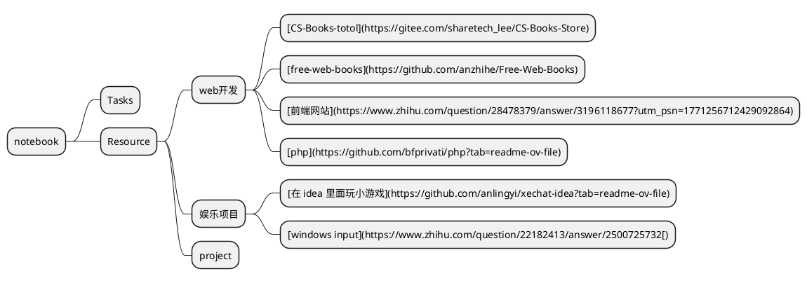

# schedule

##  Tasks

- [ ] ...
- [ ] 研究nginx
- [x] 学习在emacs中使用gdb
- [ ] [完成icp备案后处理](https://help.aliyun.com/zh/icp-filing/user-guide/the-icp-record-post-processing-1?spm=a2c4g.11174386.n2.4.496861dbRdn9aY#title-1oz-nkb-91m&shareid=b2621d0670aa7d3eb5d4115e98ab6141)
- [x] 学习vue
- [x] emacs-lsp-[mode安装](https://emacs-lsp.github.io/lsp-mode/page/installation/)
- [x] emacs-eaf安装使用
- [x] 学习使用emacs写邮件以及发送邮件
- [x] 学习js剩下的一些内容，主要涉及AJAX
- [ ] [学习这个系列的emacs配置教程](#专业 Emacs 入门（十）：笔记系统 org-mode)
- [x] [学习python-markdown](#python-markdown)
- [x] [学习nodejs](#运行环境)
- [x] 域名备案完成
- [ ] 银行卡认证
- [x] [阅读typora主题的配置文件](#typora 自定义 css)
- [ ] [learn mini video](#mini video)
- [x] [emacs web-mode](https://web-mode.org/)配置
- [x] [修改emacs配置文件](#emacs修改配置文件)
- [x] [学习正则表达式](#正则表达式)
- [x] [emacs写xhtml的插件的安装与使用](#emacs迈向xhtml)

## Activity

- ...
- 2024/7/11 13:51:23 这一段时间我在研究爬虫
- 2024/6/26 17:29:59 解决数独问题
- 2024/6/26 10:53:31 总结最近成绩
- 2024/6/25 13:52:52 了解十六进制编辑
- 2024/6/24 21:44:34 植物大战僵尸
- 2024/6/17-24 16:18:11 这段时间复习期末考试了
- 2024/6/16 19:49:47 学习算法
- 2024/6/15 19:49:16 研究glib模块
- 2024/6/14 19:12:32 继续研究nginx的connect模块
- 2024/6/13 09:54:42 制作文字版pdf
- 2024/6/12 19:31:34 研究recoll工具
- 2024/6/11 19:51:24 配置mu4e--emacs邮件箱
- 2024/6/11 11:05:32 命令行邮箱mutt
- 2024/6/10 16:43:29 研究adb调试工具以及root手机
- 2024/6/8 16:45:06 研究nginx的监听和连接模块
- 2024/6/7 09:06:50 研究zeal以及生成docset文档
- 2024/6/5 15:59:22 学习gdb调试
- 2024/6/4 13:47:20 这两天我研究了进程调度相关的内容
- 2024/6/2 10:10:26 研究org-agenda
- 2024/6/1 17:25:41 学习nginx的cycle的内容
- 2024/5/31 08:53:35 了解emacs中company的后台配置，以及代码检查的使用
- 2024/5/30 11:23:45 研究nginx日志相关内容
- 2024/5/29 19:29:06 研究nginx文件，buffer，以及内存池相关操作
- 2024/5/27 08:42:48 研究c标准库手册
- 2024/5/26 19:05:27 我发现nginx中很多部分都用到了glibc中定义的一些内容，我现在同时研究二者
- 2024/5/26 09:38:02 我准备研究Makefile文件，获得文件的依赖关系，找到整体结构
- 2024/5/25 09:22:59 把重点放到nginx的模块上，然后决定先研究里面的类型和结构体
- 2024/5/24 19:28:52 学习Doxygen ，以及gnu global
- 2024/5/23 15:45:43 学习nginx
- 2024/5/22 15:49:34 研究tts工具

# Resource

## 查找资源的思路

1. [从百度网盘群查找](https://pan.baidu.com/disk/main#/im/session)
2. [从下面罗列的电子书网站中查找](#公开网站（通用）)
3. 从淘宝，咸鱼等网站上面购买
4. 向其他人求助

## 公开网站（通用）

### 电子书

以下是几个类似于 ZLibrary 的网站，提供电子书查找和下载服务：

1. **Library Genesis (LibGen)**:
   - LibGen 是一个受欢迎的电子书下载网站，提供广泛的学术和非学术书籍资源。你可以通过关键词、作者、标题等方式搜索电子书。
   - 网站链接：[LibGen](http://libgen.is/)

2. **Project Gutenberg**:
   - Project Gutenberg 提供大量的免费电子书，特别是版权已过期的经典文学作品。你可以在网站上搜索并下载多种格式的电子书。
   - 网站链接：[Project Gutenberg](https://www.gutenberg.org/)

3. **Open Library**:
   - Open Library 是一个开放的数字图书馆项目，提供了大量的电子书和可借阅的图书资源。你可以通过书名、作者、ISBN 等进行搜索。
   - 网站链接：[Open Library](https://openlibrary.org/)

4. **Internet Archive**:
   - Internet Archive 提供了一个庞大的数字图书馆，包含电子书、音频书籍、视频资料等。你可以使用搜索功能查找并下载各种电子书。
   - 网站链接：[Internet Archive](https://archive.org/)

5. **BookBoon**:
   - BookBoon 主要提供教育类和商业类的免费电子书，适合学生和专业人士。你可以按类别和主题查找电子书。
   - 网站链接：[BookBoon](https://bookboon.com/)

6. **ManyBooks**:
   - ManyBooks 提供超过 5 万本免费电子书，涵盖各种主题和类别。你可以在网站上浏览或搜索所需的电子书。
   - 网站链接：[ManyBooks](https://manybooks.net/)

7. **PDF Drive**:
   - PDF Drive 提供了大量的免费 PDF 格式电子书，你可以通过关键词进行搜索并下载。
   - 网站链接：[PDF Drive](https://www.pdfdrive.com/)

这些网站提供了广泛的电子书资源，适合各种需求。请注意，下载和使用电子书时需遵守版权法。

#### [CS-Books-totol](https://gitee.com/sharetech_lee/CS-Books-Store)

#### [脚本之家电子书](http://www.jb51.net/books/)

### 技术标准

#### C++标准库

[Microsoft's C++ Standard Library](https://github.com/Microsoft/stl)

This is the official repository for Microsoft's implementation of the C++ Standard Library (also known as the STL), which ships as part of the MSVC toolset and the Visual Studio IDE.

#### [RFC](https://www.rfc-editor.org/)

#### [POSIX](https://en.wikipedia.org/wiki/POSIX)

POSIX（Portable Operating System Interface）标准是一组操作系统接口的标准化规范，旨在确保不同操作系统之间的软件移植性和互操作性。它定义了一套操作系统的API（应用程序接口），包括文件操作、进程控制、系统调用、用户权限等，以便开发者能够编写能够在多个UNIX-like系统上运行的可移植软件。

POSIX标准的制定和管理由IEEE（Institute of Electrical and Electronics Engineers）的POSIX工作组负责。这些标准的目的是为了促进开发UNIX操作系统的兼容性，使得在不同UNIX系统上编写的应用程序能够在其他兼容的系统上无需或只需少量修改就能运行。

POSIX标准通常包括以下几个方面的内容：

1. **Shell和工具接口**：如命令解释器、常用命令和工具等。

2. **C语言库接口**：如标准C库函数，包括文件操作、字符串处理、内存管理等。

3. **系统服务接口**：如进程控制、文件系统访问、设备IO、网络通信等。

4. **用户界面接口**：如命令行界面和图形用户界面的交互接口。

POSIX标准不仅适用于UNIX操作系统，也被许多类UNIX操作系统所采用，包括Linux、macOS等。因此，遵循POSIX标准的程序通常可以在多个类UNIX系统上进行编译和运行，从而提高了软件的可移植性和可靠性。

## [知识平台](https://worktile.com/kb/ask/30405.html)

### GitHub（国内版叫码云）

GitHub（网址：https://github.com）是一个面向开源及私有软件项目的托管平台，因为只支持git作为少数的版本库格式进行托管，故名gitHub。

国内版叫码云，论坛网址：https://gitee.com。

GitHub上面有很多资源，很多开发者都会在上面找各种各样的开源项目来学习，可以从中获取到不同的知识、内容、信息。

阿里、腾讯、字节跳动、美团、Google、Micosoft等国内外大厂都有自己的Github开源库。建议每个程序员没事可以到上面多逛逛，阅读一些优异工程师编写的源码。

### Stack Overflow

Stack Overflow是一个解决bug 的社区，网址：https://stackoverflow.com。

Stack Overflow是全球最重大的程序员问答网站，拥有非常多高质量的问答。如果大家在开发过程中遇到bug了，可以去上去搜一下，只要搜索的方式对，99%的问题都能搜到答案。因此，很多人业内人都称：“现在的编程工作都是面向Stack Overflow编程”。

### segmentfault

segmentfault又名“思否”，是中文开发者提供纯粹、高质的技术交流平台以及最前沿的技术行业动态，帮助更多的开发者获得认知。

论坛地址：https://segmentfault.com。

### InfoQ

InfoQ是一家全球性实践驱动的技术社区，致力于促进软件开发及相关领域知识与创新的传播。

InfoQ有各种语言版本，最重要的是有中文版的，内容相当有深度，非常有益于把握最新的技术动态。同时，InfoQ也会提供新闻、文章、视频演讲和采访等资讯服务。

网站地址：https://www.infoq.cn。

### V2EX

V2EX 是一个关于分享和探索的地方，上面有很多各大公司的员工和程序员。在这个网站，人人都要为内容负责，网站内容质量较高。

网站地址：https://www.v2ex.com。

### CSDN

CSDN是中国比较老牌的IT社区和服务平台，为中国的软件开发者和IT从业者提供知识传播、职业发展、软件开发等全生命周期服务。有很多厉害的开发者，在上面可以写文章和分享看法。

网站地址：https://www.csdn.net。

### 51CTO

51CTO致力于为CTO、CIO、IT技术经理、系统工程师、网络工程师、安全工程师、数据库工程师、开发工程师、项目管理人员、网络管理员等IT技术人员搭建全面、综合、专业的互动媒体平台。

网站地址：https://www.51cto.com。

### Medium

国外优质文章网站，Medium 的整体结构非常简单，容易让用户沉下心来专注于阅读。上面有很多高质量的技术文章，有很多厉害的人在上面发布内容。

网站地址：https://medium.com。

### 程序员客栈

程序员客栈是名列前茅的程序员自由工作平台，如果你是有经验有资质的开发者，都可以来上面注册成为开发者，业余的时候做点项目，赚点零花钱。

当然，如果你想成为一名自由工作者，程序员客栈也是可以满足的。只要你有技术，不怕赚不到钱。很多程序员日常在这里逛一下，接一点项目做。很多公司也在这发布项目需求。

网站地址：https://www.proginn.com。

### 掘金

掘金是一个帮助开发者成长的技术社区，网站地址：https://juejin.im。

现在国内优质的开发者交流学习社区，可以去看大佬们写的文章，也可以自己分享学习心的，与更多开发者交流。在这里，程序员可以认识更多的小伙伴儿，提升个人影响力。

### 博客园

博客园创立于2004年1月，是一个面向开发者的知识分享社区，也是非常老牌的技术社区。自创建以来，博客园一直致力并专注于为开发者打造一个纯净的技术交流社区，推动并帮助开发者通过互联网分享知识，从而让更多开发者从中受益。博客园的使命是帮助开发者用代码改变世界。很多早期的高质量内容都在博客园。网站地址：https://www.cnblogs.com。

### 开源中国

开源中国是目前比较受欢迎的中文开源技术社区，致力于传播开源的理念，推广开源项目，为IT开发者提供了一个发现、使用、并交流开源技术的平台。网站地址：https://www.oschina.net。

## web开发

### 服务器

#### [Sogou C++ Workflow](https://github.com/sogou/workflow/?tab=readme-ov-file)

搜狗公司C++服务器引擎，编程范式。支撑搜狗几乎所有后端C++在线服务，包括所有搜索服务，云输入法，在线广告等，每日处理数百亿请求。这是一个设计轻盈优雅的企业级程序引擎，可以满足大多数后端与嵌入式开发需求。

### 前端

#### 平台

##### [A free CDN for open source projects](https://www.jsdelivr.com/)

#### 案例与资讯

##### [一个做工精美的网站](https://vue.w3ctech.com/)

#####  [前端工程师一般都喜欢去哪些网站逛？](https://www.zhihu.com/question/28478379/answer/3196118677?utm_psn=1771256712429092864)

#### 教程

##### [技术参考网站-前端老白](https://www.yzktw.com.cn/)

##### [前端书库](https://github.com/qyf381389362/font-end-books/tree/master)

##### [free-web-books](https://github.com/anzhihe/Free-Web-Books)

####  工具

##### [screenshot-to-code](https://screenshottocode.com/)

##### [前端终结者](https://github.com/abi/screenshot-to-code)

#### 代码仓库

##### [成为前端大师，看这20个github库就够了](https://zhuanlan.zhihu.com/p/465197334?utm_psn=1773114228851175424)

##### [element-ui-for-vue-js3](https://github.com/element-plus/element-plus)

##### [shadcn-ui](https://zhuanlan.zhihu.com/p/678264373?utm_psn=1776976653002465280)

开箱即用：任何具备 HTML、CSS、JavaScript 和一两个框架基础知识的人都可以快速开始使用 Shadcn UI。使用复制粘贴或 CLI 安装方法可以轻松访问其组件。同时它还具备良好的文档，可以查询组件说明。

### 后端

#### 学习

##### [php](https://github.com/bfprivati/php?tab=readme-ov-file)

#### 案例

##### [后台管理系统](https://zhuanlan.zhihu.com/p/456325443?utm_psn=1776669154210643968)

##### [开源后台管理系统-使用java以及vue](https://link.zhihu.com/?target=https%3A//gitee.com/zhijiantianya/ruoyi-vue-pro)

[介绍](https://zhuanlan.zhihu.com/p/693784264?utm_psn=1776668385117962240)

## llm

### 实现

#### [llama.cpp](https://github.com/ggerganov/llama.cpp)

## 应用开发

### [Electron 应用开发实战指南：从零打造高性能跨平台桌面应用](https://zhuanlan.zhihu.com/p/688981867?utm_psn=1773076920068296704)

## 娱乐项目

### [在 idea 里面玩小游戏](https://github.com/anlingyi/xechat-idea?tab=readme-ov-file)

### [windows input](https://www.zhihu.com/question/22182413/answer/2500725732[)

## 英语学习

### [外国词汇网站-助记](https://www.vocabulary.com/)

## project

### [project from a github repo](https://github.com/Jackpopc/DevWeekly)

## 编程语言

### 算法

[计算机程序设计艺术](https://github.com/liujiming789/The-Art-of-Computer-Programming)

### C++

[C++ Insights：用编译器的视角看源码](https://mp.weixin.qq.com/s/MfowBra8B4fhX-d9dmPXUg)

## 工具类

### 语音转文字

#### [coqui-ai](https://github.com/coqui-ai/TTS)

## 个人博客

### [yuchaoshui的个人博客](http://yuchaoshui.com)

### [陶辉-nginx讲师](https://www.taohui.org.cn/)

### [大傅哥](https://bugstack.cn/)，[这是他的github](https://github.com/fuzhengwei)

### [这里面也列举了很多个人博客](https://www.zhihu.com/question/22795144/answer/885421032?utm_psn=1772521966211203073)

### [汇尘轩](https://kirigaya.cn/home)

### [李辉-flask开发者](https://greyli.com/)


selenium
========

安装
----

[参考这个网页](https://github.com/appium/python-client/issues/863)，注意会有一个bug，要安装4.9.0版本的selenium

浏览器
------

要安装浏览器和对应版本的driver，chrome[浏览器下载](https://www.google.com/intl/en_sg/chrome/browser-tools/)，chrome driver[参考这个网页](https://googlechromelabs.github.io/chrome-for-testing/)

[测试脚本](https://www.selenium.dev/zh-cn/documentation/webdriver/getting_started/first_script/)
--------

```python 
from selenium import webdriver
from selenium.webdriver.common.by import By
import time
driver = webdriver.Chrome()

driver.get("https://www.selenium.dev/selenium/web/web-form.html")

title = driver.title

driver.implicitly_wait(0.5)

text_box = driver.find_element(by=By.NAME, value="my-text")
submit_button = driver.find_element(by=By.CSS_SELECTOR, value="button")

text_box.send_keys("Selenium")
submit_button.click()

message = driver.find_element(by=By.ID, value="message")
text = message.text
time.sleep(5)
driver.quit()

```

启动浏览器的时候加载用户的配置
------------------------------

[我尝试了里面的方法，但是没有成功](https://blog.csdn.net/zhusongziye/article/details/79636567)。

[元素选择](https://juejin.cn/post/6844904002103050254)
------------------------------------------------------

当使用CSS选择器时，我们可以通过多种方法来精确地选择页面上的元素。以下是常见的选择器及其用法总结：

### 1. 基本选择器

- **标签选择器**：根据 HTML 元素的标签名选择元素。

  ```css
  div {}   /* 选择所有 <div> 元素 */
  p {}     /* 选择所有 <p> 元素 */
  ```

- **类选择器**：根据 HTML 元素的类名选择元素。

  ```css
  .class-name {}   /* 选择所有具有 class="class-name" 的元素 */
  ```

- **ID 选择器**：根据 HTML 元素的 ID 属性选择元素（ID 在文档中应该是唯一的）。

  ```css
  #element-id {}   /* 选择具有 id="element-id" 的元素 */
  ```

- **属性选择器**：根据 HTML 元素的属性选择元素。

  ```css
  [attribute-name] {}          /* 选择具有指定属性的元素 */
  [attribute-name="value"] {}  /* 选择具有指定属性和值的元素 */
  ```

### 2. 组合选择器

- **后代选择器**（空格分隔符）：选择所有符合条件的后代元素。

  ```css
  div p {}   /* 选择所有 <div> 元素下的所有 <p> 元素 */
  ```

- **直接子元素选择器**（`>` 符号）：选择直接子元素。

  ```css
  ul > li {}   /* 选择所有 <ul> 元素下的直接子元素 <li> */
  ```

- **相邻兄弟元素选择器**（`+` 符号）：选择紧接在另一个元素后的同级元素。

  ```css
  h1 + p {}   /* 选择紧接在 <h1> 元素后的第一个 <p> 元素 */
  ```

- **通用兄弟元素选择器**（`~` 符号）：选择在同一父元素下的所有同级元素。

  ```css
  h1 ~ p {}   /* 选择所有紧接在 <h1> 元素后的所有 <p> 元素 */
  ```

### 3. 伪类和伪元素选择器

- **伪类选择器**：根据元素的状态或位置选择元素，如链接的状态、鼠标悬停等。

  ```css
  a:hover {}      /* 鼠标悬停在链接上时应用的样式 */
  :nth-child(n) {}/* 选择指定位置的子元素 */
  ```

- **伪元素选择器**：用于向某些选择器添加特殊效果，例如 `::before` 和 `::after`。

### 总结

CSS选择器提供了多种灵活和强大的方法来选择页面上的元素，可以根据元素的结构、属性、状态和位置等特征来精确地定位元素并应用样式。选择器的合理使用不仅能提高代码的可维护性和可读性，还能有效地操作和管理页面上的元素。

格式化python
------------

[在 Visual Studio Code (VSCode) 中自动格式化 Python 代码](https://developer.baidu.com/article/details/2925823)

seleniumIDE
-----------

### [安装](https://chromewebstore.google.com/detail/selenium-ide/mooikfkahbdckldjjndioackbalphokd?pli=1)

### [录制操作](https://www.selenium.dev/selenium-ide/docs/en/introduction/getting-started)

### [回放操作](https://www.selenium.dev/selenium-ide/docs/en/introduction/command-line-runner)

下载fnm，再下载npm，node，然后下载selenium-side-runner，最后用·`selenium-side-runner /path/to/your-project.side`来执行录制的操作

fnm
---

#### 安装 Node.js 版本

```
fnm install <version>
```

例如，安装最新的 Node.js 版本：

```
fnm install latest
```

或者安装特定版本：

```
fnm install 14.17.0
```

#### 使用特定版本

```
fnm use <version>
```

例如，使用 14.17.0 版本：

```
fnm use 14.17.0
```

#### 列出已安装的版本

```
fnm list
```

#### 卸载某个版本

```
fnm uninstall <version>
```

#### 设置默认版本

```
fnm default <version>
```

#### 升级 `fnm`

你可以通过重新运行安装脚本来升级 `fnm`：

```
curl -fsSL https://fnm.vercel.app/install | bash
```

小红书爬取
----------

```python
# 要点1 把之前打开的浏览器关掉，程序加载之前的用户配置直接打开浏览器，直接就进入之前的登录状态
# 判断页面是否加载完成，有的时候页面不是同时加载完成的，有多种方法判断页面是否全部加载完成，第一种是等待某个元素加载，第二种是JavaScript的加载状态，第三种是AJAX的请求，结合实际进行选择
# 小红书一些页面使用了动态加载的功能，所以要通过selenium来模拟翻页，然后可以通过页面高度的变化，来判断是否翻到了文件的底部
# csv写入，具体参见代码的74行
import pytest
from selenium import webdriver
from selenium.webdriver.common.by import By
from selenium.webdriver.chrome.options import Options
from selenium.webdriver.support.ui import WebDriverWait
from selenium.webdriver.support import expected_conditions as EC
from selenium.webdriver.common.action_chains import ActionChains
from selenium.webdriver.common.keys import Keys
from time import sleep
import re
import csv

options = webdriver.ChromeOptions()
options.add_argument(r"--start-maximized")
options.add_experimental_option("detach", True)
options.add_argument(
    r"--user-data-dir=C:\Users\Administrator\AppData\Local\Google\Chrome\User Data"
)
options.add_argument(r"--profile-directory=Default")

driver = webdriver.Chrome(options=options)

driver.get(
    "https://www.xiaohongshu.com/user/profile/5c568ea2000000001803e7dc?tab=liked&subTab=note"
)

try:
    previous_height = driver.execute_script("return document.body.scrollHeight")
    page_name = 0
    bangs = []
    while True:
        # 等待页面内容加载完成
        WebDriverWait(driver, 100).until(
   		 lambda d: d.execute_script('return document.readyState') == 'complete'
        )

        parent = driver.find_element(
            by=By.XPATH,
            value='//*[@id="userPageContainer"]/div[3]/div/div[3]/div[1]',
        )
        elements = parent.find_elements(by=By.TAG_NAME, value="section")

        for element in elements:
            content = re.split(r"\r?\n", element.text)
            href = element.find_elements(by=By.TAG_NAME, value="a")[1].get_attribute(
                "href"
            )
            content.append(href)
            if content in bangs:
                continue
            bangs.append(content)
            # bangs = bangs.append(content.append(href))

        """ for element in elements:
            if (
                element.get_attribute("href") != ""
                and element.get_attribute("href") not in bangs
            ):
                bangs.append(element.get_attribute("href")) """
        # 获取当前页面的滚动高度
        actions = ActionChains(driver)
        actions.send_keys(Keys.PAGE_DOWN).perform()
        sleep(2)
        new_height = driver.execute_script("return document.body.scrollHeight")
        if new_height == previous_height:
            break
        previous_height = new_height
    with open("output.csv", "w", newline="", encoding="utf-8") as csvfile:
        csvwriter = csv.writer(csvfile)
        # 写入头部字段
        csvwriter.writerow(["Title", "Author", "Views", "URL"])
        # 写入数据到 CSV 文件
        for row in bangs:
            csvwriter.writerow(row)

finally:
    driver.quit()
```

[微博爬取参阅这个页面](https://blog.csdn.net/poorlytechnology/article/details/109686906)

cookie
------

[作者的思路分成两步，第一步是获取cookie，第二步是利用cookie来进行登录](https://blog.csdn.net/weixin_43821172/article/details/105199481)

### 获取cookie

```python
from selenium import webdriver
import os
import time
import json
 
def browser_initial():
    """"
    进行浏览器初始化
    """
    os.chdir('E:\\pythonwork')
    browser = webdriver.Chrome()
    log_url = 'https://passport.damai.cn/login?ru=https%3A%2F%2Fwww.damai.cn%2F'
    return log_url,browser
 
def get_cookies(log_url,browser):
    """
    获取cookies保存至本地
    """
    browser.get(log_url)
    time.sleep(15)     # 进行扫码
    dictCookies = browser.get_cookies()    # 获取list的cookies
    jsonCookies = json.dumps(dictCookies) #  转换成字符串保存
    
    with open('damai_cookies.txt', 'w') as f:
        f.write(jsonCookies)
    print('cookies保存成功！')
 
if __name__ == "__main__":
    tur = browser_initial()
    get_cookies(tur[0], tur[1])
```

### 利用cookie登录

```python
from selenium import webdriver
import os
import json
 
def browser_initial():
    """"
    浏览器初始化,并打开大麦网购票界面（未登录状态）
    """
    os.chdir('E:\\pythonwork')
    browser = webdriver.Chrome()
    browser.get('https://detail.damai.cn/item.htm?spm=a2oeg.search_category.0.0.8778f91as7xLdc&id=610870234751&clicktitle=2020%E5%BC%A0%E6%9D%B0%E3%80%8C%E6%9C%AA%C2%B7LIVE%E3%80%8D%E5%B7%A1%E5%9B%9E%E6%BC%94%E5%94%B1%E4%BC%9A%20%E5%90%88%E8%82%A5%E7%AB%99')
    return browser
 
def log_damai(browser):
    """
    从本地读取cookies并刷新页面,成为已登录状态
    """
    with open('damai_cookies.txt', 'r', encoding='utf8') as f:
        listCookies = json.loads(f.read())
 
    # 往browser里添加cookies
    for cookie in listCookies:
        cookie_dict = {
            'domain': '.damai.cn',
            'name': cookie.get('name'),
            'value': cookie.get('value'),
            "expires": '',
            'path': '/',
            'httpOnly': False,
            'HostOnly': False,
            'Secure': False
        }
        browser.add_cookie(cookie_dict)
    browser.refresh()                      # 刷新网页,cookies才成功
    
if __name__ == "__main__":
    browser = browser_initial()
    log_damai(browser)
```

[微博爬虫终极版](https://github.com/otonashi-ayana/SpiderWeibo)
---------------------------------------------------------------

这篇文章用request，beautyfly等非常基础的爬虫库，以及MySQL数据库，实现了十万数量级的数据的爬取，我准备深入的研究一下。

selenium grid
-------------

[Selenium Grid快速起步](https://www.selenium.dev/zh-cn/documentation/grid/getting_started/)

Here’s a more complex example of using Selenium Grid with multiple browsers (Chrome and Edge) on a local machine. This script will open both browsers, navigate to a website, perform some actions, and print the page titles.

1. ### **Run the Selenium Grid Hub**:

   ```bash
   java -jar selenium-server-4.22.0.jar hub
   ```

2. ### **Run the Selenium Grid Nodes**:

   ```bash
   java -jar selenium-server-4.22.0.jar node --detect-drivers
   ```

3. ### **Python Script**:

   ```python
   from selenium import webdriver
   from selenium.webdriver.common.desired_capabilities import DesiredCapabilities
   from selenium.webdriver.common.by import By
   from selenium.webdriver.support.ui import WebDriverWait
   from selenium.webdriver.support import expected_conditions as EC
   
   # Define the hub URL
   hub_url = "http://localhost:4444"
   
   # Define the capabilities for Chrome
   chrome_capabilities = DesiredCapabilities.CHROME.copy()
   chrome_capabilities['browserName'] = 'chrome'
   
   # Define the capabilities for Edge
   edge_capabilities = DesiredCapabilities.EDGE.copy()
   edge_capabilities['browserName'] = 'MicrosoftEdge'
   
   # Start a remote WebDriver session for Chrome
   chrome_driver = webdriver.Remote(
       command_executor=hub_url,
       desired_capabilities=chrome_capabilities
   )
   
   # Start a remote WebDriver session for Edge
   edge_driver = webdriver.Remote(
       command_executor=hub_url,
       desired_capabilities=edge_capabilities
   )
   
   def test_browser(driver, url):
       driver.get(url)
       WebDriverWait(driver, 10).until(EC.presence_of_element_located((By.TAG_NAME, "body")))
       print(f"Title in {driver.capabilities['browserName']}: {driver.title}")
       # Perform additional actions here
       driver.quit()
   
   # Test with Chrome
   test_browser(chrome_driver, "https://www.selenium.dev")
   
   # Test with Edge
   test_browser(edge_driver, "https://www.selenium.dev")
   
   # Test with multiple pages
   def test_multiple_pages(driver, urls):
       for url in urls:
           driver.get(url)
           WebDriverWait(driver, 10).until(EC.presence_of_element_located((By.TAG_NAME, "body")))
           print(f"Title in {driver.capabilities['browserName']} at {url}: {driver.title}")
       driver.quit()
   
   urls_to_test = [
       "https://www.selenium.dev",
       "https://www.google.com",
       "https://www.github.com"
   ]
   
   # Test multiple pages with Chrome
   chrome_driver = webdriver.Remote(
       command_executor=hub_url,
       desired_capabilities=chrome_capabilities
   )
   test_multiple_pages(chrome_driver, urls_to_test)
   
   # Test multiple pages with Edge
   edge_driver = webdriver.Remote(
       command_executor=hub_url,
       desired_capabilities=edge_capabilities
   )
   test_multiple_pages(edge_driver, urls_to_test)
   ```

selenium作用
------------

除了爬虫，Selenium 主要用于以下几个方面：

1. **自动化测试**:
   - Selenium 是一种强大的工具，用于自动化 Web 应用程序的测试。它允许测试人员编写脚本来模拟用户行为并验证应用程序的功能是否正常。
   - 支持多种编程语言（如 Java, Python, C# 等），并且可以与各种测试框架（如 JUnit, TestNG, pytest 等）集成。

2. **回归测试**:
   - 在开发过程中，每次更新代码后都需要重新测试应用程序的功能。Selenium 自动化测试可以在每次代码更改后运行，以确保新代码没有破坏现有功能。

3. **持续集成和持续交付（CI/CD）**:
   - Selenium 可以集成到 CI/CD 流程中，如 Jenkins、GitLab CI、Travis CI 等。当代码提交到版本控制系统时，可以自动运行 Selenium 测试，以确保代码质量和应用程序稳定性。

4. **跨浏览器测试**:
   - Selenium 支持在不同的浏览器（如 Chrome、Firefox、Edge 等）上运行测试，确保应用程序在各种浏览器上都能正常工作。

5. **用户行为模拟**:
   - Selenium 可以模拟用户在浏览器上的操作，如点击、输入文本、导航等，这使得它在功能测试和用户体验测试中非常有用。

通过这些应用，Selenium 不仅提高了测试效率，还减少了手动测试的重复性劳动，使开发团队能够更快、更可靠地发布高质量的软件。

无头浏览器
----------

之前有一个应用广泛的无头浏览器“PhantomJS”，后来谷歌也推出了chrome的无头浏览器，它就走向没落了，在selenium中使用无头浏览器添加以下选项。

```python
options.add_argument("--headless")  # 启用无头模式
options.add_argument("--disable-gpu")  # 禁用 GPU 加速
options.add_argument("--window-size=1920,1080")  # 设置窗口大小
```

资源占用情况
------------

具体的资源消耗会根据实际情况和配置有所不同，但可以给出一些一般性的估计值作为参考：

1. **空间消耗**：
   - **Chrome 浏览器本身**：约 200-300 MB 左右（具体取决于版本和安装选项）。
   - **ChromeDriver**：约 10-20 MB 左右。
   - **总体空间消耗**：大约 250-350 MB，考虑到其他系统和驱动的一些额外消耗。
2. **内存消耗**：
   - **Chrome 浏览器**：加载简单网页时大约消耗 200-300 MB 左右的内存。
   - **复杂网页和大量标签页**：内存消耗可能会增加到 1 GB 或更多，特别是加载大量 JavaScript 和动态内容时。
   - **ChromeDriver 和脚本执行**：通常会增加额外的几十到几百 MB 的内存消耗，具体取决于执行的脚本复杂性和频率。
3. **CPU消耗**：
   - **页面加载和渲染**：在页面加载和渲染期间，Chrome 浏览器会占用一定的 CPU 资源，通常在单个核心上使用 10-20% 的情况比较常见。
   - **JavaScript 执行**：执行复杂 JavaScript 脚本时，CPU 使用率可能会显著增加，高峰时可能达到 50-100% 或更高，取决于脚本复杂性和执行频率。

这些数字仅供参考，具体的资源消耗会因服务器的硬件配置、操作系统负载、运行的脚本复杂性等因素而有所不同。建议在实际部署前进行基准测试，以确保服务器能够满足预期的性能要求和资源消耗。

爬虫基础
========

参考书目
--------

python爬虫开发与项目实战 [对应项目地址](https://github.com/qiyeboy/SpiderBook)

基本库
------

当涉及 Python 中的网络请求和网页抓取时，通常会用到以下几个库：`urllib`、`requests`、`urllib3` 和 `beautifulsoup4`。这些库提供了从简单的HTTP请求到复杂的网页解析和数据提取的功能。

### 1. urllib

`urllib` 是 Python 标准库，提供了处理从 URL 打开数据的模块集合。它包括了：

- **urllib.request**: 发送 HTTP/HTTPS 请求的模块，可以用于打开和读取 URLs。
- **urllib.parse**: 用于解析 URLs。
- **urllib.error**: 包含 urllib.request 引发的异常类。
- **urllib.robotparser**: 解析 robots.txt 文件。

示例使用 `urllib` 发起请求和获取响应：

```python
import urllib.request

url = 'http://example.com'
response = urllib.request.urlopen(url)
html = response.read().decode('utf-8')
print(html)
```

### 2. [requests](https://docs.python-requests.org/en/latest/user/quickstart/#make-a-request)

`requests` 是一个简洁且功能强大的第三方库，用于发送各种 HTTP 请求。它比 `urllib` 更加直观和易用，并且支持更多的高级特性，如会话保持、Cookie 操作等。

示例使用 `requests` 库：

```python
import requests

url = 'http://example.com'
response = requests.get(url)
html = response.text
print(html)
```

### 3. urllib3

`urllib3` 是一个功能强大且线程安全的 HTTP 客户端，它对连接池和重用、线程安全的连接管理以及文件分块上传下载等提供了支持。

示例使用 `urllib3`：

```python
import urllib3

http = urllib3.PoolManager()
url = 'http://example.com'
response = http.request('GET', url)
html = response.data.decode('utf-8')
print(html)
```

### 4. BeautifulSoup

`BeautifulSoup` 是一个用于解析 HTML 和 XML 文档的库，它能够将复杂的 HTML 文档转换为一个树形结构，并提供简单的方法来遍历这棵树和搜索特定元素。

Beautiful Soup支持Python标准库中的HTML解析器，还支持一些第三方的解析器，其中一个是lxml。另一个可供选择的解析器是纯Python实现的html5lib，html5lib的解析方式与浏览器相同

示例使用 `BeautifulSoup` 提取网页内容：

```python
from bs4 import BeautifulSoup
import requests

url = 'http://example.com'
response = requests.get(url)
soup = BeautifulSoup(response.text, 'html.parser')
title = soup.title.string
print(f'Title: {title}')
```

知乎示例
--------

```python
# 这个代码可以调用登录知乎然后搜索，但是最后得到的内容是加密的
# 该文探究了知乎解密的方法，“https://blog.csdn.net/qq_36532060/article/details/123899805”

import requests

url = "https://www.zhihu.com/search?type=content&q=%E7%88%AC%E8%99%AB"
user_agent = "Mozilla/4.0 (compatible; MSIE 5.5; Windows NT)"
referer = "http://www.zhihu.com/"
cookies = {
    "_zap": "9e6862e6-0738-4ee7-a899-64a6a0ece802",
    "d_c0": "AACSLERh3BiPTsGnhJlu27i6lPl9Gje08c8=|1719886308",
    "__snaker__id": "88gq68bqfsZAsEK7",
    "q_c1": "e2b1cd9ca9ba4eff90c3abada9b6bbdd|1719886404000|1719886404000",
    "captcha_session_v2": "2|1:0|10:1719886496|18:captcha_session_v2|88:eUJyVHlpUUovQXM4Z0pHZEFIUjFidXhoZmVXQ050V2JjV2VRekQyRkJQVGdwYjBIQTB1dnRnSHVXS0RYaFhkYw==|06bfe5b06cb9292f44d01bf4d47369fa4ca053d329968157dba78d5a755120e0",
    "captcha_ticket_v2": "2|1:0|10:1719886510|17:captcha_ticket_v2|728:eyJ2YWxpZGF0ZSI6IkNOMzFfYndiMEljRy5fRnRKSDJoXypGZmxiRkticVFXUm8zb1VtdzNtaGVnQ3VFb19rY0MwNEl5QjQ5VnMzQk9hVWF0bUpvdThLSTlzQVJ4QmtLa1hoNEVlUFhvSGNKUEIzcmVXMzBUNU9vbTFNdERWWWtPcndfZnNaWnlFWFNTVEgqS0JkS3BTMkVRQVpjTlJsX1VZKkJfRjlGd0pFYUdOVkVCNllhanRmS2lVZ3Bod2lOaWRnd0ZTZFFpYlpfUkt5RnVwYTBiUWRjREl3OThaU1ZVTFV4VGJrVllSWUlvMGs2YVpTUldYQURSQXZKWWZ4eTNlSEFOcENkR1JfQlV1V0MuWkIxeU90MkFtamZwWTBnVGozUzhkS0tJNVlPeV9zVC5uMl8qcm85d09RMFQ1Z08zR3FDbU5HalhWdjY4ZjF0Q2NNZk84U3RXUHFSdF9wWEJDQlRDX0E4Qk5JNHJyWmR6TjBQcU5MbFQ0b2tqTGdhMHhReEVIRkJuS3lJcjgweENTbV8xakVpUG53czVYaWdfb01ZKmFMdzVySGY0MmgudzBFdGR2ZWJIY3I4MVh1dHNyZ1Bka21XajRrd0VYUmN3QWU1cDRxeGsqc2VqdGdtRnpwY2RyeHdpNEhLTXg0dndDRkN5WUdFT0E4LkRlQUR2ZjYyY0RVaTBOLmY0UUo1KjFDLnZiNk03N192X2lfMSJ9|9c5abaf408b34e3ca8b231216683f4677d4329ff8d583b2e519cbd05f296c8f0",
    "z_c0": "2|1:0|10:1719886510|4:z_c0|92:Mi4xNTBZVFJBQUFBQUFBQUpJc1JHSGNHQ1lBQUFCZ0FsVk5yckJ3WndCMFBWT2RWc0RYTzR2dWZ1NHB1VzJNR0FkSkZ3|61c92e1420ac5e173f4e45902dbe2fe8e8aef91bdbf2b8b97a731ff6e2d08ce1",
    "gdxidpyhxdE": "jM3lrVe9vUD%2BPrHH%2Bk9vpPSkyOvAb0W%2Ff7zI4HKZfygtidEqec0XifccWw35RflzoCfDmpdAGRTz3Ab5fJrTT1i2EoWnXhvVQqWMacyN6BfdaZw46HCPpAP1c%2Bj%2FevRjweDjxjiz38DhXSPB%5CzOr8N4M5ahv9CuGC1fPkJSV7p6z%2FB4s%3A1719888058182",
    "_xsrf": "24532abb-7d77-44c4-bb3a-e5a5d51eb698",
    "Hm_lvt_98beee57fd2ef70ccdd5ca52b9740c49": "1719886315,1719977790",
    "Hm_lpvt_98beee57fd2ef70ccdd5ca52b9740c49": "1720064747",
    "tst": "r",
    "SESSIONID": "JUQbKaBBpNxTBYLWeNLY7IusIuIqQbxJTE9F7djtXXh",
    "JOID": "UV4QA0oNGA-kBJJaVQ7vGAZE8IFLQk5bx032GxJ_U3T1R8kTAe8EjcEDlFxRaXylgOx3Wdgw5sTJeIkXj2Paqjg=",
    "osd": "UF4XAE0MGAinA5NaUg3oGQZD84ZKQklYwEz2HBF4UnTyRM4SAegHisADk19WaHyig-t2Wd8z4cXJf4oQjmPdqT8=",
    "KLBRSID": "37f2e85292ebb2c2ef70f1d8e39c2b34|1720064739|1720064739",
    "BEC": "244e292b1eefcef20c9b81b1d9777823",
}

headers = {"User-Agent": user_agent, "Referer": referer}

response = requests.get(url, headers=headers, cookies=cookies)

if response.status_code == 200:
    html = response.text
    with open("index.html", "w", encoding="utf-8") as f:
        f.write(html)
else:
    print("Failed to retrieve data.")
```

beautifulsoup详细用法
---------------------

```python
# find_all的用法和mathematica里面select的用法是类似的，就是从已有的内容了选择出符合条件的内容。可以接受一个判断函数，参见下面具体的判断函数的结构，参数是“tag”， 返回的内容是“true"或者”flase"。
from bs4 import BeautifulSoup
html_str = """
     <html><head><title>The Dormouse's story</title></head>
     <body>
     <p class='title'><b>The Dormouse's story</b></p>
<p class='story'>Once upon a time there were three little sisters; and their names were
     <a href='http://example.com/elsie' class='sister' id='link1'><!-- Elsie --></a>,
     <a href='http://example.com/lacie' class='sister' id='link2'><!-- Lacie --></a> and
     <a href='http://example.com/tillie' class='sister' id='link3'>Tillie</a>;
     and they lived at the bottom of a well.</p>
     <p class='story'>...</p>
     """
soup = BeautifulSoup(html_str, "lxml")
# print(soup.prettify())
def has_selected(tag):
    return tag.has_attr("class") and "sister" in tag.attrs["class"]
selects = soup.find_all(has_selected)
for select in selects:
    print(select.string)
```

lxml例子
--------

```python
# lxml 相比beautifulsoup来说有一个巨大的好处就是支持xpath的选择方式，xpath可以确定一个或者一组符合条件的元素，在选择方面具有很大的优越性
# xpath 参考网站 https://www.w3.org/TR/xpath
from lxml import etree

html_str = """
<html><head><title>The Dormouse's story</title></head>
<body>
<p class='title'><b>The Dormouse's story</b></p>
<p class='story'>Once upon a time there were three little sisters; and their names were
<a href='http://example.com/elsie' class='sister' id='link1'>Elsie</a>,
<a href='http://example.com/lacie' class='sister' id='link2'>Lacie</a> and
<a href='http://example.com/tillie' class='sister' id='link3'>Tillie</a>;
and they lived at the bottom of a well.</p>
<p class='story'>...</p>
"""
html = etree.HTML(html_str)
urls = html.xpath(r"// p[@class='story']/text()")
print(urls)
```

另一个爬取网页的例子

```python
import requests
from lxml import etree
import pprint

url = "https://www.readnovel.com/book/22312481000716402#Catalog"
user_agent = "Mozilla/4.0 (compatible; MSIE 5.5; Windows NT)"
headers = {"User-Agent": user_agent}
response = requests.get(url=url, headers=headers)
html = etree.HTML(response.text)
titles = html.xpath('//*[@id="j-catalogWrap"]/div[2]/div/ul/li/a/text()')
pprint.pprint(titles)
```

json
----

```python
# python 的字典 与 json 的文件 是相对应的
# 首先要创建字典列表，然后类似下面调用json.dump()写入
# 然后可以用json.load()读取，读取出来的内容就是之前存进去的字典的列表

# 这是一个写入的例子
import json

# 假设已经从网页中获取了标题元素列表 titles

# 定义存储结果的列表
results = []
# 遍历每个标题元素
for title in titles:
    # 获取链接和文本内容
    link = title.get('href')  # 获取链接
    text = title.text.strip()  # 获取文本，并去除首尾空格
    # 构建字典对象
    result = {
        'link': link,
        'text': text
    }
    # 将字典对象添加到结果列表中
    results.append(result)

# 将结果列表保存为 JSON 文件
with open('titles.json', 'w', encoding='utf-8') as f:
    json.dump(results, f, ensure_ascii=False, indent=4)

print('保存成功：titles.json')

# 这是一个读取的例子
import json

# 读取 JSON 文件
with open('titles.json', 'r', encoding='utf-8') as f:
    titles_data = json.load(f)

# 打印读取的内容（假设文件结构与保存时相同）
for item in titles_data:
    print(f"标题文本：{item['text']}")
    print(f"链接地址：{item['link']}")
    print()  # 打印空行作为分隔

print("读取完成！")
```

configparser
------------

https://blog.csdn.net/Gscsd_T/article/details/104670205

这篇文档详细介绍了configparser的配置和使用方法

csv
---

```python
# csv 是处理csv文件的模块，之前使用过，python里面对应的对象是列表的列表，或者字典的列表

# 模式1（写入）
import csv
headers = ['ID','UserName','Password','Age','Country']
rows = [(1001,'qiye','qiye_pass',24,'China'),
        (1002,'Mary','Mary_pass',20,'USA'),
        (1003,'Jack','Jack_pass',20,'USA'),
       ]

with open('qiye.csv','w') as f:
    f_csv = csv.writer(f)
    f_csv.writerow(headers)
    f_csv.writerows(rows)
    
# 模式2（写入）
import csv
headers = ['ID','UserName','Password','Age','Country']
rows = [{'ID':1001,'UserName':'qiye','Password':'qiye_pass','Age':24,'Country':' China'},
        {'ID':1002,'UserName':'Mary','Password':'Mary_pass','Age':20,'Country':'USA'},
        {'ID':1003,'UserName':'Jack','Password':'Jack_pass','Age':20,'Country':'USA'},
       ]
with open('qiye.csv','w') as f:
    f_csv = csv.DictWriter(f,headers)
    f_csv.writeheader()
    f_csv.writerows(rows)
    
# 读取
import csv
# 假设 CSV 文件名为 input.csv，编码为 UTF-8
with open('qiye.csv', mode='r', newline='', encoding='utf-8') as csvfile:
    csvreader = csv.reader(csvfile)
    # 跳过头部字段（如果有的话）
    header = next(csvreader)
    print(f'CSV 头部字段：{header}')
    # 逐行读取数据
    for row in csvreader:
        print(row)
        
def import_urls(file_path):
    urls = []
    with open(file_path, mode="r", newline="", encoding="utf-8") as csvfile:
        csvreader = csv.reader(csvfile)
        for row in csvreader:
            urls.append(row)
    return urls
```

pandas
------

当涉及数据处理和分析时，特别是在 Python 环境中，`pandas` 是一个非常强大和常用的工具库。以下是关于 `pandas` 的一些关键总结：

### 1. 数据结构

- **Series**：一维标记数组，可存储任意数据类型，类似于 Python 的列表或 NumPy 数组。

  ```python
  import pandas as pd
  s = pd.Series([1, 2, 3, 4, 5])
  ```

- **DataFrame**：二维标记数据结构，包含多个列，每列可以是不同的数据类型，类似于 Excel 表格或 SQL 表。

  ```python
  df = pd.DataFrame({
      'Name': ['Alice', 'Bob', 'Charlie'],
      'Age': [25, 30, 35]
  })
  ```

### 2. 基本操作

- **读取和写入数据**：从文件（如 CSV、Excel）、数据库或 URL 读取数据，将数据写入文件。

  ```python
  df = pd.read_csv('data.csv')
  df.to_excel('output.xlsx', index=False)
  ```

- **数据查看和统计**：快速查看数据的前几行、基本统计信息和数据类型。

  ```python
  df.head()
  df.describe()
  df.info()
  ```

### 3. 数据处理

- **选择数据**：选择特定行、列或元素。

  ```python
  df['Column']
  df.iloc[0]
  ```

- **过滤数据**：根据条件过滤数据。

  ```python
  df[df['Age'] > 30]
  ```

- **处理缺失值**：检测、删除或填充缺失的数据。

  ```python
  df.dropna()
  df.fillna(0)
  ```

- **数据转换**：应用函数、映射、分组和排序数据。

  ```python
  df.apply(func)
  df.groupby('Column').mean()
  df.sort_values(by='Column')
  ```

### 4. 数据可视化

- **绘制图表**：生成各种类型的图表，如折线图、柱状图和散点图。

  ```python
  import matplotlib.pyplot as plt
  df.plot(kind='line', x='X', y='Y')
  plt.show()
  ```

### 5. 效率和性能

- **向量化操作**：利用 `pandas` 的向量化操作处理大数据集，比传统循环更高效。

- **内存优化**：使用 `pandas` 的方法来减少内存使用，提升性能。

### 6. 整合与扩展

- **与其他库整合**：与 NumPy、SciPy、Scikit-learn 等科学计算和机器学习库无缝整合。

- **自定义扩展**：通过自定义函数或使用 `apply` 方法扩展 `pandas` 功能。

### 总结

`pandas` 提供了丰富的功能和灵活性，适用于数据的清洗、转换、分析和可视化。通过使用 `pandas`，可以高效地处理结构化数据，从而加快数据分析和建模的速度，是数据科学和分析中不可或缺的工具之一。

urlretrieve
-----------

```python
import urllib
from lxml import etree
import requests
def Schedule(blocknum,blocksize,totalsize):
    '''''
        blocknum:已经下载的数据块
        blocksize:数据块的大小
        totalsize:远程文件的大小
        '''
    per = 100.0 * blocknum * blocksize / totalsize
    if per > 100 :
        per = 100
        print '当前下载进度：%d'%per
user_agent = 'Mozilla/4.0 (compatible; MSIE 5.5; Windows NT)'
headers={'User-Agent':user_agent}
r = requests.get('http://www.ivsky.com/tupian/ziranfengguang/',headers=headers)
# 使用lxml解析网页
html = etree.HTML(r.text)
img_urls = html.xpath('.// img/@src')# 先找到所有的img
i=0
for img_url in img_urls:
    urllib.urlretrieve(img_url,'img'+str(i)+'.jpg',Schedule)
    i+=1
```


re
--

`re` 模块是 Python 标准库中用于处理正则表达式的模块。它提供了丰富的功能来进行字符串匹配、替换、分割等操作。以下是 `re` 模块的一些常见用法总结：

### 1. 基本匹配操作

#### 1.1 `re.match`

从字符串的开头进行匹配。

```python
import re

pattern = r'hello'
text = 'hello world'

match = re.match(pattern, text)
if match:
    print('匹配成功:', match.group())
else:
    print('匹配失败')
```

#### 1.2 `re.search`

扫描整个字符串并返回第一个匹配。

```python
search = re.search(pattern, text)
if search:
    print('匹配成功:', search.group())
else:
    print('匹配失败')
```

#### 1.3 `re.findall`

返回所有非重叠的匹配。

```python
text = 'hello world, hello universe'
all_matches = re.findall(pattern, text)
print('所有匹配:', all_matches)
```

#### 1.4 `re.finditer`

返回一个迭代器，迭代器包含所有匹配的 `match` 对象。

```python
iterator = re.finditer(pattern, text)
for match in iterator:
    print('匹配成功:', match.group())
```

### 2. 替换和分割

#### 2.1 `re.sub`

替换所有匹配的子串。

```python
text = 'hello world, hello universe'
new_text = re.sub(pattern, 'hi', text)
print('替换后的文本:', new_text)
```

#### 2.2 `re.subn`

替换所有匹配的子串，并返回替换次数。

```python
new_text, num_replacements = re.subn(pattern, 'hi', text)
print('替换后的文本:', new_text)
print('替换次数:', num_replacements)
```

#### 2.3 `re.split`

根据匹配分割字符串。

```python
text = 'one1two2three3four'
pattern = r'\d'
split_text = re.split(pattern, text)
print('分割结果:', split_text)
```

### 3. 编译正则表达式

为了提高效率，可以将正则表达式编译成模式对象。

```python
pattern = re.compile(r'hello')

# 使用编译后的模式对象进行匹配
match = pattern.match('hello world')
if match:
    print('匹配成功:', match.group())
```

### 4. 特殊字符和转义

正则表达式中的特殊字符需要转义，例如 `.`，`*`，`?`，`\` 等。

```python
pattern = re.compile(r'\d+')  # 匹配一个或多个数字
text = 'There are 123 apples and 456 oranges'
matches = pattern.findall(text)
print('匹配的数字:', matches)
```

### 5. 分组和捕获

使用括号 `()` 创建分组并捕获匹配的子串。

```python
pattern = re.compile(r'(\d+)-(\d+)-(\d+)')
text = 'Phone number: 123-456-7890'

match = pattern.search(text)
if match:
    print('完整匹配:', match.group())
    print('第一个分组:', match.group(1))
    print('第二个分组:', match.group(2))
    print('第三个分组:', match.group(3))
```

### 6. 非捕获分组和命名分组

#### 6.1 非捕获分组

使用 `(?:...)` 创建非捕获分组。

```python
pattern = re.compile(r'(?:\d+)-(\d+)-(\d+)')
text = 'Phone number: 123-456-7890'

match = pattern.search(text)
if match:
    print('完整匹配:', match.group())
    print('第一个分组:', match.group(1))
    print('第二个分组:', match.group(2))
```

#### 6.2 命名分组

使用 `(?P<name>...)` 创建命名分组。

```python
pattern = re.compile(r'(?P<area>\d+)-(?P<exchange>\d+)-(?P<number>\d+)')
text = 'Phone number: 123-456-7890'

match = pattern.search(text)
if match:
    print('完整匹配:', match.group())
    print('区号:', match.group('area'))
    print('交换号:', match.group('exchange'))
    print('号码:', match.group('number'))
```

### 7. 常见正则表达式模式

- `.`: 匹配任意字符（除换行符）。
- `\d`: 匹配任何数字，相当于 `[0-9]`。
- `\D`: 匹配任何非数字字符。
- `\w`: 匹配任何字母数字字符，相当于 `[a-zA-Z0-9_]`。
- `\W`: 匹配任何非字母数字字符。
- `\s`: 匹配任何空白字符（空格、制表符、换行符）。
- `\S`: 匹配任何非空白字符。
- `*`: 匹配前面的字符零次或多次。
- `+`: 匹配前面的字符一次或多次。
- `?`: 匹配前面的字符零次或一次。
- `{n}`: 匹配前面的字符恰好 n 次。
- `{n,}`: 匹配前面的字符至少 n 次。
- `{n,m}`: 匹配前面的字符至少 n 次，至多 m 次。
- `^`: 匹配字符串的开头。
- `$`: 匹配字符串的结尾。
- `[]`: 字符集，匹配方括号内的任意字符。

### 示例总结

以下是一个综合示例，展示如何使用 `re` 模块进行各种操作：

```python
import re

# 定义文本
text = "My email is example@example.com and my phone number is 123-456-7890."

# 匹配电子邮件
email_pattern = r'[a-zA-Z0-9._%+-]+@[a-zA-Z0-9.-]+\.[a-zA-Z]{2,}'
email_match = re.search(email_pattern, text)
if email_match:
    print('找到的电子邮件:', email_match.group())

# 匹配电话号码
phone_pattern = r'(\d{3})-(\d{3})-(\d{4})'
phone_match = re.search(phone_pattern, text)
if phone_match:
    print('找到的电话号码:', phone_match.group())
    print('区号:', phone_match.group(1))
    print('交换号:', phone_match.group(2))
    print('号码:', phone_match.group(3))

# 替换所有数字
text_with_replacement = re.sub(r'\d', '#', text)
print('替换后的文本:', text_with_replacement)

# 根据匹配分割文本
split_text = re.split(r'\s+', text)
print('分割后的文本:', split_text)
```

这些是 `re` 模块的一些常见用法，涵盖了基本匹配、替换和分割操作、分组和捕获等。通过 `re` 模块，你可以方便地进行各种复杂的字符串处理操作。

os
--

`os` 模块是 Python 标准库中一个用于与操作系统交互的模块。它提供了丰富的功能来处理文件和目录、管理进程、获取环境变量等。以下是 `os` 模块的一些常见用法总结：

### 1. 文件和目录操作

#### 1.1 获取当前工作目录

```python
import os

current_dir = os.getcwd()
print(current_dir)
```

#### 1.2 改变当前工作目录

```python
os.chdir('/path/to/directory')
```

#### 1.3 列出目录中的文件和子目录

```python
files_and_dirs = os.listdir('/path/to/directory')
print(files_and_dirs)
```

#### 1.4 创建目录

```python
os.mkdir('new_directory')  # 创建一个新目录
os.makedirs('parent_directory/new_directory')  # 递归创建目录
```

#### 1.5 删除目录

```python
os.rmdir('directory_to_remove')  # 删除一个空目录
os.removedirs('parent_directory/new_directory')  # 递归删除目录
```

#### 1.6 删除文件

```python
os.remove('file_to_remove.txt')
```

#### 1.7 重命名文件或目录

```python
os.rename('old_name.txt', 'new_name.txt')
```

### 2. 文件和目录路径操作

#### 2.1 获取文件或目录的绝对路径

```python
absolute_path = os.path.abspath('relative_path.txt')
print(absolute_path)
```

#### 2.2 分割路径

```python
directory, filename = os.path.split('/path/to/file.txt')
print(directory)  # 输出: /path/to
print(filename)  # 输出: file.txt
```

#### 2.3 分割文件扩展名

```python
filename, file_extension = os.path.splitext('/path/to/file.txt')
print(filename)  # 输出: /path/to/file
print(file_extension)  # 输出: .txt
```

#### 2.4 连接路径

```python
full_path = os.path.join('/path/to', 'file.txt')
print(full_path)  # 输出: /path/to/file.txt
```

### 3. 环境变量

#### 3.1 获取环境变量

```python
path_variable = os.getenv('PATH')
print(path_variable)
```

#### 3.2 设置环境变量

```python
os.environ['NEW_VARIABLE'] = 'value'
```

### 4. 执行系统命令

```python
os.system('ls -l')
```

### 5. 获取文件或目录的属性

#### 5.1 检查文件或目录是否存在

```python
exists = os.path.exists('/path/to/file_or_directory')
print(exists)  # 输出: True 或 False
```

#### 5.2 检查路径是否是文件

```python
is_file = os.path.isfile('/path/to/file')
print(is_file)  # 输出: True 或 False
```

#### 5.3 检查路径是否是目录

```python
is_dir = os.path.isdir('/path/to/directory')
print(is_dir)  # 输出: True 或 False
```

#### 5.4 获取文件大小

```python
file_size = os.path.getsize('/path/to/file')
print(file_size)  # 输出: 文件大小（以字节为单位）
```

### 6. 进程管理

#### 6.1 获取当前进程ID

```python
pid = os.getpid()
print(pid)
```

#### 6.2 获取父进程ID

```python
ppid = os.getppid()
print(ppid)
```

### 示例总结

以下是一个综合示例，展示如何使用 `os` 模块进行文件和目录操作：

```python
import os

# 获取当前工作目录
current_dir = os.getcwd()
print("当前工作目录:", current_dir)

# 列出当前目录中的文件和子目录
files_and_dirs = os.listdir(current_dir)
print("当前目录中的文件和子目录:", files_and_dirs)

# 创建一个新目录
os.mkdir('new_directory')
print("创建 new_directory 目录")

# 创建一个多级目录
os.makedirs('parent_directory/new_directory')
print("创建 parent_directory/new_directory 目录")

# 删除一个空目录
os.rmdir('new_directory')
print("删除 new_directory 目录")

# 删除一个多级目录
os.removedirs('parent_directory/new_directory')
print("删除 parent_directory/new_directory 目录")

# 创建一个文件并写入内容
with open('example.txt', 'w') as f:
    f.write('Hello, World!')

# 检查文件是否存在
if os.path.exists('example.txt'):
    print("example.txt 文件存在")

# 获取文件大小
file_size = os.path.getsize('example.txt')
print("example.txt 文件大小:", file_size)

# 重命名文件
os.rename('example.txt', 'renamed_example.txt')
print("example.txt 重命名为 renamed_example.txt")

# 删除文件
os.remove('renamed_example.txt')
print("删除 renamed_example.txt 文件")
```

这些是 `os` 模块的一些常见用法，涵盖了文件和目录操作、路径操作、环境变量管理、进程管理等。通过 `os` 模块，你可以方便地与操作系统进行交互，执行各种文件系统和进程相关的操作。

subprocess 和 multiprocessing
-----------------------------

**`subprocess`**：适用于需要启动和管理外部进程（例如运行系统命令或其他脚本）的时候。

**`multiprocessing`**：适用于需要并行执行 Python 代码并共享数据的情况。

```python
# subprocess
import subprocess

process = subprocess.Popen(['python', 'Spiderwork'], stdout=subprocess.PIPE, stderr=subprocess.PIPE)
stdout, stderr = process.communicate()

print("标准输出：", stdout.decode())
print("标准错误：", stderr.decode())


# multiprocessing
from multiprocessing import Process, Value, Array

def worker(num, arr):
    num.value = 3.1415927
    for i in range(len(arr)):
        arr[i] = -arr[i]

if __name__ == '__main__':
    num = Value('d', 0.0)
    arr = Array('i', range(10))

    p = Process(target=worker, args=(num, arr))
    p.start()
    p.join()

    print(num.value)
    print(arr[:])
```


爬虫基础模块
------------

基础爬虫框架主要包括五大模块，分别为爬虫调度器、URL管理器、HTML下载器、HTML解析器、数据存储器。功能分析如下：

- 爬虫调度器主要负责统筹其他四个模块的协调工作。

- URL管理器负责管理URL链接，维护已经爬取的URL集合和未爬取的URL集合，提供获取新URL链接的接口。

- HTML下载器用于从URL管理器中获取未爬取的URL链接并下载HTML网页。

- HTML解析器用于从HTML下载器中获取已经下载的HTML网页，并从中解析出新的URL链接交给URL管理器，解析出有效数据交给数据存储器。

- 数据存储器用于将HTML解析器解析出来的数据通过文件或者数据库的形式存储起来。

```python
# coding:utf-8
import requests
import re
from urllib.parse import urljoin
from bs4 import BeautifulSoup
import codecs
import csv


class UrlManager:
    def __init__(self):
        self.new_urls = set()  # 未爬取URL集合
        self.old_urls = set()  # 已爬取URL集合

    def has_new_url(self):
        """
        判断是否有未爬取的URL
        """
        return self.new_url_size() != 0

    def get_new_url(self):
        """
        获取一个未爬取的URL
        """
        new_url = self.new_urls.pop()
        self.old_urls.add(new_url)
        return new_url

    def add_new_url(self, url):
        """
        将新的URL添加到未爬取的URL集合中
        :param url: 单个URL
        """
        if url is None:
            return
        if url not in self.new_urls and url not in self.old_urls:
            self.new_urls.add(url)

    def add_new_urls(self, urls):
        """
        将新的URL添加到未爬取的URL集合中
        :param urls: url集合
        """
        if urls is None or len(urls) == 0:
            return
        for url in urls:
            self.add_new_url(url)

    def new_url_size(self):
        """
        获取未爬取URL集合的大小
        """
        return len(self.new_urls)

    def old_url_size(self):
        """
        获取已经爬取URL集合的大小
        """
        return len(self.old_urls)


class HtmlDownloader:

    def download(self, url):
        if url is None:
            return None

        user_agent = "Mozilla/4.0 (compatible; MSIE 5.5; Windows NT)"
        headers = {"User-Agent": user_agent}

        try:
            r = requests.get(url, headers=headers)
            r.raise_for_status()  # 检查请求是否成功
            r.encoding = "utf-8"
            return r.text
        except requests.RequestException as e:
            print(f"Error downloading {url}: {e}")
            return None


class HtmlParser:

    def parser(self, page_url, html_cont):
        """
        用于解析网页内容，抽取URL和数据
        :param page_url: 下载页面的URL
        :param html_cont: 下载的网页内容
        :return: 返回URL和数据
        """
        if page_url is None or html_cont is None:
            return None, None

        soup = BeautifulSoup(html_cont, "html.parser")
        new_urls = self._get_new_urls(page_url, soup)
        new_data = self._get_new_data(page_url, soup)
        return new_urls, new_data

    def select_method(self, tag):
        return (
            tag.name == "a"
            and "#" not in tag.get("href", "")
            and "item" in tag.get("href", "")
        )

    def _get_new_urls(self, page_url, soup):
        """
        抽取新的URL集合
        :param page_url: 下载页面的URL
        :param soup: soup对象
        :return: 返回新的URL集合
        """
        new_urls = set()
        # 抽取符合要求的a标记
        links = soup.find_all(self.select_method)
        for link in links:
            # 提取href属性
            if link and link.has_attr("href"):
                new_url = link["href"]
                new_full_url = "http://baike.baidu.com" + new_url
                new_urls.add(new_full_url)
        return new_urls

    def _get_new_data(self, page_url, soup):
        """
        抽取有效数据
        :param page_url: 下载页面的URL
        :param soup: soup对象
        :return: 返回有效数据
        """
        data = {}
        data["url"] = page_url
        title_node = soup.find("h1", class_="J-lemma-title")
        print(title_node.get_text())
        data["title"] = title_node.get_text() if title_node else ""
        summary_node = soup.find("div", attrs={"class": "MARK_MODULE"})
        data["summary"] = summary_node.get_text() if summary_node else ""
        return data


class DataOutput:
    def __init__(self):
        self.datas = []

    def store_data(self, data):
        if data is None:
            return
        self.datas.append(data)

    def output_csv(self):
        headers = ["title", "summary", "url"]
        with open("data.csv", "w", encoding="utf-8") as f:
            csvfile = csv.DictWriter(f, headers)
            csvfile.writeheader()
            csvfile.writerows(self.datas)

    def output_html(self):
        with open("郑州.md", "w", encoding="utf-8") as f:
            f.write("## 郑州\r\n")
            for data in self.datas:
                f.write(
                    "### " + "[" + data["title"] + "]" + "(" + data["url"] + ")\r\n"
                )
                f.write(data["summary"] + "\r\n")


class SpiderMan:
    def __init__(self, target):
        self.target = target
        self.manager = UrlManager()
        self.downloader = HtmlDownloader()
        self.parser = HtmlParser()
        self.output = DataOutput()

    def crawl(self, root_url):
        # 添加入口URL
        self.manager.add_new_url(root_url)
        # 判断url管理器中是否有新的url，同时判断抓取了多少个url
        while self.manager.has_new_url() and self.manager.old_url_size() < 100:
            try:
                # 从URL管理器获取新的url
                new_url = self.manager.get_new_url()
                # HTML下载器下载网页
                html = self.downloader.download(new_url)
                # HTML解析器抽取网页数据
                new_urls, data = self.parser.parser(new_url, html)
                # 将抽取的url添加到URL管理器中
                self.manager.add_new_urls(new_urls)
                # 数据存储器存储文件
                self.output.store_data(data)
                print(f"已经抓取{self.manager.old_url_size()}个链接")
            except Exception as e:
                print(f"crawl failed: {e}")
        # 数据存储器将文件输出成指定格式
        self.output.output_html()


if __name__ == "__main__":
    spider_man = SpiderMan("")
    spider_man.crawl("https://baike.baidu.com/item/%E9%83%91%E5%B7%9E%E5%B8%82/2439317")
```

分布式爬虫
----------

### 节点管理器

```python
# coding:utf-8
from multiprocessing.managers import BaseManager
import time
from multiprocessing import Process, Queue
from DataOutput import DataOutput
from UrlManager import UrlManager

class NodeManager(object):

    def start_Manager(self, url_q, result_q):
        """
        创建一个分布式管理器
        :param url_q: url队列
        :param result_q: 结果队列
        :return:
        """
        # 把创建的两个队列注册在网络上，利用register方法，callable参数关联了Queue对象，
        # 将Queue对象在网络中暴露
        BaseManager.register("get_task_queue", callable=lambda: url_q)
        BaseManager.register("get_result_queue", callable=lambda: result_q)
        # 绑定端口8001，设置验证口令‘baike’。这个相当于对象的初始化
        manager = BaseManager(address=("", 8001), authkey="baike".encode("utf-8"))
        # 返回manager对象
        return manager

    def url_manager_proc(self, url_q, conn_q, root_url):
        url_manager = UrlManager()
        url_manager.add_new_url(root_url)
        while True:
            while url_manager.has_new_url():
                # 从URL管理器获取新的url
                new_url = url_manager.get_new_url()
                # 将新的URL发给工作节点
                url_q.put(new_url)
                print("old_url=", url_manager.old_url_size())
                # 加一个判断条件，当爬去2000个链接后就关闭,并保存进度
                if url_manager.old_url_size() > 2000:
                    # 通知爬行节点工作结束
                    url_q.put("end")
                    print("控制节点发起结束通知!")
                    # 关闭管理节点，同时存储set状态
                    url_manager.save_progress("new_urls.txt", url_manager.new_urls)
                    url_manager.save_progress("old_urls.txt", url_manager.old_urls)
                    return
            # 将从result_solve_proc获取到的urls添加到URL管理器之间
            try:
                urls = conn_q.get()
                url_manager.add_new_urls(urls)
            except BaseException as e:
                time.sleep(0.1)  # 延时休息

    def result_solve_proc(self, result_q, conn_q, store_q):
        while True:
            try:
                if not result_q.empty():
                    # Queue.get(block=True, timeout=None)
                    content = result_q.get(True)
                    if content["new_urls"] == "end":
                        # 结果分析进程接受通知然后结束
                        print("结果分析进程接受通知然后结束!")
                        store_q.put("end")
                        return
                    conn_q.put(content["new_urls"])  # url为set类型
                    store_q.put(content["data"])  # 解析出来的数据为dict类型
                else:
                    time.sleep(0.1)  # 延时休息
            except BaseException as e:
                time.sleep(0.1)  # 延时休息

    def store_proc(self, store_q):
        output = DataOutput()
        while True:
            if not store_q.empty():
                data = store_q.get()
                if data == "end":
                    print("存储进程接受通知然后结束!")
                    output.ouput_end(output.filepath)

                    return
                output.store_data(data)
            else:
                time.sleep(0.1)
        pass


if __name__ == "__main__":
    # 初始化4个队列

    url_q = Queue()
    result_q = Queue()
    store_q = Queue()
    conn_q = Queue()
    # 创建分布式管理器
    node = NodeManager()
    manager = node.start_Manager(url_q, result_q)
    # 创建URL管理进程、 数据提取进程和数据存储进程
    url_manager_proc = Process(
        target=node.url_manager_proc,
        args=(
            url_q,
            conn_q,
            "http://baike.baidu.com/view/284853.htm",
        ),
    )
    result_solve_proc = Process(
        target=node.result_solve_proc,
        args=(
            result_q,
            conn_q,
            store_q,
        ),
    )
    store_proc = Process(target=node.store_proc, args=(store_q,))
    # 启动3个进程和分布式管理器
    url_manager_proc.start()
    result_solve_proc.start()
    store_proc.start()
    manager.get_server().serve_forever()
```

### 节点工作系统

```python
# coding:utf-8
from multiprocessing.managers import BaseManager

from HtmlDownloader import HtmlDownloader
from HtmlParser import HtmlParser


class SpiderWork(object):
    def __init__(self):
        # 初始化分布式进程中的工作节点的连接工作
        # 实现第一步：使用BaseManager注册获取Queue的方法名称
        BaseManager.register("get_task_queue")
        BaseManager.register("get_result_queue")
        # 实现第二步：连接到服务器:
        server_addr = "127.0.0.1"
        print(("Connect to server %s..." % server_addr))
        # 端口和验证口令注意保持与服务进程设置的完全一致:
        self.m = BaseManager(
            address=(server_addr, 8001), authkey="baike".encode("utf-8")
        )
        # 从网络连接:
        self.m.connect()
        # 实现第三步：获取Queue的对象:
        self.task = self.m.get_task_queue()
        self.result = self.m.get_result_queue()
        # 初始化网页下载器和解析器
        self.downloader = HtmlDownloader()
        self.parser = HtmlParser()
        print("init finish")

    def crawl(self):
        while True:
            try:
                if not self.task.empty():
                    url = self.task.get()

                    if url == "end":
                        print("控制节点通知爬虫节点停止工作...")
                        # 接着通知其它节点停止工作
                        self.result.put({"new_urls": "end", "data": "end"})
                        return
                    print("爬虫节点正在解析:%s" % url.encode("utf-8"))
                    content = self.downloader.download(url)
                    new_urls, data = self.parser.parser(url, content)
                    self.result.put({"new_urls": new_urls, "data": data})
            except EOFError as e:
                print("连接工作节点失败")
                return
            except Exception as e:
                print(e)
                print("Crawl  fali ")


if __name__ == "__main__":
    spider = SpiderWork()
    spider.crawl()
```

爬虫进阶
========

数据库
------

### 安装sqlite3[数据库](https://www.sqlite.org/download.html)

下载对应的库以及可执行文件，用于后续直接或者间接使用

### mongod数据库

[安装mongod数据库](https://www.mongodb.com/try/download/community)

[安装mongodsh](https://www.mongodb.com/try/download/shell)

上面是数据库的服务器，而后面是数据库的操作工具

文件加密
--------

```javascript
var _0xb483 = ["\x5F\x64\x65\x63\x6F\x64\x65", "\x68\x74\x74\x70\x3A\x2F\x2F\x77\x77\x77\x2E\x73\x6F\x6A\x73\x6F\x6E\x2E\x63\x6F\x6D\x2F\x6A\x61\x76\x61\x73\x63\x72\x69\x70\x74\x6F\x62\x66\x75\x73\x63\x61\x74\x6F\x72\x2E\x68\x74\x6D\x6C"];
(function(_0xd642x1) {
    _0xd642x1[_0xb483[0]] = _0xb483[1]
}
)(window);
var __Ox2133f = ["\x75\x73\x65\x20\x73\x74\x72\x69\x63\x74", "\x24", "\x53\x70\x61\x72\x6B\x4D\x44\x35", "\x63\x68\x61\x72\x43\x6F\x64\x65\x41\x74", "\x6C\x65\x6E\x67\x74\x68", "\x73\x75\x62\x73\x74\x72\x69\x6E\x67", "\x6D\x61\x74\x63\x68", "\x73\x75\x62\x61\x72\x72\x61\x79", "\x30", "\x31", "\x32", "\x33", "\x34", "\x35", "\x36", "\x37", "\x38", "\x39", "\x61", "\x62", "\x63", "\x64", "\x65", "\x66", "", "\x6A\x6F\x69\x6E", "\x72\x65\x73\x65\x74", "\x68\x65\x6C\x6C\x6F", "\x35\x64\x34\x31\x34\x30\x32\x61\x62\x63\x34\x62\x32\x61\x37\x36\x62\x39\x37\x31\x39\x64\x39\x31\x31\x30\x31\x37\x63\x35\x39\x32", "\x61\x70\x70\x65\x6E\x64", "\x70\x72\x6F\x74\x6F\x74\x79\x70\x65", "\x74\x65\x73\x74", "\x61\x70\x70\x65\x6E\x64\x42\x69\x6E\x61\x72\x79", "\x5F\x62\x75\x66\x66", "\x5F\x6C\x65\x6E\x67\x74\x68", "\x73\x75\x62\x73\x74\x72", "\x65\x6E\x64", "\x5F\x73\x74\x61\x74\x65", "\x5F\x66\x69\x6E\x69\x73\x68", "\x64\x65\x73\x74\x72\x6F\x79", "\x68\x61\x73\x68", "\x68\x61\x73\x68\x42\x69\x6E\x61\x72\x79", "\x41\x72\x72\x61\x79\x42\x75\x66\x66\x65\x72", "\x62\x79\x74\x65\x4C\x65\x6E\x67\x74\x68", "\x5F\x63\x6F\x6E\x63\x61\x74\x41\x72\x72\x61\x79\x42\x75\x66\x66\x65\x72", "\x73\x65\x74", "\x63\x39\x64\x36\x36\x31\x38\x64\x62\x63\x36\x35\x37\x62\x34\x31\x61\x36\x36\x65\x62\x30\x61\x66\x39\x35\x32\x39\x30\x36\x66\x31", "\x6E\x61\x6D\x65", "\x73\x6C\x69\x63\x65", "\x63\x61\x6C\x6C", "\x74\x6F\x53\x74\x72\x69\x6E\x67", "\x4F\x62\x6A\x65\x63\x74", "\x76\x61\x6C\x75\x65", "\x41\x72\x72\x61\x79", "\x4E\x75\x6C\x6C", "\x55\x6E\x64\x65\x66\x69\x6E\x65\x64", "\x6D\x61\x70", "\x70\x75\x73\x68", "\x73\x6F\x72\x74", "\x66\x6F\x72\x45\x61\x63\x68", "\x73\x74\x72\x69\x6E\x67\x69\x66\x79", "\x64\x61\x74\x61", "\x65\x78\x74\x65\x6E\x64", "\x5F\x73\x6E", "\x5F\x74\x73", "\x67\x65\x74\x54\x69\x6D\x65", "\x26\x5F\x74\x73\x3D", "\x26\x5F\x73\x6E\x3D", "\x5F\x74\x73\x3D", "\x61\x6A\x61\x78\x50\x72\x65\x66\x69\x6C\x74\x65\x72"];
(function() {
    __Ox2133f[0];
    var _0xe7fex1 = window[__Ox2133f[1]];
    var _0xe7fex2 = (window[__Ox2133f[2]] = (function() {
        __Ox2133f[0];
        var _0xe7fex3 = function(_0xe7fex12, _0xe7fex13) {
            return (_0xe7fex12 + _0xe7fex13) & 0xffffffff
        }
          , _0xe7fex4 = function(_0xe7fex14, _0xe7fex12, _0xe7fex13, _0xe7fex15, _0xe7fex16, _0xe7fex17) {
            _0xe7fex12 = _0xe7fex3(_0xe7fex3(_0xe7fex12, _0xe7fex14), _0xe7fex3(_0xe7fex15, _0xe7fex17));
            return _0xe7fex3((_0xe7fex12 << _0xe7fex16) | (_0xe7fex12 >>> (32 - _0xe7fex16)), _0xe7fex13)
        }
          , _0xe7fex5 = function(_0xe7fex12, _0xe7fex13, _0xe7fex18, _0xe7fex19, _0xe7fex15, _0xe7fex16, _0xe7fex17) {
            return _0xe7fex4((_0xe7fex13 & _0xe7fex18) | (~_0xe7fex13 & _0xe7fex19), _0xe7fex12, _0xe7fex13, _0xe7fex15, _0xe7fex16, _0xe7fex17)
        }
          , _0xe7fex6 = function(_0xe7fex12, _0xe7fex13, _0xe7fex18, _0xe7fex19, _0xe7fex15, _0xe7fex16, _0xe7fex17) {
            return _0xe7fex4((_0xe7fex13 & _0xe7fex19) | (_0xe7fex18 & ~_0xe7fex19), _0xe7fex12, _0xe7fex13, _0xe7fex15, _0xe7fex16, _0xe7fex17)
        }
          , _0xe7fex7 = function(_0xe7fex12, _0xe7fex13, _0xe7fex18, _0xe7fex19, _0xe7fex15, _0xe7fex16, _0xe7fex17) {
            return _0xe7fex4(_0xe7fex13 ^ _0xe7fex18 ^ _0xe7fex19, _0xe7fex12, _0xe7fex13, _0xe7fex15, _0xe7fex16, _0xe7fex17)
        }
          , _0xe7fex8 = function(_0xe7fex12, _0xe7fex13, _0xe7fex18, _0xe7fex19, _0xe7fex15, _0xe7fex16, _0xe7fex17) {
            return _0xe7fex4(_0xe7fex18 ^ (_0xe7fex13 | ~_0xe7fex19), _0xe7fex12, _0xe7fex13, _0xe7fex15, _0xe7fex16, _0xe7fex17)
        }
          , _0xe7fex9 = function(_0xe7fex15, _0xe7fex1a) {
            var _0xe7fex12 = _0xe7fex15[0]
              , _0xe7fex13 = _0xe7fex15[1]
              , _0xe7fex18 = _0xe7fex15[2]
              , _0xe7fex19 = _0xe7fex15[3];
            _0xe7fex12 = _0xe7fex5(_0xe7fex12, _0xe7fex13, _0xe7fex18, _0xe7fex19, _0xe7fex1a[0], 7, -680876936);
            _0xe7fex19 = _0xe7fex5(_0xe7fex19, _0xe7fex12, _0xe7fex13, _0xe7fex18, _0xe7fex1a[1], 12, -389564586);
            _0xe7fex18 = _0xe7fex5(_0xe7fex18, _0xe7fex19, _0xe7fex12, _0xe7fex13, _0xe7fex1a[2], 17, 606105819);
            _0xe7fex13 = _0xe7fex5(_0xe7fex13, _0xe7fex18, _0xe7fex19, _0xe7fex12, _0xe7fex1a[3], 22, -1044525330);
            _0xe7fex12 = _0xe7fex5(_0xe7fex12, _0xe7fex13, _0xe7fex18, _0xe7fex19, _0xe7fex1a[4], 7, -176418897);
            _0xe7fex19 = _0xe7fex5(_0xe7fex19, _0xe7fex12, _0xe7fex13, _0xe7fex18, _0xe7fex1a[5], 12, 1200080426);
            _0xe7fex18 = _0xe7fex5(_0xe7fex18, _0xe7fex19, _0xe7fex12, _0xe7fex13, _0xe7fex1a[6], 17, -1473231341);
            _0xe7fex13 = _0xe7fex5(_0xe7fex13, _0xe7fex18, _0xe7fex19, _0xe7fex12, _0xe7fex1a[7], 22, -45705983);
            _0xe7fex12 = _0xe7fex5(_0xe7fex12, _0xe7fex13, _0xe7fex18, _0xe7fex19, _0xe7fex1a[8], 7, 1770035416);
            _0xe7fex19 = _0xe7fex5(_0xe7fex19, _0xe7fex12, _0xe7fex13, _0xe7fex18, _0xe7fex1a[9], 12, -1958414417);
            _0xe7fex18 = _0xe7fex5(_0xe7fex18, _0xe7fex19, _0xe7fex12, _0xe7fex13, _0xe7fex1a[10], 17, -42063);
            _0xe7fex13 = _0xe7fex5(_0xe7fex13, _0xe7fex18, _0xe7fex19, _0xe7fex12, _0xe7fex1a[11], 22, -1990404162);
            _0xe7fex12 = _0xe7fex5(_0xe7fex12, _0xe7fex13, _0xe7fex18, _0xe7fex19, _0xe7fex1a[12], 7, 1804603682);
            _0xe7fex19 = _0xe7fex5(_0xe7fex19, _0xe7fex12, _0xe7fex13, _0xe7fex18, _0xe7fex1a[13], 12, -40341101);
            _0xe7fex18 = _0xe7fex5(_0xe7fex18, _0xe7fex19, _0xe7fex12, _0xe7fex13, _0xe7fex1a[14], 17, -1502002290);
            _0xe7fex13 = _0xe7fex5(_0xe7fex13, _0xe7fex18, _0xe7fex19, _0xe7fex12, _0xe7fex1a[15], 22, 1236535329);
            _0xe7fex12 = _0xe7fex6(_0xe7fex12, _0xe7fex13, _0xe7fex18, _0xe7fex19, _0xe7fex1a[1], 5, -165796510);
            _0xe7fex19 = _0xe7fex6(_0xe7fex19, _0xe7fex12, _0xe7fex13, _0xe7fex18, _0xe7fex1a[6], 9, -1069501632);
            _0xe7fex18 = _0xe7fex6(_0xe7fex18, _0xe7fex19, _0xe7fex12, _0xe7fex13, _0xe7fex1a[11], 14, 643717713);
            _0xe7fex13 = _0xe7fex6(_0xe7fex13, _0xe7fex18, _0xe7fex19, _0xe7fex12, _0xe7fex1a[0], 20, -373897302);
            _0xe7fex12 = _0xe7fex6(_0xe7fex12, _0xe7fex13, _0xe7fex18, _0xe7fex19, _0xe7fex1a[5], 5, -701558691);
            _0xe7fex19 = _0xe7fex6(_0xe7fex19, _0xe7fex12, _0xe7fex13, _0xe7fex18, _0xe7fex1a[10], 9, 38016083);
            _0xe7fex18 = _0xe7fex6(_0xe7fex18, _0xe7fex19, _0xe7fex12, _0xe7fex13, _0xe7fex1a[15], 14, -660478335);
            _0xe7fex13 = _0xe7fex6(_0xe7fex13, _0xe7fex18, _0xe7fex19, _0xe7fex12, _0xe7fex1a[4], 20, -405537848);
            _0xe7fex12 = _0xe7fex6(_0xe7fex12, _0xe7fex13, _0xe7fex18, _0xe7fex19, _0xe7fex1a[9], 5, 568446438);
            _0xe7fex19 = _0xe7fex6(_0xe7fex19, _0xe7fex12, _0xe7fex13, _0xe7fex18, _0xe7fex1a[14], 9, -1019803690);
            _0xe7fex18 = _0xe7fex6(_0xe7fex18, _0xe7fex19, _0xe7fex12, _0xe7fex13, _0xe7fex1a[3], 14, -187363961);
            _0xe7fex13 = _0xe7fex6(_0xe7fex13, _0xe7fex18, _0xe7fex19, _0xe7fex12, _0xe7fex1a[8], 20, 1163531501);
            _0xe7fex12 = _0xe7fex6(_0xe7fex12, _0xe7fex13, _0xe7fex18, _0xe7fex19, _0xe7fex1a[13], 5, -1444681467);
            _0xe7fex19 = _0xe7fex6(_0xe7fex19, _0xe7fex12, _0xe7fex13, _0xe7fex18, _0xe7fex1a[2], 9, -51403784);
            _0xe7fex18 = _0xe7fex6(_0xe7fex18, _0xe7fex19, _0xe7fex12, _0xe7fex13, _0xe7fex1a[7], 14, 1735328473);
            _0xe7fex13 = _0xe7fex6(_0xe7fex13, _0xe7fex18, _0xe7fex19, _0xe7fex12, _0xe7fex1a[12], 20, -1926607734);
            _0xe7fex12 = _0xe7fex7(_0xe7fex12, _0xe7fex13, _0xe7fex18, _0xe7fex19, _0xe7fex1a[5], 4, -378558);
            _0xe7fex19 = _0xe7fex7(_0xe7fex19, _0xe7fex12, _0xe7fex13, _0xe7fex18, _0xe7fex1a[8], 11, -2022574463);
            _0xe7fex18 = _0xe7fex7(_0xe7fex18, _0xe7fex19, _0xe7fex12, _0xe7fex13, _0xe7fex1a[11], 16, 1839030562);
            _0xe7fex13 = _0xe7fex7(_0xe7fex13, _0xe7fex18, _0xe7fex19, _0xe7fex12, _0xe7fex1a[14], 23, -35309556);
            _0xe7fex12 = _0xe7fex7(_0xe7fex12, _0xe7fex13, _0xe7fex18, _0xe7fex19, _0xe7fex1a[1], 4, -1530992060);
            _0xe7fex19 = _0xe7fex7(_0xe7fex19, _0xe7fex12, _0xe7fex13, _0xe7fex18, _0xe7fex1a[4], 11, 1272893353);
            _0xe7fex18 = _0xe7fex7(_0xe7fex18, _0xe7fex19, _0xe7fex12, _0xe7fex13, _0xe7fex1a[7], 16, -155497632);
            _0xe7fex13 = _0xe7fex7(_0xe7fex13, _0xe7fex18, _0xe7fex19, _0xe7fex12, _0xe7fex1a[10], 23, -1094730640);
            _0xe7fex12 = _0xe7fex7(_0xe7fex12, _0xe7fex13, _0xe7fex18, _0xe7fex19, _0xe7fex1a[13], 4, 681279174);
            _0xe7fex19 = _0xe7fex7(_0xe7fex19, _0xe7fex12, _0xe7fex13, _0xe7fex18, _0xe7fex1a[0], 11, -358537222);
            _0xe7fex18 = _0xe7fex7(_0xe7fex18, _0xe7fex19, _0xe7fex12, _0xe7fex13, _0xe7fex1a[3], 16, -722521979);
            _0xe7fex13 = _0xe7fex7(_0xe7fex13, _0xe7fex18, _0xe7fex19, _0xe7fex12, _0xe7fex1a[6], 23, 76029189);
            _0xe7fex12 = _0xe7fex7(_0xe7fex12, _0xe7fex13, _0xe7fex18, _0xe7fex19, _0xe7fex1a[9], 4, -640364487);
            _0xe7fex19 = _0xe7fex7(_0xe7fex19, _0xe7fex12, _0xe7fex13, _0xe7fex18, _0xe7fex1a[12], 11, -421815835);
            _0xe7fex18 = _0xe7fex7(_0xe7fex18, _0xe7fex19, _0xe7fex12, _0xe7fex13, _0xe7fex1a[15], 16, 530742520);
            _0xe7fex13 = _0xe7fex7(_0xe7fex13, _0xe7fex18, _0xe7fex19, _0xe7fex12, _0xe7fex1a[2], 23, -995338651);
            _0xe7fex12 = _0xe7fex8(_0xe7fex12, _0xe7fex13, _0xe7fex18, _0xe7fex19, _0xe7fex1a[0], 6, -198630844);
            _0xe7fex19 = _0xe7fex8(_0xe7fex19, _0xe7fex12, _0xe7fex13, _0xe7fex18, _0xe7fex1a[7], 10, 1126891415);
            _0xe7fex18 = _0xe7fex8(_0xe7fex18, _0xe7fex19, _0xe7fex12, _0xe7fex13, _0xe7fex1a[14], 15, -1416354905);
            _0xe7fex13 = _0xe7fex8(_0xe7fex13, _0xe7fex18, _0xe7fex19, _0xe7fex12, _0xe7fex1a[5], 21, -57434055);
            _0xe7fex12 = _0xe7fex8(_0xe7fex12, _0xe7fex13, _0xe7fex18, _0xe7fex19, _0xe7fex1a[12], 6, 1700485571);
            _0xe7fex19 = _0xe7fex8(_0xe7fex19, _0xe7fex12, _0xe7fex13, _0xe7fex18, _0xe7fex1a[3], 10, -1894986606);
            _0xe7fex18 = _0xe7fex8(_0xe7fex18, _0xe7fex19, _0xe7fex12, _0xe7fex13, _0xe7fex1a[10], 15, -1051523);
            _0xe7fex13 = _0xe7fex8(_0xe7fex13, _0xe7fex18, _0xe7fex19, _0xe7fex12, _0xe7fex1a[1], 21, -2054922799);
            _0xe7fex12 = _0xe7fex8(_0xe7fex12, _0xe7fex13, _0xe7fex18, _0xe7fex19, _0xe7fex1a[8], 6, 1873313359);
            _0xe7fex19 = _0xe7fex8(_0xe7fex19, _0xe7fex12, _0xe7fex13, _0xe7fex18, _0xe7fex1a[15], 10, -30611744);
            _0xe7fex18 = _0xe7fex8(_0xe7fex18, _0xe7fex19, _0xe7fex12, _0xe7fex13, _0xe7fex1a[6], 15, -1560198380);
            _0xe7fex13 = _0xe7fex8(_0xe7fex13, _0xe7fex18, _0xe7fex19, _0xe7fex12, _0xe7fex1a[13], 21, 1309151649);
            _0xe7fex12 = _0xe7fex8(_0xe7fex12, _0xe7fex13, _0xe7fex18, _0xe7fex19, _0xe7fex1a[4], 6, -145523070);
            _0xe7fex19 = _0xe7fex8(_0xe7fex19, _0xe7fex12, _0xe7fex13, _0xe7fex18, _0xe7fex1a[11], 10, -1120210379);
            _0xe7fex18 = _0xe7fex8(_0xe7fex18, _0xe7fex19, _0xe7fex12, _0xe7fex13, _0xe7fex1a[2], 15, 718787259);
            _0xe7fex13 = _0xe7fex8(_0xe7fex13, _0xe7fex18, _0xe7fex19, _0xe7fex12, _0xe7fex1a[9], 21, -343485551);
            _0xe7fex15[0] = _0xe7fex3(_0xe7fex12, _0xe7fex15[0]);
            _0xe7fex15[1] = _0xe7fex3(_0xe7fex13, _0xe7fex15[1]);
            _0xe7fex15[2] = _0xe7fex3(_0xe7fex18, _0xe7fex15[2]);
            _0xe7fex15[3] = _0xe7fex3(_0xe7fex19, _0xe7fex15[3])
        }
          , _0xe7fexa = function(_0xe7fex16) {
            var _0xe7fex1b = [], _0xe7fex1c;
            for (_0xe7fex1c = 0; _0xe7fex1c < 64; _0xe7fex1c += 4) {
                _0xe7fex1b[_0xe7fex1c >> 2] = _0xe7fex16[__Ox2133f[3]](_0xe7fex1c) + (_0xe7fex16[__Ox2133f[3]](_0xe7fex1c + 1) << 8) + (_0xe7fex16[__Ox2133f[3]](_0xe7fex1c + 2) << 16) + (_0xe7fex16[__Ox2133f[3]](_0xe7fex1c + 3) << 24)
            }
            ;return _0xe7fex1b
        }
          , _0xe7fexb = function(_0xe7fex12) {
            var _0xe7fex1b = [], _0xe7fex1c;
            for (_0xe7fex1c = 0; _0xe7fex1c < 64; _0xe7fex1c += 4) {
                _0xe7fex1b[_0xe7fex1c >> 2] = _0xe7fex12[_0xe7fex1c] + (_0xe7fex12[_0xe7fex1c + 1] << 8) + (_0xe7fex12[_0xe7fex1c + 2] << 16) + (_0xe7fex12[_0xe7fex1c + 3] << 24)
            }
            ;return _0xe7fex1b
        }
          , _0xe7fexc = function(_0xe7fex16) {
            var _0xe7fex1d = _0xe7fex16[__Ox2133f[4]], _0xe7fex1e = [1732584193, -271733879, -1732584194, 271733878], _0xe7fex1c, _0xe7fex1f, _0xe7fex20, _0xe7fex21, _0xe7fex22, _0xe7fex23;
            for (_0xe7fex1c = 64; _0xe7fex1c <= _0xe7fex1d; _0xe7fex1c += 64) {
                _0xe7fex9(_0xe7fex1e, _0xe7fexa(_0xe7fex16[__Ox2133f[5]](_0xe7fex1c - 64, _0xe7fex1c)))
            }
            ;_0xe7fex16 = _0xe7fex16[__Ox2133f[5]](_0xe7fex1c - 64);
            _0xe7fex1f = _0xe7fex16[__Ox2133f[4]];
            _0xe7fex20 = [0, 0, 0, 0, 0, 0, 0, 0, 0, 0, 0, 0, 0, 0, 0, 0];
            for (_0xe7fex1c = 0; _0xe7fex1c < _0xe7fex1f; _0xe7fex1c += 1) {
                _0xe7fex20[_0xe7fex1c >> 2] |= _0xe7fex16[__Ox2133f[3]](_0xe7fex1c) << (_0xe7fex1c % 4 << 3)
            }
            ;_0xe7fex20[_0xe7fex1c >> 2] |= 0x80 << (_0xe7fex1c % 4 << 3);
            if (_0xe7fex1c > 55) {
                _0xe7fex9(_0xe7fex1e, _0xe7fex20);
                for (_0xe7fex1c = 0; _0xe7fex1c < 16; _0xe7fex1c += 1) {
                    _0xe7fex20[_0xe7fex1c] = 0
                }
            }
            ;_0xe7fex21 = _0xe7fex1d * 8;
            _0xe7fex21 = _0xe7fex21.toString(16)[__Ox2133f[6]](/(.*?)(.{0,8})$/);
            _0xe7fex22 = parseInt(_0xe7fex21[2], 16);
            _0xe7fex23 = parseInt(_0xe7fex21[1], 16) || 0;
            _0xe7fex20[14] = _0xe7fex22;
            _0xe7fex20[15] = _0xe7fex23;
            _0xe7fex9(_0xe7fex1e, _0xe7fex20);
            return _0xe7fex1e
        }
          , _0xe7fexd = function(_0xe7fex12) {
            var _0xe7fex1d = _0xe7fex12[__Ox2133f[4]], _0xe7fex1e = [1732584193, -271733879, -1732584194, 271733878], _0xe7fex1c, _0xe7fex1f, _0xe7fex20, _0xe7fex21, _0xe7fex22, _0xe7fex23;
            for (_0xe7fex1c = 64; _0xe7fex1c <= _0xe7fex1d; _0xe7fex1c += 64) {
                _0xe7fex9(_0xe7fex1e, _0xe7fexb(_0xe7fex12[__Ox2133f[7]](_0xe7fex1c - 64, _0xe7fex1c)))
            }
            ;_0xe7fex12 = _0xe7fex1c - 64 < _0xe7fex1d ? _0xe7fex12[__Ox2133f[7]](_0xe7fex1c - 64) : new Uint8Array(0);
            _0xe7fex1f = _0xe7fex12[__Ox2133f[4]];
            _0xe7fex20 = [0, 0, 0, 0, 0, 0, 0, 0, 0, 0, 0, 0, 0, 0, 0, 0];
            for (_0xe7fex1c = 0; _0xe7fex1c < _0xe7fex1f; _0xe7fex1c += 1) {
                _0xe7fex20[_0xe7fex1c >> 2] |= _0xe7fex12[_0xe7fex1c] << (_0xe7fex1c % 4 << 3)
            }
            ;_0xe7fex20[_0xe7fex1c >> 2] |= 0x80 << (_0xe7fex1c % 4 << 3);
            if (_0xe7fex1c > 55) {
                _0xe7fex9(_0xe7fex1e, _0xe7fex20);
                for (_0xe7fex1c = 0; _0xe7fex1c < 16; _0xe7fex1c += 1) {
                    _0xe7fex20[_0xe7fex1c] = 0
                }
            }
            ;_0xe7fex21 = _0xe7fex1d * 8;
            _0xe7fex21 = _0xe7fex21.toString(16)[__Ox2133f[6]](/(.*?)(.{0,8})$/);
            _0xe7fex22 = parseInt(_0xe7fex21[2], 16);
            _0xe7fex23 = parseInt(_0xe7fex21[1], 16) || 0;
            _0xe7fex20[14] = _0xe7fex22;
            _0xe7fex20[15] = _0xe7fex23;
            _0xe7fex9(_0xe7fex1e, _0xe7fex20);
            return _0xe7fex1e
        }
          , _0xe7fexe = [__Ox2133f[8], __Ox2133f[9], __Ox2133f[10], __Ox2133f[11], __Ox2133f[12], __Ox2133f[13], __Ox2133f[14], __Ox2133f[15], __Ox2133f[16], __Ox2133f[17], __Ox2133f[18], __Ox2133f[19], __Ox2133f[20], __Ox2133f[21], __Ox2133f[22], __Ox2133f[23]]
          , _0xe7fexf = function(_0xe7fex1d) {
            var _0xe7fex16 = __Ox2133f[24], _0xe7fex24;
            for (_0xe7fex24 = 0; _0xe7fex24 < 4; _0xe7fex24 += 1) {
                _0xe7fex16 += _0xe7fexe[(_0xe7fex1d >> (_0xe7fex24 * 8 + 4)) & 0x0f] + _0xe7fexe[(_0xe7fex1d >> (_0xe7fex24 * 8)) & 0x0f]
            }
            ;return _0xe7fex16
        }
          , _0xe7fex10 = function(_0xe7fex15) {
            var _0xe7fex1c;
            for (_0xe7fex1c = 0; _0xe7fex1c < _0xe7fex15[__Ox2133f[4]]; _0xe7fex1c += 1) {
                _0xe7fex15[_0xe7fex1c] = _0xe7fexf(_0xe7fex15[_0xe7fex1c])
            }
            ;return _0xe7fex15[__Ox2133f[25]](__Ox2133f[24])
        }
          , _0xe7fex11 = function(_0xe7fex16) {
            return _0xe7fex10(_0xe7fexc(_0xe7fex16))
        }
          , _0xe7fex2 = function() {
            this[__Ox2133f[26]]()
        };
        if (_0xe7fex11(__Ox2133f[27]) !== __Ox2133f[28]) {
            _0xe7fex3 = function(_0xe7fex15, _0xe7fex25) {
                var _0xe7fex26 = (_0xe7fex15 & 0xffff) + (_0xe7fex25 & 0xffff)
                  , _0xe7fex27 = (_0xe7fex15 >> 16) + (_0xe7fex25 >> 16) + (_0xe7fex26 >> 16);
                return (_0xe7fex27 << 16) | (_0xe7fex26 & 0xffff)
            }
        }
        ;_0xe7fex2[__Ox2133f[30]][__Ox2133f[29]] = function(_0xe7fex28) {
            if (/[\u0080-\uFFFF]/[__Ox2133f[31]](_0xe7fex28)) {
                _0xe7fex28 = unescape(encodeURIComponent(_0xe7fex28))
            }
            ;this[__Ox2133f[32]](_0xe7fex28);
            return this
        }
        ;
        _0xe7fex2[__Ox2133f[30]][__Ox2133f[32]] = function(_0xe7fex29) {
            this[__Ox2133f[33]] += _0xe7fex29;
            this[__Ox2133f[34]] += _0xe7fex29[__Ox2133f[4]];
            var _0xe7fex1f = this[__Ox2133f[33]][__Ox2133f[4]], _0xe7fex1c;
            for (_0xe7fex1c = 64; _0xe7fex1c <= _0xe7fex1f; _0xe7fex1c += 64) {
                _0xe7fex9(this._state, _0xe7fexa(this[__Ox2133f[33]][__Ox2133f[5]](_0xe7fex1c - 64, _0xe7fex1c)))
            }
            ;this[__Ox2133f[33]] = this[__Ox2133f[33]][__Ox2133f[35]](_0xe7fex1c - 64);
            return this
        }
        ;
        _0xe7fex2[__Ox2133f[30]][__Ox2133f[36]] = function(_0xe7fex2a) {
            var _0xe7fex2b = this[__Ox2133f[33]], _0xe7fex1f = _0xe7fex2b[__Ox2133f[4]], _0xe7fex1c, _0xe7fex20 = [0, 0, 0, 0, 0, 0, 0, 0, 0, 0, 0, 0, 0, 0, 0, 0], _0xe7fex2c;
            for (_0xe7fex1c = 0; _0xe7fex1c < _0xe7fex1f; _0xe7fex1c += 1) {
                _0xe7fex20[_0xe7fex1c >> 2] |= _0xe7fex2b[__Ox2133f[3]](_0xe7fex1c) << (_0xe7fex1c % 4 << 3)
            }
            ;this._finish(_0xe7fex20, _0xe7fex1f);
            _0xe7fex2c = !!_0xe7fex2a ? this[__Ox2133f[37]] : _0xe7fex10(this._state);
            this[__Ox2133f[26]]();
            return _0xe7fex2c
        }
        ;
        _0xe7fex2[__Ox2133f[30]][__Ox2133f[38]] = function(_0xe7fex20, _0xe7fex1f) {
            var _0xe7fex1c = _0xe7fex1f, _0xe7fex21, _0xe7fex22, _0xe7fex23;
            _0xe7fex20[_0xe7fex1c >> 2] |= 0x80 << (_0xe7fex1c % 4 << 3);
            if (_0xe7fex1c > 55) {
                _0xe7fex9(this._state, _0xe7fex20);
                for (_0xe7fex1c = 0; _0xe7fex1c < 16; _0xe7fex1c += 1) {
                    _0xe7fex20[_0xe7fex1c] = 0
                }
            }
            ;_0xe7fex21 = this[__Ox2133f[34]] * 8;
            _0xe7fex21 = _0xe7fex21.toString(16)[__Ox2133f[6]](/(.*?)(.{0,8})$/);
            _0xe7fex22 = parseInt(_0xe7fex21[2], 16);
            _0xe7fex23 = parseInt(_0xe7fex21[1], 16) || 0;
            _0xe7fex20[14] = _0xe7fex22;
            _0xe7fex20[15] = _0xe7fex23;
            _0xe7fex9(this._state, _0xe7fex20)
        }
        ;
        _0xe7fex2[__Ox2133f[30]][__Ox2133f[26]] = function() {
            this[__Ox2133f[33]] = __Ox2133f[24];
            this[__Ox2133f[34]] = 0;
            this[__Ox2133f[37]] = [1732584193, -271733879, -1732584194, 271733878];
            return this
        }
        ;
        _0xe7fex2[__Ox2133f[30]][__Ox2133f[39]] = function() {
            delete this[__Ox2133f[37]];
            delete this[__Ox2133f[33]];
            delete this[__Ox2133f[34]]
        }
        ;
        _0xe7fex2[__Ox2133f[40]] = function(_0xe7fex28, _0xe7fex2a) {
            if (/[\u0080-\uFFFF]/[__Ox2133f[31]](_0xe7fex28)) {
                _0xe7fex28 = unescape(encodeURIComponent(_0xe7fex28))
            }
            ;var _0xe7fex2d = _0xe7fexc(_0xe7fex28);
            return !!_0xe7fex2a ? _0xe7fex2d : _0xe7fex10(_0xe7fex2d)
        }
        ;
        _0xe7fex2[__Ox2133f[41]] = function(_0xe7fex2e, _0xe7fex2a) {
            var _0xe7fex2d = _0xe7fexc(_0xe7fex2e);
            return !!_0xe7fex2a ? _0xe7fex2d : _0xe7fex10(_0xe7fex2d)
        }
        ;
        _0xe7fex2[__Ox2133f[42]] = function() {
            this[__Ox2133f[26]]()
        }
        ;
        _0xe7fex2[__Ox2133f[42]][__Ox2133f[30]][__Ox2133f[29]] = function(_0xe7fex2f) {
            var _0xe7fex2b = this._concatArrayBuffer(this._buff, _0xe7fex2f), _0xe7fex1f = _0xe7fex2b[__Ox2133f[4]], _0xe7fex1c;
            this[__Ox2133f[34]] += _0xe7fex2f[__Ox2133f[43]];
            for (_0xe7fex1c = 64; _0xe7fex1c <= _0xe7fex1f; _0xe7fex1c += 64) {
                _0xe7fex9(this._state, _0xe7fexb(_0xe7fex2b[__Ox2133f[7]](_0xe7fex1c - 64, _0xe7fex1c)))
            }
            ;this[__Ox2133f[33]] = _0xe7fex1c - 64 < _0xe7fex1f ? _0xe7fex2b[__Ox2133f[7]](_0xe7fex1c - 64) : new Uint8Array(0);
            return this
        }
        ;
        _0xe7fex2[__Ox2133f[42]][__Ox2133f[30]][__Ox2133f[36]] = function(_0xe7fex2a) {
            var _0xe7fex2b = this[__Ox2133f[33]], _0xe7fex1f = _0xe7fex2b[__Ox2133f[4]], _0xe7fex20 = [0, 0, 0, 0, 0, 0, 0, 0, 0, 0, 0, 0, 0, 0, 0, 0], _0xe7fex1c, _0xe7fex2c;
            for (_0xe7fex1c = 0; _0xe7fex1c < _0xe7fex1f; _0xe7fex1c += 1) {
                _0xe7fex20[_0xe7fex1c >> 2] |= _0xe7fex2b[_0xe7fex1c] << (_0xe7fex1c % 4 << 3)
            }
            ;this._finish(_0xe7fex20, _0xe7fex1f);
            _0xe7fex2c = !!_0xe7fex2a ? this[__Ox2133f[37]] : _0xe7fex10(this._state);
            this[__Ox2133f[26]]();
            return _0xe7fex2c
        }
        ;
        _0xe7fex2[__Ox2133f[42]][__Ox2133f[30]][__Ox2133f[38]] = _0xe7fex2[__Ox2133f[30]][__Ox2133f[38]];
        _0xe7fex2[__Ox2133f[42]][__Ox2133f[30]][__Ox2133f[26]] = function() {
            this[__Ox2133f[33]] = new Uint8Array(0);
            this[__Ox2133f[34]] = 0;
            this[__Ox2133f[37]] = [1732584193, -271733879, -1732584194, 271733878];
            return this
        }
        ;
        _0xe7fex2[__Ox2133f[42]][__Ox2133f[30]][__Ox2133f[39]] = _0xe7fex2[__Ox2133f[30]][__Ox2133f[39]];
        _0xe7fex2[__Ox2133f[42]][__Ox2133f[30]][__Ox2133f[44]] = function(_0xe7fex30, _0xe7fex31) {
            var _0xe7fex32 = _0xe7fex30[__Ox2133f[4]]
              , _0xe7fex33 = new Uint8Array(_0xe7fex32 + _0xe7fex31[__Ox2133f[43]]);
            _0xe7fex33[__Ox2133f[45]](_0xe7fex30);
            _0xe7fex33[__Ox2133f[45]](new Uint8Array(_0xe7fex31), _0xe7fex32);
            return _0xe7fex33
        }
        ;
        _0xe7fex2[__Ox2133f[42]][__Ox2133f[40]] = function(_0xe7fex2f, _0xe7fex2a) {
            var _0xe7fex2d = _0xe7fexd(new Uint8Array(_0xe7fex2f));
            return !!_0xe7fex2a ? _0xe7fex2d : _0xe7fex10(_0xe7fex2d)
        }
        ;
        return _0xe7fex2
    }
    )());
    var _0xe7fex34 = __Ox2133f[46];
    function _0xe7fex35(_0xe7fex36) {
        function _0xe7fex37(_0xe7fex36) {
            var _0xe7fex38 = [];
            var _0xe7fex39 = {};
            for (var _0xe7fex3a in _0xe7fex36) {
                var _0xe7fex3b = {};
                _0xe7fex3b[__Ox2133f[47]] = _0xe7fex3a;
                var _0xe7fex3c = Object[__Ox2133f[30]][__Ox2133f[50]][__Ox2133f[49]](_0xe7fex36[_0xe7fex3a])[__Ox2133f[48]](8, -1);
                if (_0xe7fex3c === __Ox2133f[51]) {
                    _0xe7fex3b[__Ox2133f[52]] = _0xe7fex37(_0xe7fex36[_0xe7fex3a])
                } else {
                    if (_0xe7fex3c === __Ox2133f[53]) {
                        _0xe7fex3b[__Ox2133f[52]] = _0xe7fex36[_0xe7fex3a][__Ox2133f[56]](function(_0xe7fex3d) {
                            var _0xe7fex3e = Object[__Ox2133f[30]][__Ox2133f[50]][__Ox2133f[49]](_0xe7fex36[_0xe7fex3a])[__Ox2133f[48]](8, -1);
                            if (_0xe7fex3e === __Ox2133f[54] || _0xe7fex3e === __Ox2133f[55]) {
                                return __Ox2133f[24]
                            }
                            ;return String(_0xe7fex3d)
                        })
                    } else {
                        if (_0xe7fex3c === __Ox2133f[54] || _0xe7fex3c === __Ox2133f[55]) {
                            _0xe7fex3b[__Ox2133f[52]] = __Ox2133f[24]
                        } else {
                            _0xe7fex3b[__Ox2133f[52]] = String(_0xe7fex36[_0xe7fex3a])
                        }
                    }
                }
                ;_0xe7fex38[__Ox2133f[57]](_0xe7fex3b)
            }
            ;_0xe7fex38[__Ox2133f[58]](function(_0xe7fex12, _0xe7fex13) {
                return _0xe7fex12[__Ox2133f[47]] > _0xe7fex13[__Ox2133f[47]] ? 1 : _0xe7fex12[__Ox2133f[47]] < _0xe7fex13[__Ox2133f[47]] ? -1 : 0
            });
            _0xe7fex38[__Ox2133f[59]](function(_0xe7fex3f) {
                _0xe7fex39[_0xe7fex3f[__Ox2133f[47]]] = _0xe7fex3f[__Ox2133f[52]]
            });
            return _0xe7fex39
        }
        var _0xe7fex39 = _0xe7fex37(_0xe7fex36);
        return _0xe7fex2[__Ox2133f[40]](JSON[__Ox2133f[60]](_0xe7fex39) + _0xe7fex34)[__Ox2133f[48]](2, 12)
    }
    _0xe7fex1[__Ox2133f[69]](function(_0xe7fex40, _0xe7fex41) {
        var _0xe7fex42 = _0xe7fex1[__Ox2133f[62]](true, {}, _0xe7fex41[__Ox2133f[61]] || {});
        if (_0xe7fex42[__Ox2133f[63]]) {
            delete _0xe7fex42[__Ox2133f[63]]
        }
        ;_0xe7fex42[__Ox2133f[64]] = new Date()[__Ox2133f[65]]();
        var _0xe7fex43 = _0xe7fex35(_0xe7fex1[__Ox2133f[62]](true, {}, _0xe7fex42));
        if (__Ox2133f[61]in _0xe7fex40) {
            _0xe7fex40[__Ox2133f[61]] += (__Ox2133f[66] + _0xe7fex42[__Ox2133f[64]] + __Ox2133f[67] + _0xe7fex43)
        } else {
            _0xe7fex40[__Ox2133f[61]] = (__Ox2133f[68] + _0xe7fex42[__Ox2133f[64]] + __Ox2133f[67] + _0xe7fex43)
        }
    })
}
)()
```

### [mafengwo 爬虫](https://blog.csdn.net/wuyongfan6589/article/details/132776184)

获取淘宝商家信息
----------------

```python
# 获取商家信息
import pytest
from selenium import webdriver
from selenium.webdriver.common.by import By
from selenium.webdriver.chrome.options import Options
from selenium.webdriver.support.ui import WebDriverWait
from selenium.webdriver.support import expected_conditions as EC
from selenium.webdriver.common.action_chains import ActionChains
from selenium.webdriver.common.keys import Keys
import time
import re
import csv

options = webdriver.ChromeOptions()
# options.add_argument("--headless")  # 启用无头模式
# options.add_argument("--disable-gpu")  # 禁用 GPU 加速
# options.add_argument("--window-size=1920,1080")  # 设置窗口大小
options.add_argument(r"--start-maximized")
options.add_experimental_option("detach", True)
options.add_argument(
    r"--user-data-dir=C:\Users\Administrator\AppData\Local\Google\Chrome\User Data"
)
options.add_argument(r"--profile-directory=Default")

driver = webdriver.Chrome(options=options)

driver.get(
    "https://s.taobao.com/search?commend=all&ie=utf8&initiative_id=tbindexz_20170306&localImgKey=&page=1&q=%E7%88%AC%E8%99%AB&search_type=item&sourceId=tb.index&spm=a21bo.jianhua%2Fa.201856.d13&ssid=s5-e&tab=all"
)


time.sleep(5)
bangs = []
shopers = driver.find_elements(
    by=By.XPATH,
    value='//*[@id="pageContent"]//div[@class="ShopInfo--shopInfo--ORFs6rK "]/div[1]/a',
)
for shoper in shopers:
    shoper_name = shoper.text
    shoper_url = shoper.get_attribute("href")
    print(shoper_name, shoper_url)
    bangs.append([shoper_name, shoper_url])

with open("shopper.csv", "w", encoding="utf-8") as f:
    csvfile = csv.writer(f)
    csvfile.writerow(["NAME", "URL"])
    csvfile.writerows(bangs)

with open("shopper.md", "w", encoding="utf-8") as f:
    f.write("SHOPPERR LIST\n")
    for name, url in bangs:
        f.write("(" + name + ")")
        f.write("[" + url + "]")
        f.write("\n")
```

```python
# 给商家发送请求
from selenium import webdriver
from selenium.webdriver.common.by import By
from selenium.webdriver.chrome.options import Options
from selenium.webdriver.support.ui import WebDriverWait
from selenium.webdriver.support import expected_conditions as EC
from selenium.webdriver.common.action_chains import ActionChains
from selenium.webdriver.common.keys import Keys
import time
import re
import csv

options = webdriver.ChromeOptions()
# options.add_argument("--headless")  # 启用无头模式
# options.add_argument("--disable-gpu")  # 禁用 GPU 加速
# options.add_argument("--window-size=1920,1080")  # 设置窗口大小
options.add_argument(r"--start-maximized")
options.add_experimental_option("detach", True)
options.add_argument(
    r"--user-data-dir=C:\Users\Administrator\AppData\Local\Google\Chrome\User Data"
)
options.add_argument(r"--profile-directory=Default")

driver = webdriver.Chrome(options=options)
content = """您好！
我是一名充满热情的网页工程师，擅长使用前端技术（如HTML、CSS、JavaScript）和后端技术（如Node.js、Python）进行全栈开发。我的技术栈还包括现代框架如Vue.js，以及数据库管理（如MySQL、MongoDB）。我注重用户体验，致力于编写高质量、可维护的代码，并且在团队合作中表现出色。
我近期完成了一个爬虫项目，展示了我在数据抓取和分析方面的能力。该爬虫利用Python和Selenium等工具，自动化收集和整理各大招聘网站的职位信息，为求职者提供精准的职位推荐。项目的成功展示了我在编写自动化脚本、处理复杂网页结构以及数据处理方面的熟练度。
我希望能有机会加入贵公司，与贵团队共同成长，为公司贡献自己的力量。期待您的回复！
"""
with open("./shopper.csv", "r", encoding="utf-8") as f:
    csvreader = csv.reader(f)
    head = next(csvreader)
    for row in csvreader:
        if row:
            print(row)
            name = row[0]
            url = row[1]
            driver.get(url=url)
            try:
                driver.find_element(
                    by=By.XPATH,
                    value="//a[@target=\"_blank\"][contains(text(), '联系客服')]",
                ).click()
                time.sleep(3)
                driver.switch_to.window(driver.window_handles[1])
                # 等待iframe加载完成
                WebDriverWait(driver, 10).until(
                    EC.frame_to_be_available_and_switch_to_it((By.XPATH, "//iframe[1]"))
                )

                # 等待发送按钮加载完成
                send_button = WebDriverWait(driver, 10).until(
                    EC.element_to_be_clickable((By.XPATH, "//button"))
                )
                editable_pre = driver.find_element(
                    By.CSS_SELECTOR, 'pre.edit[contenteditable="true"]'
                )
                time.sleep(2)
                editable_pre.send_keys(
                    r"你好,我擅长爬虫和网页开发,请问你们招人吗,我想要加入.我的手机号是15247837258,微信同号,欢迎打扰"
                )
                # 执行发送操作（假设有发送按钮）
                send_button = driver.find_element(By.XPATH, "//button")
                send_button.click()
                print("now is ", name)
                driver.switch_to.window(driver.window_handles[0])
            except:
                driver.switch_to.window(driver.window_handles[0])
                continue
```

淘宝抢单爬虫
------------

[使用selenium模拟实现](https://github.com/wangkun100/-/blob/main/python%E6%8A%A2%E5%8D%95%E6%BA%90%E7%A0%81)

# 架构

## 参考资料

### [程序员你是怎么绘制架构图？](https://zhuanlan.zhihu.com/p/214373872?utm_psn=1776214505611386880)

### [为什么很多程序员没有升级到架构师？](https://zhuanlan.zhihu.com/p/101086202)

### [path to a software architect](https://github.com/justinamiller/SoftwareArchitect)

## 架构师成长路线


上图展示了成为架构师的路线图，涵盖了多方面的知识和技能，具体包括以下几个主要领域：

### 工具（Tools）
- **Atlassian 工具**（Atlassian tools）
- **Slack**
- **Trello**

### 管理（Management）
- **Scaled: Less, SAFe**
- **敏捷（Agile）, Scrum**
- **PMI**, **ITIL**, **Prince 2**, **RUP**

### 数据（Data）
- **SQL**
  - **Postgre SQL**
  - **Oracle**
  - **MySQL**
- **NoSQL**
- **分析**（Analytics）
  - **Apache Spark**
  - **Hadoop**
- **ETL**, **数据仓库**（Data warehouses）
- **大数据工具**（Hadoop, Spark, MapReduce）

### 架构（Architectures）
- **无服务器（Serverless）**
- **微服务（Microservices）**
- **客户端/服务器架构**（Client server）
- **分层架构**（Layered）
- **分布式系统**（Distributed systems）
- **面向服务架构（SOA）**

### 模式（Patterns）
- **MVC**, **MVP**, **MVVM**
- **演员模型**（Actors）
- **SOLID**
- **领域驱动设计（DDD）**
- **面向对象编程（OOP）**
- **CQRS**, **最终一致性（Eventual consistency）**
- **ACID**, **CAP 定理（CAP theorem）**

### 网页和移动开发（Web, mobile）
- **响应式和函数式编程（Reactive & functional programming）**
- **React**, **Angular**, **Vue**
- **单页应用（SPA）**
- **渐进式网页应用（PWA）**
- **W3C 和 WHATWG 标准**（W3C & WHATWG standards）
- **设计思维、UI、UX、CX**（Design thinking, UI, UX, CX）

### 框架（Frameworks）
- **TOGAF**
- **UML**
- **IAF**
- **BABOK**
- **云计算（Cloud）**
  - **Azure**, **AWS**
  - **公有云、私有云、混合云**（Public, private, hybrid）
  - **无服务器概念**（Serverless concepts）
- **JBoss**

### 操作（Operations）
- **Ansible**, **Terraform**
- **CI/CD 工具**（CI/CD tools）
- **服务网格（Service mesh）**
- **SRE**
- **Docker**, **Kubernetes（K8s）**
- **Linux**

### 企业软件（Enterprise software）
- **Salesforce**
- **EMC DMS**
- **IBM BPM**
- **MS Dynamics**
- **SAP EPR**, **HANA**, **Business objects**

### 集成（Integration）

- **MQ**
- **业务流程管理（BPM）**, **BPEL**
- **企业服务总线（ESB）**, **SOAP**
- **API 网关及管理（API GWs, Management）**
- **REST**

### 编程（Programming）

- **.NET**
- **Java/Kotlin/Scala**
- **JavaScript/TypeScript**
- **PHP**
- **Python**
- **Go**
- **Spring**

### 安全（Security）

- **OAuth2**, **Open ID Connect**
- **OWASP**
- **公钥基础设施（PKI）**

通过掌握以上领域的知识和技能，可以帮助你成为一名全面的架构师。这个路线图展示了成为架构师所需的各方面知识，包括工具、管理、数据、架构、模式、网页和移动开发、框架、操作、企业软件、集成、编程和安全等。


# 代码工具

## Doxygen注释

### 使用

#### 常规

```bash
 #下载doxygen和graphviz
sudo apt-get install doxygen graphviz
 #生成和编辑Doxyfile
doxygen -g
 #运行docygen
doxygen Doxyfile
```

#### 配合GNU Global


这个生成的效果非常好，有html和latex两种格式，latex下直接使用make就可以生成对应的文件。


Doxygen 支持不同类型的注释，最常用的是基于 C 和 C++ 的风格。以下是几个关于注释的要求和建议：

### 文档块风格的注释

在 C 和 C++ 中，文档块通常被放置在函数、结构体、变量等的定义之前，用来描述其功能、参数、返回值等信息。一个基本的文档块通常包含以下几个部分：

- **摘要/简要描述：** 一句话简要描述该函数或者变量的作用。
- **详细描述：** 详细描述函数或者变量的功能、用法、参数、返回值等信息。
- **参数描述（如果适用）：** 描述函数的参数，包括参数名称、类型、作用等。
- **返回值描述（如果适用）：** 描述函数的返回值。
- **示例（可选）：** 提供一个简单的用例示例。

一个示例的文档块注释可能如下所示：

```c
/**
 * @brief This function adds two numbers.
 * 
 * This function takes two integers as input and returns their sum.
 * 
 * @param a The first number.
 * @param b The second number.
 * 
 * @return The sum of a and b.
 * 
 * @example
 * int result = add(3, 5);
 */
int add(int a, int b) {
    return a + b;
}
```

###  Doxygen 标签

Doxygen 使用特殊的标签来标识文档块中的各个部分。以下是一些常用的 Doxygen 标签：

- `@brief`: 简要描述。
- `@param`: 参数描述。
- `@return`: 返回值描述。
- `@example`: 示例描述。
- `@see`: 引用其他相关文档或资源。

### 注释的位置

注释应该紧邻函数、变量等的定义，并且应该放在定义的上方。这样做有助于保持代码的清晰和可读性。

### 注释的风格

注释应该尽量简洁清晰，避免过多的冗余信息。同时，应该使用易于理解的自然语言，避免使用过于专业或晦涩的术语。

## 使用GNU Global阅读

[codeql](https://github.com/github/codeql)是另一个非常强大的工具，也可以帮助分析静态代码

### [参考手册](https://www.gnu.org/software/global/manual/global.html)

### 使用心得

- 先使用查找标签的功能找到需要的函数
- 然后在当前函数中找到依赖的函数
- 明白依赖的函数之后，利用堆栈的方式回到之前的函数
- 递归的使用这种方式，直到获得全部的理解

### 命令汇总

GNU Global 是一个功能强大的代码标签系统，可以在命令行中使用多种参数来定制和控制其行为。以下是一些常见的 GNU Global 命令行参数及其功能的总结：

1. **生成标签文件：**

   ```sh
   gtags
   ```

   生成标签文件，默认会在当前目录下生成 `GTAGS`、`GRTAGS` 和 `GPATH` 等标签文件。

2. **指定源文件：**

   ```sh
   gtags [source_files...]
   ```

   可以指定要生成标签文件的源文件，而不是默认地遍历整个目录。

3. **更新标签文件：**

   ```sh
   global -u
   ```

   更新标签文件，会根据源文件的修改时间重新生成标签文件。

4. **搜索定义：**

   ```sh
   global -x symbol_name
   ```

   查找符号的定义。

5. **搜索引用：**

   ```sh
   global -r symbol_name
   ```

   查找符号的引用。

6. **列出定义和引用：**

   ```sh
   global -gs symbol_name
   ```

   列出符号的定义和引用。

7. **列出文件包含关系：**

   ```sh
   global -f filename
   ```

   列出指定文件的包含关系。

8. **列出调用关系：**

   ```sh
   global -c symbol_name
   ```

   列出符号的调用关系。

9. **列出被调用关系：**

   ```sh
   global -C symbol_name
   ```

   列出符号的被调用关系。

10. **列出文件名：**

    ```sh
    global -p pattern
    ```

    根据模式匹配列出文件名。

11. **列出定义/引用/文件名的模糊搜索：**

    ```sh
    global -ax pattern
    ```

    模糊搜索定义/引用/文件名。

12. **列出定义/引用的调用链：**

    ```sh
    global -agx pattern
    ```

    搜索定义/引用的调用链。

13. **指定标签文件路径：**

    ```sh
    global -f path_to_tags
    ```

    指定标签文件的路径。

14. **指定搜索路径：**

    ```sh
    global -d directory
    ```

    指定搜索路径。

15. **限制搜索的文件类型：**

    ```sh
    global -t type
    ```

    限制搜索的文件类型。

16. **设置递归深度：**

    ```sh
    global -N depth
    ```

    设置递归深度。

17. **显示帮助信息：**

    ```sh
    global --help
    ```

    显示帮助信息，列出所有支持的选项和参数。

## 编译（gcc）

### gcc加载头文件时的搜索路径

当你使用 GCC 编译器编译 C/C++ 代码时，它会按照一定的顺序搜索头文件，以找到需要包含的头文件。GCC 在搜索头文件时会遵循一系列默认的搜索路径。这些搜索路径包括：

1. **系统默认的标准头文件目录：**
  
   这些通常是与编译器一起安装的标准头文件目录，包括了常见的系统头文件，例如 `stdio.h`、`stdlib.h` 等。

   在 Linux 系统中，这些通常是 `/usr/include` 或 `/usr/local/include` 目录。
   
2. **通过 `-I` 选项指定的目录：**
  
   你可以通过 GCC 的 `-I` 选项手动指定额外的头文件搜索路径。例如，`-I/path/to/include`。
   
3. **环境变量 `C_INCLUDE_PATH`、`CPLUS_INCLUDE_PATH` 和 `OBJC_INCLUDE_PATH`：**
  
   如果设置了这些环境变量，GCC 将会在这些路径下搜索头文件。
   
4. **GCC 的内置默认路径：**
  
   GCC 在编译时会内置一些默认的头文件搜索路径，这些路径通常是特定于 GCC 的，不同版本的 GCC 可能会有略微不同的默认路径。

在实际使用中，你可以通过查看 GCC 的手册或者在命令行中使用 `gcc -v` 命令来查看 GCC 的详细搜索路径。通常，你可以通过手动添加 `-I` 选项来指定额外的搜索路径，以确保 GCC 能够找到你需要包含的头文件。

## 安装自己定义的c语言库

要在 Ubuntu 中安装自己定义的 C 语言库，需要执行以下步骤：

1. **编写 C 语言库代码：** 首先，你需要编写你自己的 C 语言库代码，并将其保存为 `.c` 文件。这个库可以包含一个或多个函数、数据结构和其他定义。

2. **编译成共享库：** 使用 C 编译器（如 gcc）将你的 C 语言库源代码编译成共享库（也称为动态链接库或 `.so` 文件）。通常情况下，你可以使用 `-shared` 选项来编译成共享库。例如：
  
   ```bash
   gcc -shared -o your_library.so your_library.c
   ```
   
3. **将共享库安装到系统目录：** 将编译好的共享库文件复制到系统的共享库目录中（通常是 `/usr/lib`）。你可能需要管理员权限才能将文件复制到这个目录。例如：
   ```bash
   sudo cp your_library.so /usr/lib
   ```

4. **更新共享库缓存：** 在将共享库复制到系统目录后，你可能需要更新共享库缓存，以便系统能够找到你的库。你可以使用 `ldconfig` 命令来更新共享库缓存。例如：
   ```bash
   sudo ldconfig
   ```

5. **使用你的库：** 现在，你的 C 语言库已经安装到系统中了。你可以在其他项目中包含你的库头文件，并链接到你的库文件，以便使用其中定义的函数和数据结构。

## glibc

[glibc源文件下载路径](https://ftp.gnu.org/gnu/glibc/)

[glibc manual](https://sourceware.org/glibc/manual/2.39/html_mono/libc.html)

### glob_t

```c
typedef struct
  {
    __size_t gl_pathc;		/* Count of paths matched by the pattern.  */
    char **gl_pathv;		/* List of matched pathnames.  */
    __size_t gl_offs;		/* Slots to reserve in `gl_pathv'.  */
    int gl_flags;		/* Set to FLAGS, maybe | GLOB_MAGCHAR.  */

    /* If the GLOB_ALTDIRFUNC flag is set, the following functions
       are used instead of the normal file access functions.  */
    void (*gl_closedir) (void *);
#ifdef __USE_GNU
    struct dirent *(*gl_readdir) (void *);
#else
    void *(*gl_readdir) (void *);
#endif
    void *(*gl_opendir) (const char *);
#ifdef __USE_GNU
    int (*gl_lstat) (const char *__restrict, struct stat *__restrict);
    int (*gl_stat) (const char *__restrict, struct stat *__restrict);
#else
    int (*gl_lstat) (const char *__restrict, void *__restrict);
    int (*gl_stat) (const char *__restrict, void *__restrict);
#endif
  } glob_t;
```

这段代码定义了一个名为 `glob_t` 的结构体，用于存储文件名匹配的结果，通常用于文件名模式匹配的操作。

这个结构体包含了以下几个成员：

- **`__size_t gl_pathc;`**：
  - 用于存储被模式匹配所匹配到的路径名的数量。

- **`char **gl_pathv;`**：
  - 一个指针数组，用于存储被模式匹配所匹配到的路径名列表。

- **`__size_t gl_offs;`**：
  - 用于指定在 `gl_pathv` 数组中预留的额外空间数量。

- **`int gl_flags;`**：
  - 用于存储与模式匹配相关的标志位，如是否考虑通配符。

- **`void (*gl_closedir) (void *);`**：
  - 一个函数指针，指向关闭目录流的函数。

- **`void *(*gl_readdir) (void *);`**：
  - 一个函数指针，指向读取目录流的函数。

- **`void *(*gl_opendir) (const char *);`**：
  - 一个函数指针，指向打开目录的函数。

- **`int (*gl_lstat) (const char *__restrict, struct stat *__restrict);`**：
  - 一个函数指针，指向获取文件状态信息（软链接）的函数。

- **`int (*gl_stat) (const char *__restrict, struct stat *__restrict);`**：
  - 一个函数指针，指向获取文件状态信息的函数。

这个结构体主要用于存储文件名匹配的结果信息，并且通过函数指针成员提供了对于文件访问和状态获取等操作的灵活性。

### stat64

```c
struct stat64
  {
    __mode_t st_mode;		/* File mode.  */
    __ino64_t st_ino;		/* File serial number.	*/
    __dev_t st_dev;		/* Device.  */
    __nlink_t st_nlink;		/* Link count.  */

    __uid_t st_uid;		/* User ID of the file's owner.	*/
    __gid_t st_gid;		/* Group ID of the file's group.*/
    __off64_t st_size;		/* Size of file, in bytes.  */

    __time_t st_atime;		/* Time of last access.  */
    __time_t st_mtime;		/* Time of last modification.  */
    __time_t st_ctime;		/* Time of last status change.  */
  };
```


这段代码定义了一个名为 `stat64` 的结构体，用于表示文件的状态信息，其中包含了文件的各种属性。让我们逐个解释这些成员的含义：

- **`__mode_t st_mode;`**：
  - `st_mode` 表示文件的类型和访问权限。
  - `__mode_t` 是文件模式的数据类型，用于存储文件类型和权限信息。

- **`__ino64_t st_ino;`**：
  - `st_ino` 表示文件的索引节点号（inode）。
  - `__ino64_t` 是索引节点号的数据类型，用于存储文件的唯一标识符。

- **`__dev_t st_dev;`**：
  - `st_dev` 表示文件所在的设备号。
  - `__dev_t` 是设备号的数据类型，用于标识文件所在的设备。

- **`__nlink_t st_nlink;`**：
  - `st_nlink` 表示文件的硬链接数。
  - `__nlink_t` 是硬链接数的数据类型，用于存储文件的硬链接数量。

- **`__uid_t st_uid;`**：
  - `st_uid` 表示文件的所有者用户ID。
  - `__uid_t` 是用户ID的数据类型，用于标识文件的所有者。

- **`__gid_t st_gid;`**：
  - `st_gid` 表示文件的所有者组ID。
  - `__gid_t` 是组ID的数据类型，用于标识文件的所有者组。

- **`__off64_t st_size;`**：
  - `st_size` 表示文件的大小，以字节为单位。
  - `__off64_t` 是文件大小的数据类型，用于存储文件的字节大小。

- **`__time_t st_atime;`**：
  - `st_atime` 表示文件的最后访问时间。
  - `__time_t` 是时间类型的数据类型，用于存储时间戳。

- **`__time_t st_mtime;`**：
  - `st_mtime` 表示文件的最后修改时间。

- **`__time_t st_ctime;`**：
  - `st_ctime` 表示文件的状态信息最后一次更改的时间。

这个结构体定义了文件的各种属性，包括权限、所有者、大小和时间等。在POSIX标准的环境下，这些属性通常用于文件系统操作，例如文件的创建、读取、写入和修改等。

# 自动化按键操作

## sikulix

下载存在问题，在2023年停止维护

## [pyautogui](https://github.com/asweigart/pyautogui)

去年停止维护

## [autohotkey](https://github.com/AutoHotkey/AutoHotkey?tab=readme-ov-file)

仍然在活跃运转，但是它主要只运行在windows平台

The ultimate automation scripting language for Windows

# 算法

## 数独

```python
# 这个函数用于判断在‘board’的‘row’行‘col’列能否插入‘num’元素，要判断横，竖，以及所属的九宫格
def is_valid(board, row, col, num):
    for i in range(9):
        if board[row][i] == num or board[i][col] == num or board[row//3*3 + i//3][col//3*3 + i%3] == num:
            return False
    return True
# 这个函数递归的调用自身，先假设在某个位置插入数字，然后一直计算下去，如果遍历完九个数都不能填入的话，就返回‘false’，否则就一直继续下去。它会在搜索到第一个解以后返回‘true’然后终止
def solve_sudoku(board):
    for row in range(9):
        for col in range(9):
            if board[row][col] == 0:
                for num in range(1, 10):
                    if is_valid(board, row, col, num):
                        board[row][col] = num
                        if solve_sudoku(board):
                            return True
                        board[row][col] = 0
                return False
    return True

# 这个函数用于打印九宫格
def print_board(board):
    for row in board:
        print(" ".join(str(num) if num != 0 else '.' for num in row))

# 示例数独谜题
sudoku_board = [
    [4, 0, 0, 0, 0, 2, 3, 1, 8],
    [8, 0, 1, 0, 0, 7, 6, 0, 0],
    [0, 9, 3, 0, 0, 0, 0, 0, 0],
    [0, 0, 0, 3, 4, 0, 0, 8, 0],
    [0, 0, 0, 0, 0, 0, 0, 0, 9],
    [0, 0, 0, 2, 5, 0, 0, 7, 0],
    [0, 6, 5, 0, 0, 0, 0, 0, 0],
    [1, 0, 9, 0, 0, 3, 2, 0, 0],
    [7, 0, 0, 0, 0, 4, 9, 5, 0]
]

# 调用函数解决问题
if solve_sudoku(sudoku_board):
    print_board(sudoku_board)
else:
    print("No solution exists")
```


## [递归和回溯算法](https://www.cnblogs.com/fanguangdexiaoyuer/p/11224426.html)

### 递归

```
程序调用自身的编程技巧称为递归（ recursion）。 
递归做为一种算法在程序设计语言中广泛应用。 一个过程或函数在其定义或说明中有直接或间接调用自身的一种方法，它通常把一个大型复杂的问题层层转化为一个与原问题相似的规模较小的问题来求解，递归策略只需少量的程序就可描述出解题过程所需要的多次重复计算，大大地减少了程序的代码量。
```

### 回溯

```
回溯算法实际上一个类似枚举的搜索尝试过程，主要是在搜索尝试过程中寻找问题的解，当发现已不满足求解条件时，就“回溯”返回，尝试别的路径。
```

```python
 #这是一个python版本的回溯的基本框架
result = []
def backtrack(路径, 选择列表):
    if 满足结束条件:
        result.add(路径)
        return
    
    for 选择 in 选择列表:
        做选择
        backtrack(路径, 选择列表)
        撤销选择
```


# C

## stack的一种实现

```c
typedef struct element_ {
    struct element_ *next;
    struct element_ *prev;
    int data;
} element;

typedef struct stack_ {
    element *tail;
    int len;
} stack;

void stack_init(stack* stack) {
    stack->tail = NULL;
    stack->len = 0;
    return;
}

void stack_push(stack* stack, int data) {
    if(stack->len == 0) {
        stack->tail = (element*)malloc(sizeof(element));
        stack->tail->data = data;
        stack->tail->next = NULL;
        stack->tail->prev = NULL;
        stack->len++;
        return;
    }
    element* new_elem = (element*)malloc(sizeof(element));
    new_elem->data = data;
    new_elem->next = NULL;
    new_elem->prev = stack->tail;
    stack->tail->next = new_elem;
    stack->tail = new_elem;
    stack->len++;
    return;
}

void stack_pop(stack* stack) {
    if(stack->len == 0) {
        return;
    }
    element* to_free = stack->tail;
    stack->tail = stack->tail->prev;
    if(stack->tail) {
        stack->tail->next = NULL;
    }
    free(to_free);
    stack->len--;
    return;
}

void print_stack(stack* stack) {
    element* current = stack->tail;
    printf("Stack (len=%d): ", stack->len);
    while (current) {
        printf("%d ", current->data);
        current = current->prev;
    }
    printf("\n");
}
```


## [Glib](https://gitlab.gnome.org/GNOME/glib/)

### 介绍

GLib is the low-level core library that forms the basis for projects such as GTK and GNOME. It provides data structure handling for C, portability wrappers, and interfaces for such runtime functionality as an event loop, threads, dynamic loading, and an object system.

The official download locations are: https://download.gnome.org/sources/glib

The official web site is: https://www.gtk.org/

### Installation

See the file ‘[INSTALL.md]()’. There is [separate and more in-depth documentation]() for building GLib on Windows.

#### 路径

```bash
pkg-config --cflags glib-2.0
pkg-config --libs glib-2.0
-I/usr/local/include/glib-2.0 -I/usr/local/lib/x86_64-linux-gnu/glib-2.0/include 
-L/usr/local/lib/x86_64-linux-gnu -lglib-2.0 
```


### Supported versions

Upstream GLib only supports the most recent stable release series, the previous stable release series, and the current development release series. All older versions are not supported upstream and may contain bugs, some of which may be exploitable security vulnerabilities.

See [SECURITY.md]() for more details.

### Documentation

API documentation is available online for GLib for the:

- [GLib](https://docs.gtk.org/glib/)
- [GObject](https://docs.gtk.org/gobject/)
- [GModule](https://docs.gtk.org/gmodule/)
- [GIO](https://docs.gtk.org/gio/)

### Discussion

If you have a question about how to use GLib, seek help on [GNOME’s Discourse instance](https://discourse.gnome.org/tags/glib). Alternatively, ask a question on [StackOverflow and tag it `glib`](https://stackoverflow.com/questions/tagged/glib).

### Reporting bugs

Bugs should be [reported to the GNOME issue tracking system](https://gitlab.gnome.org/GNOME/glib/issues/new). You will need to create an account for yourself. You may also submit bugs by e-mail (without an account) by e-mailing [incoming+gnome-glib-658-issue-@gitlab.gnome.org](mailto:incoming+gnome-glib-658-issue-@gitlab.gnome.org), but this will give you a degraded experience.

Bugs are for reporting problems in GLib itself, not for asking questions about how to use it. To ask questions, use one of our [discussion forums](#discussion).

In bug reports please include:

- Information about your system. For instance:
  - What operating system and version
  - For Linux, what version of the C library
  - And anything else you think is relevant.
- How to reproduce the bug.
  - If you can reproduce it with one of the test programs that are built in the `tests/` subdirectory, that will be most convenient.  Otherwise, please include a short test program that exhibits the behavior. As a last resort, you can also provide a pointer to a larger piece of software that can be downloaded.
- If the bug was a crash, the exact text that was printed out when the crash occurred.
- Further information such as stack traces may be useful, but is not necessary.

### Contributing to GLib

Please follow the [contribution guide]() to know how to start contributing to GLib.

Patches should be [submitted as merge requests](https://gitlab.gnome.org/GNOME/glib/-/merge_requests/new) to gitlab.gnome.org. If the patch fixes an existing issue, please refer to the issue in your commit message with the following notation (for issue 123):

```plaintext
Closes: #123
```

Otherwise, create a new merge request that introduces the change. Filing a separate issue is not required.

## c语言库安装

### libatomic-ops-dev

## struct dirent

```c
struct dirent {
               ino_t          d_ino;       /* Inode number ：An inode number (or simply inode) is a unique identifier for a file or a directory within a filesystem on Unix-like operating systems, such as Linux. Each inode contains metadata about the file or directory it represents, but not the actual data or name.*/
               off_t          d_off;       /* Not an offset; see below ：This field is intended to represent an offset within the directory. However, in some systems, it might not represent an actual byte offset. Instead, it can be used by the readdir implementation to keep track of the directory position.*/
               unsigned short d_reclen;    /* Length of this record ：This field indicates the length of this directory entry record. It’s the number of bytes that make up this particular struct dirent entry. This is important when reading directory entries because it tells you how much memory to move to get to the next entry.*/
               unsigned char  d_type;      /* Type of file; not supported by all filesystem types ：This field indicates the type of the file. Not all filesystems support this field, so it might be zero on those that don't. When supported, it can provide information about the type of file the directory entry refers to,  */
               char           d_name[256]; /* Null-terminated filename */
           };
```

## 以_n结尾的目的

The purpose of the `_n` macro is to provide a consistent, readable way to refer to function names in logging and error messages. This can be particularly useful in larger codebases where tracking errors and debugging requires clear and consistent messages.

Using such conventions helps developers quickly identify which system call or function caused an error, improving the maintainability and debuggability of the code.

这段C代码定义了一个内联（inline）函数，名为`ngx_write_fd`，该函数用于向一个文件描述符（file descriptor, 简称 `fd`）写入数据。让我们一步步地解析这个定义：

## 特殊c语言函数定义结构

```c
static ngx_inline ssize_t
ngx_write_fd(ngx_fd_t fd, void *buf, size_t n)
{
    return write(fd, buf, n);
}
```


1. **`static`**:

   - 这是一个存储类说明符，表示这个函数只在这个源文件（或称为编译单元）中可见，即它是私有的，不能被其他源文件直接访问。

2. **`ngx_inline`**:

   - 这通常是一个宏定义，用于建议编译器将此函数内联。内联函数是在调用它的地方直接插入其代码的函数，而不是像常规函数调用那样进行跳转。这可以减少函数调用的开销，但会增加生成的代码大小。注意，`inline`只是建议，编译器可以选择忽略它。
   - `ngx_inline`可能是在某个头文件中定义的，类似这样：

   ```c
   #ifndef NGX_INLINE  
   #define NGX_INLINE static inline  
   #endif
   ```

   但具体定义可能会因库或项目而异。

3. **函数返回类型 `ssize_t`**:

   - `ssize_t` 是一个有符号整数类型，通常用于表示可能为正或负的字节大小。在POSIX系统中，`write` 函数就使用这种类型作为返回类型。

4. **函数名和参数**:

   - `ngx_write_fd` 是函数的名称。
   - 它接受三个参数：
     - `ngx_fd_t fd`: 这是一个文件描述符类型（可能是一个`typedef`为整数的类型）。文件描述符是一个用于指代文件、套接字、管道等对象的非负整数。
     - `void *buf`: 这是一个指向要写入数据的缓冲区的指针。由于它是`void`指针，所以它可以指向任何类型的数据。
     - `size_t n`: 表示要写入的数据的字节数。`size_t`是一个无符号整数类型，通常用于表示对象的大小。

5. **函数体**:

   - 函数体只包含一个表达式：`return write(fd, buf, n);`。这调用了POSIX的`write`系统调用来实际将数据写入文件描述符。`write`函数将返回实际写入的字节数（在成功时）或-1（在失败时）。

总之，`ngx_write_fd`函数是一个简单的封装，用于调用POSIX的`write`系统调用，但添加了`static`和`inline`属性，并可能使用了特定的类型别名（如`ngx_fd_t`）。

## memcpy

```c
SYNOPSIS
       #include <string.h>
       void *memcpy(void dest[restrict .n], const void src[restrict .n],
                    size_t n);
DESCRIPTION
       The  memcpy()  function  copies n bytes from memory area src to memory area dest.  The memory areas must not overlap.  Use memmove(3) if the memory areas do overlap.

RETURN VALUE
       The memcpy() function returns a pointer to dest.
```

## mkdir

```c
SYNOPSIS
       #include <sys/stat.h>

       int mkdir(const char *pathname, mode_t mode);

       #include <fcntl.h>           /* Definition of AT_* constants */
       #include <sys/stat.h>

       int mkdirat(int dirfd, const char *pathname, mode_t mode);

   Feature Test Macro Requirements for glibc (see feature_test_macros(7)):

       mkdirat():
           Since glibc 2.10:
               _POSIX_C_SOURCE >= 200809L
           Before glibc 2.10:
               _ATFILE_SOURCE

DESCRIPTION
       mkdir() attempts to create a directory named pathname.
       The  argument mode specifies the mode for the new directory (see inode(7)).  It is modified by the process's umask in the usual way: in the absence
       of a default ACL, the mode of the created directory is (mode & ~umask & 0777).  Whether other mode bits are honored for the created  directory  de‐
       pends on the operating system.  For Linux, see NOTES below.

       The  newly  created directory will be owned by the effective user ID of the process.  If the directory containing the file has the set-group-ID bit
       set, or if the filesystem is mounted with BSD group semantics (mount -o bsdgroups or, synonymously mount -o grpid), the new directory will  inherit
       the group ownership from its parent; otherwise it will be owned by the effective group ID of the process.

       If the parent directory has the set-group-ID bit set, then so will the newly created directory.

   mkdirat()
       The mkdirat() system call operates in exactly the same way as mkdir(), except for the differences described here.

       If  the  pathname  given in pathname is relative, then it is interpreted relative to the directory referred to by the file descriptor dirfd (rather
       than relative to the current working directory of the calling process, as is done by mkdir() for a relative pathname).

       If pathname is relative and dirfd is the special value AT_FDCWD, then pathname is interpreted relative to the  current  working  directory  of  the
       calling process (like mkdir()).

       If pathname is absolute, then dirfd is ignored.

       See openat(2) for an explanation of the need for mkdirat().

RETURN VALUE
       mkdir() and mkdirat() return zero on success.  On error, -1 is returned and errno is set to indicate the error.
```


## shadow buffer

在编程和特别是图形编程中，"shadow buffer" 或 "shadow copy" 的概念通常用于表示一个数据的备份或副本，这个备份或副本与原始数据保持同步，但在某些操作或计算中可能被用作中间状态，以避免直接修改原始数据。

当你提到“如果此缓冲区是另一个缓冲区的影子（shadow），则指向另一个缓冲区”时，这通常意味着在某种数据结构或对象中，除了包含缓冲区自身的数据外，还有一个指针或引用指向该缓冲区的原始或主缓冲区。

## context

在编程和计算机科学领域，`ctx` 通常是 `context` 的缩写。`context` 在这个领域里指的是一个操作或进程的上下文环境，它包含了该操作或进程所需的所有状态信息。

## alloc, calloc, palloc

1. **alloc**：
   - `alloc` 函数是标准的 C 语言中的内存分配函数，通常是指 `malloc` 函数或者其类似函数（如 `realloc`）。
   - `alloc` 函数用于分配指定大小的内存块，并返回指向该内存块的指针。
   - 在 Nginx 中，`alloc` 可能用于分配大块内存，例如从操作系统层面分配的内存，而不是从 Nginx 内存池中分配。
2. **calloc**：
   - `calloc` 函数也是标准的 C 语言中的内存分配函数，用于分配指定数量和大小的内存块，并初始化为零。
   - 与 `alloc` 函数不同，`calloc` 函数会将分配的内存块的内容初始化为零，而 `alloc` 函数不会进行初始化操作。
   - 在 Nginx 中，`calloc` 通常不直接使用，因为 Nginx 内存池的分配函数并不提供类似 `calloc` 的初始化功能。
3. **palloc**：(即 pool alloc, 从内存池中分配内存)
   - `palloc` 函数是 Nginx 内存池中的内存分配函数，用于从内存池中分配指定大小的内存块。
   - 与标准的 C 语言中的 `malloc` 函数不同，`palloc` 函数是针对 Nginx 内存池设计的，它从预分配的内存池中分配内存，提高了内存分配的效率。
   - `palloc` 函数会从内存池中分配内存，并返回指向该内存块的指针。

## 对齐操作

```c
#define ngx_align_ptr(p, a) \
    (unsigned char *) (((uintptr_t) (p) + ((uintptr_t) a - 1)) & ~((uintptr_t) a - 1))
```

```mathematica
f[n_, a_] := (n + a - 1) - Mod[(n + a - 1), a];
```

以上两种表达的本质上是等价的，他们都可以求大于p的对小的是a的倍数的数。

## `#if 0`

在 C 语言中，使用 `#if 0` 是一种常见的预处理技巧，用于条件性地忽略代码块。虽然被忽略的代码不会被编译和执行，但这种做法在实际开发中有其具体的目的和好处。以下是一些常见原因：

### 临时禁用代码

有时候，开发人员需要临时禁用某段代码进行调试或测试，而不想永久删除该代码。使用 `#if 0` 可以方便地做到这一点，并且稍后可以轻松恢复。

```c
#if 0
// 这段代码暂时不需要，但可能以后会用到
static void *ngx_get_cached_block(size_t size) {
    // 函数实现
}
#endif
```

### 保留参考代码

开发人员可能在重构或优化代码时，保留旧版本的代码以便参考。这样做可以确保在出现问题时，可以快速回滚或对比新旧实现。

```c
#if 0
// 旧的实现方式
static void *ngx_get_cached_block(size_t size) {
    // 旧的函数实现
}
#endif

// 新的实现方式
static void *ngx_get_cached_block(size_t size) {
    // 新的函数实现
}
```

### 文档注释或示例代码

在源代码中保留示例代码或注释，帮助其他开发人员理解某些功能的实现方式或用法。这些代码片段不需要被编译。

```c
// 示例代码，展示如何实现缓存块获取
#if 0
static void *ngx_get_cached_block(size_t size) {
    // 示例函数实现
}
#endif
```

## `char` 和 `u_char` 的区别

1. **基本类型**：
   - `char` 是标准的 C 语言字符类型，表示一个字节，可以是有符号（signed）或者无符号（unsigned）。
   - `u_char` 是 Nginx 代码中定义的一个无符号字符类型，相当于 `unsigned char`。
2. **符号性**：
   - `char` 默认是有符号的，范围是 -128 到 127（在大多数实现中）。
   - `unsigned char` 的范围是 0 到 255。Nginx 使用 `u_char` 作为 `unsigned char` 的别名，确保字符总是无符号的。
3. **使用场景**：
   - `char` 一般用于表示普通字符串、文本数据和字符。
   - `u_char` 通常用于表示二进制数据、缓冲区以及需要明确表示为无符号字符的情况。

## ngx_null_command

在 Nginx 中，配置指令的数组通常以一个 `ngx_null_command` 结尾，这是一种惯用的设计模式。让我们详细解释一下为什么需要这个 `ngx_null_command`，以及如果没有它会发生什么。

### 作用

`ngx_null_command` 的主要作用是标记配置指令数组的结束。它类似于 C 字符串中的空字符（`'\0'`），用于表示数组的终止。

### 定义

通常，`ngx_null_command` 被定义为一个全零的 `ngx_command_t` 结构体。例如：

```c
#define ngx_null_command { ngx_null_string, 0, NULL, 0, 0, NULL }
```

其中，`ngx_null_string` 是一个全零的 `ngx_str_t` 结构体：

```c
#define ngx_null_string { 0, NULL }
```

## socket

```c
struct sockaddr_in {
           sa_family_t     sin_family;     /* AF_INET */
           in_port_t       sin_port;       /* Port number */
           struct in_addr  sin_addr;       /* IPv4 address */
       };
```


### 常见的地址族

`sin_family` 字段指定了套接字的地址族（Address Family），用于指明套接字使用的通信协议。`sa_family_t` 类型通常是一个无符号的短整型，代表不同的地址族。在 `sockaddr` 结构体中，它也是 `sa_family_t` 类型。常用的地址族包括但不限于以下几种：

1. **AF_INET**:
   - **说明**: IPv4 协议
   - **用途**: 用于 IPv4 网络通信。
   - **示例**: `sin_family = AF_INET;`
2. **AF_INET6**:
   - **说明**: IPv6 协议
   - **用途**: 用于 IPv6 网络通信。
   - **示例**: `sin_family = AF_INET6;`
3. **AF_UNIX (或 AF_LOCAL)**:
   - **说明**: Unix 域套接字
   - **用途**: 用于同一主机上的进程间通信。
   - **示例**: `sin_family = AF_UNIX;`
4. **AF_NETLINK**:
   - **说明**: Netlink
   - **用途**: 用于在内核与用户空间之间传递消息。
   - **示例**: `sin_family = AF_NETLINK;`
5. **AF_PACKET**:
   - **说明**: 原始套接字
   - **用途**: 允许用户通过链路层接口直接访问数据链路层。
   - **示例**: `sin_family = AF_PACKET;`
6. **AF_X25**:
   - **说明**: X.25 协议
   - **用途**: 用于 X.25 协议网络通信。
   - **示例**: `sin_family = AF_X25;`
7. **AF_AX25**:
   - **说明**: AX.25 协议
   - **用途**: 用于业余无线电包络协议。
   - **示例**: `sin_family = AF_AX25;`
8. **AF_IPX**:
   - **说明**: IPX 协议
   - **用途**: 用于 IPX/SPX 网络协议。
   - **示例**: `sin_family = AF_IPX;`
9. **AF_BLUETOOTH**:
   - **说明**: Bluetooth 协议
   - **用途**: 用于蓝牙设备通信。
   - **示例**: `sin_family = AF_BLUETOOTH;`

### 端口

`in_port_t` 是一个数据类型，用于存储端口号。端口号在网络通信中用于标识主机上不同的服务或应用程序。`sin_port` 是 `struct sockaddr_in` 结构体中的一个字段，用于指定端口号。

#### 详细解释 `in_port_t sin_port`

- 类型

  ```
  in_port_t
  ```

  - `in_port_t` 是一个定义在 `<netinet/in.h>` 头文件中的类型，通常为 16 位无符号整数，用于表示端口号。

- 字段名

  ```
  sin_port
  ```

  - `sin_port` 是 `sockaddr_in` 结构体中的一个字段，表示网络通信的端口号。

#### 端口号和网络字节顺序

端口号在网络通信中需要使用网络字节顺序（大端字节序）。这意味着最重要的字节存储在最低的内存地址处。这与大多数主机使用的小端字节序不同。

为了确保端口号以网络字节顺序存储，通常使用 `htons` 函数将主机字节顺序的端口号转换为网络字节顺序。`htons` 代表 "host to network short"，它将 16 位的主机字节顺序转换为网络字节顺序。

### htons

`htons()` 是一个用于网络编程的函数，其功能是将主机字节顺序（host byte order）中的无符号短整型整数（通常是 16 位）转换为网络字节顺序（network byte order）。这个函数在网络编程中非常重要，因为不同计算机体系结构可能使用不同的字节顺序，而网络协议通常使用统一的网络字节顺序（大端字节序）。

计算机系统通常使用两种字节顺序中的一种：

- **小端字节序 (Little-endian)**: 低序字节存储在低位地址，高序字节存储在高位地址。大多数 x86 架构的计算机使用小端字节序。
- **大端字节序 (Big-endian)**: 高序字节存储在低位地址，低序字节存储在高位地址。网络协议（如 TCP/IP）规定数据在网络上传输时应使用大端字节序。

## http服务器示例

### 代码

```c
//http-server-super
#include <stdio.h>
#include <stdlib.h>
#include <string.h>
#include <unistd.h>
#include <arpa/inet.h>
#include <sys/socket.h>
#include <sys/types.h>
#include <sys/stat.h>
#include <fcntl.h>

#define PORT 8080
#define MAXLINE 1024

void handle_connection(int connfd) {
    char buffer[MAXLINE];
    char method[16], path[256], version[16];
    char response[MAXLINE];
    char filepath[512];
    int fd;
    ssize_t n;

    // 读取客户端发送的数据
    n = read(connfd, buffer, MAXLINE - 1);
    if (n < 0) {
        perror("Read failed");
        close(connfd);
        return;
    }
    buffer[n] = '\0';

    // 解析请求行（假设是 GET 请求）
    sscanf(buffer, "%s %s %s", method, path, version);
    printf("Request: %s %s %s\n", method, path, version);
    printf("Client request:\n%s\n", buffer);
    // 构建文件路径
    snprintf(filepath, sizeof(filepath), "/data%s", path);

    // 处理根路径情况
    if (strcmp(path, "/") == 0) {
        snprintf(filepath, sizeof(filepath), "/data/index.html");
    }

    // 打开文件
    fd = open(filepath, O_RDONLY);
    if (fd < 0) {
        // 文件不存在，返回 404 Not Found
        snprintf(response, sizeof(response),
                 "HTTP/1.1 404 Not Found\r\n"
                 "Content-Type: text/html\r\n\r\n"
                 "<html><body><h1>404 Not Found</h1></body></html>\r\n");
        write(connfd, response, strlen(response));
    } else {
        // 读取文件内容并发送响应
        snprintf(response, sizeof(response),
                 "HTTP/1.1 200 OK\r\n"
                 "Content-Type: text/html\r\n\r\n");
        write(connfd, response, strlen(response));

        while ((n = read(fd, buffer, sizeof(buffer))) > 0) {
            write(connfd, buffer, n);
        }
        close(fd);
    }

    close(connfd);
}

int main() {
    int listenfd, connfd;
    struct sockaddr_in servaddr, cliaddr;
    socklen_t clilen;

    // 创建监听套接字
    listenfd = socket(AF_INET, SOCK_STREAM, 0);
    if (listenfd < 0) {
        perror("Socket creation failed");
        exit(EXIT_FAILURE);
    }

    // 清零 servaddr 结构体
    memset(&servaddr, 0, sizeof(servaddr));

    // 设置地址族为 IPv4
    servaddr.sin_family = AF_INET;
    servaddr.sin_addr.s_addr = htonl(INADDR_ANY);
    servaddr.sin_port = htons(PORT);

    // 绑定地址和端口
    if (bind(listenfd, (struct sockaddr *)&servaddr, sizeof(servaddr)) < 0) {
        perror("Bind failed");
        exit(EXIT_FAILURE);
    }

    // 开始监听连接
    if (listen(listenfd, 5) < 0) {
        perror("Listen failed");
        exit(EXIT_FAILURE);
    }

    printf("Server listening on port %d...\n", PORT);

    while (1) {
        clilen = sizeof(cliaddr);
        // 接受客户端连接
        connfd = accept(listenfd, (struct sockaddr *)&cliaddr, &clilen);
        if (connfd < 0) {
            perror("Accept failed");
            exit(EXIT_FAILURE);
        }

        printf("Client connected: %s:%d\n", inet_ntoa(cliaddr.sin_addr), ntohs(cliaddr.sin_port));

        // 处理连接
        handle_connection(connfd);
    }

    return 0;
}
```

### 思路


## 进程调度

### c语言版本

```c
/**********************************************************************************************************************************************************************************/
/* 这个是使用C语言实现调用其他进程的方法，以下是思路：
   首先用popen("ps","w")打开进程buffer，
   然后向buffer中写入命令，
   再刷新buffer执行命令，
   然后从缓冲区读出输出的结果。                                              */
/**********************************************************************************************************************************************************************************/
#include <stdio.h>
#include <stdlib.h>

int main() {
    FILE *fp;
    char buffer[1024];

    // 打开Wolfram Kernel内核进程
    fp = popen("wolfram", "w");

    if (fp == NULL) {
        printf("Error: Failed to open Wolfram Kernel process.\n");
        return 1;
    }

    // 向Wolfram Kernel发送一条命令
    fprintf(fp, "Print[1 + 1]\n");
    fflush(fp); // 刷新输出缓冲区

    // 从Wolfram Kernel读取输出
    while (fgets(buffer, sizeof(buffer), fp) != NULL) {
        printf("Wolfram Kernel Output: %s", buffer);
    }

    // 关闭Wolfram Kernel进程
    pclose(fp);

    return 0;
}
```

### python版本

```py
import subprocess

# 启动 Wolfram Kernel 进程
process = subprocess.Popen(["wolfram"], stdin=subprocess.PIPE, stdout=subprocess.PIPE, stderr=subprocess.PIPE, text=True)

# 发送命令并获取输出
command = "f[n_] := n^3;  f /@ Range[10]\n"
process.stdin.write(command)
output, error = process.communicate()

print("Output:", output)
if error != '':
    print("Error:", error.strip())

# 关闭进程
process.stdin.close()
process.stdout.close()
process.stderr.close()
```

### lisp版本

```lisp
(defun run-wolfram ()
  "Run Wolfram Kernel in a new buffer."
  (interactive)
  (let ((wolfram-buffer (get-buffer-create "*Wolfram Kernel*")))
    (pop-to-buffer-same-window wolfram-buffer)
    (unless (comint-check-proc wolfram-buffer)
      (let ((wolfram-process
             (make-comint-in-buffer "Wolfram Kernel" wolfram-buffer "wolfram" nil)))
        (set-process-query-on-exit-flag (get-buffer-process wolfram-buffer) nil)
        (accept-process-output (get-buffer-process wolfram-buffer) 1)))))

(defun send-wolfram-code (code)
  "Send Wolfram CODE to Wolfram Kernel."
  (let ((wolfram-buffer (get-buffer "*Wolfram Kernel*")))
    (when wolfram-buffer
      (with-current-buffer wolfram-buffer
        (comint-send-string (get-buffer-process wolfram-buffer) code)
        (comint-send-string (get-buffer-process wolfram-buffer) "\n"))))
```

## sdl2

```c
//这个代码利用SDL实现，它实现的功能是从命令行输入参数，然后会在图形窗口动态显示，当数据超过一定的值的时候，会把之前的内容顶掉，始终显示最新的结果。
#include <stdio.h>
#include <SDL2/SDL.h>
#include "time.h"
#include <stdlib.h>
#define WIDTH 800
#define HEIGHT 600
#define QUEUE_SIZE 10 // 队列的最大容量

double queue[QUEUE_SIZE];
int tag = 0; // 队头索引
int rear = 0; // 队尾索引（初始化为-1表示队列为空）

void drawGraph(SDL_Renderer *renderer, double points[], int count) {
  double y_scale = HEIGHT / 10.0;

  SDL_SetRenderDrawColor(renderer, 255, 255, 255, SDL_ALPHA_OPAQUE);
  SDL_RenderClear(renderer);

  SDL_SetRenderDrawColor(renderer, 0, 0, 0, SDL_ALPHA_OPAQUE);

  if (tag == 0) {
    for (int i = 0; i<rear; ++i)
      {
        double x = (double)i * WIDTH / count;
        double y = HEIGHT - points[i] * y_scale;
        double x1 = (double)(i+1) * WIDTH / count;
        double y1 = HEIGHT - points[(i + 1) % QUEUE_SIZE] * y_scale;
        SDL_RenderDrawLine(renderer, (int)x, (int)y,(int)x1,(int)y1);

      }
  } else {
    int i, j;
    for (i = rear, j = 0; j < QUEUE_SIZE - 1;j++, i = (i + 1) % QUEUE_SIZE) {
      double x = (double)j * WIDTH / count;
      double y = HEIGHT - points[i] * y_scale;
      double x1 = (double)(j+1) * WIDTH / count;
      double y1 = HEIGHT - points[(i + 1) % QUEUE_SIZE] * y_scale;
      SDL_RenderDrawLine(renderer, (int)x, (int)y,(int)x1,(int)y1);

    }
    j = 9;
    double x = (double)j * WIDTH / count;
    double y = HEIGHT - points[i] * y_scale;
    double x1 = (double)(j+1) * WIDTH / count;
    double y1 = HEIGHT - points[(i) % QUEUE_SIZE] * y_scale;
    SDL_RenderDrawLine(renderer, (int)x, (int)y,(int)x1,(int)y1);

  }

  SDL_RenderPresent(renderer);
}


// 添加元素到队列末尾
void enqueue(int value) {
  if (rear == 9) {
    tag++;
  }
  queue[rear] = value; // 在队尾添加新元素
  rear = (rear + 1) % QUEUE_SIZE; // 更新队尾索引
}

// 显示队列内容
void displayQueue() {
  if (tag == 0) {
    printf("Queue: ");
    for (int i = 0; i<rear; ++i)
      {
        printf("%f ", queue[i]);
      }
    printf("\n");
  } else {
    printf("Queue: ");
    int j;
    for (int i = rear, j = 0; j < QUEUE_SIZE;j++, i = (i + 1) % QUEUE_SIZE) {
      printf("%f ", queue[i]);
    }
    printf("\n");
  }
}

int main() {
  if (SDL_Init(SDL_INIT_VIDEO) != 0) {
    printf("SDL_Init Error: %s\n", SDL_GetError());
    return 1;
  }

  SDL_Window *win = SDL_CreateWindow("y = x^3", 100, 100, WIDTH, HEIGHT, SDL_WINDOW_SHOWN);
  if (win == NULL) {
    printf("SDL_CreateWindow Error: %s\n", SDL_GetError());
    SDL_Quit();
    return 1;
  }

  SDL_Renderer *renderer = SDL_CreateRenderer(win, -1, SDL_RENDERER_ACCELERATED | SDL_RENDERER_PRESENTVSYNC);
  if (renderer == NULL) {
    SDL_DestroyWindow(win);
    printf("SDL_CreateRenderer Error: %s\n", SDL_GetError());
    SDL_Quit();
    return 1;
  }
  /* int count = 10; */
  /* double points[count]; */
  /* srand(time(NULL)); */

  /* for (int i = 0; i < count ; i++) { */
  /*     points[i] = rand() % 10;  // 生成 0 到 999 的随机数 */
  /* } */
  double value;

  // 主循环接收用户输入
  while (1) {
    printf("Enter a number (or 'q' to quit): ");
    if (scanf("%lf", &value) != 1) {
      // 输入的不是数字，可能是'q'或其他字符
      char c;
      if (scanf("%c", &c) == 1 && c == 'q') {
        break; // 如果是'q'，则退出循环
      }
      // 清除输入缓冲区中的无效输入
      while (getchar() != '\n');
      continue; // 继续下一次循环
    }

    enqueue(value); // 将数字添加到队列中
    displayQueue(); // 显示当前队列内容
    drawGraph(renderer, queue, QUEUE_SIZE);
  }


  SDL_Event e;
  int quit = 0;
  while (!quit) {
    while (SDL_PollEvent(&e)) {
      if (e.type == SDL_QUIT) {
        quit = 1;
      }
    }
  }

  SDL_DestroyRenderer(renderer);
  SDL_DestroyWindow(win);
  SDL_Quit();

  return 0;
}
```

## qmake

`qmake` 是一个由 Qt 提供的工具，用于生成项目文件（通常是 `.pro` 文件），这些文件描述了如何构建和编译 Qt 程序。它是 Qt 的一部分，主要用于帮助开发者管理项目的构建过程。

### 主要功能包括：

1. **项目文件生成**：
   - `qmake` 通过读取 `.pro` 文件生成相应的 Makefile 或其他构建系统的描述文件，使得项目可以在不同的操作系统和编译环境中构建。

2. **跨平台支持**：
   - Qt 本身是跨平台的，`qmake` 也支持跨平台的项目构建。开发者可以使用相同的 `.pro` 文件在不同的操作系统上进行构建，而不需要为每个平台编写不同的构建脚本。

3. **模块化和扩展性**：
   - `qmake` 支持模块化的项目描述，允许开发者声明不同的模块、依赖项和构建规则。它还支持自定义函数和变量，使得开发者可以根据需要定制构建过程。

4. **集成开发环境（IDE）支持**：
   - 许多集成开发环境（如 Qt Creator）集成了 `qmake`，使得开发者可以在 GUI 中创建和管理 `.pro` 文件，并通过简单的操作完成项目的构建和调试。

5. **简化的语法**：
   - `.pro` 文件使用简洁的语法描述项目的目录结构、文件依赖关系和编译选项，使得开发者可以更专注于项目的逻辑开发而不是构建细节。

总之，`qmake` 是 Qt 开发中一个重要的工具，它通过简化和自动化项目的构建过程，提高了开发效率，并支持跨平台的应用程序开发和部署。


# nginx

[书单整理](https://github.com/YunaiV/Blog/blob/master/Books/2019_06_04_Nginx%20%E4%B9%A6%E5%8D%95%E6%95%B4%E7%90%86.md)

## 配置指南

### [配置教程](https://blog.csdn.net/qq_36722955/article/details/116573765)

### [深入理解nginx：模块开发与架构解析](file:///home/yang/ebooks/nginx/)

### [Beginner’s Guide](http://nginx.org/en/docs/beginners_guide.html)

```coffeescript
#/data的结构树
.
├── element-ui
│   ├── assets
│   │   ├── index-CQ2efGjd.css
│   │   └── index-CwQeXXGm.js
│   ├── CNAME
│   ├── element-plus-logo-small.svg
│   ├── favicon.svg
│   ├── index.html
│   └── vite.svg
├── images
│   ├── dir
│   │   └── gmdbs.png
│   └── gmdb.png
├── tree.txt
├── up1
│   └── index.html
└── www
    └── index.html

7 directories, 12 files

#nginx.conf配置文件部分内容
http {
    include /etc/nginx/mime.types;
    server {
        # location / {
        #     root /data/www;
        # }
        location / {
            proxy_pass http://localhost:8080;
        }
        # location /images/ {
        #     root /data;
        #}
        location ~ \.(gif|jpg|png)$ {
            root /data/images;
        }
         location ~ (hello|src|vite) {
             proxy_pass http://localhost:5173;
 }
        location /element-ui/ {
            root /data;
}
    }
    server {
        listen 8080;
        root /data/up1;

        location / {
        }
    }
}
```


# Wolfram

## [程序员入门](https://www.wolfram.com/language/fast-introduction-for-programmers/zh/iterators/)

## 群论

使用Mathematica进行群论问题的建模和求解是非常方便的，因为Mathematica具有强大的符号计算和数值计算功能。以下是一些常见的群论问题以及它们在Mathematica中的解决方法：

1. **定义群**：可以使用Mathematica中的符号来定义群的元素和群操作。例如：

```mathematica
G = PermutationGroup[{{1, 2, 3}, {2, 3, 1}, {1, 3, 2}}]
```

这定义了一个由置换{{1, 2, 3}, {2, 3, 1}, {1, 3, 2}}生成的置换群。

2. **计算群的阶**：可以使用`GroupOrder`函数来计算群的阶：

```mathematica
GroupOrder[G]
```

3. **确定子群**：可以使用`Subgroups`函数列出群的所有子群。

```mathematica
Subgroups[G]//这里存在错误
```

4. **判断群是否是阿贝尔群**：可以使用`AbelianGroupQ`函数。

```mathematica
AbelianGroupQ[G]
```

5. **确定群的中心**：可以使用`Center`函数。

```mathematica
Center[G]
```

6. **计算群的共轭类**：可以使用`ConjugacyClasses`函数。

```mathematica
ConjugacyClasses[G]
```

7. **求解群的不变子群**：可以使用`GroupInvariantSubgroups`函数。

```mathematica
GroupInvariantSubgroups[G]
```

8. **群同态和同构**：可以使用`GroupHomomorphism`函数和`IsomorphicGroupQ`函数。

```mathematica
h = GroupHomomorphism[G1, G2, {1 -> a, 2 -> b, 3 -> c}]
IsomorphicGroupQ[G1, G2]
```

9. **群的表示**：可以使用`GroupRepresentation`函数来计算群的表示。

```mathematica
GroupRepresentation[G]
```

这些是Mathematica中用于群论问题的一些基本功能。通过这些功能，你可以进行更复杂的群论计算和分析。

## 统计

### Tally

在 Mathematica 中，你可以使用 Tally 函数来统计列表中元素的出现次数。以下是一个例子：

```
mathematicaCopy codelist = {1, 2, 3, 1, 2, 1, 3, 4, 5};
Tally[list]
```

这将返回一个列表，其中每个元素是一个包含元素和它在原列表中出现的次数的列表。例如，对于上面的示例列表，输出可能是 `{{1, 3}, {2, 2}, {3, 2}, {4, 1}, {5, 1}}`，表示元素 1 出现了 3 次，元素 2 出现了 2 次，依此类推。

### BarChart

BarChart[new[[1 ;; 20  1, 2]], ChartStyle -> "Pastel", 
 ChartLegends -> new[[1 ;; 20 , 1, 1]]]

参考 web.nb

## 添加wolfram-script到可执行路径

安装 Wolfram Engine 并配置以便能够运行 `wolframscript` 命令涉及以下几个步骤。以下是在 Ubuntu 系统上安装和配置 Wolfram Engine 的指南：

### 下载 Wolfram Engine

首先，你需要访问 Wolfram 官方网站下载 Wolfram Engine。你可以通过以下链接下载：

- [Wolfram Engine 下载页面](https://www.wolfram.com/engine/)

你需要创建一个 Wolfram ID 并登录才能下载。

###  安装 Wolfram Engine

下载完成后，打开终端并导航到下载目录，解压并安装 Wolfram Engine：

```sh
tar -xzf WolframEngine_*.tar.gz
cd WolframEngine_*
sudo ./installer
```

安装过程会提示你输入管理员密码并进行一些配置。

###  配置 Wolfram Engine

安装完成后，`wolframscript` 命令可能还没有添加到系统的 PATH 中。你需要手动添加它。假设 Wolfram Engine 安装在默认路径 `/usr/local/Wolfram/Mathematica/`, 执行以下命令：

```sh
export PATH=$PATH:/usr/local/Wolfram/Mathematica/Executables
```

你可以将这行命令添加到你的 `~/.bashrc` 或 `~/.zshrc` 文件中，以便每次启动终端时自动加载：

```sh
echo 'export PATH=$PATH:/usr/local/Wolfram/Mathematica/Executables' >> ~/.bashrc
source ~/.bashrc
```

###  验证安装

现在你可以验证安装是否成功。打开一个新的终端窗口并运行以下命令：

```sh
wolframscript -code "Print[\"Hello, Wolfram!\"]"
```

如果输出 `Hello, Wolfram!`，则说明安装成功。

### 使用 WolframScript 运行脚本

现在你可以使用 `wolframscript` 命令运行 Mathematica 脚本了。例如，创建一个名为 `script.wl` 的文件，内容如下：

```mathematica
(* script.wl *)
f[n_] := n^2;
Print[f[3]];
```

然后在终端中运行：

```sh
wolframscript -script script.wl
```

你应该会看到输出：

```
9
```

### 解决问题

如果安装过程中遇到问题，请确保你已按照以下步骤操作：

1. **检查下载文件是否完整**：确保下载的 tar.gz 文件没有损坏。
2. **确保有管理员权限**：安装时需要管理员权限。
3. **验证路径**：确保将正确的路径添加到 PATH 环境变量中。

通过这些步骤，你应该能够成功安装并配置 Wolfram Engine，进而使用 `wolframscript` 运行 Mathematica 脚本。如果问题仍然存在，请检查官方文档或联系 Wolfram 技术支持获取更多帮助。

# Neural-Network

## 学习笔记

1. ### 预备知识

- #### 数据操作

numpy pandas os

- #### 数据预处理

把训练数据化成方便读取的格式

- #### 线性代数

Y = W*X+b, 其中 W 和 X 都是矩阵，它们满足矩阵乘法原则，b 是列矩阵，他按照 torch 的广播机制和前者相加

- #### 自动微分

自动微分需要再定义变量（比如 x）的时候再后面添加，require_grad, 还需要其他的函数进行显示的 backward()以后才会被计算，这时候可以使用 x.grad 来进行调用

- #### 概率

pytorch 中有一个方法可以自动的批量进行随机模拟，产生具体的样本

2. ### 线性神经网络

- #### 线性回归

线性回归指的是是使用线性模型来对模型进行拟合

- #### 线性回归的从零开始实现

1. 数据迭代器（data_iter）用于获取一定 batch_size 的数据
2. 网络（net）用于具体的计算
3. 损失函数（loss）用于评估训练的准确度
4. 梯度下降函数（sgd）用于根据计算得到的梯度更新 w 已经 b 的值
5. epoch 表示训练的轮数

- #### 线性回归的简洁实现

- #### softmax 回归

主要区别于线性拟合的地方，在于使用的函数不相同，softmax 可以将结果映射成分类后的结果，而线性拟合的结果是连续的

- #### 图像分类数据集

这里主要介绍了图像分类数据集的预处理操作，他把 28 *28 的很多张图片转化成了 784*$(照片张数)的数据，然后写了一个迭代器用于获取每一次的训练数据

3. ### 多层感知器

- 多层感知机

它对多层感知机做了一个简单的介绍，它主要突出了上面的层的概念。

- #### 多层感知器的简洁实现

它和之前线性回归的整体框架是类似的，主要区别只在于它中间的层级结构更多了一些，计算更复杂了一些

- #### 模型选择与欠拟合、过拟合

多项式维度低会欠拟合，而过高则会过拟合

- #### 权重衰减

- #### 向前传播

- #### 训练神经网络

以上述简单网络为例：一方面，在前向传播期间计算正则项 [(4.7.5)](https://zh-v2.d2l.ai/chapter_multilayer-perceptrons/backprop.html#equation-eq-forward-s) 取决于模型参数和 的当前值。 它们是由优化算法根据最近迭代的反向传播给出的。 另一方面，反向传播期间参数 [(4.7.11)](https://zh-v2.d2l.ai/chapter_multilayer-perceptrons/backprop.html#equation-eq-backprop-j-h) 的梯度计算， 取决于由前向传播给出的隐藏变量

的当前值。

因此，在训练神经网络时，在初始化模型参数后， 我们交替使用前向传播和反向传播，利用反向传播给出的梯度来更新模型参数。 注意，反向传播重复利用前向传播中存储的中间值，以避免重复计算。 带来的影响之一是我们需要保留中间值，直到反向传播完成。 这也是训练比单纯的预测需要更多的内存（显存）的原因之一。 此外，这些中间值的大小与网络层的数量和批量的大小大致成正比。 因此，使用更大的批量来训练更深层次的网络更容易导致 *内存不足*（out of memory）错误。

- #### 数值稳定性和模型初始化

梯度消失 当 sigmoid 函数的输入很大或是很小时，它的梯度都会消失, 因此，更稳定的 ReLU 系列函数已经成为从业者的默认选择（虽然在神经科学的角度看起来不太合理）

梯度爆炸 矩阵乘积发生爆炸。 当这种情况是由于深度网络的初始化所导致时，我们没有机会让梯度下降优化器收敛

- #### 参数初始化

- #####  默认初始化 使用正态分布来初始化权重值

- ##### Xavier 初始化 

- #### 分布偏移

训练集和测试集并不来自同一个分布。这就是所谓的分布偏移

在相应的假设条件下，可以在测试时检测并纠正协变量偏移和标签偏移。在测试时，不考虑这种偏移可能会成为问题

## mathematica 神经网络

mathematica 神经网络综述

https://reference.wolfram.com/language/tutorial/NeuralNetworksOverview.html

mathematica 神经网络简述

https://reference.wolfram.com/language/tutorial/NeuralNetworksIntroduction.html.zh?source = footer

## python 神经网络

李沐电子版教程

https://zh-v2.d2l.ai/

本地文件夹配套李沐教程

[文件夹](file:///home/yang/d2l-zh/pytorch/)

## pytorch 官网

官方文档

https://pytorch.org/docs/stable/index.html

官方网站

https://pytorch.org

## MXNet

[官方网站](https://www.nvidia.cn/glossary/data-science/mxnet/)

mxnet 是英伟达推出的一项机器语言学习框架，可以直接适用于英伟达的芯片，而且在 GPU 组训练上更加具有优势

## 相关比赛

### [kaggle](https://www.kaggle.com/)

这是一个当今流行举办机器学习比赛的平台， 每场比赛都以至少一个数据集为中心

#### 选手

[SZU Bayes](https://www.kaggle.com/bayes2003)

它来源于 [甲骨文公司](https://docs.oracle.com/cd/E28280_01/bi.1111/b32122/orbr_concepts1004.htm#RSBDR152)，它是房价预测比赛的第一名

## 专家

微信名称 望风

# wechat-mini-program

## [微信公众平台](https://mp.weixin.qq.com/)

## [微信开发者参考网站](https://developers.weixin.qq.com/doc/)


# Andriod

## 开启开发者模式

首先到【设置】【关于平板电脑】里，连续点击 5 次【版本号】，可以开启开发者模式。

然后到【系统和更新】【开发人员选项】打开【usb调试】以及 【“仅充电”模式下允许 ADB 调试】

[荣耀平板V7Pro 与华为 matepad paper USB 调试开启教程](https://powersee.github.io/2022/04/usb-debugging-honor-and-huawei/#:~:text=%E9%A6%96%E5%85%88%E5%88%B0%E3%80%90%E8%AE%BE%E7%BD%AE%E3%80%91%E3%80%90%E5%85%B3%E4%BA%8E,%E5%8F%AF%E4%BB%A5%E5%BC%80%E5%90%AF%E5%BC%80%E5%8F%91%E8%80%85%E6%A8%A1%E5%BC%8F%E3%80%82)

## root

国内的手机厂商出于利益等方面考虑，在出场的时候关闭了手机的root权限，而且又加了各种锁来防止用户获取root权限，对于它们的这种行为我是深恶痛绝的。我花了很大的功夫，都没有获得手机的root权限，只好请别人帮我弄的，下面是简单的步骤。[参考教程](https://blog.csdn.net/xuchaoxin1375/article/details/126015726)

1. 解bootloader琐
2. 刷入magisk
3. 制作boot.img
4. 刷入手机

## adb工具

[adb-awesome](https://github.com/mzlogin/awesome-adb)

adb工具是**Android SDK Platform-Tools**的一个重要组成部分，[可以从这里下载adb以及相关的工具](https://developer.android.com/tools/releases/platform-tools?hl=zh-cn#downloads)。

ADB（Android Debug Bridge）是一个强大的命令行工具，允许开发人员与Android设备进行通信和调试。以下是一些常见的ADB命令及其用途：

### 基本命令
#### **连接设备**
   - `adb devices`：列出所有连接的Android设备。
   - `adb connect <设备IP地址>`：通过WiFi连接到设备。

#### **安装与卸载应用**

   - `adb install <路径/应用.apk>`：安装APK文件。
   - `adb uninstall <包名>`：卸载应用。

[出现bug参考这个地方](https://stackoverflow.com/questions/59795600/adb-failure-delete-failed-internal-error)


#### **设备信息**
   - `adb shell getprop`：获取设备的所有属性信息。
   - `adb shell getprop ro.product.model`：获取设备型号。
   - `adb shell getprop ro.build.version.release`：获取Android版本。

#### **重启设备**
   - `adb reboot`：重启设备。
   - `adb reboot recovery`：重启设备到恢复模式。
   - `adb reboot bootloader`：重启设备到引导加载程序模式。

#### **文件传输**
   - `adb push <本地路径> <远程路径>`：将文件从本地计算机传输到设备。
   - `adb pull <远程路径> <本地路径>`：将文件从设备传输到本地计算机。

#### **进入设备Shell**
   - `adb shell`：进入设备的命令行接口。

#### **查看日志**
   - `adb logcat`：查看设备的实时日志。
   - `adb logcat -d > log.txt`：保存日志到本地文件。

#### **启动应用**
   - `adb shell am start -n <包名>/<活动名>`：启动指定应用的活动。

#### **强制停止应用**
   - `adb shell am force-stop <包名>`：强制停止指定应用。

#### **清除应用数据**

- `adb shell pm clear <包名>`：清除应用的数据和缓存。

#### **截屏**
    - `adb shell screencap -p /sdcard/screenshot.png`：截取设备屏幕。
        - `adb pull /sdcard/screenshot.png`：将截屏文件传输到本地计算机。

#### **录屏**
    - `adb shell screenrecord /sdcard/demo.mp4`：录制设备屏幕。

#### **端口转发**
    - `adb forward tcp:<本地端口> tcp:<远程端口>`：将本地端口转发到远程端口。

#### **启用TCP/IP调试**

- `adb tcpip 5555`：将ADB服务端口设置为5555。
- `adb connect <设备IP地址>`：通过WiFi连接设备。

这些命令只是ADB工具的一部分，它们可以极大地帮助开发和调试Android应用。你可以使用`adb help`命令来获取更多详细的命令和选项。

## apk文件结构

一旦你解压了APK文件（**zip**），你将能够查看它的内部结构。通常，你会看到以下目录和文件：

- `AndroidManifest.xml`：应用程序的清单文件，包含有关应用程序的基本信息。
- `classes.dex`：包含应用程序的字节码，由Dalvik或ART虚拟机执行。
- `res/`：资源文件夹，包含XML布局文件、图片和其他资源。
- `lib/`：包含本地库文件（.so文件），按架构（如armeabi-v7a, arm64-v8a等）分类。
- `assets/`：原始资产文件。
- `META-INF/`：包含签名信息和清单文件。

## 应用涉及内容（卸载应用）

在Android设备上删除软件（应用程序）的本质是从设备中移除与该应用程序相关的文件和目录，并更新系统配置以反映应用程序的移除。具体来说，这包括删除应用程序的APK文件、数据目录和缓存目录，以及更新系统配置文件。

### 删除应用程序的步骤

1. **删除应用程序的APK文件**：
   - 对于用户安装的应用程序，APK文件通常位于 `/data/app/` 目录中。
   - 对于系统预装的应用程序，APK文件通常位于 `/system/app/` 或 `/system/priv-app/` 目录中。
2. **删除应用程序的数据和缓存**：
   - 应用程序的数据目录位于 `/data/data/<包名>/`。
   - 应用程序的缓存目录位于 `/data/data/<包名>/cache/`。
3. **更新系统配置文件**：
   - 更新 `/data/system/packages.xml` 文件以移除应用程序的记录。
   - 更新 `/data/system/users/0/package-restrictions.xml` 文件以移除用户应用程序的记录。

## 二进制文件

直接用zip解压apk以后得到的是二进制的AndriodManifest.xml,我想要使用aapt工具把这个二进制转化成正常的文件，但是没有成功。`aapt` （Android Asset Packaging Tool）。`aapt` 可以解析二进制XML文件并将其转换为文本格式。

## apktools

[apktools是一款强大andriod反编译的工具](https://apktool.org/)

[这个是它的一个使用的教程](https://blog.csdn.net/baidu_31156101/article/details/107938641)

## Magisk模块

[模块推荐，来自酷安app](https://www.coolapk.com/feed/37588281?shareKey=ODg1MTNiNjA2N2ZhNjJlMTNkMjY~&shareUid=5097617&shareFrom=com.coolapk.market_12.4)

[android_root后的玩机:magisk模块&root隐藏/lsposed&xposed框架的使用/MIUI小窗多开](https://blog.csdn.net/xuchaoxin1375/article/details/126071341?csdn_share_tail=%7B%22type%22%3A%22blog%22%2C%22rType%22%3A%22article%22%2C%22rId%22%3A%22126071341%22%2C%22source%22%3A%22xuchaoxin1375%22%7D&ctrtid=8i2pw)

## apk下载网站

[最全的B站(bilibili)国际版下载都在这个网站了，需要自取](https://www.zeelis.com/t/370.html)

(1)apkpure https://apkpure.com/
(2)apkcombo https://apkcombo.com/
(3)ApkMirro https://www.apkmirror.com/
(4)uptodown https://en.uptodown.com/
(5)androidapksfree https://androidapksfree.com/
(6)apk-dl https://apk-dl.com/

# xmind

## [官方博客](https://xmind.cn/blog/)

在经历很久的考虑之后，我还是决定购买了正版的xmindpro，我觉得与其花时间去思考要不要买，还不如直接把它买下来，虽然贵了一点，但它也节省了我思考和其他的时间，也是很有价值的。

## [如何快速掌握XMind?](https://www.zhihu.com/question/325571223/answer/3029510224?utm_psn=1772745758120468480)

## [输入方程](https://xmind.cn/blog/how-to-use-latex-in-xmind/)

如果同时想输入方程和文字的话，就全部都当作方程输入就好了，如果分开来它们会变成独立的两块，不好看

## [在xmind中绘制流程图](https://xmind.cn/blog/make-flow-chart-with-xmind/)


# gdb

## 编译和调试C(python)语言

[在 Python 中使用 GDB 来调试](https://blog.alswl.com/2013/11/python-gdb/)

[在Emacs中使用gdb调试程序](https://github.com/shwangdev/dea/blob/master/emacser.com/emacs-gdb.org)

### 编译

#### 写Makefile文件

```makefile
# 在调试一个文件的时候，可以专门给这个文件写一个编译的目标，比如下面的`enums`
# 给编译的时候添加调试的选项
CFLAGS="-g"

.PHONY: check-syntax

check-syntax:
	gcc -Wall -Wextra -pedantic -fsyntax-only $(CHK_SOURCES)

enums:
	gcc -o enums enums.c
```

### 开启gdb调试

在emacs中开启gdb调试的时候需要添加`-i=mi`的选项，不然会出现窗口兼容性问题。

### gdb调试命令

#### **`info files`**

这个命令将列出GDB当前加载的所有文件，包括可执行文件、共享库和源代码文件。在输出中，你应该能看到你正在调试的可执行文件的名称。

#### `file`

加载需要的文件

#### `list`

列出相关的内容

#### `info lines`

查看当前的行号

#### `break`

#####  在函数入口处设置断点

```
 break main
```

在 `main` 函数的入口处设置断点。

##### 在特定文件的特定行设置断点

```
 break filename:linenumber
```

示例：

```
 break example.c:10
```

在 `example.c` 文件的第 10 行设置断点。

##### 在当前文件的特定行设置断点

```
 break linenumber
```

示例：

```
 break 10
```

在当前文件的第 10 行设置断点。

##### 在特定文件中的某个函数入口处设置断点

```
 break filename:function_name
```

示例：

```
 break example.c:main
```

在 `example.c` 文件中的 `main` 函数入口处设置断点。

##### 在某个地址设置断点

```
 break *address
```

示例：

```
 break *0x08048567
```

在地址 `0x08048567` 处设置断点。

##### 设置条件断点

```
 break filename:linenumber if condition
```

示例：

```
 break example.c:10 if x == 5
```

在 `example.c` 文件的第 10 行设置断点，但只有当条件 `x == 5` 为真时才会触发。

##### 在特定内存访问时设置断点（watchpoint）

```
 watch expression
```

示例：

```
 watch x
```

当变量 `x` 的值发生变化时触发断点。

##### 在特定内存写入时设置断点（watchpoint）

```
 watch -l expression
```

示例：

```
(gdb) watch -l *0x08048567
```

当地址 `0x08048567` 处的内存被写入时触发断点。

#### backtrace

查看函数调用栈

#### `info locals`

查看局部变量的值

#### `info variables`

在程序暂停后，你可以使用 `info variables` 命令来查看当前作用域内的所有变量，其中就包括全局变量。

### 调试python（gdb）

当你启动 `pdb` 后，Emacs 将进入调试模式，你可以在 `pdb` 的命令行中输入调试命令。以下是一些常用的 `pdb` 命令：

- **n (next)**: 执行下一行代码。
- **c (continue)**: 继续执行直到遇到下一个断点。
- **s (step)**: 进入函数调用，执行下一行代码。
- **l (list)**: 列出当前行附近的代码。
- **p (print)**: 打印变量的值，例如 `p x`。
- **b (break)**: 设置断点，例如 `b 12`（在第 12 行设置断点）。
- **q (quit)**: 退出调试。


# emacs

[emacs-china](https://emacs-china.org/)

[emacs-eaf](https://github.com/emacs-eaf/)

[步步为营精通emacs](https://github.com/AbstProcDo/Master-Emacs-From-Scratch-with-Solid-Procedures)

## mu4e

[mu4e是一个emacs中的邮箱客户端，和emacs集成良好，功能十分强大](https://github.com/djcb/mu)

### 安装配置

1. 先按照上面官网的内容安装mu4e,安装过程中需要自己再安装一些编译需要的依赖和库
2. 写对应的配置文件

```lisp
;;;;;;;;;;;;;;;;;;;;;;;;;;;;;;;;;;;;;;;;;;;;;;;;;;;;;;;;;;;;;;;;;;;;;;;;;;;;;;;
; 这个文件是emacs邮箱，mu4e的配置文件 ;
;;;;;;;;;;;;;;;;;;;;;;;;;;;;;;;;;;;;;;;;;;;;;;;;;;;;;;;;;;;;;;;;;;;;;;;;;;;;;;;
(add-to-list 'load-path "/usr/local/share/emacs/site-lisp/mu4e")
(require 'mu4e)

;; mu4e 基本配置
(setq mu4e-maildir "~/Maildir")
(setq mu4e-get-mail-command "mbsync -a")

;; 文件夹配置
(setq mu4e-drafts-folder "/Drafts")
(setq mu4e-sent-folder   "/Sent Messages")
(setq mu4e-trash-folder  "/Trash")
(setq mu4e-refile-folder "/Archive")

;; 配置邮件地址和签名
(setq user-mail-address "myqqhao@qq.com")
(setq user-full-name "Your Name")
(setq mu4e-compose-signature "Your Signature")

;; SMTP 配置
(setq message-send-mail-function 'smtpmail-send-it)
(setq smtpmail-smtp-server "smtp.qq.com")
(setq smtpmail-smtp-service 587)
(setq smtpmail-stream-type 'starttls)
(setq smtpmail-auth-credentials (expand-file-name "~/.authinfo"))

;; 设定为html格式显示邮件
(setq mu4e-view-prefer-html t)

;; 设置收件箱
(setq mu4e-maildir-shortcuts
      '( ("/INBOX" . ?i)
         ("/Sent Messages" . ?s)
         ("/Drafts" . ?d)
         ("/Trash" . ?t)))

;; 设置缓存邮件
(setq mu4e-headers-auto-update t)

(provide 'init-mu4e)
```


3. 启动mu4e


### [使用方法](https://junahan.netlify.app/post/emacs-mu4e/)

| 快捷键 | 命令                                     | 说明                                                         |
| ------ | ---------------------------------------- | ------------------------------------------------------------ |
| R      | 回复邮件 (Reply)                         | 用于在 `headers` / `message` view 执行回复邮件动作           |
| F      | 转发邮件 (Forward)                       |                                                              |
| C      | 写邮件 (Compose)                         |                                                              |
| E      | 编辑邮件 (Edit)                          |                                                              |
| s      | 搜索邮件 (search)                        | 执行 `mu find` 命令搜索邮件                                  |
| j      | 跳转到 maildir (jump-to-maildir)         | 在 `maildir` 之间跳转                                        |
| b      | 书签搜索 (bookmark-search)               | 为经常使用的搜索配置书签，以快速执行邮件搜索动作             |
| B      | 修改书签索引 (edit bookmark-search)      |                                                              |
| .      | 切换显示原始消息视图 (raw view (toggle)) |                                                              |
| q      | 退出                                     | 可作用于 `main` / `headers` / `messages` / `raw` 等视图用于退出当前视图 |


## zeal集成

[zeal-at-point](https://github.com/jinzhu/zeal-at-point)

Search the word at point with Zeal

[Zeal](http://zealdocs.org/) is a simple offline API documentation browser inspired by Dash (OS X app), available for Linux and Windows.

## 设置字体样式

### [cnfonts](https://github.com/tumashu/cnfonts)

cnfonts 原来叫: chinese-fonts-setup, 是一个 Emacs 中英文字体配置工 具。可以比较方便地实现中文字体和英文字体等宽（也就是大家常说的中英 文对齐）。

| 命令                      | 功能         |
| ------------------------- | ------------ |
| cnfonts-edit-profile      | 调整字体设置 |
| cnfonts-increase-fontsize | 增大字号     |
| cnfonts-decrease-fontsize | 减小字号     |

### [快速调整字体大小-Emacs-China](https://emacs-china.org/t/emacs/22135)

## company

### 开始补全的字符数

```lisp
(setq company-minimum-prefix-length 1)
```

### 配置后端

```lisp
;;yasnippet是一个很有用的后端，它可以加载代码块
;;clang是一个一般的补充c的后端
;;company-dabbrev-code 是分析当前所有buffer的内容，从代码的角度
;;company-keyword提供了各种变成语言的关键词，可以自己在里面添加自己需要的编程语言的关键词，也可以禁用一些编程语言的关键词
(setq company-clang-executable "/usr/bin/clang")
(add-hook 'c++-mode-hook
          (lambda ()
            (set (make-local-variable 'company-backends)
                 '((company-clang
                    company-files
                    company-keywords
                    company-yasnippet
                    company-capf
                    company-dabbrev-code
                    company-gtags
                    company-etags
                    company-semantic)
                   (company-dabbrev))))
```


### 自己添加一个company的后端

除了company以外,corfu也是一个自动补全的框架。

可以将补全候选词列表单独定义，然后在补全后端中调用。这样可以使代码更清晰，并便于维护和扩展。

1. #### **定义补全候选词列表：**

```elisp
(defvar my-custom-completions
  '("example" "completion" "backend" "custom" "words")
  "List of words for custom completions.")
```

2. #### **定义补全后端并调用候选词列表：**

```elisp
(defun my-company-backend (command &optional arg &rest ignored)
  "A simple Company backend for custom word completion."
  (interactive (list 'interactive))
  (cl-case command
    (interactive (company-begin-backend 'my-company-backend))
    (prefix (and (eq major-mode 'text-mode) ;; 在特定模式下启用，如 text-mode
                 (company-grab-word)))
    (candidates
     (cl-remove-if-not
      (lambda (c) (string-prefix-p arg c))
      my-custom-completions))))
```

3. #### **添加补全后端到 Company 模式：**

```elisp
(add-to-list 'company-backends 'my-company-backend
```

## emacs中调用外部命令

在emacs中，有很多地方都会集成外部命令，比如在plantuml-mode当中使用了外部的plantuml，在clang-company中使用了外部的clang，mathematica-mode当中使用了外部的wolframscript，以下是一个示例。

```lisp
;;这段代码的思路是先在"/tmp"区域创建一个wls文件，然后调用wolframscript来执行这个生成的文件，再将结果返回到名为”*Wolfrm output*“的buffer。
(defun xah-wolfram-eval-region (Xbegin Xend)
  "Eval code in text selection with WolframScript.
Version: 2024-03-21"
  (interactive "r")
  (let ((xcode (buffer-substring-no-properties Xbegin Xend))
        (xrandfilename
         (concat
          (if xah-wolfram-temp-dir-path
              xah-wolfram-temp-dir-path
            temporary-file-directory
            )
          (format "wolfram_%s_%x.wls" (format-time-string "%Y%m%d%-H%M%S") (random #xfffff))))
        (xoutBuf "*Wolfram output*")
        xcmdStr
        )
    (setq xcmdStr (format  "wolframscript -print all -file %s &" xrandfilename))
    (with-temp-file xrandfilename
      (insert xcode))
    (message "Running 「%s」" xcmdStr)
    (shell-command xcmdStr xoutBuf)
    (display-buffer xoutBuf)))
```


## [wolfram-mode](https://github.com/xahlee/xah-wolfram-mode?tab=readme-ov-file)

这是一个在emacs中写mathematica代码的方法，可以像运行python脚本一样，直接在emacs里面执行mathematica的代码，感觉非常的方便，参考下面的界面。


## plantuml-mode

在emacs中有一个plantuml-mode，这个模式可以直接预览plantuml对应的生成的内容，十分好用。

[plantuml](https://github.com/xuanye/plantuml-style-c4)的一个样式库，但是不好使用。

[这是另外一个样式库，我也没有用成功](https://github.com/bschwarz/puml-themes)

## org-mode

如果使用org-mode，就不要过于依赖实时预览的功能，我感觉这个不是很好进行配置，我准备暂时放弃这个功能，就单纯的使用它最基本的文本编辑的功能。

## org-roam

[参考手册](https://www.orgroam.com/manual.html)

- `org-roam-node-insert`: creates a node if it does not exist, and inserts a link to the node at point.
- `org-roam-node-find`: creates a node if it does not exist, and visits the node.
- `org-roam-capture`: creates a node if it does not exist, and restores the current window configuration upon completion.

## 内置浏览器

emacs中内置的浏览器是eww，这款是纯html浏览器，css和js都很难进行设置，[Xwidgets](https://www.gnu.org/software/emacs/manual/html_node/elisp/Xwidgets.html)是一个很好的替代品，它在界面的展示方面，具有更强的优势。

## elisp

```lisp
;;; typora-mode.el --- A minor mode to emulate Typora keybindings for Org-mode

;; 定义键映射
(defvar typora-mode-map (make-sparse-keymap)
  "Keymap for `typora-mode`.")

(defun my-org-insert-heading (level)
  "根据前缀参数 LEVEL 插入相应级别的标题."
  (interactive "p")
  (beginning-of-line)
  (let ((stars-on-line (save-excursion
                         (beginning-of-line)
                         (when (looking-at "^\\*+ ")
                           ;; 匹配行首的 *，并去除空格
                           (match-string 0)))))
    (when stars-on-line
      (delete-region (line-beginning-position) (+ (line-beginning-position) (length stars-on-line)))))
  (insert (make-string level ?*) " ")
  (end-of-line))

;; 插入标题
(define-key typora-mode-map (kbd "C-1") (lambda () (interactive) (my-org-insert-heading 1)))
(define-key typora-mode-map (kbd "C-2") (lambda () (interactive) (my-org-insert-heading 2)))
(define-key typora-mode-map (kbd "C-3") (lambda () (interactive) (my-org-insert-heading 3)))
(define-key typora-mode-map (kbd "C-4") (lambda () (interactive) (my-org-insert-heading 4)))
(define-key typora-mode-map (kbd "C-5") (lambda () (interactive) (my-org-insert-heading 5)))
(define-key typora-mode-map (kbd "C-6") (lambda () (interactive) (my-org-insert-heading 6)))


;; 定义 minor mode
(define-minor-mode typora-mode
  "A minor mode to emulate Typora keybindings for Org-mode."
  :lighter " Typora"
  :keymap typora-mode-map
  :global nil
  (if typora-mode
      (message "typora-mode enabled")
    (message "typora-mode disabled")))

(provide 'typora-mode)
;;; typora-mode.el ends here
```


## org-agenda

### [Org as 地表最强的管理与计划的助手工具](https://emacs-china.org/t/05-org-as/12092)

### 设置agenda的文件路径

### 设置capture的模板和存储路径

### 定制agenda的查看格式

## 代码格式化工具

### python

#### 安装black

Black 是一个高度可配置的 Python 代码格式化工具，它会自动调整代码的格式，使其符合 PEP 8 标准。你可以使用以下命令安装 Black：

```bash
pip install black
```

#### **使用 `blacken-mode` 集成 Black**

`blacken-mode` 是一个 Emacs 包，可以自动运行 Black 格式化 Python 代码。你可以在 Emacs 中安装 `blacken-mode`，并在编辑 Python 文件时自动运行 Black 来格式化代码。

### c

#### 安装clangformat

ClangFormat 是由 Clang 提供的一个代码格式化工具，它能够根据预定义的样式或自定义的样式文件自动格式化 C 和 C++ 代码。你可以使用以下命令安装 ClangFormat：

```bash
sudo apt-get install clang-format
```

#### 安装对应插件

在 Emacs 中，你可以使用 `clang-format.el` 这个官方提供的包来与 ClangFormat 集成，类似于 `blacken-mode` 与 Black 的集成。`clang-format.el` 包含了一些函数和命令，可以方便地调用 ClangFormat 来格式化 C 和 C++ 代码。


## flymake与flycheck

### 意见

推荐使用flycheck，flymake因为年久失修，在使用过程中会存在各式各样的问题无法解决，导致体验的效果很差劲，我使用flycheck以后，这些问题就都迎刃而解了，flycheck只需要配置一下环境当中的语法检查工具就可以了，比如C的话可以用clang或者gcc，python的话可以用python-compile，python-flake8,python-pylint等等，js可以用eslint，[具体可以参考这里](https://www.flycheck.org/en/latest/languages.html#syntax-checker-python-flake8)，总之这些都比较容易解决，然后就可以直接用了。


### flycheck配置

(setq flycheck-check-syntax-automatically '(mode-enabled save))


## 添加环境中的路径变量

[exec-path-from-shell](https://github.com/purcell/exec-path-from-shell)

A GNU Emacs library to ensure environment variables inside Emacs look the same as in the user's shell.

## 我对emacs的需要

1. 语法高亮
2. 代码（块）补全
3. 调整缩进
4. 寻找位置（函数，变量，文件）
5. 保存工作区
6. 代码语法检查
7. 代码格式化工具

## [elpy](https://elpy.readthedocs.io/en/latest/quickstart.html)

elpy是一个python的模式

- `C-c C-c (elpy-shell-send-region-or-buffer)`

  Evaluate the current script (or region if something is selected) in an interactive python shell. The python shell is automatically displayed aside of your script.

- `C-c C-d (elpy-doc)`

  Display documentation for the thing under cursor (function or module). The documentation will pop in a different buffer, that can be closed with q.


- `C-c C-f (elpy-find-file)`

  Find a file in the current project. This uses a search-as-you-type interface for all files under the project root.A prefix argument enables “do what I mean” mode. On an import statement, it will try to open the module imported. Elsewhere in a file, it will look for an associated test or implementation file, and if found, open that. If this fails, either way, it will fall back to the normal find file in project behavior.If the current file is called `foo.py`, then this will search for a `test_foo.py` in the same directory, or in a `test` or `tests` subdirectory. If the current file is already called `test_foo.py`, it will try and find a `foo.py` nearby.This command uses [projectile](https://github.com/bbatsov/projectile) or [find-file-in-project](https://github.com/technomancy/find-file-in-project) under the hood, so you need one of them to be installed.

- **M-. (elpy-goto-definition)**

  Go to the location where the identifier at point is defined. This is not always easy to make out, so the result can be wrong. Also, the backends can not always identify what kind of symbol is at point. Especially after a few indirections, they have basically no hope of guessing right, so they don’t.

- **M-\* (pop-tag-mark)**

  Go back to the last place where M-. was used, effectively turning M-. and M-* into a forward and backward motion for definition lookups.

## add-hook

```lisp
;;add-hook就是给一定的模式后面添加钩子，执行一定的函数
;;许多的模式启动的时候，一般就是会执行hook后的绑定，比如添加快捷键绑定，启动一定的程序
(defun my-disable-elpy-company-backend ()
  "Disable elpy-company-backend in company-backends."
  (setq company-backends (remove 'elpy-company-backend company-backends)))

(add-hook 'elpy-mode-hook 'my-disable-elpy-company-backend)
```


## 移动光标

在 Emacs 中，如果你想将当前光标所在的行移动到屏幕的中间，你可以使用以下命令：

```
M-x recenter
```

或者，你可以使用快捷键 `C-l`，它的默认绑定是 `recenter-top-bottom`。这个命令循环执行三种行为：

1. 将当前行移动到屏幕中央。
2. 将当前行移动到屏幕顶部。
3. 将当前行移动到屏幕底部。

每次按 `C-l` 都会在这三种状态之间循环。

## 使用书签

好的，以下是关于 Emacs 书签功能的总结：

1. **设置书签：** 使用 `C-x r m` 快捷键在当前位置设置一个书签。你需要输入一个书签名称，并确认。

2. **列出所有书签：** 使用 `C-x r l` 快捷键列出当前文件中的所有书签。这将打开一个缓冲区，显示所有书签的列表。

3. **跳转到书签：** 使用 `C-x r b`在列出所有书签的缓冲区中，使用 `RET` 键选择一个书签，然后你将跳转到该书签所在的位置。

4. **删除书签：** 使用 `C-x r d` 快捷键删除当前文件中的书签。Emacs 会提示你选择要删除的书签，并删除选定的书签。

5. **书签标记：** 使用 `M-x bookmark-set` 命令为书签设置标记，以便在列出所有书签时快速定位特定的书签。

6. **保存和加载书签：** Emacs 会在会话结束时自动保存书签。你也可以手动保存和加载书签，使用 `M-x bookmark-save` 和 `M-x bookmark-load` 命令。

通过这些操作，你可以更方便地在文档中标记重要位置，并且快速地在书签之间跳转，提高编辑效率。

## nginx-mode

[nginx-mode](https://github.com/ajc/nginx-mode)

emacs默认配置中没有编辑nginx.conf的模式，这是一个编辑nginx.conf的插件，效果还不错。

## 使用emacs连接服务器

[参考这篇文档](https://www.gnu.org/software/emacs/manual/html_node/emacs/Remote-Files.html)

```emacs
//其中method可以使用ssh，plink等等
/method:host:filename
/method:user@host:filename
/method:user@host#port:filename
```


## 打字训练

### [speed-type](https://github.com/dakra/speed-type)

speed-type-text 开始打字

customize-group speed-type 设置参数	


## gtags

GNU Global（通常简称为 gtags）是一个源代码标签系统，它可以生成一个索引数据库以便于在源代码中进行快速跳转和查找定义。以下是使用 GNU Global 的基本步骤：

1. **安装 GNU Global**：

   首先，你需要安装 GNU Global。你可以在操作系统的包管理器中查找 GNU Global 的安装包。例如，在 Ubuntu 上，你可以使用以下命令安装：

   ```
   sudo apt install global
   ```

   或者你也可以从 GNU Global 的官方网站下载源代码并编译安装。

2. **生成标签文件**：

   在你的源代码目录中执行以下命令来生成标签文件：

   ```
   gtags
   ```

   这会在当前目录生成一个名为 `GTAGS` 的标签文件以及相关的索引文件。

3. **使用 Emacs 中的 gtags 插件**：

   如果你使用 Emacs，你可以安装并配置 gtags 插件来与 GNU Global 集成。Emacs 的 gtags 插件提供了一组命令和快捷键，可以让你在源代码中进行快速跳转和查找定义。

   你可以按照 gtags 插件的文档说明来配置 Emacs，并学习如何使用 gtags 插件提供的命令来浏览和跳转源代码。

4. **在 Emacs 中使用 GNU Global**：

   一旦在 Emacs 中配置了 gtags 插件，你就可以使用以下命令来进行标签跳转：

   - `M-.`（Meta + .）：跳转到定义处。
   - `M-,`（Meta + ,）：返回上一次跳转的位置。
   - `M-x gtags-find-tag`：手动输入标识符来查找定义。

   通过这些命令，你可以在 Emacs 中方便地浏览和导航源代码，并快速定位到感兴趣的函数或变量的定义位置。

通过这些步骤，你可以使用 GNU Global 来加速在源代码中进行跳转和查找定义的过程。

## 折叠和展开代码块

在 Emacs 中，有多个插件可以用来折叠代码。最通用和流行的插件是 `hs-minor-mode` 和 `outline-minor-mode`。此外，还有一些更强大的折叠插件，比如 `origami-mode` 和 `fold-this`.

### `hs-minor-mode`

`hs-minor-mode` 是 Emacs 自带的折叠插件，支持多种编程语言的代码块折叠。

#### 启用 `hs-minor-mode`：

在特定编程模式下启用 `hs-minor-mode`，例如在 `python-mode` 中：

```emacs-lisp
(add-hook 'python-mode-hook 'hs-minor-mode)
```

#### 使用 `hs-minor-mode`：

- `C-c @ C-h`: 折叠代码块
- `C-c @ C-s`: 展开代码块
- `C-c @ C-M-h`: 折叠所有代码块
- `C-c @ C-M-s`: 展开所有代码块

你可以通过 `M-x hs-minor-mode` 手动启用或禁用 `hs-minor-mode`.

###  `outline-minor-mode`

`outline-minor-mode` 是 Emacs 的另一种内置折叠模式，适用于大纲样式的文本和代码。

#### 启用 `outline-minor-mode`：

```emacs-lisp
(add-hook 'prog-mode-hook 'outline-minor-mode)
```

#### 使用 `outline-minor-mode`：

- `C-c @ C-t`: 切换折叠/展开
- `C-c @ C-a`: 展开所有内容
- `C-c @ C-l`: 折叠所有内容
- `C-c @ C-c`: 折叠/展开当前节点

### origami-mode`

`origami-mode` 是一个强大的折叠插件，支持多种语言和嵌套折叠。

#### 安装 `origami-mode`：

使用 `package.el` 安装：

```emacs-lisp
(unless (package-installed-p 'origami)
  (package-refresh-contents)
  (package-install 'origami))
```

#### 启用 `origami-mode`：

```emacs-lisp
(add-hook 'prog-mode-hook 'origami-mode)
```

#### 使用 `origami-mode`：

- `C-c C-f o`: 切换折叠/展开
- `C-c C-f c`: 折叠当前节点
- `C-c C-f u`: 展开当前节点
- `C-c C-f r`: 重置所有折叠

### `fold-this`

`fold-this` 是一个简单但功能强大的折叠插件，允许你手动选择折叠区域。

#### 安装 `fold-this`：

使用 `package.el` 安装：

```emacs-lisp
(unless (package-installed-p 'fold-this)
  (package-refresh-contents)
  (package-install 'fold-this))
```

#### 使用 `fold-this`：

选择一段代码后，调用以下命令进行折叠：

```emacs-lisp
(global-set-key (kbd "C-c C-f f") 'fold-this)
(global-set-key (kbd "C-c C-f u") 'fold-this-unfold-at-point)
(global-set-key (kbd "C-c C-f a") 'fold-this-unfold-all)
```

### 示例配置

以下是一个示例配置，结合 `origami-mode` 和 `fold-this`：

```emacs-lisp
;; 添加 MELPA 源
(require 'package)
(add-to-list 'package-archives '("melpa" . "https://melpa.org/packages/") t)
(package-initialize)

;; 安装 origami 和 fold-this
(unless (package-installed-p 'origami)
  (package-refresh-contents)
  (package-install 'origami))

(unless (package-installed-p 'fold-this)
  (package-refresh-contents)
  (package-install 'fold-this))

;; 启用 origami-mode
(add-hook 'prog-mode-hook 'origami-mode)

;; 设置 fold-this 的快捷键
(global-set-key (kbd "C-c C-f f") 'fold-this)
(global-set-key (kbd "C-c C-f u") 'fold-this-unfold-at-point)
(global-set-key (kbd "C-c C-f a") 'fold-this-unfold-all)
```

通过这些插件，你可以在 Emacs 中轻松折叠和展开代码块，提高代码阅读和编辑的效率。

## sublimity

这是一个类似sublime中的侧边的一个插件，当移动坐标的时候，侧边的光标会随着上下移动，能够整体的把握整个文件的脉络，有一定的帮助。

## 使用emacs临时执行命令行命令

对于一些简单的操作，比如创建文件（夹），删除文件（夹），显示当前目录，编译可执行代码，执行代码看效果，打开文件，改变文件所有人和权限，显示当前的文件，完全可以直接使用emacs中（M-!）（也即shell-command）的方式来执行，

## 添加和更新包源列表

### 在配置文件中添加下面内容（.emacs.d/init.el）

```lisp
(require 'package)
(add-to-list 'package-archives '("melpa" . "https://melpa.org/packages/") t)
(add-to-list 'package-archives '("melpa-stable" . "https://stable.melpa.org/packages/") t)
(add-to-list 'package-archives '("gnu" . "https://elpa.gnu.org/packages/") t)
```

### 运行list-package，然后按“U”，更新包源

## emacs重复上一次命令

在 Emacs 中，您可以使用 `M-x repeat-complex-command` 或者快捷键 `C-x z` 来重复上一次执行的命令。

1. 使用 `M-x repeat-complex-command`：

   按下 `M-x`，然后键入 `repeat-complex-command` 并按下 `RET`。这将重复上一次执行的命令。

2. 使用快捷键 `C-x z`：

   在执行完一个命令后，按下 `C-x z` 将会重复上一次执行的命令。如果您希望连续多次重复同一个命令，可以按下 `z` 键多次。

## projectile

### 添加一个目录到已知的项目

projectile-add-known-project

### 移除一个已知的项目

projectile-remove-known-project

### 使用正则表达式替换

[原理和规则](https://www.jb51.net/article/281027.htm)

#### 使用下面命令替换

projectile-replace-regex

#### 使用下面进行保存

projectile-save-project-buffers

#### 关闭打开的buffer

1. **使用 `kill-all-local-buffers` 命令**：
   这个命令将关闭当前窗口中的所有缓冲区，但不会关闭其他窗口中的缓冲区。你可以通过 `M-x kill-all-local-buffers` 来调用它（其中 `M-x` 是按 `Esc` 键然后按 `x` 键）。
2. **使用 `delete-other-windows` 和 `kill-this-buffer`**：
   首先，你可以使用 `C-x 1`（即 `delete-other-windows`）来确保只有一个窗口是活动的。然后，你可以使用 `C-x k`（即 `kill-buffer`）并输入要关闭的缓冲区的名称，或者只按 `C-x k` 并选择当前缓冲区来逐个关闭它们。但这种方法比较繁琐，如果你有很多缓冲区需要关闭的话。

### 命令大全

C-c C-p ESC	projectile-project-buffers-other-buffer
C-c C-p !	projectile-run-shell-command-in-root
C-c C-p &	projectile-run-async-shell-command-in-root
C-c C-p ?	projectile-find-references
C-c C-p C	projectile-configure-project
C-c C-p D	projectile-dired
C-c C-p E	projectile-edit-dir-locals
C-c C-p F	projectile-find-file-in-known-projects
C-c C-p I	projectile-ibuffer
C-c C-p K	projectile-package-project
C-c C-p L	projectile-install-project
C-c C-p P	projectile-test-project
C-c C-p R	projectile-regenerate-tags
C-c C-p S	projectile-save-project-buffers
C-c C-p T	projectile-find-test-file
C-c C-p V	projectile-browse-dirty-projects
C-c C-p a	projectile-find-other-file
C-c C-p b	projectile-switch-to-buffer
C-c C-p c	projectile-compile-project
C-c C-p d	projectile-find-dir
C-c C-p e	projectile-recentf
C-c C-p f	projectile-find-file
C-c C-p g	projectile-find-file-dwim
C-c C-p i	projectile-invalidate-cache
C-c C-p j	projectile-find-tag
C-c C-p k	projectile-kill-buffers
C-c C-p l	projectile-find-file-in-directory
C-c C-p m	projectile-commander
C-c C-p o	projectile-multi-occur
C-c C-p p	projectile-switch-project
C-c C-p q	projectile-switch-open-project
C-c C-p r	projectile-replace
C-c C-p t	projectile-toggle-between-implementation-and-test
C-c C-p u	projectile-run-project
C-c C-p v	projectile-vc
C-c C-p z	projectile-cache-current-file
C-c C-p <left>	projectile-previous-project-buffer
C-c C-p <right>	projectile-next-project-buffer

C-c C-p x e	projectile-run-eshell
C-c C-p x g	projectile-run-gdb
C-c C-p x i	projectile-run-ielm
C-c C-p x s	projectile-run-shell
C-c C-p x t	projectile-run-term
C-c C-p x v	projectile-run-vterm

**C-c C-p s g**	projectile-grep
C-c C-p s r	projectile-ripgrep
C-c C-p s s	projectile-ag
C-c C-p s x	projectile-find-references

C-c C-p 5 D	projectile-dired-other-frame
C-c C-p 5 a	projectile-find-other-file-other-frame
C-c C-p 5 b	projectile-switch-to-buffer-other-frame
C-c C-p 5 d	projectile-find-dir-other-frame
C-c C-p 5 f	projectile-find-file-other-frame
C-c C-p 5 g	projectile-find-file-dwim-other-frame
C-c C-p 5 t	projectile-find-implementation-or-test-other-frame

C-c C-p 4 C-o	projectile-display-buffer
C-c C-p 4 D	projectile-dired-other-window
C-c C-p 4 a	projectile-find-other-file-other-window
C-c C-p 4 b	projectile-switch-to-buffer-other-window
C-c C-p 4 d	projectile-find-dir-other-window
C-c C-p 4 f	projectile-find-file-other-window
C-c C-p 4 g	projectile-find-file-dwim-other-window
C-c C-p 4 t	projectile-find-implementation-or-test-other-window

C-c C-p x 4 v	projectile-run-vterm-other-window

## emacs图片插件

[image+](https://github.com/mhayashi1120/Emacs-imagex?tab=readme-ov-file)

当打开png图片的时候,运行下面的命令M-x
imagex-auto-adjust-mode
然后重新刷新buffer
revert-buffer

就能看到在窗口内看到大小合适的图片.


如果需要放大缩小, M-x

imagex-global-sticky-mode

然后用下面的快捷键进行缩放等操作
;; * C-c + / C-c -: Zoom in/out image.
;; * C-c M-m: Adjust image to current frame size.
;; * C-c C-x C-s: Save current image.

[这也是一个image的仓库，用于辅助上面的iamge+](https://github.com/abo-abo/hydra)

## [eaf](https://github.com/emacs-eaf/emacs-application-framework#install)

让emacs成为一个操作系统


### 安装gnome-extension

Gnome3 Wayland Native: You need to execute the command `cp -r emacs-application-framework/gnome-shell/eaf-wayland@emacs-eaf.org ~/.local/share/gnome-shell/extensions` and activate the `eaf-wayland@emacs-eaf.org` plugin in `gnome-extensions`
Gnome3 Wayland Native：您需要执行命令 `cp -r emacs-application-framework/gnome-shell/eaf-wayland@emacs-eaf.org ~/.local/share/gnome-shell/extensions` 并激活 `eaf-wayland@emacs-eaf.org` 插件 `gnome-extensions`

### [安装eaf-markmap](https://github.com/emacs-eaf/eaf-markmap?tab=readme-ov-file)

markmap是一个思维导图软件，它可以集成到VS-code,vim,以及emacs当中，这个是它的emacs版本。[它的官网地址是这个](https://markmap.js.org/repl)。[这个是它github仓库的地址](https://github.com/markmap/markmap?tab=readme-ov-file)。

## neotree插件

### M-x

neotree-toggle 打开或关闭

neotree-dir 制定打开的目录

### 通用操作

- `↑` 和 `↓`：上下移动光标选择文件或目录。
- `RET` 或 `TAB`：打开选定的文件或目录，或者展开/折叠选定的目录。
- `q`：退出 Neotree 文件树。
- `SPC`：在选定的文件或目录上进行标记或取消标记。
- `H`：显示/隐藏帮助菜单。
- `?`：显示 Neotree 的快捷键帮助信息。

## 操作命令

### 执行init.el eval-buffer

### 执行单行代码 C-x C-e

### 关闭buffer

在 Emacs 中，您可以使用 `kill-buffer` 函数来关闭一个或多个缓冲区。以下是一种方法：

1. **使用 `ibuffer`**：`ibuffer` 是 Emacs 中用于管理缓冲区的交互式界面。您可以使用 `M-x ibuffer` 命令打开它。
2. **标记要关闭的缓冲区**：在 `ibuffer` 界面中，您可以使用 `m` 键将要关闭的缓冲区标记为需要操作的缓冲区。按下 `m` 键会在缓冲区前面显示一个 `*` 标记。
3. **执行操作**：标记完所有要关闭的缓冲区后，按下 `D` 键执行删除操作，然后按下 `x` 键确认关闭标记的缓冲区。
4. 

## 用emacs编辑latex

### [AUCTex](https://www.emacswiki.org/emacs/AUCTeX)

## emacs自动保存桌面

### 保存桌面打开的buffer

你可以在 Emacs 启动时添加以下代码来启用 `desktop-save-mode`：

```
(desktop-save-mode 1)
```

你可以将这行代码添加到你的 Emacs 配置文件（通常是 `~/.emacs` 或 `~/.emacs.d/init.el`）中。

1. 配置保存会话信息的位置：

你可以配置保存会话信息的位置，例如：

```
(setq desktop-dirname "~/.emacs.d/desktop/")
(setq desktop-path (list desktop-dirname))
```

以上代码将会话信息保存到 `~/.emacs.d/desktop/` 目录中。

注意如果没有desktop文件夹的话需要先创建一个

### 保存桌面的窗口布局

[perspective](https://github.com/nex3/perspective-el)

The Perspective package provides multiple named workspaces (or "perspectives") in Emacs, similar to multiple desktops in window managers like Awesome and XMonad, and Spaces on the Mac.

### 设置桌面的主题

以下是一些在 GitHub 上备受欢迎的 Emacs 主题：

1. **Doom Emacs**：这是一个非常流行的 Emacs 配置框架，包括许多主题和配色方案，其中包括一些暗色主题。
2. **Spacemacs**：类似于 Doom Emacs，Spacemacs 也是一个 Emacs 配置框架，它提供了一些内置的暗色主题以及一些额外的主题插件。
3. **Solarized**：这是一个受欢迎的配色方案，提供了两个版本：Light 和 Dark。它在许多编辑器中都很受欢迎，包括 Emacs。
4. **Tomorrow Theme**：这是一个现代的配色方案，具有暗色和亮色版本。它有一些变种，适合不同的编程语言和环境。
5. **Dracula**：Dracula 是一个暗色主题，具有清晰的对比度和色彩饱和度，适合长时间的编程工作。

## 用emacs读源代码

### [技巧](https://stardiviner.github.io/Blog/How-to-Read-Code-in-Emacs.html#org8a5067d)

### 比较差异

在 Emacs 中，有一些工具可以帮助您比较文件之间的差异，并了解文档相对于之前的版本所做的修改。以下是一些常用的工具：

1. **Ediff**： `Ediff` 是 Emacs 的内置工具，用于比较文件之间的差异并进行合并。您可以使用 `M-x ediff` 命令来启动 Ediff，并选择要比较的文件。Ediff 将会以交互方式显示两个文件之间的差异，并允许您进行修改和合并。
2. **Diff Mode**： `Diff Mode` 是 Emacs 的一个内置模式，用于显示文件之间的差异。您可以使用 `M-x diff-mode` 命令来将当前缓冲区切换到 Diff Mode，并使用 `diff` 命令生成的补丁文件来查看文件之间的差异。
3. **Vc-diff**： 如果您正在使用版本控制系统（如 Git），Emacs 还提供了 `Vc-diff` 工具，用于比较版本控制中的文件的差异。您可以使用 `M-x vc-diff` 命令来查看当前文件在版本控制系统中的修改情况，并以交互方式浏览差异。

这些工具都是 Emacs 自带的，可以帮助您比较文件之间的差异，并了解文档相对于之前的版本所做的修改。您可以根据自己的需求选择适合的工具来进行文件比较和修改。

## use emacs to write js

### 安装自动补全插件

[tern](https://github.com/ternjs/tern/tree/master?tab=readme-ov-file)

[company-tern这是一个坑人的玩意，非常麻烦](https://github.com/kevinushey/company-tern?tab=readme-ov-file)

[tern使用也非常的麻烦](https://github.com/webpack/webpack/issues/15127)

在emacs中想配置直接执行js非常麻烦，暂时放弃

### [安装js2-mode](https://github.com/mooz/js2-mode)

### [安装indium](https://indium.readthedocs.io/en/latest/installation.html)

#### [配置indium](https://emacs-china.org/t/indium-emacs-javascript/7051)

#### [下载json-process-client](https://github.com/emacsmirror/json-process-client)

要注意顺序

#### [下载js2-refactor](https://github.com/js-emacs/js2-refactor.el)

#### [下载s包](https://github.com/magnars/s.el)

#### [下载multiple-cursors](https://github.com/magnars/multiple-cursors.el)

### [安装Chrome浏览器](https://support.google.com/chrome/a/answer/9025903?hl=en&ref_topic=9025817&sjid=17686342759721064849-AP)

我反复尝试了好久都没有成功，主要在于我对这个语言掌握的太少，我准备先用替代的方法，之后有机会再安装。

## use emacs to write html

### [常用软件写网页html,新手用什么软件写html网页比较靠谱](https://blog.csdn.net/weixin_31056947/article/details/117853448)

### [用emacs写html文件](https://blog.csdn.net/paul08colin/article/details/6443266)

 p { margin-bottom: 0.21cm; } 

C-c C-f :  光标移动到当前所在位置的下一个HTML 标签。

 C-c C-b :  光标移到到当前所在位置的上一个HTML 标签。 

C-c \<left>/\<right> :  跳到该标签的开始/ 结束。

 C-c DEL :  删除标签。 C-c 1~6 :  插入标题h1~h6 。

 C-c Enter :  插入段落标记\<p> 。 

C-c /  ：闭合b 标签。比如可以结合上一条使用，就会自动插入\</p> 。

 C-c C-c h :  插入超级链接标记。

 C-c C-c n :  插入anchor （锚标），便于在文档其他位置跳转到该位置。

需要在Mini-buffer 中输入锚标名称。

 C-c C-c u :  插入无序列表标记\<ul>\<li>\</ul> 。

 C-c C-c o :  插入有序列表标记\<ol>\<li>\</ol> 。

 C-c C-c l :  插入标记\<li> 。

 C-c C-c - :  插入水平线\<hr> 。 

C-c C-c i :  插入图像引用标记 \ 。

 C-c C-j :  插入换行符\<br>

 有时需要在html文本中显示html标记，比如\<p>，不能直接输入。可以这样： C-c C-n < ，然后输入 p ，然后再 C-c C-n >;。其实 C-c C-n 后输入的字符都不会被html解析而直接输出了。 

c-c c-t 跳过之后的标签 [C-M-j](https://emacs.stackexchange.com/questions/35378/html-mode-insert-tag-without-attributes)

### [使用emacs写html](http://blog.chinaunix.net/uid-7591142-id-112460.html)

### emacs迈向xhtml

#### [tidy](http://www.hollenback.net/index.php?EmacsTidy)

#### [nxml-mode](https://www.emacswiki.org/emacs/NxmlModeForXHTML#h5o-1)

#### emacs修改配置文件

emacs修改文件过程

1. 使用C-h k 或者C-h m找到函数的定义
2. 更具一个已知的函数反复搜索，找到map定义
3. 更改原来的定义，以及hook的内容
4. 修改完以后，需要用M-x byte-compile-file来重新编译文件（这一步主要针对内置的文件，因为内置的文件经过编译以提高运行速率）

## 模式

### [php-mode](https://github.com/emacs-php/php-mode?tab=readme-ov-file)

原来的包里面没有php-mode-autoloads.el，不建议直接安装

[推荐下载这个配置，然后从里面找到对应的内容](https://github.com/jstautz/.emacs.d/tree/4482419c653b823da622dedd471876399e77b1f8)

## 关于编辑器的一些议论

### [为什么还有人用VIM](https://www.zhihu.com/question/547708456/answer/2645630850?utm_psn=1768532068147818497)

### [Excalidraw](https://www.zhihu.com/question/465346075/answer/3091803862?utm_psn=1769031940265664512)

### [专业 Emacs 入门（十）：笔记系统 org-mode](https://zhuanlan.zhihu.com/p/633047823?utm_psn=1769030680720388096)

### [emacs配置文件参考](https://github.com/cabins/emacs.d)

### [这是一个linux的学习笔记，里面包含了很多配置vim的实际教程](https://github.com/cubxxw/awesome-cs-course/tree/master/linux)

### [这也是一个介绍vim优势的文章](https://www.zhihu.com/question/547708456/answer/2645630850?utm_psn=1768532068147818497)


# html-and-css

## 学习工具

### [headfirst html](file:///home/yang/ebooks/web/Head%20First%20HTML%E4%B8%8ECSS%E4%B8%AD%E6%96%87%E7%89%88.pdf)

### [tools](#use emacs to write html)

### [Documenting web technologies, including CSS, HTML, and JavaScript, since 2005.](https://developer.mozilla.org/en-US/)

### [Web 开发技术MDN中文网页](https://developer.mozilla.org/zh-CN/docs/Web)

## 网站编辑实时预览

类似于 Typora 这样的所见即所得（WYSIWYG）编辑工具，在 HTML 编辑方面并不是特别常见。然而，有一些编辑器提供了类似的功能，允许你在编辑 HTML 时实时预览效果。以下是一些可以考虑的工具：

1. **Adobe Dreamweaver：** Dreamweaver 是 Adobe 公司开发的一个功能强大的网页设计和编程软件，提供所见即所得的编辑功能，并且支持 HTML、CSS、JavaScript 等多种语言的编辑和预览。
2. **Microsoft Expression Web：** 这是一个微软开发的网络开发工具，提供所见即所得的编辑功能，适用于创建和编辑 HTML、CSS 和 JavaScript。
3. **BlueGriffon：** 这是一个开源的 WYSIWYG HTML 和 EPUB 编辑器，类似于 Dreamweaver，提供了可视化编辑和实时预览的功能。
4. **CKEditor：** CKEditor 是一个基于 Web 的富文本编辑器，可以集成到你的网站或应用程序中，提供了类似于 Typora 的实时编辑和预览功能。
5. **TinyMCE：** TinyMCE 是另一个流行的富文本编辑器，可以用于在网站或应用程序中创建和编辑 HTML 内容，并提供所见即所得的编辑功能。

对于 Ubuntu 或其他 Linux 系统，也有一些可用的所见即所得的 HTML 编辑工具。以下是一些常见的选择：

1. **Bluefish：** 这是一个功能强大的 HTML 编辑器，提供了实时预览功能，并支持多种编程语言的编辑。它可以在 Ubuntu 中通过软件包管理器安装。
2. **KompoZer：** KompoZer 是一个免费的 WYSIWYG HTML 编辑器，具有类似于 Dreamweaver 的界面和功能，可用于创建和编辑 HTML 页面。
3. **Quanta Plus：** Quanta Plus 是一个基于 KDE 的 HTML 编辑器，提供了所见即所得的编辑功能，并集成了代码编辑器、文件管理器等工具。
4. **BlueGriffon：** 此工具之前已经提到过，它也提供了 Linux 版本，可以在 Ubuntu 上使用。它是一个跨平台的 HTML 和 EPUB 编辑器，具有类似于 Dreamweaver 的界面和功能。
5. **Atom / Visual Studio Code / Sublime Text：** 虽然这些编辑器不是专门的所见即所得的 HTML 编辑器，但它们提供了丰富的插件和功能，可以安装插件来实现所见即所得的编辑和预览功能。

## 基础学习笔记

### html元素的种类

[HTML 元素参考](https://developer.mozilla.org/zh-CN/docs/Web/HTML/Element)

### cursor样式

在CSS中，`cursor` 属性定义了鼠标指针在元素上悬停时的外观。除了 `pointer`（通常表示链接或可点击的元素）之外，还有许多其他的 `cursor` 值。以下是一些常见的 `cursor` 样式：

1. **default**：默认光标（通常是一个箭头）。
2. **none**：不显示光标。
3. **context-menu**：显示上下文菜单的光标。通常显示为带有箭头的菜单图标。
4. **help**：显示帮助信息的光标。通常是一个带有问号的圆圈或箭头。
5. **progress**：表示程序正忙的光标。通常是旋转的圆圈或沙漏形状。
6. **wait**：与 `progress` 类似，但不太常见。
7. **text**：表示文本选择的光标（通常是I形光标）。
8. **crosshair**：十字线光标，用于精确选择。
9. **move**：表示对象可以移动的光标（通常是四个方向的箭头）。
10. **e-resize, ne-resize, n-resize, nw-resize, w-resize, sw-resize, s-resize, se-resize**：这些值表示光标指向的方向，并指示对象可以在该方向上调整大小。
11. **vertical-text**：表示垂直文本选择的光标。
12. **alias**：通常是一个小的带有箭头的圆圈，表示该对象可能有别名。
13. **cell**：表示单元格边界的光标。
14. **copy**：表示复制操作的光标，通常是一个带有加号的箭头。
15. **no-drop**：表示该元素不能接受放置操作的光标（例如，防止拖放操作）。
16. **grab, grabbing**：这些值用于表示拖动操作。`grab` 是未拖动时的光标，而 `grabbing` 是正在拖动时的光标。
17. **zoom-in, zoom-out**：表示放大或缩小的光标。

### 块元素与内联元素

在HTML中，元素可以分为块级元素（block-level elements）和内联元素（inline elements），它们在文档中的布局和显示行为有所不同。

**块级元素**：

1. 块级元素会在页面上以独立的块状区域显示，即元素会占据一整行或者一整个父容器的宽度。
2. 块级元素可以包含其他块级元素或者内联元素。
3. 常见的块级元素包括 `<div>`、`<p>`、`<h1>` - `<h6>`、`<ul>`、`<ol>`、`<li>`、`<blockquote>` 等。

**内联元素**：

1. 内联元素通常在行内显示，即它们不会独占一行，而是在同一行内随文本流动。
2. 内联元素只能容纳文本或者其他内联元素，不能包含块级元素。
3. 常见的内联元素包括 `<span>`、`<a>`、`<strong>`、`<em>`、``、`<br>`、`<input>` 等。

### css样式大全

[CSS的常用套路(附demo的效果实现与源码)](https://zhuanlan.zhihu.com/p/107741668?utm_psn=1773115017446977536)

[css样式](file:///home/yang/ebooks/web/css.pdf)

[这是google默认的字体css](https://fonts.googleapis.com/css?family=Open+Sans:400italic,700italic,700,400&subset=latin,latin-ext)

### 使用浏览器的开发者工具

浏览器的开发者工具具有非常强大的功能

- 增加或者取消css样式
- 查看样式的具体数值
- 获得具体的样式内容


### [在线颜色表](https://tool.oschina.net/commons?type=3)

## 加载html速度

### 提高性能

如果你的 HTML 文件太大导致加载缓慢，可以尝试以下几种方法来优化页面加载性能：

1. **压缩文件大小：** 使用压缩工具（如 Gzip）对 HTML 文件进行压缩，减小文件大小，从而加快加载速度。
2. **优化图片大小：** 如果 HTML 文件中包含大量的图片，请确保图片经过压缩和优化，以减小文件大小。你可以使用工具（如 Photoshop、TinyPNG）来优化图片。
3. **延迟加载：** 使用延迟加载技术（如懒加载或按需加载）来延迟加载 HTML 文件中的部分内容，只有当用户需要时才加载，而不是一次性加载所有内容。
4. **分页加载：** 如果可能的话，将大文件拆分成多个小文件，并使用分页加载技术来分批加载内容，从而减少单个页面的加载时间。
5. **异步加载：** 使用 JavaScript 来异步加载页面中的部分内容，例如使用 AJAX 技术加载动态内容或者使用模块化加载器加载模块化的 JavaScript 脚本。
6. **CDN 加速：** 将静态资源（如图片、样式表、脚本）部署到 CDN（内容分发网络）上，加速文件的下载速度。
7. **缓存优化：** 使用合适的缓存策略来优化页面的缓存效果，减少重复加载相同内容的次数，例如设置合适的缓存控制头和 ETag。
8. **优化网络请求：** 减少页面中的网络请求次数，合并和压缩文件，减小文件大小，优化 HTTP 请求。

### 形成缓存

通过结合以上多种优化方法，可以有效地提高页面加载性能，减少页面加载时间。

可以通过使用浏览器的缓存机制来实现让用户在第一次加载页面后形成缓存，从而在下次访问时快速加载页面。常用的缓存策略包括：

1. **HTTP 缓存控制头：** 使用合适的 HTTP 缓存控制头来指示浏览器如何缓存页面内容。常用的缓存控制头包括 `Cache-Control` 和 `Expires`。
2. **ETag：** 使用 ETag（实体标签）来标识页面内容的版本，当页面内容发生变化时，ETag 也会发生变化，浏览器可以通过比较 ETag 来确定是否需要重新加载页面内容。
3. **Service Worker：** 使用 Service Worker 技术来在浏览器中实现自定义的缓存策略，可以缓存页面内容、资源文件等，并在网络不可用时提供离线访问功能。
4. **LocalStorage 和 SessionStorage：** 使用浏览器的本地存储功能（如 LocalStorage 和 SessionStorage）来缓存页面数据，可以在用户关闭浏览器后仍然保存缓存数据，下次访问时直接加载。
5. **IndexedDB：** 使用浏览器的 IndexedDB API 来创建客户端的数据库，可以存储大量数据并提供高性能的读写操作，适用于需要持久化存储的数据。

通过结合以上多种缓存策略，可以实现在用户第一次加载页面时形成缓存，并在下次访问时快速加载页面内容。需要根据页面特点和需求选择合适的缓存策略，并进行相应的实现和配置。

## 页面宽度调整

[HTML适应手机浏览器宽度](https://blog.csdn.net/wusuopuBUPT/article/details/21941343)

## Chrome查看手机端样式

要使用 Google Chrome 的开发者工具查看网页在手机上的效果，可以按照以下步骤操作：

1. 打开 Google Chrome 浏览器，并进入你想要查看的网页。
2. 打开开发者工具：
   - 在 Windows 或 Linux 上，按下 `F12` 键或者 `Ctrl + Shift + I` 组合键。
   - 在 macOS 上，按下 `Cmd + Opt + I` 组合键。
3. 进入移动设备模拟器模式：
   - 在开发者工具的顶部菜单栏中，点击 Toggle Device Toolbar 图标（或者按下 `Ctrl + Shift + M`），即可进入移动设备模拟器模式。
4. 选择要模拟的设备类型：
   - 在工具栏的左上角，点击下拉菜单按钮，选择你想要模拟的移动设备类型，如 iPhone、iPad 等。
   - 或者点击 Responsive 按钮，手动调整视口大小和缩放比例。
5. 查看网页效果：
   - 此时，你会看到网页以模拟设备的尺寸和分辨率显示在开发者工具中。
   - 你可以在模拟器中与网页进行交互，查看在不同设备上的显示效果，并且可以检查调试网页中的元素和样式。


<a name="javascript"> </a>

# javascript

## 学习笔记

### [d3.js](https://d3js.org/d3-fetch#svg)

D3是一个用于数据可视化的强大工具，它能够加载很多种不同格式的内容，比如db数据库，svg格式图片，csv格式数据，json格式数据。它也能用很多种不同的格式进行展示，比如表格，图像，坐标轴图像。	

下面是使用它展示svg图像的一个示例：

```html
<body>
  <div id="svg-container"></div>
  <script>
    // Load the SVG file
    d3.xml("mode.svg").then(data => {
      // Append the loaded SVG to the container
      document.getElementById("svg-container").appendChild(data.documentElement);

      // Select the SVG
      const svg = d3.select("#svg-container svg");

      // Add click event to nodes to toggle visibility
      svg.selectAll("g").on("click", function(event) {
        const node = d3.select(this);
        const childNodes = node.selectAll("g");

        // Toggle visibility
        childNodes.classed("hidden", !childNodes.classed("hidden"));
      });
    }).catch(error => {
      console.error("Error loading the SVG:", error);
    });
  </script>
</body>
```


### 改变节点文本步骤


### javascript新建一个网页对象

使用jsdom虽然有好处，但对于初学者来说有点复杂，不太建议尝试，建议使用浏览器的环境来学习js，可以先创建一个标准的html模板，比如

```html
<!DOCTYPE html>
<html lang="en">
<head>
    <meta charset="UTF-8">
    <meta name="viewport" content="width=device-width, initial-scale=1.0">
    <title>Validation Example</title>
</head>
<body>
    <input type="text" id="inputField">
    <span id="helpText"></span>

    <script>
		//在此处引用你的脚本，用来测试js的效果
    </script>
</body>
</html>
```


```js
const http = require('http');
const { JSDOM } = require('jsdom');

// 创建一个HTTP服务器
const server = http.createServer((req, res) => {
  // 创建一个虚拟的DOM
  const dom = new JSDOM(`<!DOCTYPE html><html><head><title>Node.js Generated Page</title></head><body></body></html>`);

  // 获取虚拟DOM中的document对象
  const document = dom.window.document;

  // 在虚拟DOM中添加HTML内容
  const heading = document.createElement('h1');
  heading.textContent = 'Hello, world!';
  document.body.appendChild(heading);

  // 设置响应头
  res.writeHead(200, {'Content-Type': 'text/html'});

  // 发送HTML内容到浏览器
  res.end(dom.serialize());
});

// 监听端口
const port = 3000;
server.listen(port, () => {
  console.log(`Server running at http://localhost:${port}/`);
});
```


### 元素及其方法

[Element](https://developer.mozilla.org/zh-CN/docs/Web/API/Element)

**`Element`** 是最通用的基类，[`Document`](https://developer.mozilla.org/zh-CN/docs/Web/API/Document) 中的所有元素对象（即表示元素的对象）都继承自它。它只具有各种元素共有的方法和属性。更具体的类则继承自 `Element`。

例如，[`HTMLElement`](https://developer.mozilla.org/zh-CN/docs/Web/API/HTMLElement) 接口是所有 HTML 元素的基本接口。同样，[`SVGElement`](https://developer.mozilla.org/zh-CN/docs/Web/API/SVGElement) 接口是所有 SVG 元素的基本接口，而 [`MathMLElement`](https://developer.mozilla.org/zh-CN/docs/Web/API/MathMLElement) 接口则是 MathML 元素的基础接口。大多数功能是在这个类的更深层级的接口中被进一步制定的。

在 Web 平台的领域以外的语言，比如 XUL，通过 `XULElement` 接口，同样也实现了 `Element` 接口。

### 获取元素的方法

除了 `getElementById` 外，还有其他一些获取 HTML 中指定元素的方法，其中一些常见的方法包括：

1. **querySelector**：通过 CSS 选择器选择匹配的第一个元素。
   ```javascript
   var element = document.querySelector(".className"); // 通过类名选择
   var element = document.querySelector("#idName"); // 通过 id 选择
   var element = document.querySelector("tag"); // 通过标签名选择
   ```

2. **querySelectorAll**：通过 CSS 选择器选择匹配的所有元素，返回一个 NodeList 对象。
   ```javascript
   var elements = document.querySelectorAll(".className"); // 通过类名选择所有匹配元素
   var elements = document.querySelectorAll("tag"); // 通过标签名选择所有匹配元素
   ```

3. **getElementsByClassName**：通过类名获取所有匹配的元素，返回一个 HTMLCollection 对象。
   ```javascript
   var elements = document.getElementsByClassName("className"); // 通过类名获取所有匹配元素
   ```

4. **getElementsByTagName**：通过标签名获取所有匹配的元素，返回一个 HTMLCollection 对象。
   ```javascript
   var elements = document.getElementsByTagName("tag"); // 通过标签名获取所有匹配元素
   ```

5. **getElementsByName**：通过元素的 name 属性获取所有匹配的元素，返回一个 NodeList 对象。
   ```javascript
   var elements = document.getElementsByName("nameValue"); // 通过 name 属性获取所有匹配元素
   ```

这些方法各有不同的用途，可以根据需要选择适合的方法来获取 HTML 中的元素。

### 事件类型

以下是一些常见的事件类型：

1. **点击事件（click）**：当用户单击元素时触发。
2. **双击事件（dblclick）**：当用户双击元素时触发。
3. **鼠标按下事件（mousedown）**：当鼠标按钮被按下时触发。
4. **鼠标松开事件（mouseup）**：当鼠标按钮被释放时触发。
5. **鼠标移动事件（mousemove）**：当鼠标指针在元素上移动时触发。
6. **鼠标滚轮事件（wheel）**：当鼠标滚轮滚动时触发。
7. **元素获取焦点事件（focus）**：当元素获得焦点时触发。
8. **元素失去焦点事件（blur）**：当元素失去焦点时触发。
9. **元素的值改变事件（change）**：当元素的值发生改变时触发。
10. **元素内容变化事件（input）**：当元素的内容发生变化时触发。
11. **鼠标右键菜单事件（contextmenu）**：当用户右键点击元素时触发。
12. **元素加载事件（load）**：当元素加载完成时触发，例如图片加载完成或页面加载完成。
13. **元素卸载事件（unload）**：当元素被卸载（例如页面被关闭或刷新）时触发。
14. **触摸事件（touchstart/touchend/touchmove）**：当触摸屏设备上的用户触摸元素时触发。
15. **错误事件（error）**：当元素加载过程中发生错误时触发，例如图片加载失败或脚本加载失败。
16. **键盘按下事件（keydown）**：当用户按下键盘上的任意键时触发。
17. **键盘松开事件（keyup）**：当用户释放键盘上的任意键时触发。
18. **键盘按下并松开事件（keypress）**：当用户按下并松开键盘上的任意键时触发。
19. **滚动事件（scroll）**：当元素的滚动条滚动时触发。
20. **窗口大小变化事件（resize）**：当窗口大小发生变化时触发。
21. **表单提交事件（submit）**：当表单提交时触发。
22. **拖拽事件（drag）**：当元素被拖动时触发。
23. **播放事件（play）**：当音频或视频播放时触发。
24. **动画开始/结束事件（animationstart/animationend）**：当 CSS 动画开始或结束时触发。
25. **过渡开始/结束事件（transitionstart/transitionend）**：当 CSS 过渡效果开始或结束时触发。

这只是一小部分可用事件类型的示例。通过 `addEventListener` 方法，你可以为任何支持的事件类型添加事件监听器，以响应用户的交互和页面的变化。

在创建 input 元素并添加事件监听器时，应该先将 input 元素添加到 DOM 中，然后再添加事件监听器。这样才能确保 input 元素已经存在于 DOM 中，事件监听器才能正常工作。

### addEventListener

`addEventListener` 是 JavaScript 中用于向 HTML 元素添加事件监听器的方法。通过 `addEventListener` 方法，你可以指定当特定事件发生时，要执行的 JavaScript 函数。

语法格式如下：

```
element.addEventListener(event, function, useCapture);
```

- `element`：要添加事件监听器的 HTML 元素。
- `event`：要监听的事件的名称，比如 "click"、"mouseover"、"keydown" 等。
- `function`：当事件发生时要执行的 JavaScript 函数。
- `useCapture`：一个可选的布尔值参数，表示事件是否在捕获阶段触发。默认为 false，即在冒泡阶段触发事件。

### innerHTML

`innerHTML` 是 JavaScript 中用于获取或设置 HTML 元素内容的属性。它是 DOM（文档对象模型）中的一个属性，可以用于操作 HTML 元素的内容。

- 当你使用 `element.innerHTML` 时，它会返回指定元素内部的 HTML 标记和文本内容。
- 当你设置 `element.innerHTML = "some HTML content"` 时，它会将指定元素内部的 HTML 内容替换为新的 HTML 内容。

例如，在以下示例中：

```
<div id="example">This is some text.</div>
```

如果你使用 JavaScript 来获取 `example` 元素的 `innerHTML` 属性：

```
var content = document.getElementById("example").innerHTML;
console.log(content); // 输出: This is some text.
```

而如果你将 `example` 元素的 `innerHTML` 属性设置为新的 HTML 内容：

```
document.getElementById("example").innerHTML = "<p>This is new content.</p>";
```

那么 `example` 元素的内容将被替换为新的 HTML 内容 `<p>This is new content.</p>`。

### 段落内部内容读写
```html
<!DOCTYPE html>
<html>
<head>
    <title>Adjusting content inside <p> tag</title>
    <script>
        // 获取 <p> 标签内的内容并调整
        function adjustParagraphContent() {
            // 获取 <p> 元素
            var paragraph = document.getElementById("paragraph");

            // 获取 <p> 元素内的文本内容
            var paragraphContent = paragraph.textContent;
    
            // 在控制台输出原始内容
            console.log("原始内容：" + paragraphContent);
    
            // 在这里进行你想要的操作，比如替换文本、添加内容等
            // 这里只是一个简单的示例，将文本内容转换为大写
            paragraph.textContent = paragraphContent.toUpperCase();
       	    alert("paragraph.textContent is "+paragraph.textContent+".");
        }
    </script>
</head>
<body>
    <!-- 点击按钮调用 adjustParagraphContent 函数 -->
    <button onclick="adjustParagraphContent()">调整内容</button>

    <!-- 包含内容的 <p> 标签 -->
    <p id="paragraph">lsfjlsdjf。</p>
</body>
</html>
```

### document.createElement

`document.createElement()` 是 JavaScript 中的一个 DOM 方法，用于在文档中动态创建新的 HTML 元素。它的语法如下：

```javascript
document.createElement(tagName)
```

其中 `tagName` 是要创建的元素的标签名，比如 `"div"`、`"p"`、`"img"` 等。

使用 `document.createElement()` 方法可以在 JavaScript 中创建新的 HTML 元素，然后可以通过其他 DOM 方法和属性对其进行操作和设置。一般的步骤包括：

1. 调用 `document.createElement(tagName)` 创建一个新的元素节点。
2. 可以使用其他 DOM 方法（比如 `setAttribute()`）来设置元素的属性，比如 `id`、`class`、`src` 等。
3. 将创建的元素添加到文档中的某个位置，可以是文档的某个容器元素内部，或者是其他元素的子元素。

以下是一个简单的例子，演示如何使用 `document.createElement()` 创建一个新的 `<div>` 元素，并将其添加到文档中：

```html
<!DOCTYPE html>
<html lang="en">
<head>
    <meta charset="UTF-8">
    <meta name="viewport" content="width=device-width, initial-scale=1.0">
    <title>Create Element Example</title>
</head>
<body>
    <!-- HTML 中的一个容器元素 -->
    <div id="container"></div>

    <script>
        // 创建一个新的 div 元素
        var newDiv = document.createElement("div");

        // 设置新元素的一些属性
        newDiv.id = "newElement";
        newDiv.textContent = "This is a new element!";

        // 获取容器元素
        var container = document.getElementById("container");

        // 将新元素添加到容器中
        container.appendChild(newDiv);
    </script>
</body>
</html>
```

在这个例子中，JavaScript 创建了一个新的 `<div>` 元素，设置了它的 `id` 和文本内容，然后将其添加到文档中的一个容器元素内部。

### 产生4行7列的伪随机数

```js
arr = Array.from({ length:4}, () => Array.from({length:7}, ()=>(Math.random() >= 0.5)))
```


### 选择

#### if else

```js
if (curScene ==0) {
	    curScene = 1;
	    message = "Your journey begins at a fork in the road.";
	}
	else if (curScene == 3) {
	    if (option == 1) {
		curScene = 6;
		message = "Sorry, a troll lives on the other side of the bridge and you just became his lunch.";
	    }
	    else if {
		curScene = 7;
		message = "Your stare is interrupted by the arrival of a huge troll.";
	    }
	}
```


#### switch
```js
	  switch (curScene) {
	  case 0:
	      curScene = 1;
	      message = "Your journey begins at a fork in the end.";
	      break;
	  case 1:
	      if (decision == 1) {
		  curScene = 2;
		  message = "Take the path.";
	      }
	      else {
		  curScene = 3;
		  message = "Take the bridge";
	      }
	      break;
      }
```
### 循环

#### for循环

```js
for (let i = 0; i < showTime.length; i++) {
	console.log("The time is " + showTime[i] + " now.")
}
```

#### while循环

```js
var count = 10;
while (count > 0) {
    count--;
    console.log("you are stupid.")
}
console.log("sorry, you are smart!")
```


### 正则表达式

```js
> regex = /^[0-9a-zA-Z]{2}\/\d{2}\/\d{2,4}$/
> regex.test("kj/37/2389")
true

//^ 表示开头
//$ 表示结尾
//\d 表示数字
//\w 表示字母和数字
//[0-9a-zA-Z] 表示匹配符合条件的任何一个
//{min,max} 表示匹配的个数范围
//. 表示匹配任意一个除了"\n"的字符
//* 表示模式是可选的，可以出现一次或任意多次，也可以不出现
//()? 括号内的内容可以出现，也可以不出现
//()+ 表示括号内容可以出现一次或者多次
//(A|B) 表示出现A或者出现B

//组合拳
// /.+/ 匹配任意字符，但需要超过一次以上，也就是匹配非空
// /\w*/ 匹配空和任意字母数字
```


### 引入其他文件的内容

果您希望在 `myjs.js` 文件中定义的变量在其他文件中可用，您需要将它们导出。在 `myjs.js` 文件中，您可以使用 `module.exports` 导出 `showTime` 变量，使其在其他文件中可用。

下面是一个示例 `myjs.js` 文件如何导出 `showTime` 变量：

```
// myjs.js
let showTime = ["12:30", "2:45", "5:00", "7:15", "9:30"];
module.exports = showTime;
```

要在 Node.js 交互式命令行中使用您在 `myjs.js` 文件中定义的变量，您需要通过 `require` 函数将该文件导入到 Node.js 中。然后，您就可以在交互式命令行中使用该文件中定义的变量了。

`let myVar = require('./myjs.js');`

### 声明变量

在 JavaScript 中，`let`、`var` 和 `const` 是用于声明变量的关键字，它们有一些区别：

1. **var**:

   - 在旧版 JavaScript 中是声明变量的唯一方式。
   - 它是函数作用域的，而不是块级作用域。这意味着变量在声明它们的函数内部是可见的，而不管它们是在哪里声明的。如果在函数外部声明的变量，它们会成为全局变量。
   - 通过 `var` 声明的变量可以被多次声明而不会引发错误。

2. **let**:

   - 是 ES6（ECMAScript 2015）引入的新特性，用于声明块级作用域的变量。
   - `let` 声明的变量只在其声明的块或子块中可用，并且不会被提升到块的顶部。
   - 不能重复声明同一个变量。

3. **const**:

   - 也是 ES6 引入的，用于声明常量，其值在声明后不能再被修改。
   - 声明的变量也是块级作用域的。
   - 必须在声明时进行初始化，并且尝试重新分配常量会引发错误。

### 作用域

块级作用域和函数作用域是 JavaScript 中的两种作用域类型，它们决定了变量的可见性和生命周期。

1. 块级作用域
   - 在块级作用域中声明的变量只在当前块（由 `{}` 包围的代码段）中可见。
   - 块级作用域通常与 `let` 和 `const` 一起使用，因为它们会创建块级作用域的变量。
   - ES6 引入了块级作用域的概念，之前 JavaScript 中只有函数作用域。
   - 例如，在 `if` 语句、`for` 循环、`while` 循环、`switch` 语句等代码块内声明的变量只在该代码块内部可见。

```
{
    let x = 10; // 在块级作用域内声明的变量
    console.log(x); // 输出 10
}
console.log(x); // ReferenceError: x is not defined，因为 x 只在块级作用域内可见
```

1. 函数作用域
   - 在函数作用域中声明的变量只在函数内部可见。
   - 在 JavaScript 中，`var` 关键字声明的变量具有函数作用域，而不是块级作用域。
   - 在函数内部声明的变量会被提升到函数的顶部（变量提升）。
   - 例如，在函数内部声明的变量可以在整个函数范围内使用，而不管它们是在函数中的哪个位置声明的。

```
function myFunction() {
    var y = 20; // 在函数作用域内声明的变量
    console.log(y); // 输出 20
}

myFunction();
console.log(y); // ReferenceError: y is not defined，因为 y 只在函数作用域内可见
```

总的来说，块级作用域使得 JavaScript 中的作用域规则更加清晰和灵活，可以更好地控制变量的可见性和生命周期。

## 跨域问题的解决

要解决这个问题，可以采取以下措施：

1. **使用 HTTP 服务器**：不要直接打开 HTML 文件，而是通过 HTTP 服务器访问它。您可以使用本地服务器软件，如 Apache、Nginx 或 PHP 的内置服务器。
2. **修改浏览器设置**：对于开发目的，您可以在浏览器中禁用 CORS 策略，但这并不推荐，因为它会引入安全风险，并且不应该在生产环境中使用。
3. **配置服务器的 CORS 设置**：如果您控制服务器，可以配置服务器以允许来自特定来源的跨源请求。这通常涉及到设置 HTTP 响应头 `Access-Control-Allow-Origin`。
4. **使用代理服务器**：如果您的前端和后端在不同的域上运行，您可以使用代理服务器来绕过 CORS 限制。
5. **后端设置 CORS 头部**：如果您的后端服务器支持 CORS，您可以在服务器的响应中设置适当的 CORS 头部，以允许前端应用进行跨域请求。

## 排查错误

### 命名方式

小驼峰法命名，getElementById 不是 getElementByid

## 运行环境

### [nodejs官方文档](https://nodejs.org/docs/latest/api/documentation.html)

|                                               | python       | javascript   |
| --------------------------------------------- | ------------ | ------------ |
| 脚本                                          | py脚本       | js脚本       |
| 运行环境                                      | python解释器 | nodejs解释器 |
| 包管理器（使用npm可以安装nodejs运行时的依赖） | pip          | npm          |
| 版本管理器（使用nvm可以安装不同版本的npm）    | conda        | nvm          |

#### nodejs包

##### [core-js](https://github.com/zloirock/core-js/tree/master)

core-js是node-js的底层包之一，几乎所有的网站都会或多或少使用它

##### [wiki.js](https://zhuanlan.zhihu.com/p/455020805?utm_psn=1772890047756402688)

帮助写wiki以及发布的工具

##### [jsdom](https://github.com/jsdom/jsdom)

jsdom 是许多 Web 标准的纯 JavaScript 实现，特别是 WHATWG DOM 和 HTML 标准，用于Node.js。一般来说，该项目的目标是模拟足够多的 Web 浏览器子集，以便用于测试和抓取真实世界的 Web 应用程序。

##### vue.js

[一些vue的好用的组件](https://www.zhihu.com/question/504009271/answer/3374441308?utm_psn=1771049127276851200)

[尤雨溪自述维护vue感触](https://www.zhihu.com/question/36292298?utm_psn=1771067488010493952)

##### [leaflet](https://www.zhihu.com/pin/1770509062184140800?native=1&scene=share&utm_psn=1770712848286924800)

最流行 js 映射库之—-leaflet | Leaflet 仅仅用重约 39KB 的 JS，实现了大多数开发者所需要的所有地图功能。它能够在桌面和移动端上高效地工作，并且能够通过大量的插件进行扩展，而且其源代码非常简单易读。有创建地图需要的可以考虑一下该 js 库。	

### [Chrome浏览器](#安装Chrome浏览器)

### 重新安装npm以及nodejs

#### 卸载n

rm -rf ~/.nvm

exec "$SHELL"

dpkg -S /usr/bin/npm 查看npm是通过什么方式安装的

apt show npm 这将显示有关 `npm` 软件包的详细信息，包括版本、描述等。

sudo apt remove nodejs 卸载nodejs

#### 重新安装

[从该界面下载nvm](https://github.com/nvm-sh/nvm)

添加配置文件

```bash
(d2l2) yang@yang-HP-Pavilion-Laptop-14-dv0xxx:~$ curl -o- https://raw.githubusercontent.com/nvm-sh/nvm/v0.39.7/install.sh | bash
  % Total    % Received % Xferd  Average Speed   Time    Time     Time  Current
                                 Dload  Upload   Total   Spent    Left  Speed
  0     0    0     0    0     0      0      0 --:--:-- --:--:-- -  0     0    0     0    0     0      0      0 --:--:-- --:--:-- -100 16555  100 16555    0     0  22238      0 --:--:-- --:--:-- --:--:-- 22221
=> Downloading nvm from git to '/home/yang/.nvm'
=> 正克隆到 '/home/yang/.nvm'...
remote: Enumerating objects: 365, done.
remote: Counting objects: 100% (365/365), done.
remote: Compressing objects: 100% (313/313), done.
remote: Total 365 (delta 43), reused 165 (delta 26), pack-reused 0
接收对象中: 100% (365/365), 365.08 KiB | 1.03 MiB/s, 完成.
处理 delta 中: 100% (43/43), 完成.
* （头指针在 FETCH_HEAD 分离）
  master
=> Compressing and cleaning up git repository

=> nvm source string already in /home/yang/.bashrc
=> bash_completion source string already in /home/yang/.bashrc
=> Close and reopen your terminal to start using nvm or run the following to use it now:

export NVM_DIR="$HOME/.nvm"
[ -s "$NVM_DIR/nvm.sh" ] && \. "$NVM_DIR/nvm.sh"  # This loads nvm
[ -s "$NVM_DIR/bash_completion" ] && \. "$NVM_DIR/bash_completion"  # This loads nvm bash_completion
(d2l2) yang@yang-HP-Pavilion-Laptop-14-dv0xxx:~$ ema .bashrc
(d2l2) yang@yang-HP-Pavilion-Laptop-14-dv0xxx:~$ source .bashrc
(d2l2) yang@yang-HP-Pavilion-Laptop-14-dv0xxx:~$ nvm --version
0.39.7
(d2l2) yang@yang-HP-Pavilion-Laptop-14-dv0xxx:~$ nvm install node
Downloading and installing node v22.0.0...
Downloading https://nodejs.org/dist/v22.0.0/node-v22.0.0-linux-x64.tar.xz...
##########################################################.0%
Computing checksum with sha256sum
Checksums matched!
Now using node v22.0.0 (npm v10.5.1)
Creating default alias: default -> node (-> v22.0.0)

```


js逆向
======

问题
----

关于JS逆向马蜂窝网站的问题，可以从多个角度进行罗列，以便在课堂上进行深入探讨。以下是一些可能的问题：

### 一、基础与背景问题

1. 马蜂窝网站采用JS逆向技术的目的是什么？
   - 提问目的：了解JS逆向技术在网站防护中的应用背景。
2. 马蜂窝网站的JS逆向主要影响哪些类型的用户或行为？
   - 提问目的：探讨JS逆向对普通用户、爬虫开发者及数据分析师等群体的影响。

### 二、技术实现问题

1. 马蜂窝网站是如何通过JS逆向技术生成加密的Cookie的？
   - 提问目的：深入了解Cookie加密的具体实现过程，包括加密算法、密钥管理等。
2. 在马蜂窝网站的JS逆向过程中，为什么需要进行多次请求（如三次请求）才能成功获取数据？
   - 提问目的：探讨多次请求背后的技术逻辑和防护机制。
3. 如何识别和分析马蜂窝网站中用于生成Cookie的JS代码？
   - 提问目的：教授如何使用工具（如Fiddler、Charles等）和技巧来定位和解析JS代码。
4. 马蜂窝网站中的JS代码是否使用了混淆技术？这对逆向分析有何影响？
   - 提问目的：讨论混淆技术的目的、类型及其对逆向分析难度的影响。

### 三、应对与解决方案

1. 面对马蜂窝网站的JS逆向防护，爬虫开发者有哪些应对策略？
   - 提问目的：探讨爬虫开发者如何通过模拟浏览器行为、解析JS代码等方式绕过防护机制。
2. 如何有效地调试和分析马蜂窝网站中的JS代码，以便逆向获取所需数据？
   - 提问目的：教授调试技巧，如设置断点、观察变量变化等，以及如何利用开发者工具进行高效分析。
3. 是否存在通用的工具或库可以简化马蜂窝网站JS逆向的过程？
   - 提问目的：探讨现有工具或库在JS逆向中的应用及其局限性。

### 四、安全与伦理问题

1. 马蜂窝网站采用JS逆向技术是否存在安全风险？如何评估这些风险？
   - 提问目的：讨论JS逆向技术可能带来的安全风险，如数据泄露、DDoS攻击等，并探讨评估风险的方法。
2. 在进行马蜂窝网站JS逆向分析时，如何确保行为符合法律法规和伦理规范？
   - 提问目的：强调在逆向分析过程中遵守法律法规和伦理规范的重要性，并探讨如何确保合规性。

这些问题涵盖了马蜂窝网站JS逆向技术的多个方面，旨在引导学生深入理解该技术的工作原理、应用场景、挑战及解决方案。通过这些问题，学生可以更好地掌握JS逆向技术的相关知识，并在实践中加以应用。


模拟请求，如果有就直接提取

没有，

1. 添加请求头
2. 没有，并且数据返回一串数字或者字母形式，通过js密钥加密
3. 请求头加密

pyexecjs

# vue

[官方教程](https://cn.vuejs.org/tutorial/#step-2)

[官方文档](https://cn.vuejs.org/guide/introduction.html#api-styles)

[babeljs](https://babeljs.io/docs/learn)

[Vue3开发实战经验](https://www.zhihu.com/question/461860114/answer/3198958961?utm_psn=1776191174413750274)

## 新建一个vue项目


## npm使用

### 基本指令

1. **npm install**: 安装依赖包，可以使用 `npm install package_name` 安装特定包，或者 `npm install` 安装 package.json 文件中指定的所有依赖项。
2. **npm uninstall**: 卸载已安装的包，可以使用 `npm uninstall package_name` 卸载特定包。
3. **npm update**: 更新依赖包，可以使用 `npm update package_name` 更新特定包，或者 `npm update` 更新 package.json 文件中的所有依赖项。
4. **npm init**: 初始化新的 npm 项目，创建 package.json 文件。
5. **npm search**: 搜索 npm 上的包，可以使用 `npm search package_name` 搜索特定包。
6. **npm run**: 运行 package.json 文件中指定的脚本命令。
7. **npm version**: 更新项目版本号。
8. **npm publish**: 将包发布到 npm 仓库。
9. **npm link**: 在全局环境中链接本地包进行测试。
10. **npm cache**: 管理 npm 缓存，如清除缓存等操作。
11. npm list:列出当前加载的包。

### package.json

npm需要用到项目里的package.json文件，下面是一个例子

```bash
(base) yang@yang-HP-Pavilion-Laptop-14-dv0xxx:~/code/vue/vue-project$ cat package.json 
{
  "name": "vue-project",
  "version": "0.0.0",
  "private": true,
  "type": "module",
  "scripts": {
    "dev": "vite",
    "build": "vite build",
    "preview": "vite preview"
  },
  "dependencies": {
    "vue": "^3.4.21"
  },
  "devDependencies": {
    "@vitejs/plugin-vue": "^5.0.4",
    "vite": "^5.2.8"
  }
}
 #运行npm install 会安装文件中使用的依赖包
 #运行npm run 会执行上面scripts里面对应的内容
 #比如运行npm run dev 会执行vite
 #运行npm run build 会执行vite build
```

## npm和pnpm的异同

`pnpm` 和 `npm` 都是 JavaScript 的包管理器，用于管理和安装 JavaScript 项目的依赖。它们之间的主要异同如下：

**相同点：**

1. **包管理：** 两者都用于安装、管理和卸载 JavaScript 包。
2. **命令行工具：** 都提供了命令行工具，使用户可以在终端中执行各种操作，如安装依赖、运行脚本等。
3. **配置文件：** 都有类似的配置文件，如 `package.json` 或 `pnpmfile.js`，用于配置项目的依赖和脚本。

**不同点：**

1. **依赖管理方式：**
   - **npm：** 默认情况下，`npm` 在项目的 `node_modules` 文件夹中为每个包创建一个软链接，这意味着相同的包在不同的项目中可能会重复下载，占用更多的磁盘空间。
   
   - **pnpm：** `pnpm` 使用一种称为“硬链接”的技术，将依赖安装到单个全局存储库中，并在项目之间共享它们。这样可以减少重复下载，节省磁盘空间。具体来说，`pnpm` 的全局存储库通常位于用户的主目录下的 `.pnpm-store` 文件夹中。如果你在安装 `pnpm` 时没有指定其他位置，它将会在这里创建。
   
     当你在一个项目中安装依赖时，`pnpm` 会将这些依赖下载到全局存储库，并在项目的 `node_modules` 文件夹中创建符号链接，指向全局存储库中的相应依赖。这样，多个项目可以共享同一依赖，节省磁盘空间。
   
2. **性能：**
   - **pnpm：** 由于共享依赖，`pnpm` 在安装和更新依赖时通常比 `npm` 更快。
   - **npm：** `npm` 在管理依赖时可能会较慢，特别是对于大型项目或有大量依赖的项目。

3. **生态系统：**
   - **npm：** `npm` 是 Node.js 社区最常用的包管理器之一，拥有庞大的生态系统和丰富的资源。
   - **pnpm：** 相对而言，`pnpm` 的生态系统相对较小，但正在逐渐增长。

总的来说，`pnpm` 在大多数情况下都是 `npm` 的替代选择，特别是在需要更快的安装和更少磁盘空间占用的情况下。

## npx

`npx` 是 Node.js 提供的一个工具，用于在当前项目的上下文中执行 npm 包。它的作用是在不全局安装包的情况下，临时执行 npm 包中的命令。当你需要执行一个不常用的命令，或者你不想将其添加到项目的依赖中时，可以使用 `npx`。

具体来说，`npx` 会在执行命令时，查找当前目录下的 `node_modules/.bin` 目录，如果该目录下有要执行的命令，就直接执行；如果没有，它会在全局的 npm 包中查找并执行。这样做的好处是可以避免全局安装很多不必要的 npm 包，同时确保在不同的项目中使用不同版本的工具。

## vue-devtools

[Vue DevTools 使用指南 - 如何安装和使用 Vue DevTools 调试 Vue 组件](https://juejin.cn/post/7081703827367264263)

[官方安装相关问题解答](https://devtools.vuejs.org/guide/faq.html)

## 快速入门vue

### 推荐使用CDN的方式

CDN方式引用vue，能够让你对vue有一个整体的把握，如果一开始就陷入到复杂的vue应用模块里，你很可能会无法知道vue到底是什么，以及想要开始最初的实践会很麻烦。如果你这样做，你会惊奇的发现原来vue也只是一个javascript脚本，并没有那么玄之又玄。不过后续如果想要使用vue的单文件组件的语法，可以再深入了解vue的框架。

可以借助 script 标签直接通过 CDN 来使用 Vue：

```
<script src="https://unpkg.com/vue@3/dist/vue.global.js"></script>
```

这里使用了 [unpkg](https://unpkg.com/)，但你也可以使用任何提供 npm 包服务的 CDN，例如 [jsdelivr](https://www.jsdelivr.com/package/npm/vue) 或 [cdnjs](https://cdnjs.com/libraries/vue)。当然，你也可以下载此文件并自行提供服务。

通过 CDN 使用 Vue 时，不涉及“构建步骤”。这使得设置更加简单，并且可以用于增强静态的 HTML 或与后端框架集成。但是，你将无法使用单文件组件 (SFC) 语法。

## vue版本

vue已经推出了三个版本，他们之间的api写法略有区别，开始学的时候可能会遇到加载的vue版本不对，导致加载不出来的情况

```html
//这是一个支持vue2的文件，我最开始的时候加载的是vue3的js脚本，导致运行不出来。
<!DOCTYPE html>
<html lang="en">
<head>
  <meta charset="UTF-8">
  <meta name="viewport" content="width=device-width, initial-scale=1.0">
  <title>Vue Example</title>
  <!-- 引入 Vue.js 库 -->
  <script src="vue2.js"></script>
</head>
<body>

<div id="app">
  <!-- 在 Vue 实例中绑定数据和事件 -->
  <p>{{ message }}</p>
  <button @click="reverseMessage">Reverse Message</button>
</div>

<script>
// 创建一个 Vue 实例
new Vue({
  el: '#app', // 指定挂载点
  data: {
    message: 'Hello Vue!' // 初始化数据
  },
  methods: {
    // 定义一个方法用于反转消息字符串
    reverseMessage: function () {
      this.message = this.message.split('').reverse().join('');
    }
  }
})
</script>

</body>
</html>
```

```html
//这个是vue3的版本，在vue3当中，所有的接口都被整合在了Vue,这个大接口的下面
<!DOCTYPE html>
<html lang="en">
<head>
  <meta charset="UTF-8">
  <meta name="viewport" content="width=device-width, initial-scale=1.0">
  <title>Vue Example</title>
  <!-- 引入 Vue.js 库 -->
  <script src="vue.global.js"></script>
</head>
<body>

<div id="app">
  <!-- 在 Vue 实例中绑定数据和事件 -->
  <p>{{ message }}</p>
  <button @click="reverseMessage">Reverse Message</button>
</div>

<script>
// 创建一个 Vue 实例
const app = Vue.createApp({
  data() {
    return {
      message: 'Hello Vue!'
    }
  },
  methods: {
    // 定义一个方法用于反转消息字符串
    reverseMessage() {
      this.message = this.message.split('').reverse().join('');
    }
  }
});

// 挂载 Vue 实例到 DOM 元素上
app.mount('#app');
</script>

</body>
</html>
```

## 创建vue应用的两种方法

```html
//其实vue应用的创建方法只有一种，就是Vue.createApp(const aconst)
//在创建好以后就挂载到对应的id上面
<script>
      const AttributeBinding = {
        data() {
          return {
            message: 'You loaded this page on ' + new Date().toLocaleString()
          }
        }
      }
      Vue.createApp(AttributeBinding).mount('#bind-attribute')

      const Counter = Vue.createApp({
        data() {
          return {
            counter: 0
          }
        },
        methods: {
          add() {
            this.counter++;
          }
        }
      });

      Counter.mount('#counter');
    </script>
```

## js定义常量对象

```js
const myObject = {
  data() {
    return {
      counter: 0
    }
  },
  methods: {
    add() {
      this.counter++;
    }
  }
};
在这个示例中：
myObject 是一个常量引用，它指向一个对象，该对象包含两个部分：data 方法和 methods 对象。
data 是一个方法，它返回一个对象，这个对象包含一个键值对 counter: 0。
methods 对象中包含一个方法 add，该方法将 counter 的值加 1。
尽管 myObject 本身是常量，但可以修改它所引用对象的属性和方法。
```

## vue中常见的指令和特性绑定

在 Vue.js 中，有许多指令和特性绑定，用于在模板中实现各种功能。以下是一些常见的 Vue 指令及其用法总结：

### v-bind

`v-bind` 是用于绑定 HTML 属性、class 和 style 的指令。

**语法**:
```html
<!-- 动态属性绑定 -->
<a v-bind:href="url">Link</a>
<!-- 缩写形式 -->
<a :href="url">Link</a>
```

**绑定 class 和 style**:
```html
<!-- 绑定 class -->
<div :class="{ active: isActive }"></div>

<!-- 绑定 style -->
<div :style="{ color: activeColor, fontSize: fontSize + 'px' }"></div>
```

### v-on

`v-on` 用于监听 DOM 事件。

**语法**:
```html
<!-- 监听事件 -->
<button v-on:click="doSomething">Click me</button>
<!-- 缩写形式 -->
<button @click="doSomething">Click me</button>
```

### v-model

`v-model` 用于双向数据绑定，常用于表单元素。

**语法**:
```html
<!-- 双向绑定 input 框的值 -->
<input v-model="message" placeholder="edit me">

<!-- 用于复选框 -->
<input type="checkbox" v-model="checked">

<!-- 用于单选按钮 -->
<input type="radio" v-model="picked" value="a">
<input type="radio" v-model="picked" value="b">

<!-- 用于选择框 -->
<select v-model="selected">
  <option disabled value="">Please select one</option>
  <option>A</option>
  <option>B</option>
  <option>C</option>
</select>
```

### v-for

`v-for` 用于循环渲染元素列表。

**语法**:
```html
<!-- 遍历数组 -->
<li v-for="item in items" :key="item.id">{{ item.text }}</li>

<!-- 遍历对象 -->
<div v-for="(value, key) in object" :key="key">
  {{ key }}: {{ value }}
</div>

<!-- 遍历带有索引的数组 -->
<li v-for="(item, index) in items" :key="index">{{ item.text }}</li>
```

### v-if, v-else-if, v-else

用于条件渲染。

**语法**:
```html
<!-- 条件渲染 -->
<div v-if="awesome">Vue is awesome!</div>
<div v-else>Oh no 😢</div>

<!-- 结合 v-else-if 和 v-else 使用 -->
<div v-if="type === 'A'">A</div>
<div v-else-if="type === 'B'">B</div>
<div v-else-if="type === 'C'">C</div>
<div v-else>Not A/B/C</div>
```

### v-show

用于切换元素的显示和隐藏。

**语法**:
```html
<div v-show="isVisible">This is visible</div>
```

### v-text

更新元素的 `textContent`。

**语法**:
```html
<span v-text="message"></span>
```

### v-html

更新元素的 `innerHTML`，允许渲染 HTML 内容。

**语法**:
```html
<div v-html="htmlContent"></div>
```

### v-cloak

用于防止闪烁效果，在 Vue 完全编译之后，`v-cloak` 属性将被移除。

**语法**:
```html
<div v-cloak>{{ message }}</div>
```

### v-pre

跳过这个元素和它的子元素的编译过程。用于显示原始的 Mustache 标签。

**语法**:
```html
<span v-pre>{{ this will not be compiled }}</span>
```

### v-once

只渲染元素和组件一次。以后数据变化时不会重新渲染。

**语法**:
```html
<span v-once>{{ message }}</span>
```

### 自定义指令

除了内置指令，你还可以创建自定义指令。

**创建自定义指令**:
```javascript
Vue.directive('focus', {
  inserted: function (el) {
    el.focus()
  }
})
```

**使用自定义指令**:
```html
<input v-focus>
```

这些是 Vue.js 中最常用的一些指令和特性绑定。了解这些指令将帮助你在 Vue.js 开发中更高效地处理模板和数据。

## 特性缩写

v-前缀作为一种视觉提示,用来识别模板中 Vue 特定的 attribute。当你在使用 Vue.js 为现有标签添加动态行为 (dynamic behavior) 时,v- 前缀很有帮助,然而,对于一些频繁用到的指令来说,就会感到使用繁琐。同时,在构建由 Vue 管理所有模板的单页面应用程序 (SPA -single-page application) (opens new window) 时, v- 前缀也变得没那么重要了。因此,Vue 为 v-bind 和 v-on 这两个最常用的指令,提供了特定简写
```
v-vind:herf='urf' <==> :herf='urf'
v-on:click='change' <==> @click='change'
```

## 键名大小写

在 DOM 中使用模板时 (直接在一个 HTML 文件里撰写模板),还需要避免使用大写字符来命名键名,因为浏览器会把 attribute 名全部强制转为小写

## v-if vs v-show

v-if 是“真正”的条件渲染,因为它会确保在切换过程中条件块内的事件监听器和子组件适当地被销毁和重建。v-if 也是惰性的:如果在初始渲染时条件为假,则什么也不做——直到条件第一次变为真时,才会开始渲染条件块。相比之下, v-show 就简单得多——不管初始条件是什么,元素总是会被渲染,并且只是简单地基于CSS 进行切换。一般来说, v-if 有更高的切换开销,而 v-show 有更高的初始渲染开销。因此,如果需要非常频繁地切换,则使用 v-show 较好;如果在运行时条件很少改变,则使用 v-if 较好。

## .parent

`.prevent` 修饰符是 Vue.js 中用于事件处理的一个修饰符，它用于在事件处理程序中阻止事件的默认行为。在这个特定的例子中，`.prevent` 修饰符与 `v-on:submit` 指令一起使用，以防止表单的默认提交行为。

默认情况下，当用户在表单中按下回车键或点击提交按钮时，浏览器会尝试提交表单。表单提交时，页面会重新加载或跳转到指定的 URL，这是浏览器的默认行为。在某些情况下，我们可能希望在提交表单时执行自定义的 JavaScript 逻辑，而不希望页面重新加载或跳转。这时就需要阻止表单的默认提交行为。

`.prevent` 修饰符会告诉 Vue.js 在触发事件时调用事件处理程序，并且在处理程序执行时，使用 JavaScript 的 `event.preventDefault()` 方法来阻止事件的默认行为，即阻止表单提交。

## button

在 HTML 中，`<button>` 元素默认是一个提交按钮，特别是当它位于 `<form>` 元素内时。如果没有指定 `type` 属性，它的默认 `type` 是 `"submit"`。因此，当用户点击这个按钮时，它会触发表单的 `submit` 事件。

## 组件基础

```html
<!DOCTYPE html>
<html lang="en">
  <head>
    <meta charset="UTF-8">
    <meta name="viewport" content="width=device-width, initial-scale=1.0">
    <title>Vue Example</title>
    <!-- 引入 Vue.js 库 -->
    <script src="vue.global.js"></script>
  </head>
  <body>
    <div id="components-demo">
      <button-counter></button-counter>
      <button-counter></button-counter>
      <button-counter></button-counter>
    </div>
    <script>
      const app = Vue.createApp({});
      app.component('button-counter', {
        data() {
          return {
            count: 0
          }
        },
        template: `
          <button @click='count++'>
          you clicked me {{count}} times.
          </button>
          `
      });
      app.mount("#components-demo");
    </script>
  </body>
</html>
```

## prop数据传递

```html
//第一种是直接传递 比如直接用title
//第二种是在引用的时候传递
//在props里面的参数也有形式变量的意思，并不一定就是真正的使用的时候的名字
//上面的理解有问题，其实props里面绑定的名字一定是要用的，可以通过v-bind来进行绑定
<!DOCTYPE html>
<html lang="en">
  <head>
    <meta charset="UTF-8">
    <meta name="viewport" content="width=device-width, initial-scale=1.0">
    <title>Vue Example</title>
    <!-- 引入 Vue.js 库 -->
    <script src="vue.global.js"></script>
  </head>
  <body>
 <div id="blog-post-demo" class="demo">
 <blog-post title="My journey with Vue"></blog-post>
 <blog-post title="Blogging with Vue"></blog-post>
 <blog-post title="Why Vue is so fun"></blog-post>
 </div>
 <div id="blog-post-demo2" class="demo">
   <blog-post
     v-for="post in posts"
     :key="post.id"
     :title="post.title"
     ></blog-post>
 </div>
 <script>
   const App = {
     data() {
       return {
         posts: [
           {id: 1, title: 'My journey with Vue'},
           {id: 2, title: 'Blogging with Vue'},
           {id: 3, title: 'Why Vue is so fun'}
         ]
       }
     }
   };
   const app2 = Vue.createApp(App);
   app2.component('blog-post', {
     props: ['title'],
     template: `<h4>{{title}}</h4>`
   });
   app2.mount('#blog-post-demo2');

   const app = Vue.createApp({});
   app.component('blog-post', {
     props: ['title'],
     template: `<h4>{{title}}</h4>`
   });
   app.mount('#blog-post-demo');
    </script>
  </body>
</html>
```

## ref响应式引用

`ref` 是 Vue 3 Composition API 中用于创建响应式数据的一个函数。通过使用 `ref`，你可以将基本的数据类型（如字符串、数字、布尔值等）或者对象包装成响应式引用。这意味着，当 `ref` 包装的数据发生变化时，依赖于这些数据的 Vue 组件会自动更新。

## ref 的基本用法

```javascript
import { ref } from 'vue'

export default {
  setup() {
    const counter = ref(0) // 创建一个初始值为 0 的响应式引用

    function increment() {
      counter.value++ // 修改响应式引用的值
    }

    return { counter, increment }
  }
}
```

## 详细解释

1. **创建响应式引用**

```javascript
const counter = ref(0)
```

- `ref` 函数接受一个参数，作为其初始值。这里 `counter` 的初始值是 `0`。
- `counter` 是一个响应式引用对象，它有一个 `.value` 属性来存储实际值。这个 `.value` 属性是响应式的，当它改变时，所有依赖于它的组件都会重新渲染。

2. **修改响应式引用的值**

```javascript
counter.value++
```

- 通过修改 `counter.value`，可以更新响应式引用的值。
- 当 `counter.value` 发生变化时，依赖于 `counter` 的模板会自动更新。

3. **在模板中使用**

```html
<template>
  <div>
    <p>{{ counter }}</p>
    <button @click="increment">Increment</button>
  </div>
</template>

<script>
import { ref } from 'vue'

export default {
  setup() {
    const counter = ref(0)

    function increment() {
      counter.value++
    }

    return { counter, increment }
  }
}
</script>
```

- 在模板中可以直接使用 `counter`，Vue 会自动解包 `.value` 属性并进行渲染。

## 为什么需要 ref

在 Vue 3 中，响应式系统是基于 `Proxy` 实现的。对于对象类型的数据，Vue 3 可以直接使用 `reactive` 函数使其响应式。然而，对于基本类型的数据（如字符串、数字、布尔值等），需要使用 `ref` 函数来创建响应式引用。这是因为 `Proxy` 无法直接代理基本类型的数据。

## ref 的更多用法

### 响应式数组和对象

尽管 `ref` 通常用于基本类型，但它也可以用于复杂类型：

```javascript
const state = ref({
  count: 0,
  items: []
})
```

### 深度响应式

对于复杂对象，如果需要深度响应式，可以结合 `reactive` 使用：

```javascript
import { ref, reactive } from 'vue'

const state = reactive({
  user: ref({ name: 'John', age: 30 }),
  settings: {
    theme: 'dark',
    notifications: ref(true)
  }
})
```

### 响应式函数

在 Vue 3 中，响应式函数是指当其依赖的响应式数据改变时，会自动更新的函数。`ref` 和 `reactive` 都是响应式函数的一部分，它们让你能够轻松地创建和管理响应式数据。

### 综合示例

```html
<template>
  <div>
    <p>Counter: {{ counter }}</p>
    <button @click="increment">Increment</button>
    <p>Message: {{ message }}</p>
    <button @click="updateMessage">Update Message</button>
  </div>
</template>

<script>
import { ref } from 'vue'

export default {
  setup() {
    const counter = ref(0)
    const message = ref('Hello, Vue 3!')

    function increment() {
      counter.value++
    }

    function updateMessage() {
      message.value = 'Updated Message!'
    }

    return { counter, increment, message, updateMessage }
  }
}
</script>
```

在这个示例中，我们创建了两个响应式引用 `counter` 和 `message`，并定义了两个方法 `increment` 和 `updateMessage` 来更新它们的值。模板会自动根据引用值的变化进行更新。

## setup与data(),method(),computed()等对应

在 Vue 3 的单文件组件中，`setup` 函数是用来替代 Vue 2 中的 `data`、`methods`、`computed` 等选项的。`setup` 函数接收两个参数：props 和 context。在 `setup` 函数中，你可以返回一个包含响应式数据、方法等的对象，这些数据和方法可以在组件的模板中直接使用。

以下是 `setup` 函数中的一般内容与 Vue 2 中的对应关系：

1. **响应式数据 (data)**：
   在 `setup` 函数中，可以使用 `ref`、`reactive` 等函数创建响应式数据。这些数据将直接暴露给组件的模板。
   
   ```javascript
   import { ref } from 'vue'
   
   export default {
     setup() {
       // 创建响应式数据
       const count = ref(0)
   
       return {
         count // 暴露给模板
       }
     }
   }
   ```

2. **方法 (methods)**：
   在 `setup` 函数中，可以直接定义方法，并将其返回，从而在组件的模板中使用。
   
   ```javascript
   export default {
     setup() {
       // 定义方法
       const increment = () => {
         count.value++
       }
   
       return {
         increment // 暴露给模板
       }
     }
   }
   ```

3. **计算属性 (computed)**：
   在 `setup` 函数中，可以使用 `computed` 函数创建计算属性，并将其返回。
   
   ```javascript
   import { ref, computed } from 'vue'
   
   export default {
     setup() {
       const count = ref(0)
   
       // 创建计算属性
       const doubleCount = computed(() => count.value * 2)
   
       return {
         count,
         doubleCount // 暴露给模板
       }
     }
   }
   ```

4. **生命周期钩子 (lifecycle hooks)**：
   在 `setup` 函数中，可以通过 `onMounted`、`onUpdated`、`onUnmounted` 等函数定义生命周期钩子。
   
   ```javascript
   import { onMounted } from 'vue'
   
   export default {
     setup() {
       // 在组件挂载后执行
       onMounted(() => {
         console.log('Component mounted')
       })
     }
   }
   ```

需要注意的是，`setup` 函数中返回的对象会直接与模板中的数据、方法进行对应，因此可以直接在模板中使用返回的对象。例如，在模板中使用 `count`、`increment`、`doubleCount` 等变量和方法。

## vue2选项与vue3setup中函数的对应

|          Vue 2 选项          |                  Vue 3 setup 函数中的对应项                  |
| :--------------------------: | :----------------------------------------------------------: |
|            `data`            |           使用 `ref` 或 `reactive` 创建响应式状态            |
|          `methods`           |                 在 setup 函数中直接定义方法                  |
|          `computed`          |               使用 `computed` 函数创建计算属性               |
|           `watch`            |     使用 `watch` 或 `watchEffect` 函数进行响应式数据监听     |
|  `watchEffect` (Vue 3 新增)  | 在 Vue 3 中使用 `watchEffect` 进行自动依赖收集的响应式数据监听 |
| `computed` 的 getter/setter  | 在 Vue 3 中，`computed` 同样支持 getter/setter，但通常使用 `ref` 和 `computed` 结合实现 |
|    `mounted` 生命周期钩子    |     在 setup 函数中，你可以使用 `onMounted` 生命周期钩子     |
|    `updated` 生命周期钩子    |     在 setup 函数中，你可以使用 `onUpdated` 生命周期钩子     |
| `beforeDestroy` 生命周期钩子 |           在 Vue 3 中，使用 `onBeforeUnmount` 替代           |
|   `destroyed` 生命周期钩子   |             在 Vue 3 中，使用 `onUnmounted` 替代             |
|           `props`            | 通过 `props` 选项定义，在 setup 函数中通过 `props` 参数访问  |
|           `emits`            | 通过 `emits` 选项定义，在 setup 函数中通过 `context.emit` 方法触发事件 |
|      `provide`/`inject`      | 在 Vue 3 中，你可以继续在 setup 函数中使用 `provide` 和 `inject` 来进行依赖注入 |
|           `mixins`           | Vue 3 中推荐使用 Composition API 替代 Mixins，但 Mixins 仍然可用 |
|          `filters`           |   Vue 3 移除了 filters，建议使用 methods 或 computed 替代    |
|          自定义指令          | 自定义指令在 Vue 2 和 Vue 3 中的使用方式相似，但需要在 Vue 3 的 setup 函数中使用 `app.directive()` 或 `directive` 选项进行注册 |

# php

## 学习笔记

### [在命令行使用PHP](https://www.php.net/manual/zh/features.commandline.usage.php)

1. 让 PHP 运行指定文件。

   ```
   $ php my_script.php
   
   $ php -f my_script.php
   ```

   以上两种方法（使用或不使用 **-f** 参数）都能够运行给定的 my_script.php 文件。注意，没有限制可以执行哪种文件， 特别是文件名也不必用 `.php` 作为扩展名。

2. 在命令行中直接传递 PHP 代码执行。

   ```
   $ php -r 'print_r(get_defined_constants());'
   ```

   必须特别注意 shell 变量的替代及引号的使用。

3. 在命令行中交互式的使用PHP

您可以使用 `php -a` 命令来启动 PHP 的交互式 shell。以下是如何使用的步骤：

   1. 打开终端。

   2. 输入以下命令并按下回车键：

      ```
      php -a
      ```

   3. 然后，您会看到 PHP 的提示符 `php >`，表示您已经进入了交互式的 PHP shell。

   4. 您可以在提示符后输入 PHP 代码，并按下回车键执行。例如：

      ```
      php > echo "Hello, world!";
      ```

      这将输出 `Hello, world!`。

   5. 您可以像在常规 PHP 脚本中一样编写和执行 PHP 代码，但是需要注意一些差异，例如在交互式 shell 中，您可以直接执行语句而不需要使用 `<?php` 和 `?>` 标签。

   6. 要退出交互式 shell，您可以输入 `exit` 或者按下 `Ctrl + D`。

   通过这种方式，您可以在命令行中方便地交互式使用 PHP，这对于测试小段代码、调试或者执行简单的任务非常有用。

### 使用php连接数据库


### 向数据库中插入数据

```php
$query = "INSERT INTO aliens_abduction (first_name, last_name, when_it_happened, how_long, how_many, alien_description, what_they_did, fang_spotted, other, email) VALUES ('Sally', 'Jones', '3 days ago', '1 day', 'four', 'green with six tentacles', 'We just talked and played with a dog', 'yes', 'I may have seen your dog. connect me.', 'sally@gregs-list.net')";
$result = $conn->query($query) or die ('Error querying database');
```


### html中使用php

#### 启动数据库

`sudo systemctl start mysql`

#### 启动服务器

`sudo systemctl start apache2`

#### 准备php文件

`cp report.php /var/www/html`

#### 改变文件权限和所有者（可选）

`sudo chown yang /var/www/html`

`sudo chmod -R 777 /var/www/html`

#### 准备html文件

```html
<!DOCTYPE html PUBLIC "-//W3C//DTD XHTML 1.0 Transitional//EN"
  "http://www.w3.org/TR/xhtml1/DTD/xhtml1-transitional.dtd">
<html xmlns="http://www.w3.org/1999/xhtml" xml:lang="en" lang="en">
<head>
  <meta http-equiv="Content-Type" content="text/html; charset=utf-8" />
  <title>Aliens Abducted Me - Report an Abduction</title>
  <link rel="stylesheet" type="text/css" href="style.css" />
</head>
<body>
  <h2>Aliens Abducted Me - Report an Abduction</h2>

  <p>Share your story of alien abduction:</p>
  <form method="post" action="http://localhost/report.php">
    <label for="firstname">First name:</label>
    <input type="text" name="firstname" /><br />
    <label for="lastname">Last name:</label>
    <input type="text" name="lastname" /><br />
    <label for="email">What is your email address?</label>
    <input type="text" name="email" /><br />
    <label for="whenithappened">When did it happen?</label>
    <input type="text" name="whenithappened" /><br />
    <label for="howlong">How long were you gone?</label>
    <input type="text" name="howlong" /><br />
    <label for="howmany">How many did you see?</label>
    <input type="text" name="howmany" /><br />
    <label for="aliendescription">Describe them:</label>
    <input type="text" name="aliendescription" size="32" /><br />
    <label for="whattheydid">What did they do to you?</label>
    <input type="text" name="whattheydid" size="32" /><br />
    <label for="fangspotted">Have you seen my dog Fang?</label>
    Yes <input name="fangspotted" type="radio" value="yes" />
    No <input name="fangspotted" type="radio" value="no" /><br />
    <br />
    <label for="other">Anything else you want to add?</label>
    <textarea name="other"></textarea><br />
    <input type="submit" value="Report Abduction" name="submit" />
  </form>
</body>
</html>
```

### 使用php发送邮件

```bash
yang@yang-HP-Pavilion-Laptop-14-dv0xxx:~/code/php$ cat email.php
<?php
$to = "jordanwatson186@gmail.com";
$subject = "Test Email";
$message = "This is a test email sent from PHP.";

// Additional headers
// $headers = "From: sender@example.com\r\n";
$headers = "From: 1830574935@qq.com\r\n";
$headers .= "Reply-To: sender@example.com\r\n";
$headers .= "X-Mailer: PHP/" . phpversion();

// Send email
if (mail($to, $subject, $message, $headers)) {
    echo "Email sent successfully to $to";
} else {
    echo "Email sending failed";
}
?>
```

### 处理来自数据库的列表内容

```php
  $query = "SELECT * FROM email_list";
  $result = mysqli_query($dbc, $query)
    or die('Error querying database.');

  while ($row = mysqli_fetch_array($result)){
    $to = $row['email'];
    $first_name = $row['first_name'];
    $last_name = $row['last_name'];
    $msg = "Dear $first_name $last_name,\n$text";
    mail($to, $subject, $msg, 'From:' . $from);
    echo 'Email sent to: ' . $to . '<br />';
  }
```

### 使用php上传和删除文件

```php
move_uploaded_file($_FILES['screenshot']['tmp_name'], $target);
//其中target是服务器文件夹的完整的路径，比如/var/www/html/image
//$_FILES是上传的文件
//tmp_name 是上传文件的临时存放路径

@unlink('/var/www/html/' . $image_path . $screenshot);
//这个用于删除服务器上面的文件
```

### 判断语句

```php
if (isset($_POST[id])) {
    //执行命令
}
else if （XXX）{
    //执行命令
}
else {
    //执行命令
}
```

### 循环语句

在PHP中，循环结构用于重复执行相同或类似的代码块。以下是PHP中常见的循环结构及其用法：

1. **for 循环：**
   ```php
   for ($i = 0; $i < 5; $i++) {
       echo "The number is: $i <br>";
   }
   ```
   这段代码将从0开始循环，每次递增1，直到 $i 小于5为止。在每次循环中，输出当前的 $i 值。

2. **foreach 循环：**
   ```php
   $colors = array("Red", "Green", "Blue");
   foreach ($colors as $color) {
       echo "$color <br>";
   }
   ```
   这段代码用于遍历数组 $colors 中的每个元素，并将每个元素的值赋给变量 $color。然后输出每个颜色。

3. **while 循环：**
   ```php
   $i = 0;
   while ($i < 5) {
       echo "The number is: $i <br>";
       $i++;
   }
   ```
   这段代码将在 $i 小于5的条件下重复执行循环体内的代码块，每次循环结束后递增 $i 的值。

4. **do...while 循环：**
   ```php
   $i = 0;
   do {
       echo "The number is: $i <br>";
       $i++;
   } while ($i < 5);
   ```
   这段代码首先执行循环体内的代码块，然后检查循环条件。只要条件为真，就会重复执行循环体，直到条件为假为止。

这些是PHP中常见的循环结构及其用法。它们可以根据具体的需求来选择使用哪种循环结构。

### php中的数据结构

下面是一个完整的总结，包括 PHP 中常见的数组和其他数据结构的使用方法（从本质上来说，下面的php其实只是一种结构，有一个数组的名称，然后是里面的元素，每个元素都由元素的索引（也可以说是元素的名称），以及元素的值构成的，可以参考下面的图片，至于队列和栈只是特殊操作而已，并不特别。）：


1. **数组（Array）：** 数组是一种用于存储多个值的数据结构，可以通过数字索引或关联索引访问。
   - 数字索引数组：
     ```php
     $numbers = array(1, 2, 3, 4, 5);
     echo $numbers[0]; // 输出 1
     ```
   - 关联索引数组：
     ```php
     $person = array("name" => "John", "age" => 30, "city" => "New York");
     echo $person["name"]; // 输出 John
     ```

2. **多维数组（Multidimensional Array）：** 多维数组是一种包含一个或多个数组作为元素的数组。
   ```php
   $students = array(
       array("name" => "John", "age" => 20),
       array("name" => "Alice", "age" => 22),
       array("name" => "Bob", "age" => 21)
   );
   echo $students[0]["name"]; // 输出 John
   ```

3. **列表（List）：** 列表是一种只包含数字索引的数组。
   ```php
   $colors = ["Red", "Green", "Blue"];
   echo $colors[1]; // 输出 Green
   ```

4. **堆栈（Stack）和队列（Queue）：** 堆栈和队列是一种特殊的数组，具有特定的数据结构和操作方式。
   - 堆栈：
     ```php
     $stack = array();
     array_push($stack, "Apple");
     array_push($stack, "Banana");
     $fruit = array_pop($stack); // 从堆栈中弹出 Banana
     ```
   - 队列：
     ```php
     $queue = array();
     array_push($queue, "Apple");
     array_push($queue, "Banana");
     $fruit = array_shift($queue); // 从队列中移出 Apple
     ```

这些数据结构在 PHP 中用于存储和处理数据，你可以根据具体的需求选择适合的数据结构。

### 变量对应关系

`$_POST,$_GET,$FILE`,一类的变量，和请求体是对应的，对应的表单里面的是name的名字，比如表单提交的时候有一个`<input name="dog">`这部分，那到时候找这部分的值的时候就对应使用$_POST['dog']

对于file来说，他还有一些特别的属性

```php
$screenshot = $_FILES['screenshot']['name'];
$screenshot_type = $_FILES['screenshot']['type'];
$screenshot_size = $_FILES['screenshot']['size']; 
$_FILES['screenshot']['tmp_name']
```

### php中的字符串操作函数

1. **explode():**
   - 语法：`explode(分隔符, 字符串, 限制)`
   - 描述：将一个字符串根据指定的分隔符拆分成数组。
   - 示例：
     ```php
     $string = "苹果,香蕉,橙子";
     $fruits = explode(",", $string);
     print_r($fruits); // 输出：Array ( [0] => 苹果 [1] => 香蕉 [2] => 橙子 )
     ```

2. **implode():**
   - 语法：`implode(分隔符, 数组)`
   - 描述：使用指定的分隔符将数组的元素连接成一个字符串。
   - 示例：
     ```php
     $fruits = array("苹果", "香蕉", "橙子");
     $string = implode(", ", $fruits);
     echo $string; // 输出：苹果, 香蕉, 橙子
     ```

3. **str_replace():**
   - 语法：`str_replace(搜索字符串, 替换字符串, 目标字符串, 替换次数)`
   - 描述：在给定的字符串中，将所有出现的搜索字符串替换为替换字符串。
   - 示例：
     ```php
     $string = "你好，世界！";
     $new_string = str_replace("世界", "PHP", $string);
     echo $new_string; // 输出：你好，PHP！
     ```

4. **trim():**
   - 语法：`trim(字符串, 字符集)`
   - 描述：删除字符串开头和结尾的空格或指定的字符集。
   - 示例：
     ```php
     $string = "   你好，世界！   ";
     $new_string = trim($string);
     echo $new_string; // 输出：你好，世界！
     ```

5. **strlen():**
   - 语法：`strlen(字符串)`
   - 描述：返回字符串的长度。
   - 示例：
     ```php
     $string = "你好，世界！";
     $length = strlen($string);
     echo $length; // 输出：9
     ```

6. **strpos():**
   - 语法：`strpos(字符串, 查找字符串, 开始位置)`

   - 描述：查找字符串中第一次出现指定子字符串的位置，并返回其索引。如果未找到，则返回 false。
   - 示例：
   ```php
   $string = "Hello, world!";
   $position = strpos($string, "world");
   echo $position; // 输出：7
   ```

7. **substr():**
   - 语法：`substr(字符串, 起始位置, 长度)`
   - 描述：从字符串中返回指定长度的子字符串。
   - 示例：
     ```php
     $string = "Hello, world!";
     $substring = substr($string, 7, 5);
     echo $substring; // 输出：world
     ```

8. **strtolower() 和 strtoupper():**
   - 语法：`strtolower(字符串)` 和 `strtoupper(字符串)`
   - 描述：将字符串转换为小写或大写。
   - 示例：
     ```php
     $string = "Hello, World!";
     $lowercase = strtolower($string);
     $uppercase = strtoupper($string);
     echo $lowercase; // 输出：hello, world!
     echo $uppercase; // 输出：HELLO, WORLD!
     ```

9. **strrev():**
   - 语法：`strrev(字符串)`
   - 描述：反转字符串中的字符顺序。
   - 示例：
     ```php
     $string = "Hello, World!";
     $reversed = strrev($string);
     echo $reversed; // 输出：!dlroW ,olleH
     ```

10. **htmlspecialchars() 和 htmlentities():**
    - 语法：`htmlspecialchars(字符串)` 和 `htmlentities(字符串)`
    - 描述：将字符串中的特殊字符转换为 HTML 实体。
    - 示例：
      ```php
      $string = "<script>alert('Hello');</script>";
      $escaped = htmlspecialchars($string);
      echo $escaped; // 输出：&lt;script&gt;alert('Hello');&lt;/script&gt;
      ```


### 请求体

一般性的请求体构成原则：

1. **请求头部分**：请求头包含了关于请求的元信息，例如请求方法、请求路径、主机地址、内容类型等。这些信息通过请求头部发送到服务器。
2. **空行**：在请求头部分和请求体之间有一个空行，用于分隔头部和请求体。
3. **请求体部分**：请求体包含了请求所传递的数据。它的内容根据请求方法和内容类型的不同而有所不同。
   - 对于 GET 请求，通常不包含请求体，因为数据直接放在 URL 中。
   - 对于 POST 请求，请求体中包含了提交的数据，可以是表单数据、JSON 数据、XML 数据等。数据的格式由请求头部的 Content-Type 指定。
   - 对于其他 HTTP 方法（如 PUT、DELETE 等），请求体的内容取决于请求的目的和使用场景。

```
GET /ch05/final/guitarwars/admin.php HTTP/1.1
Accept: text/html,application/xhtml+xml,application/xml;q=0.9,image/avif,image/webp,image/apng,*/*;q=0.8,application/signed-exchange;v=b3;q=0.7
Accept-Encoding: gzip, deflate, br, zstd
Accept-Language: en-US,en;q=0.9,zh-CN;q=0.8,zh;q=0.7
Cache-Control: max-age=0
Connection: keep-alive
Host: localhost
Sec-Fetch-Dest: document
Sec-Fetch-Mode: navigate
Sec-Fetch-Site: none
Sec-Fetch-User: ?1
Upgrade-Insecure-Requests: 1
User-Agent: Mozilla/5.0 (X11; Linux x86_64) AppleWebKit/537.36 (KHTML, like Gecko) Chrome/124.0.0.0 Safari/537.36
sec-ch-ua: "Chromium";v="124", "Google Chrome";v="124", "Not-A.Brand";v="99"
sec-ch-ua-mobile: ?0
sec-ch-ua-platform: "Linux"
```

### 管理员认证

```php
//admin.php
<?php
  require_once('authorize.php');
?>

<!DOCTYPE html PUBLIC "-//W3C//DTD XHTML 1.0 Transitional//EN"
  "http://www.w3.org/TR/xhtml1/DTD/xhtml1-transitional.dtd">
<html xmlns="http://www.w3.org/1999/xhtml" xml:lang="en" lang="en">
<head>
  <meta http-equiv="Content-Type" content="text/html; charset=utf-8" />
  <title>Guitar Wars - High Scores Administration</title>
	.......
    
   
//this is authorize.php
<?php
  // User name and password for authentication
  $username = 'rock';
  $password = 'roll';

  if (!isset($_SERVER['PHP_AUTH_USER']) || !isset($_SERVER['PHP_AUTH_PW']) ||
    ($_SERVER['PHP_AUTH_USER'] != $username) || ($_SERVER['PHP_AUTH_PW'] != $password)) {
    // The user name/password are incorrect so send the authentication headers
    header('HTTP/1.1 401 Unauthorized');
    header('WWW-Authenticate: Basic realm="Guitar Wars"');
    exit('<h2>Guitar Wars</h2>Sorry, you must enter a valid user name and password to access this page.');
  }
?>
//$_SERVER['PHP_AUTH_USER'],$_SERVER['PHP_AUTH_PW']这些值会作为全局变量储存
//通过管理员模式，我们可以对用户提交的信息做一次核对，经过核对的信息才会被存储以及
```

### 用户注册和登陆

```php
 //用户注册 
if (isset($_POST['submit'])) {
    // Grab the profile data from the POST
    $username = mysqli_real_escape_string($dbc, trim($_POST['username']));
    $password1 = mysqli_real_escape_string($dbc, trim($_POST['password1']));
    $password2 = mysqli_real_escape_string($dbc, trim($_POST['password2']));

    if (!empty($username) && !empty($password1) && !empty($password2) && ($password1 == $password2)) {
      // Make sure someone isn't already registered using this username
      $query = "SELECT * FROM mismatch_user WHERE username = '$username'";
      $data = mysqli_query($dbc, $query);
      if (mysqli_num_rows($data) == 0) {
        // The username is unique, so insert the data into the database
        $query = "INSERT INTO mismatch_user (username, password, join_date) VALUES ('$username', SHA('$password1'), NOW())";
        mysqli_query($dbc, $query);

        // Confirm success with the user
        echo '<p>Your new account has been successfully created. You\'re now ready to <a href="login.php">log in</a>.</p>';

        mysqli_close($dbc);
        exit();
      }
      else {
        // An account already exists for this username, so display an error message
        echo '<p class="error">An account already exists for this username. Please use a different address.</p>';
        $username = "";
      }
    }
 //password确认两次
 //password在传到服务器前用SHA加密
 //避免出现相同的用户名
 //exit() 是 PHP 中用于终止脚本执行的函数。它可以用于退出当前的 PHP 脚本，停止执行后续的代码。通常情况下，exit() 函数可以带有一个可选的状态码参数，用于指定脚本的退出状态。
    
//用户登陆
  if (!isset($_SESSION['user_id'])) {
    if (isset($_POST['submit'])) {
      // Connect to the database
      $dbc = mysqli_connect(DB_HOST, DB_USER, DB_PASSWORD, DB_NAME);

      // Grab the user-entered log-in data
      $user_username = mysqli_real_escape_string($dbc, trim($_POST['username']));
      $user_password = mysqli_real_escape_string($dbc, trim($_POST['password']));

      if (!empty($user_username) && !empty($user_password)) {
        // Look up the username and password in the database
        $query = "SELECT user_id, username FROM mismatch_user WHERE username = '$user_username' AND password = SHA('$user_password')";
        $data = mysqli_query($dbc, $query);

        if (mysqli_num_rows($data) == 1) {
          // The log-in is OK so set the user ID and username session vars (and cookies), and redirect to the home page
          $row = mysqli_fetch_array($data);
          $_SESSION['user_id'] = $row['user_id'];
          $_SESSION['username'] = $row['username'];
          setcookie('user_id', $row['user_id'], time() + (60 * 60 * 24 * 30));    // expires in 30 days
          setcookie('username', $row['username'], time() + (60 * 60 * 24 * 30));  // expires in 30 days
          $home_url = 'http://' . $_SERVER['HTTP_HOST'] . dirname($_SERVER['PHP_SELF']) . '/index.php';
          header('Location: ' . $home_url);
        }
        else {
          // The username/password are incorrect so set an error message
          $error_msg = 'Sorry, you must enter a valid username and password to log in.';
        }
      }
      else {
        // The username/password weren't entered so set an error message
        $error_msg = 'Sorry, you must enter your username and password to log in.';
      }
    }    
```

### mysqli函数集合

好的，以下是一些常用的 mysqli 函数及其简要说明：

1. **mysqli_connect()**：建立与 MySQL 数据库服务器的连接。
   ```php
   $link = mysqli_connect($host, $user, $password, $database);
   ```

2. **mysqli_close()**：关闭与 MySQL 数据库服务器的连接。
   ```php
   mysqli_close($link);
   ```

3. **mysqli_real_escape_string()**：对字符串进行 SQL 转义，防止 SQL 注入攻击。
   ```php
   $escaped_string = mysqli_real_escape_string($link, $string);
   ```

4. **mysqli_query()**：执行一条 SQL 查询。
   ```php
   $result = mysqli_query($link, $query);
   ```

5. **mysqli_num_rows()**：返回结果集中的行数。
   ```php
   $num_rows = mysqli_num_rows($result);
   ```

6. **mysqli_fetch_array()**：从结果集中获取一行作为关联数组、数字数组或混合数组。
   ```php
   $row = mysqli_fetch_array($result, $resulttype);
   //这是一个类似C语言里面文件读取的操作，每读取一次，对应的指针就会偏移一次，一般使用类似下面的方式来完成全部读取
     while ($row = mysqli_fetch_array($data)) {
   	//dosomething
     }
   //在读完以后最后一个读到的值是NULL，也就会跳出循环了。
   ```
   
7. **mysqli_insert_id()**：返回最后插入行的 ID。
  
   ```php
   $last_insert_id = mysqli_insert_id($link);
   ```
   
8. **mysqli_error()**：返回上一个数据库操作的错误消息。
   ```php
   $error_message = mysqli_error($link);
   ```

9. **mysqli_stmt_prepare()**：准备要执行的 SQL 语句。
   ```php
   $stmt = mysqli_stmt_prepare($link, $query);
   ```

10. **mysqli_stmt_bind_param()**：将变量与预处理语句中的参数绑定。
    ```php
    mysqli_stmt_bind_param($stmt, $types, $param1, $param2, ...);
    ```

11. **mysqli_stmt_execute()**：执行准备好的语句。
    ```php
    mysqli_stmt_execute($stmt);
    ```

这些函数能够帮助你在 PHP 中与 MySQL 数据库进行交互，执行查询、插入、更新、删除等操作，并处理错误和防止 SQL 注入攻击。

### 设置cookie

#### 添加cookie

setcookie(变量名称，给变量赋的值，time()+（cookie保存的时间）)，这里的时间是以秒为单位的

```php
/var/www/html/ch07/final/mismatch/#login.php#
30:          setcookie('user_id', $row['user_id'], time() + (60 * 60 * 24 * 30));    // expires in 30 days
31:          setcookie('username', $row['username'], time() + (60 * 60 * 24 * 30));  // expires in 30 days
```

#### 清除cookie

和上面的类似，setcookie(变量的名称，‘’，time()-3600),它的意思是把变量置空，并且在一小时之前就过期了，浏览器就会清除这个cookie，cookie一类的操作主要还是依靠浏览器完成的。

```php
setcookie('user_id', '',time() - 3600);
```

### session与cookie

#### 二者之间的差异

- **Session** 是一种在服务器端保存状态信息的机制。当用户访问网站时，服务器会为每个用户创建一个唯一的会话标识（session ID），并将该标识存储在服务器上。在会话期间，服务器可以使用该会话标识来存储和检索与用户相关的数据。通常情况下，会话数据存储在服务器的内存中或持久化存储（例如数据库）中。Session 机制可以用于跟踪用户的登录状态、购物车内容、用户首选项等信息。
- **Cookie** 是一种在客户端（通常是用户的浏览器）保存数据的机制。服务器可以通过设置 HTTP 响应头来向客户端发送 Cookie，客户端会将这些 Cookie 存储在本地。随后，客户端的每个请求都会自动将相应的 Cookie 发送回服务器。Cookie 可以用于跟踪用户的浏览行为、记住用户的登录凭证、记录用户的偏好设置等。由于 Cookie 存储在客户端，因此它们可以被用户随时删除或修改，因此不适合存储敏感信息。

#### session的储存路径

在默认情况下，如果没有对会话存储路径进行配置，PHP 的会话数据将会保存在服务器的临时文件夹中。对于 Apache 服务器，这些临时文件夹通常位于操作系统的临时目录下。

具体而言，对于使用 PHP 的 Apache 服务器，会话文件通常会存储在 `/var/lib/php/sessions/` 目录中。在这个目录下，每个会话都会有一个对应的会话文件，文件名以 `sess_` 开头，后跟会话 ID。例如，`sess_jaklfj2o3ij3oifj3oij3o`。这些会话文件是由 PHP 自动创建和管理的。

你可以在服务器上使用命令行或文件浏览器来访问这个目录，查看其中的会话文件。需要注意的是，这些会话文件通常是以 PHP 序列化格式存储的，你可能需要解析这些文件才能读取其中的内容。

如果你想确认会话的存储路径，可以查看你的 PHP 配置文件（通常是 `php.ini` 文件）中的 `session.save_path` 配置选项。你也可以在 PHP 的信息页面中找到这个配置的值。


#### cookie的存储路径

在ubuntu下的chrome中cookie的默认存储路径是~/.config/google-chrome/Default,[可以从chrome://version网站获取](chrome://version/)


### cookie值的解释

- `creation_utc`：记录条目创建的时间戳。
- `host_key`：存储网站的主机键或主机名。
- `top_frame_site_key`：记录顶层框架的站点键。
- `name`：存储 cookie 的名称。
- `value`：存储 cookie 的值。
- `encrypted_value`：可能是存储加密的 cookie 值（如果浏览器启用了 cookie 加密）。
- `path`：记录 cookie 的路径。
- `expires_utc`：记录 cookie 过期的时间戳。
- `is_secure`：指示是否是安全 cookie。
- `is_httponly`：指示是否是 HTTP only cookie。
- `last_access_utc`：记录最后一次访问此 cookie 的时间戳。
- `has_expires`：指示是否设置了 cookie 的过期时间。
- `is_persistent`：指示是否是持久 cookie。
- `priority`：可能是 cookie 的优先级。
- `samesite`：指示 cookie 的 SameSite 属性。
- `source_scheme`：记录来源的协议方案。
- `source_port`：记录来源的端口。
- `last_update_utc`：记录此条目的最后更新时间戳。

### 页面重定向

```php
$home_url = 'http://' . $_SERVER['HTTP_HOST'] . dirname($_SERVER['PHP_SELF']) . '/index.php';
header('Location: ' . $home_url);

假设当前脚本的 URL 是 http://www.example.com/folder/script.php：

$_SERVER['HTTP_HOST'] 是 www.example.com 主机地址
$_SERVER['PHP_SELF'] 是 /folder/script.php 当前正在执行的脚本的路径
dirname($_SERVER['PHP_SELF']) 是 /folder 文件夹
所以 $home_url 最终是 http://www.example.com/folder/index.php
header('Location: ' . $home_url); 发送 HTTP 头，使得浏览器重定向到 http://www.example.com/folder/index.php
这个重定向通常用于用户认证、表单处理后跳转等情景。
```

### 分页展示示例脚本

```php
<!DOCTYPE html PUBLIC "-//W3C//DTD XHTML 1.0 Transitional//EN"
  "http://www.w3.org/TR/xhtml1/DTD/xhtml1-transitional.dtd">
<html xmlns="http://www.w3.org/1999/xhtml" xml:lang="en" lang="en">
<head>
  <meta http-equiv="Content-Type" content="text/html; charset=utf-8" />
  <title>Risky Jobs - Search</title>
  <link rel="stylesheet" type="text/css" href="style.css" />
</head>
<body>
  
  
  <h3>Risky Jobs - Search Results</h3>

<?php
  // This function builds a search query from the search keywords and sort setting
  function build_query($user_search, $sort) {
    $search_query = "SELECT * FROM riskyjobs";

    // Extract the search keywords into an array
    $clean_search = str_replace(',', ' ', $user_search);
    $search_words = explode(' ', $clean_search);
    $final_search_words = array();
    if (count($search_words) > 0) {
      foreach ($search_words as $word) {
        if (!empty($word)) {
          $final_search_words[] = $word;
        }
      }
    }

    // Generate a WHERE clause using all of the search keywords
    $where_list = array();
    if (count($final_search_words) > 0) {
      foreach($final_search_words as $word) {
        $where_list[] = "description LIKE '%$word%'";
      }
    }
    $where_clause = implode(' OR ', $where_list);

    // Add the keyword WHERE clause to the search query
    if (!empty($where_clause)) {
      $search_query .= " WHERE $where_clause";
    }

    // Sort the search query using the sort setting
    switch ($sort) {
    // Ascending by job title
    case 1:
      $search_query .= " ORDER BY title";
      break;
    // Descending by job title
    case 2:
      $search_query .= " ORDER BY title DESC";
      break;
    // Ascending by state
    case 3:
      $search_query .= " ORDER BY state";
      break;
    // Descending by state
    case 4:
      $search_query .= " ORDER BY state DESC";
      break;
    // Ascending by date posted (oldest first)
    case 5:
      $search_query .= " ORDER BY date_posted";
      break;
    // Descending by date posted (newest first)
    case 6:
      $search_query .= " ORDER BY date_posted DESC";
      break;
    default:
      // No sort setting provided, so don't sort the query
    }

    return $search_query;
  }

  // This function builds heading links based on the specified sort setting
  function generate_sort_links($user_search, $sort) {
    $sort_links = '';

    switch ($sort) {
    case 1:
      $sort_links .= '<td><a href = "' . $_SERVER['PHP_SELF'] . '?usersearch=' . $user_search . '&sort=2">Job Title</a></td><td>Description</td>';
      $sort_links .= '<td><a href = "' . $_SERVER['PHP_SELF'] . '?usersearch=' . $user_search . '&sort=3">State</a></td>';
      $sort_links .= '<td><a href = "' . $_SERVER['PHP_SELF'] . '?usersearch=' . $user_search . '&sort=5">Date Posted</a></td>';
      break;
    case 3:
      $sort_links .= '<td><a href = "' . $_SERVER['PHP_SELF'] . '?usersearch=' . $user_search . '&sort=1">Job Title</a></td><td>Description</td>';
      $sort_links .= '<td><a href = "' . $_SERVER['PHP_SELF'] . '?usersearch=' . $user_search . '&sort=4">State</a></td>';
      $sort_links .= '<td><a href = "' . $_SERVER['PHP_SELF'] . '?usersearch=' . $user_search . '&sort=5">Date Posted</a></td>';
      break;
    case 5:
      $sort_links .= '<td><a href = "' . $_SERVER['PHP_SELF'] . '?usersearch=' . $user_search . '&sort=1">Job Title</a></td><td>Description</td>';
      $sort_links .= '<td><a href = "' . $_SERVER['PHP_SELF'] . '?usersearch=' . $user_search . '&sort=3">State</a></td>';
      $sort_links .= '<td><a href = "' . $_SERVER['PHP_SELF'] . '?usersearch=' . $user_search . '&sort=6">Date Posted</a></td>';
      break;
    default:
      $sort_links .= '<td><a href = "' . $_SERVER['PHP_SELF'] . '?usersearch=' . $user_search . '&sort=1">Job Title</a></td><td>Description</td>';
      $sort_links .= '<td><a href = "' . $_SERVER['PHP_SELF'] . '?usersearch=' . $user_search . '&sort=3">State</a></td>';
      $sort_links .= '<td><a href = "' . $_SERVER['PHP_SELF'] . '?usersearch=' . $user_search . '&sort=5">Date Posted</a></td>';
    }

    return $sort_links;
  }

  // This function builds navigational page links based on the current page and the number of pages
  function generate_page_links($user_search, $sort, $cur_page, $num_pages) {
    $page_links = '';

    // If this page is not the first page, generate the "previous" link
    if ($cur_page > 1) {
      $page_links .= '<a href="' . $_SERVER['PHP_SELF'] . '?usersearch=' . $user_search . '&sort=' . $sort . '&page=' . ($cur_page - 1) . '"><-</a> ';
    }
    else {
      $page_links .= '<- ';
    }

    // Loop through the pages generating the page number links
    for ($i = 1; $i <= $num_pages; $i++) {
      if ($cur_page == $i) {
        $page_links .= ' ' . $i;
      }
      else {
        $page_links .= ' <a href="' . $_SERVER['PHP_SELF'] . '?usersearch=' . $user_search . '&sort=' . $sort . '&page=' . $i . '"> ' . $i . '</a>';
      }
    }

    // If this page is not the last page, generate the "next" link
    if ($cur_page < $num_pages) {
      $page_links .= ' <a href="' . $_SERVER['PHP_SELF'] . '?usersearch=' . $user_search . '&sort=' . $sort . '&page=' . ($cur_page + 1) . '">-></a>';
    }
    else {
      $page_links .= ' ->';
    }

    return $page_links;
  }

  // Grab the sort setting and search keywords from the URL using GET
  $sort = $_GET['sort'];
  $user_search = $_GET['usersearch'];

  // Calculate pagination information
  $cur_page = isset($_GET['page']) ? $_GET['page'] : 1;
  $results_per_page = 5;  // number of results per page
  $skip = (($cur_page - 1) * $results_per_page);

  // Start generating the table of results
  echo '<table border="0" cellpadding="2">';

  // Generate the search result headings
  echo '<tr class="heading">';
  echo generate_sort_links($user_search, $sort);
  echo '</tr>';

  // Connect to the database
  require_once('connectvars.php');
  $dbc = mysqli_connect(DB_HOST, DB_USER, DB_PASSWORD, DB_NAME);

  // Query to get the total results 
  $query = build_query($user_search, $sort);
  $result = mysqli_query($dbc, $query);
  $total = mysqli_num_rows($result);
  $num_pages = ceil($total / $results_per_page);

  // Query again to get just the subset of results
  $query =  $query . " LIMIT $skip, $results_per_page";
  $result = mysqli_query($dbc, $query);
  while ($row = mysqli_fetch_array($result)) {
    echo '<tr class="results">';
    echo '<td valign="top" width="20%">' . $row['title'] . '</td>';
    echo '<td valign="top" width="50%">' . substr($row['description'], 0, 100) . '...</td>';
    echo '<td valign="top" width="10%">' . $row['state'] . '</td>';
    echo '<td valign="top" width="20%">' . substr($row['date_posted'], 0, 10) . '</td>';
    echo '</tr>';
  } 
  echo '</table>';

  // Generate navigational page links if we have more than one page
  if ($num_pages > 1) {
    echo generate_page_links($user_search, $sort, $cur_page, $num_pages);
  }

  mysqli_close($dbc);
?>

</body>
</html>
```

### 图形验证

```php
//该文件名为captcha.php
//使用方法为：
//
//还需要加入以下的验证
//    $user_pass_phrase = hash('sha256', $_POST['verify']);
//    if ($_SESSION['pass_phrase'] == $user_pass_phrase) {


<?php
session_start();

// Set some important CAPTCHA constants
define('CAPTCHA_NUMCHARS', 6);  // number of characters in pass-phrase
define('CAPTCHA_WIDTH', 100);   // width of image
define('CAPTCHA_HEIGHT', 25);   // height of image

// Generate the random pass-phrase
$pass_phrase = "";
for ($i = 0; $i < CAPTCHA_NUMCHARS; $i++) {
    $pass_phrase .= chr(rand(97, 122));
}

// Store the encrypted pass-phrase in a session variable
$_SESSION['pass_phrase'] = hash('sha256', $pass_phrase);

// Create the image
$img = imagecreatetruecolor(CAPTCHA_WIDTH, CAPTCHA_HEIGHT);

// Set a white background with black text and gray graphics
$bg_color = imagecolorallocate($img, 255, 255, 255);     // white
$text_color = imagecolorallocate($img, 0, 0, 0);         // black
$graphic_color = imagecolorallocate($img, 64, 64, 64);   // dark gray

// Fill the background
imagefilledrectangle($img, 0, 0, CAPTCHA_WIDTH, CAPTCHA_HEIGHT, $bg_color);

// Draw some random lines
for ($i = 0; $i < 5; $i++) {
    imageline($img, 0, rand() % CAPTCHA_HEIGHT, CAPTCHA_WIDTH, rand() % CAPTCHA_HEIGHT, $graphic_color);
}

// Sprinkle in some random dots
for ($i = 0; $i < 50; $i++) {
    imagesetpixel($img, rand() % CAPTCHA_WIDTH, rand() % CAPTCHA_HEIGHT, $graphic_color);
}

// Draw the pass-phrase string
$font_path = '/var/www/html/ch11/final/guitarwars/Courier New Bold.ttf';  // Update this path to your font file
imagettftext($img, 18, 0, 5, CAPTCHA_HEIGHT - 5, $text_color, $font_path, $pass_phrase);

// Output the image as a PNG using a header
header("Content-type: image/png");
imagepng($img);

// Clean up
imagedestroy($img);
?>
```

### 权限

在服务器当中，要给文件配置合适的读写权限，否则会引发严重的问题，会出现严重的500错误。


## 安装php

### **安装 PHP 解释器**：

- 在 Ubuntu 上，您可以使用以下命令安装 PHP：

  ```bash
  sudo apt update
  sudo apt install php
  sudo apt install php-mysqli #这个部分是为了安装mysqli，它负责建立与数据库的连接
  sudo apt-get install php-gd #这个部分是为了安装图形验证的库
  sudo apt-get install php-xml #这一部分是为了安装xml写入的库
  ```

### **配置 Web 服务器**：

     - 如果您只需要在本地运行 PHP 文件而不是 Web 应用程序，则可以跳过此步骤。
    
     - 如果您计划在本地搭建 Web 应用程序，则需要配置 Web 服务器，例如 Apache 或 Nginx，并将 PHP 配置为 Web 服务器的模块或 FastCGI 进程。
    
     - 在 Ubuntu 上，您可以使用以下命令安装 Apache 和 PHP：
    
       ```
       sudo apt update
       sudo apt install apache2
       sudo apt install libapache2-mod-php
       ```
    
     - 在 Windows 上，您可以安装 WampServer、XAMPP 或直接在 IIS 上配置 PHP。

### **创建和运行 PHP 文件**：

     - 创建一个新的 PHP 文件，例如 
    
       ```
       hello.php
       ```
    
       并在其中编写 PHP 代码，例如：
    
       ```
       <?php
       echo "Hello, World!";
       ?>
       ```
    
     - 将该 PHP 文件放在您的 Web 服务器的文档根目录下（通常是 `/var/www/html` 或 `C:\xampp\htdocs`）。
    
     - 启动您的 Web 服务器，并在浏览器中访问该 PHP 文件的 URL（例如 `http://localhost/hello.php`）以查看 PHP 运行结果。


数据处理
========

[中文实体命名识别工具使用汇总：Stanza、LAC、Ltp、Hanlp、foolnltk、NLTK、BosonNLP](https://blog.csdn.net/weixin_37913042/article/details/112723589)
--------------------------------------------------------------------------------------------------------------------------------------------------

### Stanford CoreNLP 命名实体识别

[使用教程](https://www.52nlp.cn/%E6%96%AF%E5%9D%A6%E7%A6%8F%E5%A4%A7%E5%AD%A6nlp%E7%BB%84python%E6%B7%B1%E5%BA%A6%E5%AD%A6%E4%B9%A0%E8%87%AA%E7%84%B6%E8%AF%AD%E8%A8%80%E5%A4%84%E7%90%86%E5%B7%A5%E5%85%B7stanza%E8%AF%95%E7%94%A8)

CoreNLP是Java自然语言处理的一站式服务！CoreNLP使用户能够导出文本的语言注释，包括标记和句子边界、词性、命名实体、数值和时间值、依赖和选区解析、共指、情感、引用属性和关系。CoreNLP的核心是管道。管道接收原始文本，对文本运行一系列NLP注释器，并生成最终的注释集。管道产生核心文档，包含所有注释信息的数据对象，可以通过简单的API访问，并且可以序列化到Google协议缓冲区。

指定pipeline的操作步骤以及对应的语料文件的位置，可以自定义配置文件，再引入代码中。实际上我们可能用不到所有的步骤，或者要使用不同的语料库，因此可以自定义配置文件，然后再引入。那在我的项目中，我就直接读取了该properties文件。（有时候我们只想使用ner功能，但不想使用其他功能，想去掉。然而，Stanford CoreNLP有一些局限，就是在ner执行之前，一定需要tokenize, ssplit, pos, lemma 的引入，大大增加了耗时。）

### [FoolNLTK](https://github.com/rockyzhengwu/FoolNLTK)

这个已经被废弃了，我直接安装以后有环境的问题，它使用的是tensorflow，版本有严重的问题

文本匹配
--------

`re` 是 Python 中用于处理正则表达式的标准库，它允许你在文本中搜索、匹配和操作字符串。下面是 `re` 库的一些基本用法和常见方法：

### 导入模块

首先，需要导入 `re` 模块：

```python
import re
```

### 基本函数和方法

1. **re.match(pattern, string, flags=0)**:

   - 尝试从字符串的起始位置匹配一个模式，如果不在起始位置匹配成功的话，match() 将返回 None。

   ```python
   pattern = r"hello"
   text = "hello world"
   match = re.match(pattern, text)
   if match:
       print("Matched!")
   else:
       print("Not matched.")
   ```

2. **re.search(pattern, string, flags=0)**:

   - 扫描整个字符串，并返回第一个成功的匹配。

   ```python
   pattern = r"world"
   text = "hello world"
   match = re.search(pattern, text)
   if match:
       print("Matched!")
   else:
       print("Not matched.")
   ```

3. **re.findall(pattern, string, flags=0)**:

   - 返回字符串中所有与模式匹配的字符串列表。

   ```python
   pattern = r"\d+"
   text = "There are 123 apples and 456 oranges."
   numbers = re.findall(pattern, text)
   print(numbers)  # ['123', '456']
   ```

4. **re.finditer(pattern, string, flags=0)**:

   - 返回一个迭代器，包含所有与模式匹配的匹配对象。

   ```python
   pattern = r"\d+"
   text = "There are 123 apples and 456 oranges."
   matches = re.finditer(pattern, text)
   for match in matches:
       print(match.group())  # 打印每个匹配对象的字符串形式
   ```

5. **re.sub(pattern, repl, string, count=0, flags=0)**:

   - 替换字符串中的模式匹配项，并返回替换后的字符串。

   ```python
   pattern = r"\d+"
   text = "There are 123 apples and 456 oranges."
   replaced_text = re.sub(pattern, "X", text)
   print(replaced_text)  # There are X apples and X oranges.
   ```

### 正则表达式模式语法

在 `re` 中，正则表达式模式使用特定的语法来描述要匹配的字符串模式。以下是一些常见的模式元字符和语法：

- **普通字符**：字母和数字按照它们的字面意思匹配。
- **`.`**：匹配除换行符 `\n` 外的任何字符。
- **`^`** 和 **`$`**：匹配字符串的开始和结束。
- **`*`, `+`, `?`**：匹配前面的字符零次或多次、一次或多次、零次或一次。
- **`{}`**：指定匹配次数的范围。
- **`[]`**：定义字符集合。
- **`()`**：组合模式并标记一个子组。
- **`\`**：转义字符，用于特殊字符的匹配。

### 示例

```python
import re

text = "The quick brown fox jumps over the lazy dog"

# 查找包含 "fox" 的单词
pattern = r"\bfox\b"
matches = re.findall(pattern, text)
print(matches)  # ['fox']

# 替换所有的元音字母为 "X"
pattern = r"[aeiou]"
replaced_text = re.sub(pattern, "X", text)
print(replaced_text)  # ThX qXXck brXwn fXx jXmps XvXr thX lXzy dXg
```

这些示例展示了如何使用 `re` 库进行基本的文本搜索、匹配和替换操作。正则表达式的语法非常丰富，可以实现复杂的文本处理需求，需要根据具体情况选择合适的模式和方法。


-

# SQL

## 学习笔记

### 设计数据库

#### [数据库设计工具](https://zhuanlan.zhihu.com/p/694452923?utm_psn=1776890537222062080)

DrawDB是一款多功能且用户友好的在线工具，允许用户轻松设计数据库实体关系。通过简单直观的界面，DrawDB使用户能够创建图表、导出SQL脚本、自定义编辑环境，而无需创建账户。

#### 示例


#### 设计原则


### 创建一个新用户

要在 MySQL 数据库中创建一个新用户，你需要以 root 身份登录到 MySQL，并使用 CREATE USER 和 GRANT 语句来完成。以下是创建新用户的步骤：

1. 以 root 身份登录到 MySQL：

   ```bash
   mysql -u root -p
   ```

   然后输入你的 root 密码来登录。

2. 创建一个新用户。例如，创建一个名为 `newuser` 的用户并指定密码：

   ```sql
   CREATE USER 'newuser'@'localhost' IDENTIFIED BY 'password';
   ```

   这将创建一个名为 `newuser` 的用户，他只能从本地主机连接，并且使用 `password` 作为密码。请确保将 `password` 替换为你选择的实际密码。

3. 授予新用户所需的权限。例如，你可以授予新用户对所有数据库的全部权限：

   ```sql
   GRANT ALL PRIVILEGES ON *.* TO 'newuser'@'localhost' WITH GRANT OPTION;
   ```

   这将授予 `newuser` 用户对所有数据库的所有权限，并且允许他对这些权限进行授权。

4. 刷新 MySQL 权限：

   ```sql
   FLUSH PRIVILEGES;
   ```

5. 退出 MySQL：

   ```sql
   exit;
   ```

现在，你已经成功创建了一个名为 `newuser` 的新用户，并且授予了他适当的权限。记得将 `localhost` 替换为你的实际主机名，如果你希望该用户能够从其他主机连接。

### 基本数据库操作

1. **创建数据库**：

```sql
CREATE DATABASE database_name;
```


2. **显示当前的数据库**：

```sql
SHOW DATABASES;
```

这将列出 MySQL 服务器上当前存在的所有数据库。

3. **选择数据库**：

```sql
USE database_name;
```


4. **查看数据库中的表**：

```sql
SHOW TABLES;
```

这将列出当前活动数据库中的所有表。

5. **创建表**：

```sql
CREATE TABLE table_name (
    column1 datatype,
    column2 datatype,
    ...
);
```

例如，要创建名为 `users` 的表，具有 `id` 和 `username` 列：

```sql
CREATE TABLE users (
    id INT AUTO_INCREMENT PRIMARY KEY,
    username VARCHAR(255) NOT NULL
);
```

6. **删除数据库**：

```sql
DROP DATABASE database_name;
```

请小心使用此命令，因为它将永久删除指定的数据库及其所有内容。例如：

```sql
DROP DATABASE mydatabase;
```

这些是 MySQL 中最基本的数据库操作。根据您的需求，您可能还需要了解如何向表中插入数据、查询数据、更新数据和删除数据等更高级的数据库操作。

### 基本的 MySQL 表操作：

1. **创建表**：

```sql
CREATE TABLE table_name (
    column1 datatype,
    column2 datatype,
    ...
);
```

例如，要创建名为 `users` 的表，具有 `id` 和 `username` 列：

```sql
CREATE TABLE users (
    id INT AUTO_INCREMENT PRIMARY KEY,
    username VARCHAR(255) NOT NULL
);
```

2. **查看表结构**：

```sql
DESCRIBE table_name;
```

这将显示指定表的结构，包括列名、数据类型和其他属性。

3. **插入数据**：

```sql
INSERT INTO table_name (column1, column2, ...) VALUES (value1, value2, ...);
```

例如，向名为 `users` 的表中插入新的用户记录：

```sql
INSERT INTO users (username) VALUES ('John'), ('Alice'), ('Bob');
```

4. **查询数据**：

```sql
SELECT * FROM table_name;
```

这将返回指定表中的所有数据。

5. **更新数据**：

```sql
UPDATE table_name SET column1 = value1, column2 = value2 WHERE condition;
```

例如，更新名为 `users` 的表中 `id` 为 1 的用户的用户名：

```sql
UPDATE users SET username = 'Jane' WHERE id = 1;
```

6. **删除数据**：

```sql
DELETE FROM table_name WHERE condition;
```

例如，删除名为 `users` 的表中 `id` 为 2 的用户：

```sql
DELETE FROM users WHERE id = 2;
```

7. **删除表**：

```sql
DROP TABLE table_name;
```

请小心使用此命令，因为它将永久删除指定的表及其所有数据。例如：

```sql
DROP TABLE users;
```

这些是 MySQL 中最基本的表操作。根据您的需求，您可能还需要了解如何使用索引、约束、视图和存储过程等更高级的表操作。

### select的高阶用法

`SELECT` 是 SQL 中最常用的语句之一，用于从数据库中检索数据。以下是 `SELECT` 语句的基本用法以及一些常见的用法变体：

#### 基本用法：

```sql
SELECT column1, column2, ... FROM table_name;
```

这个语句用于从指定的表中选择指定的列。您可以使用 `*` 来选择所有列。

#### 带有条件的查询：

```sql
SELECT column1, column2, ... FROM table_name WHERE condition;
```

在 `WHERE` 子句中指定条件，以筛选出满足条件的行。条件可以包括比较运算符（例如 `=`, `>`, `<`, `>=`, `<=`, `!=`），逻辑运算符（例如 `AND`, `OR`, `NOT`），以及其他条件。

```sql
SELECT column1, column2, ... FROM table_name WHERE condition;
```

在 `WHERE` 子句中指定条件，以筛选出满足条件的行。条件可以包括比较运算符（例如 `=`, `>`, `<`, `>=`, `<=`, `!=`），逻辑运算符（例如 `AND`, `OR`, `NOT`），以及其他条件。

#### 排序：

```sql
SELECT column1, column2, ... FROM table_name ORDER BY column1, column2, ... ASC|DESC;
```

使用 `ORDER BY` 子句对结果进行排序。您可以指定一个或多个列来排序，并使用 `ASC`（升序）或 `DESC`（降序）来指定排序顺序。

#### 聚合函数：

```sql
SELECT COUNT(*), SUM(column), AVG(column), MAX(column), MIN(column) FROM table_name;
```

聚合函数允许您对数据进行汇总和计算。例如，`COUNT()` 用于计算行数，`SUM()` 用于计算总和，`AVG()` 用于计算平均值，`MAX()` 和 `MIN()` 用于计算最大值和最小值。

```sql
SELECT COUNT(*), SUM(column), AVG(column), MAX(column), MIN(column) FROM table_name;
```

聚合函数允许您对数据进行汇总和计算。例如，`COUNT()` 用于计算行数，`SUM()` 用于计算总和，`AVG()` 用于计算平均值，`MAX()` 和 `MIN()` 用于计算最大值和最小值。

#### 分组：

```sql
SELECT column1, AGGREGATE_FUNCTION(column2) FROM table_name GROUP BY column1;
```

使用 `GROUP BY` 子句将数据分组，以便对每个组应用聚合函数。例如，您可以按照某个列的值对数据进行分组，并对每个组的其他列应用聚合函数。

#### 连接：

```sql
SELECT table1.column1, table2.column2 FROM table1 JOIN table2 ON table1.column = table2.column;
```

`JOIN` 用于将多个表中的数据合并在一起。您可以通过 `ON` 子句指定连接条件，以确定如何将两个表中的行匹配起来。

```sql
SELECT table1.column1, table2.column2 FROM table1 JOIN table2 ON table1.column = table2.column;
```

`JOIN` 用于将多个表中的数据合并在一起。您可以通过 `ON` 子句指定连接条件，以确定如何将两个表中的行匹配起来。

这些是 `SELECT` 语句的一些常见用法。通过组合这些用法，您可以执行复杂的查询来获取所需的数据。在实践中，您可能会根据具体的业务需求使用 `SELECT` 语句的不同变体。

#### 选择奇数列

```sql
SELECT * FROM guitarwars WHERE MOD(id, 2) = 1;
```

#### 选择包含一定字符的内容

```sql
SELECT * FROM cookies c WHERE host_key LIKE '%zhihu%';
```

### 多表操作

#### join关联查询

在数据库中，`JOIN` 是一种非常常用的操作，用于根据两个或多个表之间的某些相关列之间的关系，从这些表中查询数据。以下是几种常见的 `JOIN` 类型及其使用方法：

1. **INNER JOIN（内连接）**

    例子

   ```mysql
   mysql> SELECT mismatch_topic.topic_id , mismatch_category.name FROM mismatch_topic INNER JOIN mismatch_category ON (mismatch_topic.category_id = mismatch_category.category_id ) WHERE mismatch_topic.name = 'Horror movies';
   +----------+---------------+
   | topic_id | name          |
   +----------+---------------+
   |        8 | Entertainment |
   +----------+---------------+
   1 row in set (0.00 sec)
   //如果列名相同的时候可以简化成USING，比如上面可以简化成(列名都为category)
   SELECT mismatch_topic.topic_id , mismatch_category.name FROM mismatch_topic INNER JOIN mismatch_category USING(category_id) WHERE mismatch_topic.name = 'Horror movies';
   ```

   

   返回两个表中都有的数据。当两个表中指定的列的值相等时，返回行。

   ```sql
   SELECT columns  
   FROM table1  
   INNER JOIN table2  
   ON table1.column_name = table2.column_name;
   ```

2. **LEFT JOIN（左连接，或 LEFT OUTER JOIN）**

    

   返回左表中的所有记录，以及右表中匹配的行。如果右表中没有匹配的行，则结果中对应列的值将是 NULL。

   ```sql
   SELECT columns  
   FROM table1  
   LEFT JOIN table2  
   ON table1.column_name = table2.column_name;
   ```

3. **RIGHT JOIN（右连接，或 RIGHT OUTER JOIN）**

    

   与 LEFT JOIN 相反，返回右表中的所有记录，以及左表中匹配的行。如果左表中没有匹配的行，则结果中对应列的值将是 NULL。

   ```sql
   SELECT columns  
   FROM table1  
   RIGHT JOIN table2  
   ON table1.column_name = table2.column_name;
   ```

   注意：虽然 RIGHT JOIN 在技术上可用，但在实践中，LEFT JOIN 通常更常用，因为可以通过调整表顺序和连接条件来模拟 RIGHT JOIN。

4. **FULL JOIN（全连接，或 FULL OUTER JOIN）**

    

   返回左表和右表中的所有记录。当某一边没有匹配时，对应列的值将是 NULL。

   ```sql
   -- 注意：不是所有的数据库系统都支持 FULL JOIN，但可以使用 UNION 来模拟  
   SELECT columns  
   FROM table1  
   FULL JOIN table2  
   ON table1.column_name = table2.column_name;
   ```

   如果数据库不支持 FULL JOIN，你可以通过结合 LEFT JOIN 和 RIGHT JOIN（并使用 UNION 去除重复行）来模拟它。

5. **CROSS JOIN（交叉连接）**

    

   返回左表中的每一行与右表中的每一行的组合。如果没有指定连接条件，将返回左表和右表的笛卡尔积。

   ```sql
   SELECT columns  
   FROM table1  
   CROSS JOIN table2;
   ```

6. **SELF JOIN（自连接）**

    

   一个表与其自身进行连接。通常用于比较表内的行或查找表内的相关行。

   ```sql
   SELECT columns  
   FROM table1 t1  
   JOIN table1 t2  
   ON t1.column_name = t2.other_column_name;
   ```

   在上面的查询中，`t1` 和 `t2` 是对同一个表 `table1` 的不同引用（别名），允许你在查询中区分它们。

当使用 JOIN 时，确保选择正确的连接类型，并明确指定连接条件，以确保查询返回所需的结果。同时，为了提高性能，确保连接的列已经被适当地索引。

### 防止注入攻击（php version）

```php
$first_name = mysqli_real_escape_string($dbc, trim($_POST['firstname']));
$last_name = mysqli_real_escape_string($dbc, trim($_POST['lastname']));
```


这段代码涉及到了对用户输入进行处理，以防止 SQL 注入和去除不必要的空白字符。

1. **mysqli_real_escape_string() 函数**：这是一个用于转义 SQL 查询中的特殊字符的函数。当用户输入包含引号等特殊字符时，如果不进行处理，可能会导致 SQL 注入攻击。`mysqli_real_escape_string()` 函数会将这些特殊字符转义，使其成为安全的文本数据，可以安全地插入到 SQL 查询中。它的语法是：

   ```php
   $escaped_string = mysqli_real_escape_string($connection, $string);
   ```

   其中，`$connection` 是数据库连接对象，通常使用 `mysqli_connect()` 或 `mysqli_init()` 函数创建；`$string` 是要转义的字符串。

2. **trim() 函数**：这是一个用于去除字符串两端的空白字符（空格、制表符、换行符等）的函数。在用户输入时，可能会存在不小心输入多余的空白字符，使用 `trim()` 函数可以去除这些不必要的空白字符，以保证数据的一致性。它的语法是：

   ```php
   $trimmed_string = trim($string);
   ```

   其中，`$string` 是要去除空白字符的字符串。

因此，以上代码段将 `$_POST` 中的 `firstname` 和 `lastname` 值进行了处理：先使用 `trim()` 函数去除了两端的空白字符，然后使用 `mysqli_real_escape_string()` 函数对字符串进行了转义，以防止 SQL 注入攻击。

### 执行sql脚本

#### 示例sql脚本

```sql
CREATE TABLE `guitarwars` (
  `id` INT AUTO_INCREMENT,
  `date` TIMESTAMP DEFAULT CURRENT_TIMESTAMP,
  `name` VARCHAR(32),
  `score` INT,
  `screenshot` VARCHAR(64),
  PRIMARY KEY (`id`),
  KEY `name` (`name`)
);

INSERT INTO `guitarwars` VALUES (1, '2008-04-22 14:37:34', 'Paco Jastorius', 127650, 'pacosscore.gif');
INSERT INTO `guitarwars` VALUES (2, '2008-04-22 21:27:54', 'Nevil Johansson', 98430, 'nevilsscore.gif');
INSERT INTO `guitarwars` VALUES (4, '2008-04-23 09:12:53', 'Belita Chevy', 282470, 'belitasscore.gif');
INSERT INTO `guitarwars` VALUES (6, '2008-04-23 14:09:50', 'Kenny Lavitz', 64930, 'kennysscore.gif');
INSERT INTO `guitarwars` VALUES (7, '2008-04-24 08:13:52', 'Phiz Lairston', 186580, 'phizsscore.gif');
INSERT INTO `guitarwars` VALUES (8, '2008-04-25 07:22:19', 'Jean Paul Jones', 243260, 'jeanpaulsscore.gif');
INSERT INTO `guitarwars` VALUES (9, '2008-04-25 11:49:23', 'Jacob Scorcherson', 389740, 'jacobsscore.gif');
```


####  直接在命令行执行sql脚本

```bash
(base) yang@yang-HP-Pavilion-Laptop-14-dv0xxx:/var/www/html/ch05/final$ mysql -uyang -p game < guitarwars.sql 
 #这是选择数据库的操作，也可以直接用下面的
 (base) yang@yang-HP-Pavilion-Laptop-14-dv0xxx:~/code/sql$ mysql -uyang -p < create_database.sql 
  #这样是直接执行sql脚本，不需要选择是那个数据库来操作
```


#### 在登陆mysql以后执行

```bash
mysql> source /var/www/html/ch05/final/guitarwars.sql;
Query OK, 0 rows affected (0.02 sec)

Query OK, 1 row affected (0.01 sec)

Query OK, 1 row affected (0.00 sec)

Query OK, 1 row affected (0.00 sec)

Query OK, 1 row affected (0.00 sec)

Query OK, 1 row affected (0.01 sec)

Query OK, 1 row affected (0.00 sec)

Query OK, 1 row affected (0.00 sec)
```

### 将SQLite数据库导出成sql脚本

要将 SQLite 数据库中的数据导出为 SQL 文件，可以使用 SQLite 提供的命令行工具 `sqlite3`。以下是基本的步骤：

1. 使用以下命令连接到要导出的 SQLite 数据库文件：
   ```
   sqlite3 /path/to/your/database.db
   ```
   这里 `/path/to/your/database.db` 是你要导出的 SQLite 数据库文件的路径。

2. 输入以下命令导出数据到 SQL 文件：
   ```
   .output /path/to/your/output.sql
   .dump
   ```
   这里 `/path/to/your/output.sql` 是你要导出的 SQL 文件的路径。`.dump` 命令会将数据库中的所有表格结构和数据输出到当前指定的输出文件中。

3. 通过执行上述步骤，你就可以将 SQLite 数据库中的数据导出为 SQL 文件。接下来，你可以使用其他数据库管理工具或编程语言中的 MySQL 客户端来执行该 SQL 文件，将数据导入到 MySQL 数据库中。

### 导出数据

```sql
TEE information.txt  
DESCRIBE mismatch_category;  
NOTEE	
```

执行效果如下：

```bash
(base) yang@yang-HP-Pavilion-Laptop-14-dv0xxx:/var/www/html/ch08/final$ cat information.txt 
mysql> DESCRIBE mismatch_category;
+-------------+-------------+------+-----+---------+----------------+
| Field       | Type        | Null | Key | Default | Extra          |
+-------------+-------------+------+-----+---------+----------------+
| category_id | int         | NO   | PRI | NULL    | auto_increment |
| name        | varchar(48) | YES  |     | NULL    |                |
+-------------+-------------+------+-----+---------+----------------+
2 rows in set (0.00 sec)
 #它会把命令行所有输入输出信息都导入到information.txt当中
```


## 安装mysql数据库及命令行工具

在Ubuntu命令行中安装MySQL数据库服务器和MySQL命令行工具可以使用以下步骤：

### **安装MySQL数据库服务器：**

```bash
sudo apt update
sudo apt install mysql-server
```

安装过程中会提示您设置MySQL root用户的密码，请根据提示完成设置。

安装完成后，MySQL服务器会自动启动，并且会随系统启动而启动。

### **安装MySQL命令行工具：**

```bash
sudo apt update
sudo apt install mysql-client
```

安装完成后，您可以使用以下命令连接到MySQL服务器：

```bash
sudo mysql -u root -p
```

其中，用户名是您在MySQL服务器上的用户名。输入此命令后，系统将提示您输入密码，输入与该用户名关联的密码即可登录到MySQL服务器。

您还可以使用其他MySQL命令行工具，例如`mysqladmin`、`mysqldump`等，它们通常随着`mysql-client`软件包一起安装。

### **禁止mysql自动启动**

如果您只想在需要时启动 MySQL，而不希望它在系统启动时自动启动，您可以禁用 MySQL 服务器的自动启动：

```
sudo systemctl disable mysql
```

这样做后，MySQL 将不会在系统启动时自动启动，您需要手动执行 `sudo systemctl start mysql` 才能启动它。


### mysql内部文件

在Ubuntu上，默认情况下，MySQL 数据库文件存储在 `/var/lib/mysql/` 目录下。这个目录包含了MySQL数据库的所有数据文件，包括数据库、表和数据，以下是具体的信息。

1. `auto.cnf`: 包含自动生成的 MySQL 配置信息。
2. `binlog.*`: 二进制日志文件，用于记录数据库的更改操作。
3. `client-cert.pem`, `client-key.pem`: 客户端 SSL/TLS 证书和密钥。
4. `debian-5.7.flag`: 一个标志文件，指示该 MySQL 实例是由 Debian 软件包管理器安装的。
5. `ib_buffer_pool`: InnoDB 存储引擎的缓冲池文件。
6. `ibdata1`: InnoDB 存储引擎的共享表空间文件。
7. `mysql`: MySQL 系统数据库，包含用户权限、配置等信息。
8. `performance_schema`: 用于存储 MySQL 性能监控数据的数据库。
9. `sys`: 用于存储 MySQL 系统表的数据库。
10. `undo_*`: InnoDB 存储引擎的 undo 日志文件。
11. `*.pem`: SSL/TLS 证书和密钥文件，用于安全连接。

# python

[python文档](https://docs.python.org/zh-cn/3.10/)

pytest
======

`pytest` 是一个功能强大的 Python 测试框架，通常在以下情况下使用：

### 适合使用 pytest 的情况：

1. **单元测试：** 对单个函数、类或模块进行测试，验证其行为是否符合预期。

2. **集成测试：** 测试多个组件之间的交互和集成，确保整体系统功能正常。

3. **功能测试：** 针对整个功能或特定功能模块进行测试，模拟用户实际使用场景。

4. **自动化测试：** 编写自动化测试脚本来代替手动测试，提高测试效率和一致性。

### pytest 的详细使用方法：

1. **安装 pytest：** 首先确保已经安装了 Python 和 pip 工具，然后可以使用以下命令安装 pytest：

   ```bash
   pip install pytest
   ```

2. **编写测试代码：** 创建一个或多个以 `test_` 开头的 Python 测试函数或方法，例如：

   ```python
   # test_example.py
   def add(x, y):
       return x + y
   
   def test_addition():
       assert add(2, 3) == 5
       assert add(1, 1) != 3
   ```

3. **运行测试：** 在命令行中进入测试代码所在的目录，然后运行 pytest：

   ```bash
   pytest
   ```

   pytest 将会自动查找并执行当前目录及其子目录中的所有测试文件和测试函数。

4. **断言：** 使用 `assert` 断言来检查测试条件是否为真。pytest 支持丰富的断言方式，如 `assert <expression>`、`assert <expression>, <message>` 等。

5. **参数化测试：** 使用 `@pytest.mark.parametrize` 装饰器进行参数化测试，测试多组输入的情况。

   ```python
   import pytest
   
   @pytest.mark.parametrize("input1, input2, expected", [
       (2, 3, 5),
       (1, 1, 2),
       (0, 0, 0),
   ])
   def test_addition(input1, input2, expected):
       assert add(input1, input2) == expected
   ```

6. **测试运行选项：** pytest 提供多种选项和标记来控制测试的运行，如 `-v`（详细输出）、`-x`（遇到第一个失败即停止）、`-k <expression>`（匹配测试名称模式）、`--maxfail=<num>`（允许最大失败数）等。

7. **测试报告：** pytest 可以生成详细的测试报告，支持多种格式如文本、HTML、JUnit XML 等，通过选项 `-r` 控制输出格式。

8. **扩展和插件：** 可以通过 pytest 的插件系统扩展功能，如参数化、覆盖率、测试运行分布等。

9. **集成 CI/CD：** pytest 可以轻松集成到持续集成和持续部署系统中，如 Jenkins、Travis CI 等，自动运行和监控测试。

通过这些详细的使用方法，你可以更好地利用 pytest 进行 Python 测试，提高代码质量和稳定性。

object
------

在 Python 中，`object` 是所有类的基类，默认情况下所有的类都继承自 `object`。这是因为 Python 是一种面向对象的编程语言，所有的东西都是对象（包括类本身）。以下是 `object` 的一些特征和类型信息：

### 特征

1. **基类**:

   - 所有类都是 `object` 的子类。

   - 如果定义一个类没有显式地继承某个基类，那么它默认继承自 `object`。

   - 示例：

     ```
     pythonCopy codeclass MyClass:
         pass
     
     # 等价于
     class MyClass(object):
         pass
     ```

2. **统一的类型体系**:

   - Python 使用一种统一的类型体系，即所有的类型都派生自 `object`。
   - 这使得各种类型（如整数、列表、用户定义的类等）可以使用通用的接口和功能。

3. **内置方法**:

   - 由于所有类都继承自 

     ```
     object
     ```

     ，它们可以使用 

     ```
     object
     ```

      提供的内置方法。例如：

     - `__str__`: 返回对象的字符串表示。
     - `__repr__`: 返回对象的正式字符串表示（通常可以用来重新创建对象）。
     - `__eq__`: 用于比较两个对象是否相等。
     - `__hash__`: 返回对象的哈希值（如果对象是可哈希的）。
     - `__init__`: 对象初始化方法。

4. **多态和继承**:

   - 通过继承 `object`，可以实现多态，即不同类型的对象可以通过相同的接口进行操作。
   - 可以创建复杂的继承层次，重用和扩展功能。

try机制
-------

`try` 语句是 Python 提供的一种用于处理异常的结构。它允许你捕获和处理在程序运行期间可能发生的异常，从而避免程序崩溃，并能够进行适当的错误处理。这个的帮助非常大，尤其是程序是执行完之后才做从内存到文件的写入的时候，如果中途中断的话可能就要重新来过，而如果使用这个，可以在中断以后触发错误处理机制，及时保存和处理一部分内容，非常有帮助。

### 结构与基本用法

一个典型的 `try` 语句由四个部分组成：`try`、`except`、`else` 和 `finally`。其中 `else` 和 `finally` 是可选的。

```
pythonCopy codetry:
    # 可能引发异常的代码
except ExceptionType1:
    # 当捕获到 ExceptionType1 时执行的代码
except ExceptionType2 as e:
    # 当捕获到 ExceptionType2 时执行的代码，并将异常实例保存到变量 e
else:
    # 如果没有引发任何异常，执行的代码
finally:
    # 无论是否引发异常，都会执行的代码
```

### 详细介绍

1. **`try` 块**：
   - 放置可能引发异常的代码。如果没有异常发生，`try` 块内的所有代码会正常执行。
2. **`except` 块**：
   - 放置处理特定异常的代码。可以有多个 `except` 块来处理不同类型的异常。
   - 可以使用 `except ExceptionType as e` 的形式，将异常实例保存到变量 `e` 中，以便在 `except` 块内进一步处理。
3. **`else` 块**（可选）：
   - 如果 `try` 块没有引发任何异常，`else` 块内的代码会执行。
   - `else` 块通常用于那些不希望在 `try` 块内执行的代码，因为它们只有在 `try` 块成功时才会运行。
4. **`finally` 块**（可选）：
   - 无论 `try` 块是否引发异常，`finally` 块中的代码都会执行。
   - 常用于清理操作，如关闭文件、释放资源等。

文件加密
--------

使用Cython将Python代码编译为C扩展模块后，生成的文件是共享对象文件（.so或.pyd），这些文件不能直接使用Python解释器执行。相反，它们需要作为模块导入到Python脚本中。

### 使用Cython编译和运行Python脚本

1. **安装Cython**：

   ```sh
   pip install cython
   ```

2. **创建`setup.py`文件**：

   创建一个名为`setup.py`的文件，内容如下：

   ```python
   from setuptools import setup
   from Cython.Build import cythonize
   
   setup(
       ext_modules=cythonize("your_script.py")
   )
   ```

3. **编译Python脚本**：

   在命令行中运行以下命令：

   ```sh
   python setup.py build_ext --inplace
   ```

   这将生成一个共享对象文件（.so或.pyd），例如`your_script.cpython-38-x86_64-linux-gnu.so`或`your_script.cp38-win_amd64.pyd`，具体取决于你的Python版本和操作系统。

4. **创建主脚本**：

   创建一个主脚本，用于导入并执行生成的C扩展模块。假设你的Cython编译文件名是`your_script`：

   ```python
   import your_script
   
   # 如果 your_script 有 main 函数或其他入口函数，直接调用
   your_script.main()  # 假设有一个 main 函数
   ```

5. **运行主脚本**：

   在命令行中运行主脚本：

   ```sh
   python main_script.py
   ```

### 示例

假设你有一个`buy.py`脚本，内容如下：

```python
# buy.py
def main():
    print("Executing buy.py script")

if __name__ == "__main__":
    main()
```

#### 创建`setup.py`文件：

```python
from setuptools import setup
from Cython.Build import cythonize

setup(
    ext_modules=cythonize("buy.py")
)
```

#### 编译`buy.py`脚本：

```sh
python setup.py build_ext --inplace
```

这会生成一个名为`buy.cpython-38-x86_64-linux-gnu.so`（或其他相应名称）的共享对象文件。

#### 创建`main.py`文件：

```python
import buy

buy.main()
```

#### 运行`main.py`脚本：

```sh
python main.py
```

这样，你就可以通过编译后的共享对象文件运行Python脚本，同时保护源代码。

python安装包的方法
------------------

1. 最一般的方法是直接使用pip install `package name`来进行安装，但有时候在网络不好的时候
2. 可以采用先把包的“.whl”文件下载下来，然后使用 `python -m pip install package-name.whl`来进行下载

修改浏览器默认的文件夹的路径
----------------------------

### [通过注册表](https://blog.csdn.net/weixin_51623642/article/details/131609755)

在【开始菜单或运行中】输入regedit打开注册表编辑器，展开HKEY_LOCAL_MACHINE\SOFTWARE\Policies\Microsoft，查看是否存在Edge文件夹，不存在久右键点击Microsoft，选择【新建 - 项】，命名为Edge。如果存在则无需创建。


右键点击Edge，选择 新建 - 字符串值，命名如下：

DiskCacheDir：设置磁盘缓存目录

UserDataDir ：设置用户数据目录

然后双击修改其数据为指定目录。


## 学习笔记

### pexpect

这个脚本用于模拟输入变量。

```py
import pexpect
import random
import time

# 启动程序
child = pexpect.spawn('../c/draw_array')

# # 模拟输入
# inputs = ["5", "10", "15", "0"]

# for value in inputs:
#     child.expect("Enter a number")
#     child.sendline(value)

while True:
    value = random.random() * 10
    value = str(value)
    child.expect("Enter a number")
    child.sendline(value)
    time.sleep(0.5)  # 间隔0.5秒

# 打印程序的输出
child.interact()
```


### os

#### os.walk(folder_path)

遍历文件夹下所有的内容，返回（root,dirs,files）

#### os.path.join(path1,path2)

将两个路径拼接到一起，返回一个路径字符串

#### os.path.isfile(file_path)

判断file_path这个字符串是否存在一个文件

### 列表

列表可以嵌套其他的结构，也可以嵌套列表

#### 创建一个列表

lists = [ ]

#### 在列表尾部添加一个元素

lists.append(element)

#### 列表索引

从零开始，以可以从后向前索引

### 文件读写操作

```python
with open(file_path, 'r', encoding='utf-8') as f:
                    lines = f.readlines()
//lines是一个列表
```


## python 程序包

### [生成python项目需要的最小requirements.txt文件](https://www.zhihu.com/question/463332914/answer/3433457082?utm_psn=1777328303856664576)

#### pip freeze方法

#### 使用第三方库[pipreqs](https://www.zhihu.com/search?q=pipreqs&search_source=Entity&hybrid_search_source=Entity&hybrid_search_extra={"sourceType"%3A"answer"%2C"sourceId"%3A3433457082})

### [EasySpider](https://www.zhihu.com/question/36292298/answer/3035289149?utm_psn=1771060801685999616)

EasySpider是一款[完全免费](https://www.zhihu.com/search?q=完全免费&search_source=Entity&hybrid_search_source=Entity&hybrid_search_extra={"sourceType"%3A"answer"%2C"sourceId"%3A3035289149})和开源的可视化爬虫软件，此软件可以让大家使用图形化界面，无代码可视化的设计和执行爬虫任务。

### [sympy](https://docs.sympy.org/latest/modules/vector/basics.html)

### [Python/Sympy 计算梯度、散度和旋度](https://blog.csdn.net/ouening/article/details/80712269)

### [python-markdown](https://github.com/Python-Markdown/markdown)

#### 我想通过下面的方法添加一个扩展

from markdown.preprocessors import Preprocessor
import markdown
import re

class AddIdToHeaders(Preprocessor):
    """ Add id attribute to headers starting with '#' """
    def run(self, lines):
        new_lines = []
        for line in lines:
            if line.startswith('#'):
                # Match the header text after '#' and remove any special characters
                header_text = line.strip('#').strip()
                # Determine the header level
                header_level = line.count('#')
                id_value = re.sub(r'\W+', '-', header_text.lower())
                # Add id attribute to the header tag
                new_lines.append(f'<h{header_level} id="{id_value}">{line.strip("#").strip()}</h{header_level}>')
            else:
                new_lines.append(line)
        return new_lines

 将自定义的预处理器作为扩展添加到 Markdown 转换中
extensions = [AddIdToHeaders()]

 读取 Markdown 文件内容
with open('your_markdown_file.md', 'r', encoding='utf-8') as f:
    markdown_content = f.read()

 将 Markdown 转换为 HTML，并应用自定义的预处理器
html_content = markdown.markdown(markdown_content, extensions=extensions)


## python 爬虫

###06 爬虫

12306 是被访问量最高的网站之一，有相当多的软件针对 12306 设计，它们可以自动化的实现很多 12306 上的任务，导致普通人难以直接买到票，官方为了解决这些问题，也做出了很多的努力，但上有政策，下有对策，这个问题一时之间还是难以解决。技术黄牛已然成为了提高普通人生活成本的一项重大因素。和这个类似的还有网购时的价格策略，千人千价，通过算法来剥削用户。

### 地图爬虫

地图爬虫主要分为高德地图和百度地图，爬取的范围比较广泛，需要使用对应的 api 接口，这在网站当中也是十分常见的，两种服务在咸鱼上都有售卖。

### 词频统计软件

把它放到这里，主要是它也是爬虫需要的一个部分，如果能处理爬虫的问题，那么一般来说词频统计一类的也都不是问题。

### 爬虫技术

我学过一些爬虫的技术，比如 request 和 beautifulsoup 组合爬取网页的内容，也学习过使用包模拟登录浏览器的程序，我倒是成功打开浏览器了，但是没有能够进一步操作，我觉得最方便的是 scrapy 这个包，它可以充分的和浏览器的开发者工具结合，直接锁定页面里面对应的内容，功能非常的强大。但是随着 [网站验证技术的提高](#网站验证), 导致爬虫的技术难度也逐渐提高，不过总有高手可以解决问题。

## python 微信自动化工具

### [wxpy](https://github.com/youfou/wxpy/releases)

已经不行了，微信不支持网页版

### itchat

基本框架

### pywin

现在的主要方法，使用按键模拟的方法进行控制

<a name="broswer"> </a>

# broswer

## 搜索引擎

### bing

### chromium

### duckduckgo

### [perplexity-ai搜索引擎](https://www.perplexity.ai/)

## 插件

### [推荐一款非常好用的 ChatGPT 插件 Superpower for ChatGPT](https://zhuanlan.zhihu.com/p/629361369)

### [user-agent](https://chromewebstore.google.com/detail/user-agent-switcher-for-c/djflhoibgkdhkhhcedjiklpkjnoahfmg?hl=zh-CN&utm_source=ext_sidebar)

### [Immersive Translate](https://immersivetranslate.com/en/)

### vimium-模拟vim控制浏览器

### [**TimeYourWeb**](https://chromewebstore.google.com/detail/timeyourweb-time-tracker/kfmlkgchpffnaphmlmjnimonlldbcpnh?hl=zh-CN&utm_source=ext_sidebar)

### [Adblock-最佳广告拦截工具](https://chromewebstore.google.com/detail/adblock-%E2%80%94-%E6%9C%80%E4%BD%B3%E5%B9%BF%E5%91%8A%E6%8B%A6%E6%88%AA%E5%B7%A5%E5%85%B7/gighmmpiobklfepjocnamgkkbiglidom?hl=zh-CN&utm_source=ext_sidebar)

### [篡改猴](https://chromewebstore.google.com/detail/%E7%AF%A1%E6%94%B9%E7%8C%B4/dhdgffkkebhmkfjojejmpbldmpobfkfo?hl=zh-CN&utm_source=ext_sidebar)

### [dark-mode](https://chromewebstore.google.com/detail/dark-reader/eimadpbcbfnmbkopoojfekhnkhdbieeh?hl=zh-CN&utm_source=ext_sidebar)

### [RSS-Subscription-Extension](https://chromewebstore.google.com/detail/rss-subscription-extensio/nlbjncdgjeocebhnmkbbbdekmmmcbfjd?hl=zh-CN&utm_source=ext_sidebar)

## 油猴脚本

### 常用油猴脚本

#### [油小侯](https://www.youxiaohou.com/zh-cn/linux.html#linux-%E6%A1%8C%E9%9D%A2%E7%AB%AF)

[网盘直连下载助手](https://www.youxiaohou.com/install.html)

网盘在浏览器中下载的时候有诸多限制，比如文件大小超过一定数量就不能下载，这个工具可以获取对应的下载链接，然后直接在IDM，Motrix等工具，或者在命令行当中直接下载，非常方便。

#### [无缝翻页](https://greasyfork.org/zh-CN/scripts/419215-%E8%87%AA%E5%8A%A8%E6%97%A0%E7%BC%9D%E7%BF%BB%E9%A1%B5)

#### [知乎增强](https://greasyfork.org/zh-CN/scripts/419081-%E7%9F%A5%E4%B9%8E%E5%A2%9E%E5%BC%BA)

#### [CSDN 增强](https://greasyfork.org/zh-CN/scripts/378351-csdngreener-csdn%E5%B9%BF%E5%91%8A%E5%AE%8C%E5%85%A8%E8%BF%87%E6%BB%A4-%E5%85%8D%E7%99%BB%E5%BD%95-%E4%B8%AA%E6%80%A7%E5%8C%96%E6%8E%92%E7%89%88-%E6%9C%80%E5%BC%BA%E8%80%81%E7%89%8C%E8%84%9A%E6%9C%AC-%E6%8C%81%E7%BB%AD%E6%9B%B4%E6%96%B0)

### 创作油猴脚本

[这是油猴脚本的中文论坛](https://bbs.tampermonkey.net.cn/)

[使用油猴脚本流氓网站nodejs.cn不断弹窗的问题](https://blog.csdn.net/returndbf/article/details/135346731)

## 内部探索功能

[**多线程下载**功能](https://www.zhihu.com/question/42060324/answer/2070784188)

[chrome导出数据，包括历史记录](https://support.google.com/accounts/answer/3024190?sjid=10552904774300950020-AP)


# linux

## 解决问题的思路

1. 从笔记中查找有没有解决方法
  1. 方法类的内容 从日常笔记中查找
  2. 解释类的内容 从recoll中查找
  3. 文档类的内容 从zeal中查找
2. 寻找合适的工具（询问ChatGPT）
3. 查找工具的用法（**tldr**，**man（--help）** ，**官方文档**）
4. 调试使用工具解决问题


## strace

要检测使用 `gsettings` 命令后哪些文件立刻发生了修改，可以使用以下方法来追踪文件系统中的变化：

### 使用 `strace` 工具

`strace` 是一个 Linux 下的系统调用跟踪工具，可以帮助捕获并分析进程的系统调用。你可以使用 `strace` 跟踪 `gsettings` 命令执行时所涉及到的文件操作。

1. **安装 `strace`**
   ```bash
   sudo apt install strace   # 如果你的系统是基于 Debian/Ubuntu 的
   ```

2. **跟踪 `gsettings` 命令**
   使用以下命令结构来跟踪 `gsettings` 命令的文件系统操作：
   ```bash
   strace -e trace=file gsettings set <schema> <key> <value>
   ```

   - `<schema>`：设置的 schema（如 `org.gnome.desktop.interface`）
   - `<key>`：具体的设置键（如 `gtk-theme`）
   - `<value>`：设置的值（如 `'Adwaita-dark'`）

   例如：
   ```bash
   strace -e trace=file gsettings set org.gnome.desktop.interface gtk-theme 'Adwaita-dark'
   ```

3. **分析输出**
   `strace` 会输出 `gsettings` 命令执行过程中涉及的文件操作。你可以检查输出来看哪些文件被修改或访问了。

### 示例输出
运行 `strace` 命令后，会看到类似以下的输出：
```
openat(AT_FDCWD, "/usr/share/glib-2.0/schemas/org.gnome.desktop.interface.gschema.xml", O_RDONLY|O_CLOEXEC) = 3
openat(AT_FDCWD, "/usr/share/glib-2.0/schemas/org.gnome.desktop.interface.gschema.xml", O_RDONLY|O_CLOEXEC) = 3
openat(AT_FDCWD, "/usr/share/glib-2.0/schemas/org.gnome.desktop.interface.gschema.xml", O_RDONLY|O_CLOEXEC) = 3
...
```

这些是 `gsettings` 命令执行时打开的文件。你可以分析这些输出来了解 `gsettings` 所影响的文件和目录。

### 注意事项
- `strace` 会捕获每个系统调用，输出可能会很多。你可以通过 `-e` 参数来限制捕获的系统调用类型，以便更精确地检查文件操作。
- 修改的文件可能包括配置文件、数据库文件、缓存文件等。对于 `gsettings` 而言，主要影响的是 `dconf` 数据库中的内容，而不是直接修改文件。
- 修改 `dconf` 数据库文件本身（`~/.config/dconf/user`）的变化不太容易通过 `strace` 观察到，因为这是一个二进制格式的文件。

通过使用 `strace` 工具，你可以比较准确地追踪到 `gsettings` 命令执行时所涉及的文件操作，从而了解 `gsettings` 设置的实际影响。

## dconf（gnome桌面的配置文件）

在 GNOME 桌面环境中，用户配置的主题设置会保存到 `dconf` 数据库中，而 `dconf` 数据库会存储在用户的主目录下的特定文件中。直接编辑这些文件并不推荐，因为它们是二进制文件且由 GNOME 的设置守护进程（`dconf`）管理的。

### **dconf 配置存储位置**

用户的 dconf 数据库文件通常存储在以下目录：

```
~/.config/dconf/user
```

这个文件是二进制文件，不适合直接编辑。建议使用 `gsettings` 或 `dconf` 命令行工具来修改配置。

备份到文件：

```
dconf dump / > dconf-backup.txt
```

从文件恢复：

```
dconf load / < dconf-backup.txt
```

## gsettings

在 GNOME 桌面环境中，`gsettings` 提供了大量配置选项来设置桌面属性。以下是一些常见的设置桌面属性的 `gsettings` 配置：

可以从`/home/yang/.config/glib-2.0/settings/keyfile`中查看具体的配置的修改，文件类似下面这样：

```yaml
[system/proxy]
mode='manual'

[system/proxy/http]
host='127.0.0.1'
port=7890

[system/proxy/https]
host='127.0.0.1'
port=7890

[system/proxy/socks]
host='127.0.0.1'
port=7891
```


### **桌面背景**

- **设置桌面背景图片**：
  ```bash
  gsettings set org.gnome.desktop.background picture-uri 'file:///path/to/your/image.jpg'
  ```
- **设置背景图片的模式（缩放、平铺、拉伸等）**：
  ```bash
  gsettings set org.gnome.desktop.background picture-options 'stretched'
  ```

### **锁屏背景**
- **设置锁屏背景图片**：
  ```bash
  gsettings set org.gnome.desktop.screensaver picture-uri 'file:///path/to/your/image.jpg'
  ```

### **图标大小**
- **设置桌面图标大小**：
  ```bash
  gsettings set org.gnome.nautilus.icon-view default-zoom-level 'standard'
  ```

### **图标排列**
- **设置桌面图标排列方式（按网格、手动）**：
  ```bash
  gsettings set org.gnome.nautilus.icon-view default-layout 'manual'
  ```

### **主题**
- **设置 GTK 主题**：
  ```bash
  gsettings set org.gnome.desktop.interface gtk-theme 'Adwaita-dark'
  ```
- **设置图标主题**：
  ```bash
  gsettings set org.gnome.desktop.interface icon-theme 'Papirus'
  ```
- **设置 Shell 主题**：
  ```bash
  gsettings set org.gnome.shell.extensions.user-theme name 'Adwaita-dark'
  ```

### **字体**
- **设置界面字体**：
  ```bash
  gsettings set org.gnome.desktop.interface font-name 'Cantarell 11'
  ```
- **设置文档字体**：
  ```bash
  gsettings set org.gnome.desktop.interface document-font-name 'Sans 11'
  ```
- **设置等宽字体**：
  ```bash
  gsettings set org.gnome.desktop.interface monospace-font-name 'Monospace 11'
  ```

### **鼠标和触控板**
- **设置光标主题**：
  ```bash
  gsettings set org.gnome.desktop.interface cursor-theme 'Adwaita'
  ```
- **设置鼠标加速度**：
  ```bash
  gsettings set org.gnome.desktop.peripherals.mouse speed 0.5
  ```

### **键盘**
- **设置键盘重复延迟**：
  ```bash
  gsettings set org.gnome.desktop.peripherals.keyboard delay 250
  ```
- **设置键盘重复速度**：
  ```bash
  gsettings set org.gnome.desktop.peripherals.keyboard repeat-interval 30
  ```

### **电源管理**
- **设置显示器关闭时间**：
  ```bash
  gsettings set org.gnome.desktop.session idle-delay 300
  ```

### **通知**

- **启用或禁用通知**：
  ```bash
  gsettings set org.gnome.desktop.notifications show-banners true
  ```

### **时间和日期**

- **显示日期在顶栏**：
  
  ```bash
  gsettings set org.gnome.desktop.interface clock-show-date true
  ```

### **窗口管理**

- **启用窗口悬停焦点**：
  
  ```bash
  gsettings set org.gnome.desktop.wm.preferences focus-mode 'sloppy'
  ```
- **启用按键焦点模式**：
  ```bash
  gsettings set org.gnome.desktop.wm.preferences focus-mode 'click'
  ```

### **屏幕亮度**

- **设置屏幕亮度**：
  
  ```bash
  gsettings set org.gnome.settings-daemon.plugins.power ambient-enabled false
  gsettings set org.gnome.settings-daemon.plugins.power brightness 75
  ```

### **屏幕边缘触发（热区）**

- **启用屏幕左上角触发活动概览**：
  
  ```bash
  gsettings set org.gnome.desktop.interface enable-hot-corners true
  ```

### **扩展**

- **启用特定扩展**：
  ```bash
  gsettings set org.gnome.shell enabled-extensions "['extension-name@example.com']"
  ```

这些是一些常见的桌面属性配置，您可以根据需要进行修改。如果需要更详细的信息，您可以使用 `gsettings list-schemas` 和 `gsettings list-keys` 来查看可用的设置和对应的键。例如：
```bash
gsettings list-schemas | grep gnome
gsettings list-keys org.gnome.desktop.background
```

这样可以查看具体的可用配置项和对应的设置键。


## pkg-config

  Provide the details of installed libraries for compiling applications.
  More information: https://www.freedesktop.org/wiki/Software/pkg-config/.

  - Get the list of libraries and their dependencies:
    pkg-config --libs library1 library2 ...

  - Get the list of libraries, their dependencies, and proper cflags for gcc:
    pkg-config --cflags --libs library1 library2 ...

  - Compile your code with libgtk-3, libwebkit2gtk-4.0 and all their dependencies:
    c++ example.cpp $(pkg-config --cflags --libs gtk+-3.0 webkit2gtk-4.0) -o example

## 日志清理

定期清理日志文件以防止它们占用过多磁盘空间是一个良好的系统管理实践。可以使用 `logrotate` 工具来自动管理和轮换日志文件。以下是配置 `logrotate` 来定期清理 NGINX 日志的步骤：

### 安装 logrotate

大多数 Linux 发行版默认安装了 `logrotate`。如果你的系统上没有安装，可以使用包管理器来安装：

- 在 Debian/Ubuntu 系统上：

  ```bash
  sudo apt-get install logrotate
  ```

- 在 CentOS/RHEL 系统上：

  ```bash
  sudo yum install logrotate
  ```

### 配置 logrotate

1. **创建或编辑 logrotate 配置文件**:

   通常情况下，`logrotate` 的配置文件位于 `/etc/logrotate.d/` 目录下。你可以为 NGINX 创建一个单独的配置文件，例如 `/etc/logrotate.d/nginx`。

2. **添加 logrotate 配置**:

   下面是一个示例配置文件，它每天轮换 NGINX 的日志文件，并且保留最近的 7 个日志文件：

   ```text
   /var/log/nginx/*.log {
       daily                   # 每日轮换日志
       missingok               # 如果日志文件丢失，则忽略错误
       rotate 7                # 保留最近 7 个轮换的日志文件
       compress                # 压缩轮换后的日志文件
       delaycompress           # 延迟一个轮换周期再压缩
       notifempty              # 如果日志文件为空，不进行轮换
       create 0640 nginx adm   # 使用指定的权限创建新的日志文件
       sharedscripts           # 运行脚本时，仅执行一次
   
       postrotate
           # 在每次日志轮换后，重新加载 NGINX，以使其开始写入新的日志文件
           [ -f /run/nginx.pid ] && kill -USR1 `cat /run/nginx.pid`
       endscript
   }
   ```

### 解释配置选项

- `daily`: 每天轮换一次日志文件。
- `missingok`: 如果日志文件不存在，则不会报错。
- `rotate 7`: 保留最近的 7 个日志文件，超过这个数量的旧日志将被删除。
- `compress`: 压缩轮换后的日志文件以节省磁盘空间。
- `delaycompress`: 延迟一个轮换周期后再压缩日志文件，这样最近的一个日志文件不会被压缩，便于调试。
- `notifempty`: 如果日志文件为空，则不轮换。
- `create 0640 nginx adm`: 使用指定的权限创建新的日志文件，并设置所属用户和组。
- `sharedscripts`: 确保脚本（例如 postrotate）在所有日志文件轮换完毕后只运行一次。
- `postrotate ... endscript`: 在日志轮换后执行的脚本。在这里，它向 NGINX 主进程发送 `USR1` 信号，通知 NGINX 重新打开日志文件。

### 手动测试 logrotate 配置

在正式启用之前，可以手动测试 `logrotate` 配置，以确保它按预期工作：

```bash
sudo logrotate -d /etc/logrotate.d/nginx
```

此命令会显示 `logrotate` 将执行的操作，但不会实际执行轮换。确保没有错误后，可以运行以下命令实际执行轮换：

```bash
sudo logrotate -f /etc/logrotate.d/nginx
```

### 定期执行 logrotate

在大多数 Linux 系统中，`logrotate` 是通过 `cron` 自动定期运行的。`cron` 会定期检查并执行 `/etc/cron.daily/logrotate` 脚本，从而确保日志文件按计划轮换。

通过以上配置和步骤，你可以确保 NGINX 的日志文件被定期清理和管理，从而避免日志文件占用过多的磁盘空间。

## man

### 使用小技巧

先使用`man -k . | grep "word"`来匹配想搜索的命令或者定义的位置，然后再到对应的地方区查找。就大多数时候而言，很多都是可以找到的，对很多C语言的标准库的函数，是一查一个准。


### 介绍

在 Unix 和 Linux 系统中，`man` 命令用于显示各种文档页面（manual pages）。这些文档页面按章节（sections）组织，每个章节包含不同类型的信息。章节的数字指定了文档的类别。以下是各个章节的含义：

1. **User Commands**: 用户命令（可执行程序或shell命令）
2. **System Calls**: 系统调用（由内核提供的函数）
3. **Library Functions**: 库函数（通常是C标准库函数）
4. **Special Files**: 特殊文件（通常是/dev下的设备文件）
5. **File Formats and Conventions**: 文件格式和约定（例如/etc/passwd）
6. **Games and Screensavers**: 游戏和屏保
7. **Miscellaneous**: 杂项（包括宏包、常见约定等）
8. **System Administration Commands**: 系统管理命令和守护进程
9. **Kernel Routines**: 内核例程（特定于内核的函数）

## 统计一个文件夹下的文件的总行数

```py
import os

def count_lines_in_folder(folder_path):
    total_lines = 0
    for root, dirs, files in os.walk(folder_path):
        for file in files:
            file_path = os.path.join(root, file)
            if os.path.isfile(file_path):
                with open(file_path, 'r', encoding='utf-8') as f:
                    lines = f.readlines()
                    total_lines += len(lines)
    return total_lines

folder_path = '/home/yang/Downloads/nginx-1.0.15/src/'
total_lines = count_lines_in_folder(folder_path)
print("Total lines in folder:", total_lines)
```


## diff工具

[用 MoonBit 实现 diff](https://zhuanlan.zhihu.com/p/699218281)

它是一个比对两个文本文件之间有什么不同之处的工具

## 文件的详细信息

(base) yang@yang-HP-Pavilion-Laptop-14-dv0xxx:/var/www/html$ stat ch01/final/aliens/report.php
  文件：ch01/final/aliens/report.php
  大小：1662      	块：8          IO 块大小：4096   普通文件
设备：259,5	Inode: 9967384     硬链接：1
权限：(0777/-rwxrwxrwx)  Uid: ( 1000/    yang)   Gid: ( 1000/    yang)
访问时间：2024-05-13 15:40:50.310284845 +0800
修改时间：2024-05-10 21:15:36.457368163 +0800
变更时间：2024-05-12 16:52:21.409318555 +0800
创建时间：2024-05-10 21:15:36.457368163 +0800

## find的进阶用法

`find` 命令是一个非常强大的工具，用于在目录中搜索文件和目录。你可以结合 `-exec` 选项来对找到的每个文件或目录执行特定的命令。以下是 `find` 命令的一些常见用法以及如何使用 `-exec` 选项的更一般的方法：

### 一般用法

#### 查找特定名称的文件

```
find /path/to/search -name "filename"
```

例如，查找当前目录及其子目录中所有名为 `example.txt` 的文件：

```
find . -name "example.txt"
```

#### 查找特定模式的文件

```
find /path/to/search -name "*.txt"
```

例如，查找当前目录及其子目录中所有 `.txt` 文件：

```
find . -name "*.txt"
```

#### 查找特定大小的文件

```
find /path/to/search -size +10M
```

例如，查找当前目录及其子目录中所有大于 10MB 的文件：

```
find . -size +10M
```

#### 查找特定时间修改的文件

```
find /path/to/search -mtime -7
```

例如，查找当前目录及其子目录中所有 7 天内修改过的文件：

```
find . -mtime -7
```

### 使用 `-exec` 执行命令

#### 删除找到的文件

```
find /path/to/search -name "filename" -exec rm {} \;
```

例如，删除当前目录及其子目录中所有名为 `example.txt` 的文件：

```
find . -name "example.txt" -exec rm {} \;
```

#### 移动找到的文件

```
find /path/to/search -name "*.txt" -exec mv {} /new/path/ \;
```

例如，移动当前目录及其子目录中所有 `.txt` 文件到 `/new/path/` 目录：

```
find . -name "*.txt" -exec mv {} /new/path/ \;
```

#### 列出找到的文件的详细信息

```
find /path/to/search -name "*.txt" -exec ls -l {} \;
```

例如，列出当前目录及其子目录中所有 `.txt` 文件的详细信息：

```
find . -name "*.txt" -exec ls -l {} \;
```

#### 压缩找到的文件

```
find /path/to/search -name "*.log" -exec gzip {} \;
```

例如，压缩当前目录及其子目录中所有 `.log` 文件：

```
find . -name "*.log" -exec gzip {} \;
```

### 一般的 `find` 命令语法

```
find /path/to/search [options] [conditions] [-exec command {} \;]
```

- `/path/to/search`：指定要搜索的目录。
- `[options]`：可选项，例如 `-type f` 查找文件，`-type d` 查找目录。

## 查看字体路径的方法

1. **使用 `fc-list` 命令**：这个命令可以列出系统中安装的所有字体及其路径。运行以下命令：

   ```
   fc-list | grep -i "regular"
   ```

   这将列出所有具有 "regular" 属性的字体及其完整路径。

2. **查看常见字体目录**：Linux 系统中的字体通常安装在以下目录之一：

   - `/usr/share/fonts/`
   - `~/.fonts/` (当前用户的本地字体)

   您可以使用 `ls` 或 `find` 命令来查看这些目录中的字体文件。

3. **使用 `locate` 命令**：如果您的系统中安装了 `locate` 命令，可以使用它来快速搜索字体文件：

   ```
   locate ttf
   ```

   这将列出所有以 `ttf` 结尾的文件，即 TrueType 字体文件。

## pdf工具

pdftk file1.pdf file2.pdf cat output output.pdf

这个工具可以用于合并pdf文件

## trash

`sudo apt install trash-cli`

1. **trash**: 这个命令用于将文件或目录移动到垃圾桶中。您可以使用它来代替 `rm` 命令，以便删除文件时将其移动到垃圾桶而不是永久删除。例如：
  
   ```bash
   trash filename
   ```
   
2. **trash-empty**: 此命令用于清空垃圾桶，永久删除其中的所有文件。如果您确定不需要恢复任何已删除的文件，可以使用此命令来释放磁盘空间。例如：
   ```bash
   trash-empty
   ```

3. **trash-list**: 这个命令用于列出垃圾桶中的所有文件。这对于查看之前删除的文件，并决定是否恢复它们很有帮助。例如：
   ```bash
   trash-list
   ```

4. **trash-put**: 此命令用于将文件或目录移动到垃圾桶中，与 `trash` 命令类似，但它接受文件路径作为参数。例如：
   ```bash
   trash-put /path/to/file
   ```

5. **trash-restore**: 这个命令用于从垃圾桶中还原文件或目录。您可以使用此命令将先前删除的文件恢复到原来的位置。例如：
   ```bash
   trash-restore filename
   ```

6. **trash-rm**: 此命令与 `trash` 类似，用于将文件或目录移动到垃圾桶中，但是它更接近 `rm` 命令的用法。例如：
   ```bash
   trash-rm filename
   ```


## while循环

```bash
(base) yang@yang-HP-Pavilion-Laptop-14-dv0xxx:~/ebooks/physics/convert$ while true;do
> ls | grep "pdf" | tail -n 1
> sleep 5
> done
 #这是一个用于检测任务执行情况的工具，间隔五秒执行一次
```


## 防火墙策略

当使用UFW时，您可以使用以下命令来配置和管理防火墙规则：

1. **启用/禁用UFW**：

   - 启用UFW：`sudo ufw enable`
   - 禁用UFW：`sudo ufw disable`

2. **查看当前防火墙状态**：

   - `sudo ufw status`：显示当前防火墙规则的状态和开启/关闭状态。

3. **添加/删除规则**：

   - 添加规则：`sudo ufw allow <port>/<protocol>`：允许指定端口和协议的传入连接。
   - 删除规则：`sudo ufw delete allow <port>/<protocol>`：删除指定端口和协议的传入连接规则。

4. **指定来源IP地址**：

   - 允许特定IP地址：`sudo ufw allow from <IP>`：允许特定IP地址的连接。
   - 禁止特定IP地址：`sudo ufw deny from <IP>`：禁止特定IP地址的连接。

5. **指定应用程序**：

   - 允许应用程序：`sudo ufw allow <app>`：允许指定的应用程序通过防火墙。
   - 禁止应用程序：`sudo ufw deny <app>`：禁止指定的应用程序通过防火墙。

6. **指定端口范围**：

   - 允许端口范围：`sudo ufw allow <start_port>:<end_port>/<protocol>`：允许指定端口范围和协议的连接。
   - 禁止端口范围：`sudo ufw deny <start_port>:<end_port>/<protocol>`：禁止指定端口范围和协议的连接。

7. **指定传输方向**：

   - 允许出站连接：`sudo ufw allow out <port>/<protocol>`：允许指定端口和协议的出站连接。
   - 禁止出站连接：`sudo ufw deny out <port>/<protocol>`：禁止指定端口和协议的出站连接。

8. **查看已定义的规则**：

   - `sudo ufw status numbered`：按编号列出所有已定义的规则。

这些是UFW的基本用法。您可以根据需要使用这些命令来配置您的防火墙规则。

## 查询自己的ip

### 公网ip地址

`curl ifconfig.me`

### ifconfig查询结果分析

```bash
接口名称 (wlp0s20f3)： 这是网络接口的名称。在 Linux 中，网络接口通常以类似 eth0、wlan0 或者像这里的 wlp0s20f3 这样的形式命名。
标志 (flags)： 这是描述网络接口当前状态的标志。在这种情况下，UP 表示接口已启用，BROADCAST 表示接口支持广播通信，RUNNING 表示接口正在运行，MULTICAST 表示接口支持多播通信。
MTU (mtu)： MTU（最大传输单元）是网络接口可以传输的数据包的最大大小。在这里，MTU 为 1500 字节。
IP 地址 (inet)： 这是网络接口的 IPv4 地址。在这个例子中，IP 地址是 10.166.83.73。
子网掩码 (netmask)： 子网掩码定义了网络中主机的范围。它指示哪些 IP 地址属于同一网络。在这里，子网掩码是 255.254.0.0。
广播地址 (broadcast)： 这是广播地址，用于在网络上发送广播消息。在这里，广播地址是 10.167.255.255。
IPv6 地址 (inet6)： 这是网络接口的 IPv6 地址。在这个例子中，IPv6 地址是 fe80::1ee0:5ed9:9489:881c。
MAC 地址 (ether)： 这是网络接口的物理地址，也称为 MAC 地址。在这里，MAC 地址是 68:3e:26:0e:6e:74。
传输队列长度 (txqueuelen)： 这是网络接口发送队列的长度。
接收数据包数量 (RX packets) 和发送数据包数量 (TX packets)： 这些是网络接口接收和发送的数据包数量。
```


## 创建桌面图标

### 生成icon图片大小256*256px


### 撰写`.desktop`文件

```bash
(base) yang@yang-HP-Pavilion-Laptop-14-dv0xxx:/usr/share/applications$ cat upload.desktop
[Desktop Entry]
Type=Application
Name=upload-resource
Comment=Run the Typora script located in ~/typora/
AllowExecutables=true
Exec=/bin/bash -c "~/typora/run.sh"
Icon=https://raw.githubusercontent.com/Cipivious/my_try/main/upload.png
Terminal=false
Categories=Utility;
```

### 运行`update-desktop-database`重新加载桌面数据

### 建立符号链接显示到桌面

`ln -s /usr/share/applications/run-typora.desktop ~/Desktop/run-typora.desktop`

### 设置图标在桌面显示的位置


## 下载

### wget

wget 是一个在命令行下用来下载文件的工具，它支持断点续传功能。下面是一些 wget 命令的基本使用方法和断点续传的操作：

1. **基本使用方法**：

   ```
   wget [options] [URL]
   ```

   例如，要下载一个文件，你可以使用以下命令：

   ```
   wget http://example.com/file.zip
   ```

2. **断点续传**：

   要使用 wget 进行断点续传，你需要添加 `-c` 或 `--continue` 选项。当你重新下载一个已经存在的文件时，wget 会检查文件的大小和本地文件的大小，如果它们不同，wget 将会继续下载缺少的部分。

   ```
   wget -c http://example.com/file.zip
   ```

   如果下载过程中意外中断，你可以再次使用相同的命令来继续下载文件，wget 将会从上次中断的地方继续下载。

## sed

[sed使用教程](https://www.runoob.com/linux/linux-comm-sed.html)

[sed使用案例](file://https://raw.githubusercontent.com/Cipivious/my_try/main/mindmap.sh)

```bash
#!/bin/bash
cd https://raw.githubusercontent.com/Cipivious/my_try/main/
cp resources.md mindmap.md 
# 输入文件路径
input_file="mindmap.md"

# 输出文件路径
output_file="mindmap.puml"

# 使用 grep 筛选以 # 开头的行，并保存到输出文件中
grep -E '^#{1,3} ' "$input_file"  > "$output_file"
# 在输出文件的首行前添加 @startmindmap
# 在输出文件的末尾添加 @endmindmap
sed -i '$a\@endmindmap' "$output_file"
sed -i 's/#/\*/g' "$output_file"
sed -i 's/^\*/\*\*/g' "$output_file"
sed -i '1i\* notebook' "$output_file"
sed -i '1i\@startmindmap' "$output_file"
echo "制作完成完成"

plantuml $output_file
silence mindmap.png
```


## 系统修复的方法

进入recovery mode里面的root输入命令来修复，这是最稳妥的方法。

## 输入

### 输入法

感觉ubuntu24.04里面输入法是一个很麻烦的事情，我还按照sogou官方给的教程安装输入法，但是出现了闪屏的问题，[我找到了一个之前的问题，但这个是23.10版本的，我尝试之后并没有解决问题](https://blog.csdn.net/hsyxxyg/article/details/137676045)，[然后从这里面找到了一个说法，说是搜狗输入法需要fcitx5,然后我就把之前的fcitx卸载了，重新安装了fcitx5,在语言支持那里作了切换，但这个时候又出现了新的问题，就是我再dpkg -i sogou.deb的时候，它说需要fcitx，于是我又下回了之前的那个，反复几次都没有妥善的解决。](https://forum.ubuntu.com.cn/viewtopic.php?t=494350)目前官方还没有给从妥善的解决方法，我觉得最好的办法还是用ubuntu默认的ibus输入法，这个输入法一般不会有什么问题，[这是一个在命令行安装中文输入法的教程](https://juejin.cn/post/7274626136328552500)，当然也可以直接从右上角的ibus设置那里安装。如果新安装ibus的话（比如我之前把ibus卸载了然后安装的fcitx），可能右上角不会出现ibus的配置图标，重启一下电脑就出现了。

## 设置默认窗口最大化

在 Ubuntu 中，你可以使用 CompizConfig 设置来实现窗口默认最大化的功能。以下是具体步骤：

1. **安装 CompizConfig 设置管理器**：如果你还没有安装 CompizConfig 设置管理器，请在终端中运行以下命令安装：

```
sudo apt update
sudo apt install compizconfig-settings-manager
```

1. **打开 CompizConfig 设置管理器**：打开终端，运行以下命令：

```
ccsm
```

1. **在 CompizConfig 设置管理器中找到窗口管理器**：在 CompizConfig 设置管理器的搜索框中搜索 "窗口管理器"，然后点击 "窗口管理器"。
2. **设置默认最大化**：在 "窗口管理器" 设置中，找到 "开始最大化" 选项，勾选它以启用窗口默认最大化。
3. **保存设置**：关闭 CompizConfig 设置管理器，你所做的更改应该已自动保存。

## 键盘映射

### [修改配置文件](https://blog.csdn.net/L141210113/article/details/106616629)

先用xev工具获取键位的keycode的值，然后到`/usr/share/X11/xkb/keycodes/evdev`这个文件作出修改。

### [xmodmap工具](https://www.cnblogs.com/yinheyi/p/10146900.html)

首先也是通过xev工具获取keycode的值，然后写`.Xmodmap`文件。

### 配置emacs全局快捷键

我尝试过很多方法，以下是唯一一个成功的

[xkeysnail](https://github.com/mooz/xkeysnail?tab=readme-ov-file)

如果你没有使用conda环境的话，参考上面的教程就可以完成设置，如果你使用的话，可能会遇到一些小坑，可以往下看一下。

因为xkeysnail需要系统权限，必须用sudo才能启用，因此你必须有一个系统的python环境才可以。

1. 首先运行`sudo apt install python3-pip`安装sudo的pip环境
2. 这时候不可以直接运行`sudo pip3 install xkeysnail`,否则会产生下面的报错
3. 要运行`sudo /usr/bin/pip3 install xkeysnail --break-system-packages`这个才可以
4. [然后你把这个文件保存到本地的`~/config.py`](https://github.com/mooz/xkeysnail/blob/master/example/config.py),然后运行`sudo xkeysnail config.py`就可以了


### 获得活动窗口信息

[xprop](#https://blog.csdn.net/qq_43287763/article/details/121461656)

xprop实用程序用于在 X 服务器中显示窗口和字体属性。通过单击所需的窗口，使用命令行参数或可能在窗口的情况下选择一个窗口或字体。然后给出属性列表，可能带有格式化信息。

## ubuntu24.04双系统重装教程

[附一个archlinux启动盘制作的安装教程](https://zhuanlan.zhihu.com/p/405352705?utm_id=0)

[这是一个安装archlinux的教程](https://juejin.cn/post/7224418285797965884)

[制作**Ubuntu系统完整备份**](https://www.zhihu.com/question/66316139/answer/3486065028?utm_campaign=shareopn&utm_medium=social&utm_psn=1769729835855896576&utm_source=wechat_session)

### 刻录系统

### 进入BIOS模式使用usb启动

### 这里主要讲硬盘分区那里

由于我是双系统，所以在安装的的时候，就需要考虑在那里安装的问题

之前我的系统的硬盘划分是这样的

|      | 硬盘分区       | 内容                                 |
| ---- | -------------- | ------------------------------------ |
| 1    | /dev/nvme0n1p1 | Windows Boot Manager                 |
| 2    | /dev/nvme0n1p2 | 这一块是window系统预留的区域，比较小 |
| 3    | /dev/nvme0n1p3 | 这一块是Windows文件系统的区域        |
| 4    | /dev/nvme0n1p4 | 这一块是ubuntu20.04的系统的区域      |


这个是我配置好的一个界面

我是把之前的/dev/nvme0n1p4先按change那里的“-”移除，然后它就变成了“freespace”，之后把光标移动到freespace的地方，然后点击下面的+号，就可以重新划分硬盘的区域了。

我计划了三块区域。第一块是启动区域，他必须在nvme0n1p1，因为他在第一个块，不过你不要担心如果你这样会损害之前的Windows启动项，因为我这样做是成功的。第二块是交换内存，这块也可以不设置，不过我在这里设置了，它可以作为系统内存的扩展区域，在一定程度上可以提高性能。第三块是Linux文件系统的区域，它挂载系统的根目录。

### 其他的部分和安装其他系统的过程差不多，就不啰嗦了

### 下面是安装后的界面，大家可以参考一下


## 亮度条件

[亮度调节](https://blog.csdn.net/ftimes/article/details/119907899)

## ubuntu包管理器

在 Ubuntu 中，软件包管理器会根据一定的优先级顺序来确定要从哪个软件源下载软件包。这个顺序通常如下所示（从高到低）：

1. **本地源（Local Sources）：** 本地源的软件包会优先于远程软件源进行安装。这包括已经从 CD/DVD 或 USB 驱动器加载的软件包以及通过本地网络共享提供的软件包。
2. **PPA（Personal Package Archives）：** 如果你已经添加了个人软件包存档（PPA），系统会优先考虑从这些源中下载软件包。
3. **主要软件源（Main Repositories）：** 官方 Ubuntu 软件源的主要部分，例如 `http://archive.ubuntu.com/ubuntu/`。
4. **更新软件源（Updates Repositories）：** 包含更新的软件包，通常位于 `http://archive.ubuntu.com/ubuntu/` 的 `-updates` 子目录。
5. **安全软件源（Security Repositories）：** 包含针对安全漏洞的修复程序的软件包，通常位于 `http://security.ubuntu.com/ubuntu/`。
6. **后备软件源（Backports Repositories）：** 包含从后续版本的 Ubuntu 中提取的软件包，通常位于 `http://archive.ubuntu.com/ubuntu/` 的 `-backports` 子目录。
7. **宇宙和多元宇宙软件源（Universe and Multiverse Repositories）：** 包含社区维护的软件包和非自由软件包的软件源。

### snap商店

### dpkg （debain package manager）

dpkg --list

dpkg --remove

dpkg --purge

### apt（调用dpkg来完成）

添加源的方法

要向 `dpkg` 中添加软件包源，你需要编辑 `/etc/apt/sources.list` 文件或在 `/etc/apt/sources.list.d/` 目录中创建一个新的 `.list` 文件。以下是向 `dpkg` 添加源的一般步骤：

**编辑 `sources.list` 文件：**

打开终端并使用你喜欢的文本编辑器（如 `nano`、`vim` 或 `gedit`）编辑 `/etc/apt/sources.list` 文件。在文件中添加新源的行，格式如下：

Types: deb
URIs: http://mirrors.tuna.tsinghua.edu.cn/ubuntu/
Suites: noble
Components: main restricted universe multiverse
Signed-By: /usr/share/keyrings/ubuntu-archive-keyring.gpg

其中，`http://repository.example.com/ubuntu` 是软件包存储库的 URL，`distribution` 是发行版的代号（如 `bionic`、`focal`），`component1`, `component2` 等是软件包的组件（如 `main`, `contrib`, `non-free`）。

**添加 PPA：**

使用 `add-apt-repository` 命令添加 PPA。例如：

```
sudo add-apt-repository ppa:example/ppa
```

这里的 `ppa:example/ppa` 是 PPA 的名称。在命令中使用实际的 PPA 名称。

### [使用appimage](https://github.com/AppImage/AppImageKit/wiki/FUSE)

参考上面的教程下载即可，可以给应用创建一个.desktop的图标，便于之后使用

## 邮件系统

[ubuntu对postfix的官方帮助文档](https://wiki.ubuntu.org.cn/Postfix_%E5%BF%AB%E9%80%9F%E6%8C%87%E5%8D%97)

MTA（Mail Transfer Agent）是用于发送和路由电子邮件的软件。常见的 MTA 包括 Postfix、Sendmail、Exim 等。以下是一般步骤来设置和使用 MTA：

1. **安装 MTA**：首先，你需要安装一个 MTA。在 Ubuntu 和 Debian 等 Linux 发行版上，你可以使用包管理器来安装，例如：

   ```
   sudo apt-get update
   sudo apt-get install postfix
   ```

   上述命令会安装 Postfix MTA。

2. **配置 MTA**：安装完成后，你需要对 MTA 进行一些配置。Postfix 的配置文件通常位于 `/etc/postfix/main.cf`。你可以编辑这个文件来配置域名、邮箱别名、邮件转发规则等。

3. **启动 MTA 服务**：配置完成后，你需要启动 MTA 服务。在大多数情况下，安装完成后 MTA 会自动启动，你可以使用以下命令来确认服务是否正在运行：

   ```
   sudo systemctl status postfix
   ```

   如果服务没有运行，你可以使用以下命令来启动：

   ```
   sudo systemctl start postfix
   ```

4. **测试发送邮件**：配置完成后，你可以测试 MTA 是否正常工作。你可以使用命令行工具 `mail` 来发送测试邮件：

   ```
   echo "This is a test email" | mail -s "Test Email" recipient@example.com
   ```

   替换 `recipient@example.com` 为你自己的邮箱地址。如果一切正常，你应该会收到一封来自你的服务器的测试邮件。

5. **查看日志**：如果遇到问题，你可以查看 MTA 的日志文件来排查。Postfix 的日志文件通常位于 `/var/log/mail.log` 或 `/var/log/maillog`。

## 静默打开

silence() {
    open $1 >/dev/null 2>&1 &
}

[参见这里](file:///home/yang/.bashrc)

## 复制

`xclip` 是一个在 Linux 系统中用于与剪贴板进行交互的命令行工具。要使用 `xclip` 复制文件到剪贴板，你可以使用以下命令：

```
xclip -selection clipboard -t <MIME_type> -i <file_path>
```

其中：

- `-selection clipboard` 表示选择剪贴板作为目标。
- `-t <MIME_type>` 指定要复制的数据的 MIME 类型。对于文件，通常可以使用 `application/octet-stream`。
- `-i <file_path>` 指定要复制的文件的路径。

例如，要将文件 `example.txt` 复制到剪贴板，可以运行以下命令：

```
xclip -selection clipboard -t application/octet-stream -i example.txt
```

运行这个命令后，文件 `example.txt` 的内容将被复制到剪贴板中。你可以在其他应用程序中使用粘贴操作（通常是使用 Ctrl+V）来粘贴这个文件的内容。

## 执行定时任务

### 查看定时任务(当前用户)

crontab -l	

### 编辑定时任务

crontab -e

m h m d y https://raw.githubusercontent.com/Cipivious/my_try/main/run.sh

### 检查定时任务的执行效果

/var/log/syslog 中存放着系统执行文件的记录，可以从里面查看执行情况

使用 `grep CRON /var/log/syslog` 可以筛选出定时文件的执行情况

## 自动启动程序

### 通过gnome的开机启动项目来自动启动

除了使用systemctl以外，还可以使用gnome自带的一个开机启动项目来进行设置，如下图所示，感觉这个执行的效果也不错


### **桌面环境的自启动目录**

 桌面环境通常提供了一个专门的目录，用于存放用户登录后要自动运行的程序。例如，在 GNOME 桌面环境中，可以将脚本放置在 `~/.config/autostart/` 目录中。这样，在用户登录后，桌面环境会自动运行该脚本，它和上面的应用的效果是一样的。

注意里面的一个开关，X-GNOME-Autostart-enabled 只有把这个设置成true，程序才会在开机的时候自动启动


### systemctl

#### [官方教程](https://systemd.io/)

#### [高级用法教程](https://ioflood.com/blog/systemctl-linux-command/#:~:text=It%20is%20a%20highly%20customizable,configure%20them%20to%20your%20needs.&text=In%20this%20example%2C%20we%20use,service%20)

#### 开机

在 Linux 系统中，您可以通过编辑启动脚本或者使用系统服务来实现在开机或关机时自动执行脚本的功能。

1. **使用启动脚本**： 您可以编辑 `/etc/rc.local` 文件，将您希望在系统启动时执行的命令或脚本添加到文件中。编辑完成后，保存文件并重新启动系统，系统启动时将会自动执行该脚本。

2. **使用 systemd 服务**： 在较新的 Linux 发行版中，通常使用 systemd 来管理系统服务。您可以创建一个 systemd 服务单元文件，并在其中指定要在系统启动时执行的脚本。以下是一个示例 systemd 服务单元文件的内容：

   ```
   plaintextCopy code[Unit]
   Description=My Script
   
   [Service]
   Type=oneshot
   ExecStart=/path/to/your/script.sh
   
   [Install]
   WantedBy=multi-user.target
   ```

   在这个示例中，`ExecStart` 指定了要执行的脚本的路径。编辑完成后，将该文件保存为 `.service` 后缀的文件（例如 `myscript.service`），然后将该文件移动到 `/etc/systemd/system/` 目录下。

   然后，运行以下命令来启用该服务并在系统启动时执行脚本：

   ```
   sh
   Copy code
   sudo systemctl enable myscript.service
   ```

   重新启动系统后，该脚本将会在系统启动时自动执行。

#### 关机

对于在 Linux 系统关闭时执行脚本的需求，您可以使用 systemd 的关机钩子（shutdown hook）来实现。关机钩子允许您在系统关闭时执行特定的命令或脚本。

以下是如何使用 systemd 的关机钩子来执行脚本的步骤：

1. 创建一个脚本文件，其中包含您希望在系统关闭时执行的命令。假设您的脚本文件是 `/path/to/your/shutdown_script.sh`。
2. 创建一个 systemd 单元文件，用于定义关机钩子。命名为 `your-shutdown-hook.service`，内容如下：

```
plaintextCopy code[Unit]
Description=Shutdown Hook
DefaultDependencies=no
Before=shutdown.target reboot.target halt.target
Requires=network.target
After=network.target

[Service]
Type=oneshot
ExecStart=/path/to/your/shutdown_script.sh

[Install]
WantedBy=halt.target reboot.target shutdown.target
```

在这个示例中，`ExecStart` 指定了要在系统关闭时执行的脚本的路径。

1. 将该文件保存到 `/etc/systemd/system/` 目录下。
2. 使用以下命令启用服务：

```
sudo systemctl enable your-shutdown-hook.service
```

这样，当系统关闭时，您的脚本 `/path/to/your/shutdown_script.sh` 将会自动执行。

## chmod

chmod是改变文件权限的方法

[Linux 系统误将 chmod 权限改成 了 000，如何恢复?](https://www.zhihu.com/question/590661860/answer/3288127626?utm_psn=1771052214779686912)

## 使用git

### 技巧

code 里面可以搜到相关的代码，有时候从repo中找不到可以从这里看看


### 上传代码

一旦您的 Markdown 文件准备好了，您可以使用 Git 工具将文件上传到 GitHub。以下是一个基本的上传流程：

- 首先，确保您已经在本地使用 Git 初始化了一个仓库，并将其与 GitHub 上的远程仓库关联。
- 将您的 Markdown 文件添加到 Git 中：`git add your_file.md`
- 提交更改：`git commit -m "Add your_file.md"`
- 推送到 GitHub：`git push origin master`

在上面的命令中，`your_file.md` 是您要上传的 Markdown 文件的文件名，`origin` 是您与 GitHub 关联的远程仓库的名称，`master` 是您要推送到的分支名称。

可以使用git commit -m "Add new feature - $(date +"%Y-%m-%d")"按日期更新

如果你想要舍弃本地的更改，并将本地仓库恢复到与远程仓库相同的状态，你可以使用 `git reset --hard` 命令。这个命令会将工作目录、暂存区和 HEAD 指针都重置到指定的提交（或分支），并且会丢弃所有未提交的更改。

在你的情况下，你可以执行以下命令来舍弃本地的更改并将本地仓库恢复到与远程仓库相同的状态：

```
git reset --hard origin/main
```

这个命令会将你当前所在分支（假设是 `main` 分支）重置为与远程 `main` 分支相同的状态，丢弃本地的所有更改。

### [run.sh](file://https://raw.githubusercontent.com/Cipivious/my_try/main/my_try/run.sh)

这是一个自动上传的脚本

### [下载单个文件](https://worktile.com/kb/ask/210361.html)

```bash
git archive –format=zip –output=file.zip HEAD:path/to/file
```


### [删除仓库](https://worktile.com/kb/ask/261517.html)

要删除远程分支的文件，需要按照以下步骤进行操作：

1. 首先，使用以下命令查看当前的远程分支列表：

   git branch -r
   

   这将显示所有的远程分支列表，包括远程分支的名称和对应的远程仓库。

2. 然后，使用以下命令切换到对应的本地分支，用于进行文件删除操作：

   git checkout 


   这将切换到本地分支 。

3. 接下来，使用以下命令查看当前分支的文件列表：

   git ls-files


   这将显示当前分支的所有文件列表。

4. 然后，使用以下命令删除指定的文件：

   git rm 


   处填写要删除的文件路径。

5. 接着，使用以下命令提交删除的文件变更：

   git commit -m “Delete file: ”


   在 `` 处填写要删除的文件路径。

6. 最后，使用以下命令推送删除的文件变更到远程分支：

   git push origin 


   这将推送删除的文件变更到远程分支 ``。


## ssh使用方法

下面是使用 SSH 的一般操作步骤：

1. **生成 SSH 密钥对：** 在客户端生成 SSH 密钥对，包括公钥和私钥。你可以使用以下命令生成 SSH 密钥对：

```
ssh-keygen -t rsa -b 2048 -C "your_email@example.com"
```

这个命令会生成一个 RSA 类型的密钥对，并将其保存在默认的路径（通常是 `~/.ssh/id_rsa`）。

2. **将公钥添加到服务器：** 将生成的公钥（通常是 `~/.ssh/id_rsa.pub` 文件中的内容）添加到服务器的 `~/.ssh/authorized_keys` 文件中。这样，客户端就可以使用私钥与服务器进行安全通信了。

```
ssh-copy-id user@server_ip
```

3. **使用 SSH 连接服务器：** 客户端可以使用以下命令连接到服务器：

```
ssh user@server_ip
```

在连接时，SSH 会使用客户端的私钥对通信进行加密和认证，以确保连接的安全性。如果私钥与服务器的公钥匹配，连接将会成功建立。

## 创建链接以及使用方法

### 创建链接的方法

ln -s /path/to/target /path/to/symlink

### 查看链接的文件

ls -l /path/to/directory

### 删除链接

rm /path/to/link

### 操作链接

要打开符号链接代表的文件或目录，您可以像打开任何其他文件或目录一样操作。只需提供符号链接的路径即可。

## 查看硬件信息

### 查看电源设置

 upower -d /org/freedesktop/UPower/devices/battery_BATO

### 查看CPU设置

lscpu

### 查看显卡设置

lspci

### 查看内存信息

cat /proc/meminfo

### 查看硬盘信息

sudo du -h --max-depth=1 查看硬盘空间使用情况

lsblk

### 查看全部的信息

lshw

### 结果

[参见这里](#电脑硬件)

## [临时当做计算器](https://blog.csdn.net/focus_lyh/article/details/112371286)

expr 1 + 2（注意空格）

expr 28 \* 28（运算符需要转义）

## [修改默认应用](https://blog.csdn.net/hustrains/article/details/8652098)

如果你想指定Okular和Emacs作为默认的应用程序来打开特定类型的文件，你需要做以下步骤：

1. **确定应用程序的.desktop文件名：** 首先，你需要确定Okular和Emacs的.desktop文件名。通常，Okular的.desktop文件名可能是`okular.desktop`，Emacs的.desktop文件名可能是`emacs.desktop`。你可以在`/usr/share/applications`目录中查找这些文件，或者使用`locate`命令搜索它们。

2. **编辑文件关联：** 一旦确定了.desktop文件名，你可以编辑文件关联列表以将其与特定类型的文件关联起来。你可以通过在终端中使用文本编辑器（如Nano或Vim）打开`~/.local/share/applications/mimeapps.list`文件，然后添加以下行：

```
application/oxps=okular.desktop
application/pdf=okular.desktop
application/postscript=okular.desktop
application/rtf=emacs.desktop
```

这样就会将Okular关联到`.oxps`、`.pdf`和`.ps`文件，将Emacs关联到`.rtf`文件。

3. **保存更改：** 保存并关闭`mimeapps.list`文件。

4. **更新文件关联：** 最后，你可能需要重新启动你的文件管理器或者重启会话来应用这些更改。

## linux 下图像编辑工具

### gimp

它是支持项目最多的软件

[官方网站](https://www.gimp.org/downloads/)

[中文教程](https://docs.gimp.org/2.10/zh_CN/)

[画各种形状](https://blog.csdn.net/tody_guo/article/details/7628508)

## 破解密码

### [aircrack-ng---破解 WiFi 密码](https://github.com/conwnet/wpa-dictionary)

首先获取数据包，然后使用字典暴力破解，上述的链接存着常用的密码字典

### [aircrack 教程](https://blog.csdn.net/MyJDL/article/details/52629383)

### [rarcrack](https://www.kali.org/tools/rarcrack/)

破解 rar，zip，7z 格式的压缩包

## gnome-extension

[集成gnome浏览器](https://extensions.gnome.org/)

在app-store中可以下载gnome-extension，插件的路径是`~/.local/share/gnome-shell/extensions`这个。

## [QtDbus](https://blog.csdn.net/u011942101/article/details/123393592)

D-Bus是一种进程间通信（IPC）和远程过程调用（RPC）机制，最初是为Linux开发的，用于用一个统一的协议取代现有的和相互竞争的IPC解决方案。它还被设计为允许系统级进程（如打印机和硬件驱动程序服务）与正常用户进程之间的通信。
它使用一种快速的二进制消息传递协议，由于其低延迟和低开销，适用于同一台机器的通信。其规范目前由freedesktop定义。org项目，并可供各方使用。

## 桌面图形系统

要确定你正在使用的 Ubuntu 桌面系统是 X 还是 Wayland：

```bash
echo $XDG_SESSION_TYPE
```

X11 是传统的图形显示服务器，而 Wayland 是一个新兴的图形显示协议，旨在替代 X11 并提供更现代、更高效、更安全的图形显示解决方案。

X11 和 Wayland 之间的主要区别包括：

1. **架构和设计**：X11 是一个复杂的图形显示系统，具有分离的服务器和客户端，而 Wayland 是一个更简单、更直接的图形显示协议，将显示服务器和客户端整合在一起。

2. **性能**：由于 Wayland 的设计更现代化，它通常比 X11 具有更好的性能和更低的延迟。这意味着在使用 Wayland 的系统上，图形显示更加流畅和响应。

3. **安全性**：Wayland 在设计上考虑了安全性，并提供了更严格的权限控制机制，以确保图形显示系统的安全性。

4. **硬件加速支持**：Wayland 提供了更好的硬件加速支持，可以更充分地利用现代图形硬件的性能优势。

除了 X11 和 Wayland 外，还有其他类似的图形显示系统，比如 Mir，它是由 Canonical 开发的用于 Ubuntu Touch 和 Ubuntu 桌面系统的另一种图形显示协议。Mir 的目标与 Wayland 类似，旨在提供更现代、更高效、更安全的图形显示解决方案。

# Windows环境配置

## [mingw](https://blog.csdn.net/qq_40410597/article/details/122474487)

在下载过程出现很多问题，主要是不了解，下载exe文件结果执行不了，源文件找不到bin，最后只好下载7z文件。

## [miniconda](https://docs.anaconda.com/miniconda/)

### 下载

在这个界面下载miniconda

### 添加环境变量

[anaconda安装目录下的Scripts文件夹中有conda等程序](https://www.py.cn/tools/anaconda/19876.html)

## 管理员权限

我想要给所有的应用管理员权限，但是用Windows11组策略打不开，于是放弃

## 删除软件

[找到所有的软件](https://jingyan.baidu.com/article/c33e3f48f38c2dea14cbb57f.html)

到设置里面删除

## [cmd.exe 的命令行启动参数](https://blog.csdn.net/WPwalter/article/details/94128623)

有一些程序不支持被直接启动，而要求通过命令行启动。这个时候，你就需要使用 cmd.exe 来启动这样的程序。我们都知道如何在 cmd.exe 中启动一个程序，但是当你需要自动启动这个程序的时候，你就需要知道如何通过 cmd.exe 来启动一个程序，而不是手工输入然后回车运行了。

## [注册表](https://blog.csdn.net/weixin_45300266/article/details/122359920)

注册表是一个强大的工具，可以用来自动执行一些任务

注册表是Windows操作系统中的一个重要组成部分，用于存储和管理系统和应用程序的配置信息、用户设置、硬件配置等数据。它以一种层次化的树状结构组织数据，类似于文件系统中的文件夹和文件，但它不是一个真正的文件系统，而是一个数据库。

### 结构和组织

注册表分为几个主要的顶级键（Hives），每个顶级键包含特定类型的配置信息：

1. **HKEY_CLASSES_ROOT (HKCR)**：包含文件扩展名与文件类型关联的信息，以及COM组件的注册信息。

2. **HKEY_CURRENT_USER (HKCU)**：包含当前用户的配置信息，包括桌面、环境变量、网络连接等。

3. **HKEY_LOCAL_MACHINE (HKLM)**：包含计算机的全局配置信息，包括硬件配置、安装的软件信息等。

4. **HKEY_USERS (HKU)**：包含所有用户的配置信息，每个用户有一个对应的子键。

5. **HKEY_CURRENT_CONFIG (HKCC)**：包含计算机的当前硬件配置信息，通常是动态生成的。

### 数据单元

注册表中的数据单元主要有三种类型：

- **键 (Key)**：类似于文件夹，用于组织和存储数据。键可以包含子键和值。

- **值 (Value)**：类似于文件，存储具体的数据。每个键可以包含多个值。

- **数据类型**：值可以有不同的数据类型，如字符串、整数、二进制数据等，这取决于存储的数据内容。

### 原理和作用

注册表的主要作用包括但不限于以下几个方面：

1. **配置管理**：存储和管理系统和应用程序的配置信息，包括用户界面设置、安全选项、网络配置等。

2. **软件安装**：在安装软件时，注册表被用来记录安装的路径、版本信息、文件关联等。

3. **系统状态维护**：记录系统的硬件配置、设备驱动、系统服务等。

4. **用户配置**：每个用户的个性化设置、环境变量、桌面背景等都可以在注册表中找到。

### 访问和修改

访问注册表可以通过注册表编辑器（如 `regedit.exe`）进行，也可以通过编程接口（如 Windows API 或 PowerShell）来实现。修改注册表需要管理员权限，并且需要小心操作，因为错误的修改可能导致系统不稳定或不可预测的行为。

### 总结

注册表是Windows操作系统中的核心配置存储机制，它以层次化、键值对的方式组织和存储各种系统和应用程序的配置信息。正确理解和管理注册表对于系统稳定性和应用程序正常运行至关重要，因此在修改注册表时务必小心谨慎，最好提前备份以防万一。

## 自动执行任务

在注册表中实现自动执行任务通常涉及到创建一个特定类型的注册表项或值，使得系统在某些事件发生时能够自动执行相关的任务或命令。这些任务可以是启动应用程序、运行脚本、设置环境变量等。以下是几种常见的在注册表中实现自动执行任务的方法：

###  启动项（AutoStart）

通过在注册表中设置启动项，可以让系统在用户登录时或计算机启动时自动执行相关的任务或程序。这通常用于设置自动启动的应用程序。

- **当前用户启动项**：
  - 路径：`HKEY_CURRENT_USER\Software\Microsoft\Windows\CurrentVersion\Run`
  - 在这个位置下创建一个字符串值，命名为你想要启动的程序或任务，值设置为程序的路径或命令。

- **所有用户启动项**：
  - 路径：`HKEY_LOCAL_MACHINE\SOFTWARE\Microsoft\Windows\CurrentVersion\Run`
  - 同样，在这个位置下创建一个字符串值，指定要自动启动的程序或任务。

例如，在 `HKEY_CURRENT_USER\Software\Microsoft\Windows\CurrentVersion\Run` 中创建一个名为 `MyApp` 的字符串值，其值设置为 `C:\Path\To\MyApp.exe`，这样每次用户登录时 `MyApp` 就会自动启动。

###  注册表中的计划任务

可以通过注册表设置来创建和管理 Windows 的计划任务，让系统在特定时间或事件发生时执行任务。

- **计划任务路径**：
  - `HKEY_LOCAL_MACHINE\SOFTWARE\Microsoft\Windows NT\CurrentVersion\Schedule\TaskCache\Tree`

- 在这个路径下创建子键和值来定义计划任务的详细信息，例如任务名称、触发器、执行路径等。这种方式比较复杂，推荐使用 Windows 提供的任务计划程序界面（Task Scheduler）来创建和管理计划任务，它提供了更直观的界面和更多的配置选项。

### 注册表中的服务

服务是在系统后台运行的应用程序，可以通过注册表中的相关项来配置服务的启动和执行。

- **服务路径**：
  - `HKEY_LOCAL_MACHINE\System\CurrentControlSet\Services`

- 在这个路径下创建或修改相关的子键和值来配置服务的启动类型、依赖项等。这需要特别的权限和对服务的深入了解，不推荐直接修改注册表来配置服务，建议使用服务管理器（services.msc）或 PowerShell 等工具。

### 注意事项

- **备份注册表**：在修改注册表之前，务必备份当前的注册表状态，以防操作失误导致系统问题。
- **权限**：修改注册表需要管理员权限。
- **谨慎操作**：注册表是系统关键的配置存储机制，不正确的修改可能导致系统不稳定甚至无法启动。

总之，虽然可以通过注册表来实现自动执行任务，但对于大部分任务，Windows 提供了更安全和方便的界面和工具（如任务计划程序），推荐优先使用这些工具来管理任务和自动化操作。

## [git](https://git-scm.com/download/win)

git是一个强大的版本控制系统，可以借助它同步内容，下载东西。

## mysql

[mysql在安装时遇到的问题，电脑名称为中文字符或者含有空格，要把之前的删除掉然后重命名电脑，再重新安装。](https://blog.csdn.net/weixin_61635597/article/details/124332866)

```bash
gcc -o library Book.cpp BorrowRecord.cpp DBUtil.cpp main.cpp Manager.cpp Student.cpp TimeUtil.cpp User.cpp -IC:/Program\ Files/MySQL/MySQL\ Server\ 8.0/include -LC:/Program\ Files/MySQL/MySQL\ Server\ 8.0/lib -lmysqlclient
```

## windows管理员账户

Windows设置管理员账户启动的时候，有诸多的方便，可以从网上搜索具体的方法。

管理员账户启动，安装之类的操作不需要再经过确认操作，比较简便。

在安装应用的时候要注意是给一个用户安装，还是给所有的用户安装。

## 修改键盘映射

Windows修改键盘映射本质是修改注册表来实现的，[也可以通过安装sharpkey软件来简化这个过程](https://github.com/randyrants/sharpkeys?tab=readme-ov-file)。

修改鼠标映射
------------

可以通过官方的驱动来实现，也可以通过其他方式来实现，[比如**X-Mouse Button Control**](https://www.highrez.co.uk/downloads/xmousebuttoncontrol.htm)

### 设置自定义复杂按键

在 X-Mouse Button Control 中，你可以重新映射鼠标按键到键盘上的某个按键，比如将某个鼠标按钮映射为 `Up` 键（即箭头键盘上的上箭头键）。以下是具体步骤：

1. **打开 X-Mouse Button Control**：
   - 安装并运行 X-Mouse Button Control。
2. **选择要重新映射的鼠标按钮**：
   - 在主窗口中，选择你要重新映射的鼠标按钮（例如，Button 4）。
3. **选择新的功能**：
   - 点击该按钮的功能下拉菜单。
4. **选择 "Simulated Keystrokes" 选项**：
   - 在下拉菜单中，找到并选择 `Simulated Keystrokes`。
5. **配置模拟按键**：
   - 在弹出的 `Simulated Keystrokes` 对话框中，输入 `{UP}`（大括号中的 `UP`）表示上箭头键。
6. **应用设置**：
   - 点击 `OK` 保存设置，然后点击 `Apply` 应用更改。

## vscode

### 安装

vscode在安装的时候区分普通用户和系统用户，分别是两个不同的版本，[参见该网页](https://code.visualstudio.com/Download)

### 扩展

emacs 

prettier

### 配置python环境

[参考教程](https://www.bilibili.com/video/BV1TN411K7sn/?p=4&spm_id_from=pageDriver&vd_source=7e6cfdab613c324e6f610acca57d1135)

显示文件的扩展名
----------------

要在 Windows 中显示文件的后缀名，你可以按照以下步骤进行设置：

### 显示文件扩展名的方法：

1. **打开文件资源管理器**：
   - 可以通过点击桌面上的文件夹图标或者按下 `Windows + E` 快捷键来打开。
2. **进入文件和文件夹选项**：
   - 点击顶部菜单栏中的 "视图"（View），然后选择 "选项"（Options）。
3. **打开文件夹选项**：
   - 在弹出的 "文件夹选项" 对话框中，点击 "视图"（View）选项卡。
4. **取消隐藏文件扩展名的勾选**：
   - 在 "高级设置" 区域，找到 "隐藏已知文件类型的扩展名" 选项，并确保取消勾选。
5. **应用更改**：
   - 点击 "应用"（Apply）和 "确定"（OK）保存更改。

typora自动编号
--------------

在linux版本的typora直接有自动编号的选项，但是在Windows里面没有这个选项。

[可以参考这个文章](https://typorachina.com/guide/how-tos/auto-numbering-for-headings.html)，修改css文件来解决

远程控制工具
------------

### [向日葵远程控制](https://sunlogin.oray.com/download)

### Todesk

配置java环境
------------

安装java[环境](https://jdk.java.net/22/)

电源电量
--------

[充电80%保护电池设置：笔记本充电只充80%的设置在哪，详细步骤](https://baijiahao.baidu.com/s?id=1785197554316170487#:~:text=1.1%20Windows%E7%B3%BB%E7%BB%9F%201%E3%80%81%E5%8F%B3%E9%94%AE%E7%82%B9%E5%87%BB%E7%94%B5%E6%B1%A0%E5%9B%BE%E6%A0%87%EF%BC%8C%E9%80%89%E6%8B%A9%E2%80%9C%E7%94%B5%E6%BA%90%E9%80%89%E9%A1%B9%E2%80%9D%E3%80%82,%E5%9C%A8%E9%80%89%E6%8B%A9%E7%9A%84%E7%94%B5%E6%BA%90%E8%AE%A1%E5%88%92%E4%B8%8B%EF%BC%8C%E7%82%B9%E5%87%BB%E2%80%9C%E6%9B%B4%E6%94%B9%E8%AE%A1%E5%88%92%E8%AE%BE%E7%BD%AE%E2%80%9D%E3%80%82%20%E9%80%89%E6%8B%A9%E2%80%9C%E6%9B%B4%E6%94%B9%E9%AB%98%E7%BA%A7%E7%94%B5%E6%BA%90%E8%AE%BE%E7%BD%AE%E2%80%9D%E3%80%82%202%E3%80%81%E5%9C%A8%E5%BC%B9%E5%87%BA%E7%9A%84%E9%AB%98%E7%BA%A7%E8%AE%BE%E7%BD%AE%E7%AA%97%E5%8F%A3%E4%B8%AD%EF%BC%8C%E6%9F%A5%E6%89%BE%E2%80%9C%E5%A4%84%E7%90%86%E5%99%A8%E7%94%B5%E6%BA%90%E7%AE%A1%E7%90%86%E2%80%9D%E9%80%89%E9%A1%B9%E3%80%82%203%E3%80%81%E8%AE%BE%E7%BD%AE%E5%85%85%E7%94%B5%E5%BC%80%E5%A7%8B%E5%92%8C%E5%81%9C%E6%AD%A2%E7%9A%84%E7%99%BE%E5%88%86%E6%AF%94%EF%BC%8C%E4%B8%80%E8%88%AC%E5%8F%AF%E8%AE%BE%E7%BD%AE%E4%B8%BA80%25%E3%80%82)

ocr识别工具
-----------

[tesseract](https://github.com/UB-Mannheim/tesseract/wiki)

对应的语言包

输入法变成繁体中文
------------------

[参考解决方案](https://answers.microsoft.com/zh-hans/windows/forum/all/%E5%BE%AE%E8%BD%AF%E8%87%AA%E5%B8%A6%E7%9A%84/7119c58c-ac31-4941-83ad-250334e90882)

# ideas

## 搬家纪要

因为下学期要搬校区了，所以i要搬一次家。搬家的过程比较简单快捷，首先在学校附近找了一个房子，先开始看了几个。有一个是老小区，房屋都比较破旧，抽油烟机和阳台都非常的脏，我感觉很不满意。第二个和上一个在同一个小区，但是价格比较贵，而且不愿意商量，所以我们又没有谈拢。第三个在火车站附近，小区整体比较脏，但是房间里面装修比较干净，我们是从58同城上面看的，但是到了那里以后他的要价却高了很多，属实是有一些坑人，我感觉对他烦透了。然后我又在旁边看到一个人，他说可以推荐房子，我们去看了一下，感觉虽然比较大，但是有一点脏，而且还没有家具，做饭之类的也都不方便，只好作罢。最后费了九牛二虎之力，最后才找到合适的房子。总体来说也算挺快的，我们下午两点多去的，到下午六点多就定下来了，感觉也还可以。

第二天上午开始收拾原来家里的东西，首先是衣服，其次是电子产品，然后是餐厨用品，还有最多的就是书籍，还有一些杂七杂八的其它东西。我们先把衣服一类的叠好，然后装到了透明的大塑料袋里面，装了四个带子。然后又把书籍一类的装到了箱子里面，有一些装到了行李箱里面，另一些用快递的小箱子装好然后封到了一起，还有一些用一种有粘性的塑料袋裹到了一起。其他的东西也采用了类似书的策略，总是是大包小包的基本都带走了。但是也有些没有带走，后来总是感觉有一些可惜，又要重新再买。

收拾的差不多以后，我叫的货拉拉就到了，大概花了七十块钱。我先和物业说了一下，让他们同意货拉拉从小区进来到车库下面停着，然后又借了一个小推车，用来装卸，本来我们以为东西很多，根本装不完，但是到后来实际上也只推了四个小车就都推完了。期间货拉拉的司机也帮助了我们一下，不过他又额外添加了一些费用，我发现他有的时候甚至会故意拖沓，延长一些时间，然后我需要给他多付一些超时费。到新小区因为停车的问题，又耽误了一些时间，导致后来超了一些时间，他又然我给他补上。走之前他还说要是下面停车收费的话还要我付停车的钱，所幸停车没有收费。

搬完东西以后，把之前在家里拆掉的书架和桌子又重新组装了一下，把包起来的东西又都拆开摆好，然后又出去吃了一顿好吃的，搬家就算告了一个段落。后来还有一个小插曲，因为之前家里都是用的智能门锁，但是搬到的这个新家是原始的锁，走出去的时候没有带钥匙，只好请人来开了一次锁，然后在门口贴了一个纸条--记得拿钥匙。

感觉现在的城市生活，很多东西都可以用钱来进行支配。比如搬家这回事，找房子有中介，搬家有货拉拉，外卖有美团和饿了吗，开锁一类的事情也可以从美团上面找到，感觉每个人都被分配了一定的任务，然后获得一定的报酬，又用得到的报酬，去购买别人的产品和服务。感觉大家表面上虽然是笑呵呵的，但是本质却只是为了自己赚钱，等到下次再见面的时候，就谁也不认识谁了。大家为了钱聚到一起，拿到了钱以后就又一拍两散，又成为陌路之人了。

## 知乎，小红书，抖音，CSDN等伪知识平台

这些平台的主要作用是搜索，而不适合用来学习。如果在实践的过程当中遇到问题，可以尝试从这些地方来获取解答，但是更靠谱的方法还是从[查找资源的思路](#查找资源的思路),这个思路来寻找需要的资料。如果日常喜欢刷这些内容的话，至少于我而言，我获取的正面价值越来越小，之前我是喜欢在看到好的文章之后就总结一下，但是最近一段时间，我都没有总结什么新的内容了。我觉得最好有这么一个平台，它可以每天给我推荐最新的科技和互联网相关的内容，让它作为一个传声筒，作为一个新闻联播，然我获取最新的动向。

也许是我使用的方法不对，我看知乎的时候喜欢看他推荐的内容，也许我不应该把自己看的内容交给推荐算法，而是让我自己来掌握，我觉得比起算法，更能贴合我的需求的应当是一些相关的答主，博主一类的人。我可以关注一些我感兴趣的人，从这里获取我需要的内容和答案。

## [中文纠错算法](https://zhuanlan.zhihu.com/p/704971385?utm_psn=1789037620510216193)

当搜索词存在错误的时候，搜索引擎会尝试自动纠错，对于中文来说，有几种解决方案：

1. 相似拼音纠错
2. Trie树，hash表
3. DFA算法

## 植物大战僵尸

### 修改用户数据

#### 在ProgramDate/Popcap下面找到user1.dat文件

#### 下载一个十六进制的编辑工具（比如010editor）

#### [参考这个修改数据](https://www.gamedog.cn/zombies/gl481432.html)

### 修改植物属性

#### [向日葵](https://blog.csdn.net/lyshark_csdn/article/details/128545722)

#### CE工具

#### OE工具

## 百度网盘

[多线程下载工具](https://github.com/yzfedora/baidudl)

### [油小侯使用攻略](https://www.youxiaohou.com/zh-cn/linux.html#_1-%E5%AE%89%E8%A3%85%E8%84%9A%E6%9C%AC%E7%AE%A1%E7%90%86%E5%99%A8)

1. 下载tempomonkey-beta
2. [安装该脚本](https://www.youxiaohou.com/install.html)
3. 转存要下载的内容到自己的账号然后打开
4. 首次登陆要输入密码（AGPL3）
5. 点下载助手即可选择多种方式进行下载

## [请问什么是API？怎么使用它？](https://www.zhihu.com/question/446964318/answer/3528800492?utm_psn=1784690694503321601

常见的 API 架构和协议包括：

**·** **[REST](https://link.zhihu.com/?target=https%3A//www.nginx-cn.net/resources/glossary/rest-api/)**——也被称为 RESTful，这种架构风格基于***[表征状态转移](https://link.zhihu.com/?target=https%3A//baike.baidu.com/item/%E8%A1%A8%E5%BE%81%E7%8A%B6%E6%80%81%E8%BD%AC%E7%A7%BB/22369460%3Ffr%3Daladdin)\***的原则。它使用 [HTTP ](https://www.zhihu.com/search?q=HTTP &search_source=Entity&hybrid_search_source=Entity&hybrid_search_extra={"sourceType"%3A"answer"%2C"sourceId"%3A3528800492})方法（例如 GET、[POST](https://www.zhihu.com/search?q=POST&search_source=Entity&hybrid_search_source=Entity&hybrid_search_extra={"sourceType"%3A"answer"%2C"sourceId"%3A3528800492})、PUT 和 DELETE）和抽象信息（以资源和资源模型的形式）来创建可扩展、灵活且技术独立的结构。如今，[REST ](https://www.zhihu.com/search?q=REST &search_source=Entity&hybrid_search_source=Entity&hybrid_search_extra={"sourceType"%3A"answer"%2C"sourceId"%3A3528800492})仍然是最受欢迎的 API 架构。

**·** **[GraphQL](https://link.zhihu.com/?target=https%3A//www.nginx-cn.net/resources/glossary/graphql/)**——由 [Meta](https://www.zhihu.com/search?q=Meta&search_source=Entity&hybrid_search_source=Entity&hybrid_search_extra={"sourceType"%3A"answer"%2C"sourceId"%3A3528800492})（原名 Facebook）开发的一种开源查询语言，[GraphQL ](https://www.zhihu.com/search?q=GraphQL &search_source=Entity&hybrid_search_source=Entity&hybrid_search_extra={"sourceType"%3A"answer"%2C"sourceId"%3A3528800492})架构支持通过单个 API 调用从多个来源获取数据。由于[客户端](https://www.zhihu.com/search?q=客户端&search_source=Entity&hybrid_search_source=Entity&hybrid_search_extra={"sourceType"%3A"answer"%2C"sourceId"%3A3528800492})只请求必要的数据，因此 GraphQL API 往往比 [REST API ](https://www.zhihu.com/search?q=REST API &search_source=Entity&hybrid_search_source=Entity&hybrid_search_extra={"sourceType"%3A"answer"%2C"sourceId"%3A3528800492})更加高效（但缓存能力较差）。

**·** **[SOAP](https://link.zhihu.com/?target=https%3A//baike.baidu.com/item/%E7%AE%80%E5%8D%95%E5%AF%B9%E8%B1%A1%E8%AE%BF%E9%97%AE%E5%8D%8F%E8%AE%AE/3841505%3FfromModule%3Dlemma-qiyi_sense-lemma%26fromtitle%3DSOAP%26fromid%3D4684413)**——这种架构方法使用*简单对象访问协议*(SOAP)。[SOAP ](https://www.zhihu.com/search?q=SOAP &search_source=Entity&hybrid_search_source=Entity&hybrid_search_extra={"sourceType"%3A"answer"%2C"sourceId"%3A3528800492})消息通常采用 XML 格式，因此相比 REST 或 GraphQL 略显笨重。与 REST API 不同，SOAP API 采用严格的实施准则来定义 API 协议的结构。

**·** **[WebSocket](https://link.zhihu.com/?target=https%3A//baike.baidu.com/item/WebSocket%3FfromModule%3Dlemma_search-box)**——这种 API 协议为[全双工通信协议](https://www.zhihu.com/search?q=全双工通信协议&search_source=Entity&hybrid_search_source=Entity&hybrid_search_extra={"sourceType"%3A"answer"%2C"sourceId"%3A3528800492})，意味着客户端和服务器可以同时发送和接收消息。此外，服务器发送的消息可以不是对客户端请求的响应，而是（例如）由服务器端的事件触发。相比之下，REST API 遵循严格的“请求-响应”模式。

**·** **[RPC](https://link.zhihu.com/?target=https%3A//baike.baidu.com/item/RemoteProcedureCall/9425569%3FfromModule%3Dsearch-result_lemma-recommend)** ——借助*[远程过程调用](https://www.zhihu.com/search?q=远程过程调用&search_source=Entity&hybrid_search_source=Entity&hybrid_search_extra={"sourceType"%3A"answer"%2C"sourceId"%3A3528800492})*，开发人员能够使用相同的代码来调用在不同地址空间（通常是在远程服务器上）中运行的函数 — 就像调用本地函数一样，而不必指定远程交互的细节。由于可以使用多种语言，因此这种协议很灵活，常用于“客户端-服务器”通信。[gRPC](https://www.zhihu.com/search?q=gRPC&search_source=Entity&hybrid_search_source=Entity&hybrid_search_extra={"sourceType"%3A"answer"%2C"sourceId"%3A3528800492})（Google 远程过程调用）就是一种 RPC。

## [99行代码的《冰雪奇缘》](https://zhuanlan.zhihu.com/p/97700605?utm_psn=1784935908430209024)

这篇文章介绍了一个叫`Taich`的库，它能够实现对于连续介质的模拟，我觉得它有几点好处吧，首先是在绘制动画这一块，给我提供了一个新思路。第二个是在模拟相互作用，我总感觉这是难以实现的，尤其是分子的种类和数量变多以后，粒子之间的相互作用会变得极其复杂，用物理的方法往往只能从统计的角度来获得解，而不能得到准确的解析解。Taich更多还是一种针对计算机图形学的编程语言，和其它的语言差不多，它还实现了自己的编译器。为了通用性，他把Taich移植到了Python上，可以不依赖系统和环境等因素直接使用。

文章里还介绍了作者的一些思想和经历，可以在情绪低落的时候看一看，它会让人燃起新的希望。

## 笔记思想

笔记应当能够作为一个快速路，能快速的让我们驶向目标的方向。笔记的内容不能过于庞杂，不能够完全像一本书一样，把所有的内容都包含进来，这样笔记就成了知识本身，还不如就当作电子书一样放在那里。

笔记应该像一个指南，它可以快捷的告诉你，你可以用什么方法解决问题，你会用到哪些工具，你可以从哪里找到你需要的东西。对于简单的问题，你可以直接在笔记中获得答案。而对于复杂的问题，你也可以从笔记中获得解决的思路和方法。

笔记就应该像这样，如果想要求全责备的话，那笔记岂不是成为了书籍本身，那为什么还要做笔记。笔记它是一个索引和总结，它有自己的作用，而不是用笔记去代替书籍。

## zlibrary

之前看一个评论说zlibrary被FBI打压了，不想让它们干了，貌似这损害了它们的利益。现在看来影响果真是不小的，我想从上面下载一本电子书，结果首先需要注册一个账号，然后才可以登陆。登陆以后如果想要下载书的话，还要再从discard上面下载，我又要注册discard的账号，我之前注册过discard的账号，但是现在死活都登陆不上了，每次登陆都是下面的这个界面。根本就登陆不上，这已经是一个被废弃的角落了，电脑版本的已经完全用不成了。我又想再手机上下载，但是手机没有google play 下载比较麻烦，也不想折腾了。我决定以后彻底放弃zlibrary了。

感觉还是买正版的比较好，虽然要花一点钱，但终究是省事省力一些，之后也可以少一些麻烦，虽然各种奇技淫巧也可以实现，但靠这些小打小闹，是做不成什么大事的。


## 写邮件

这个学期我是计算物理课程的小组长，负责提交我们的课程和上机实验的作业，我们是小组长收齐以后汇总交，主要也就是由我来负责提交了。上大学以来，虽然也写过邮件，但次数并不多，一年可能也只写一两封邮件，所以对于邮箱的操作不是很熟悉，在手机上甚至都没有发送邮件的工具。提交作业，虽然简单，但对我来说也是个锻炼，我们几乎每一个星期都要提交一到两次作业，除了几次由于一些原因我提交的晚了一些外，整体的效果还是比较好的。

我感觉邮箱其实就像是一个大的文件夹，你可以自己在里面再创建一些小的文件夹，在小的文件夹里面，你可以创建一种“邮件”格式的文件。邮箱系统可以帮助你把这个文件移动到别的文件夹，如果是移动到回收站就算作删除了。邮箱系统也可以帮你把你的文件，移动到别人的收件夹，这样就算是你发送了一个邮件，别人接收了一个邮件。

邮件的写作是要求特别的格式的，一般有收件人邮箱，发件人姓名，正文还有附件。附件里面可以有文本文件，压缩包，图片，或者其他的一些格式的内容。

## google（QQ）邮箱IMAP

###  管理员帐户和普通帐户的区别

- **管理员帐户**：具有管理整个Google Workspace域的权限，可以创建、删除和管理用户、设置组织策略等。
- **普通帐户**：只能访问个人的Gmail、Google Drive等服务，没有管理域的权限。

### 我的账户

***Your current account, jodanawastson1846@gmail.com, isn’t managed by an administrator.** The account isn’t associated with *

*any company, school, or group. Instead, it’s a free Google Account that you can manage yourself.*

### Sign in with app passwords

[Create & use app passwords](https://support.google.com/mail/answer/185833?sjid=4959853516539025644-AP)

### QQ邮箱

[IMAP设置方法](https://service.mail.qq.com/detail/0/339)

google比较难设置，不如qq，以下是qq邮箱的配置

```
set from = "your_email@qq.com"
set realname = "Your Name"

# IMAP 设置
set imap_user = "your_email@qq.com"
set imap_pass = "your_authorization_code"
set folder = "imaps://imap.qq.com/"
set spoolfile = "+INBOX"
set postponed = "+Drafts"

# SMTP 设置
set smtp_url = "smtps://your_email@qq.com:smtp_authorization_code@smtp.qq.com:465/"
set smtp_pass = "your_authorization_code"

# 其他设置
set record = "+Sent"
set trash = "+Trash"
set header_cache = "~/.mutt/cache/headers"
set message_cachedir = "~/.mutt/cache/bodies"
set certificate_file = "~/.mutt/certificates"

# 使用 Emacs 作为编辑器
set editor="emacs -nw"
```


#### 设置黑名单

有一些公司会推荐很多的邮件，我的邮箱里会有很多的垃圾邮件，这也是我研究邮箱的初衷，我想让我的邮箱变得更加的干净一些。

## 文档查询

我看过的技术文档虽然不多，但也不能说是很少。其中有一些写的比较好，考虑了阅读者的具体情况，而且逻辑比较清晰。比较之下另一些可能就比较差了，它们的内容是一条条的没有逻辑，或者自以为有逻辑，实则看起来让人们云里雾里。但从我这么久的经验看来，学习一个东西，最快的方法还是跟着参考文档去实践。我之前写过一个[学习前的思考](学习前的思考),那这一个就类似于怎么学习了。我觉得其实学习主要也就是几步，首先是选对学习的教材（比如参考文档，比如归纳讲解），第二步是勤于思考（明白它在干什么，它在想什么），第三步是多加实践（利用学到的东西做一些事情，或者复现学到的东西）。

就文档来说，如果是常用的文档，应该把它下载下来，然后制作成docset，便于随时高效的查阅。对于不常用的文档，就把它放到互联网上就行了，需要的时候就搜索一下，很快就能找到，这样的内容一般也不要保存或者收藏网址，不然到时候找网址的位置，可能还不如直接搜索一下来的快。当然也不都是如此，有些用的太少了，可能想找的时候连关键词都想不起来，这样的最好记一下，留下一个印象，便于之后查找。

## [公司的技术栈](https://www.zhihu.com/question/653736451/answer/3509953598)

关于公司的技术栈，是一个很有意思的话题，有的公司会随着业务的变化，或者规模的扩张等原因，更改自己的技术栈，而有的公司则会坚持使用某一种技术栈。

我觉得有的公司在考虑的时候，不会把技术的发展放到比较重的位置上，而是会把公司的利益放在首位，我感觉这在于中国的公司是尤其严重的。中国的很多公司，被形容为开源社区的寄生虫，它们从开源社区中吸收营养，却没有回馈开源社区的意识。而如果它们自己有什么产出的话，更是会向宝贝一样藏起来，不会让其他人看一眼。在这样的环境之下，很少有公司会把精力放到打磨产品的技术上面，除非这个东西和自己的利益息息相关，而且在开源社区也没有很好的替代品，只能自己开发。

## 项目管理软件

[10款交付类型项目管理软件](https://zhuanlan.zhihu.com/p/700346092)，我觉得项目光软件对于团队管理来说，具有重要的作用，它能够让每一个团队成员，都能明晰我们的整个项目规划，明白我们当前的项目进度，也可以进一步找到之后努力的方向。同时它也能向别人展示我们的项目进度，以及我们的预期规划的达成情况。

## 终端可视化工具

[edex-ui](https://www.zhihu.com/pin/1778153996295323648?native=1&scene=share&utm_psn=1779130630854881280)是一个全屏、跨平台的终端仿真器和系统监视器，它的外观和感觉就像一个科幻电脑界面。该项目最初的灵感来自于《创战记》的电影特效，其设计初衷是“减少艺术，增加可分配软件的 dx-ui”。作者总结了它的特点以及适用的场景。

## 数据可视化展示

[三分钟将你的数据通过仪表盘展示](https://zhuanlan.zhihu.com/p/700358616?utm_psn=1779182155731992576)，该文主要介绍了Streamlit，Streamlit 是一个开源的 Python 库，用于快速构建和共享交互式数据应用程序。作者还在文中举了一些使用的例子。

## matlab绘图

[MATLAB在复杂矩阵数据显示有着得天独厚的优势，有些人老说MATLAB绘图土、不好看，于是本文的作者开发了各种MATLAB绘图工具，争取让MATLAB也能绘制出美观的图片：](https://www.zhihu.com/question/39417414/answer/2695071131?utm_psn=1780495807943946240)


## 利用开源社区

[在校生如何在开源社区中成长？这篇作者给的答案是先熟悉在github中提交prompt的过程，然后选择自己感兴趣的方向，之后就在这个项目中努力发挥自己的作用。开始如果不太强，可以先修复一些可复现的，很重要的（至少让别人觉得很重要的），而且修复难度不是太高的来练手，等实力强了以后再做更难的工作。](https://www.zhihu.com/，question/336820269/answer/762430975?utm_psn=1782309849683595264)我觉得它的想法很不错，这也几乎是每一个人的成长之路吧。

## 窗口无响应

在gnome桌面中，我写了一个程序，使用了SDL2的标准库，在展示的窗口当中，每隔一段时间，就会出现窗口无响应，是否要强行关闭的选项，我觉得这个暂时并不是我的重点，我可以等以后想要写桌面软件的时候再来做相关的研究。

通过这一个程序的写作，我对进程这个概念的理解又加深了一步。

我觉得可以使用流水线的方式来比喻进程。操作系统是一个基础的流水线，它完成的是一些公用型的工作。而打开一个软件（也就是开启一个进程），就像是新建了一个流水线，而重复打开一个软件，就像是复制了一条和刚才一样的流水i线。我们如果想要流水线正常运作，就要向流水线之中添加原料。我们点击鼠标，或者按键盘操作，就像是一个倾倒原料的开关，在我们完成了相关的操作以后，就会有相应的内容被添加到了流水线之中，这个流水线是一直运转的，当添加进佐料以后，就会把它一步步的加工成最后的产品。对音频软件来说，最后可能会播放对应的音频；对于mathematica来说，就会执行相应的数学运算；对于浏览器来说，就会执行相应的请求，然后返回请求的结果。每一个进程就是一个流水线，它们一直在默默的运转，加入相应的原料以后，就会有对应的产出。

对于普通的使用者来说，向流水线中添加原料，都只能按照软件作者预设的轨道来进行，用的最多的应该是按钮和快捷键。但是对于程序员来说，这可以在了解背后的原理之后，依靠一定的规则，直接通过脚本，来向流水线中添加佐料。它可以一次性添加很多的佐料，也可以在不同的时间和地点来来添加佐料，自由度会增加很多。

每一个打开的应用，背后都对应着一个进程。这个进程可能不止能接受一种佐料，它可能能够接收多种佐料。原因是一个流水线上也可能有很多不同的分支，它们之间可能是并列的关系，也可能是支持的关系。就比如nginx，它有一个总的进程，ngx_cycle,它控制着nginx的整个生命周期，他还有很多的模块，比如event模块，http模块，upsteam模块，这些模块分别承担着不同的使命，但只有它们协同运转，才能撑得起整个nginx系统。我们也把这样的东西称作线程。不过有时也把nginx称为多进程模式，因为它的各个模块之间不是共享资源的。

下面是进程和线程的介绍：

### 进程 (Process)

1. **定义**：进程是一个正在执行的程序的实例。
2. **资源分配**：每个进程拥有独立的内存空间、文件描述符、全局变量等资源。
3. **独立性**：进程之间是独立的，一个进程崩溃不会影响其他进程。
4. **上下文切换**：进程切换时，操作系统需要保存和恢复进程的状态信息，这个过程比较耗时。

### 线程 (Thread)

1. **定义**：线程是进程内的一个执行路径，称为轻量级进程。
2. **资源共享**：同一进程内的线程共享内存空间、文件描述符、全局变量等资源。
3. **独立性**：线程有独立的执行栈和程序计数器，但在一个进程内，线程是协作关系，一个线程崩溃可能影响整个进程。
4. **上下文切换**：线程切换比进程切换更高效，因为线程之间共享同一进程的资源，不需要保存和恢复大量的状态信息。

## 进程调度

这几天我都在研究emacs中使用mathematica，我先下载了一个xah-wolfram-mode,但是这个功能不是很健全，所以我就对它作出了一些修改。第一个是设置了一个mathematica的内部关键词的补全，包括过往好几个版本的关键词。第二个是添加其他的补全比如文件名补全，上下文分析代码补全。（第一个和第二个都主要用到了company-mode）。第三个是进程，这个部分包括几个环节，一个是打开一个mathematica进程，一个是把选中区域的内容发到mathematica进程中执行，另一个是调用前一个方法执行整个文件。第四个是修改了一下用wolframscript执行的方式，把生成缓存的文件夹改成了“/tmp”，另一个是在执行以后取消选中状态。（第三个和第四个都用到了进程调度相关的内容）。第五个我尝试在命令行中调用imageMagick来进行给mathematica绘图，但是这个虽然可以执行，但是却没有显示出图形界面，不知道什么原因，准备暂时搁置了，[参考这里](https://mathematica.stackexchange.com/questions/121526/how-to-view-an-image-from-command-line)。

感觉这几天我有点偏离主题了，总是把精力放到emacs上面，我好几次打开ngx_connection_t.c这个文件，但都没有塌下心来看而是转向做其他的事情了。我之所以松懈，有一部分原因是ngx_cycle,c这个文件后面的内容实在是太多了，看的我有一些烦躁了，于是就跳过了一些没有看完。另一部分的原因是我看的时候转头去写了一个简单的服务器，我觉得我已经找到它的关键了。我觉得nginx的作用不是从无到有的实现服务器的功能，其实它真正实现服务器功能的部分，调用的是操作系统底层的接口，而它的主要功能，是控制请求和调配资源，它的代码主要实现的是这个。我觉得我已经明白它主要在干什么了。

## 关于代码的注释

我上过好几门编程相关的课程，老师都是很强调写注释的，我却总是觉得我自己知道我自己写的自己知道是什么意思，所以就不喜欢写注释。 不过我也能明显的感受到，写注释是有明显的好处的，就拿我之前写的mathmatic的文件来说，我那段时间写了不少的内容，但是都没有写注释，到后来我想要查找相关的内容的时候，却找不到对应的内容在哪里了。

以后我要经常写注释，如果可能的话，要尽可能使用Doxygen的格式，这样的话还可以生成对应的文档。我可以每周固定花一定的时间，然后整理一下最近的代码，做一些分析和总结。

## 学习前的思考

我觉得学习中效率比较高的方式是直接查看官方的参考文档，但还有一个更重要的东西，就是先确定一个东西是否值得学习和研究。在决定是否学习一个东西之前，不要盲目作出决定，比如找到了相关的资料以后就直接上手，这样可能最后发现做的很多都是无用功。比如这几天我研究plantuml的作图的时候的样式，感觉忙了很长时间，但是却一无所获，我找了其他人的主题，其中一个是2023年版的，今年2024年已经不可以用了，另一个则更早是两年前的了。虽然说前后有关联，但是想直接用确不行。

在学习一个东西之前，应该考虑以下几个方面的内容：

1. 版本的更新情况（这个非常重要，尤其对于python，很多python的库随着年数的增长会年久失修，出现各种兼容性的问题，其中最严重的就是tensorflow，它在几次版本大调以后，已经失去了很多开发者的信任。对于很多开发者来说，最重要的是一个稳定的可以长期使用的版本，没有人希望自己写的东西会因为版本的更改而变得无法运行。在这个方面，windows是做的最好的，windows在版本更新的时候总是做到向下兼容，在几十年前的软件，现在依然可以正常的运行。这个在学习之前一定要慎重考虑）
2. 功能的强大程度（最好学习具有通用性和普适性的东西，它不止局限于个别平台或者地方，要有很强的迁移性。还要考虑功能的完善程度，有的东西在个别功能上比较好，但是其他的地方却存在缺陷，如果想解决其他的问题，必须还要借助其他的平台，这样做会消耗很大的功夫。与其这样，还不如开始就下功夫学一个功能强大的，相对完备的工具，使能够在一个平台上完成各种工作）
3. 考虑自己的需求（在学一个东西前，要知道这个东西可以做什么，也要知道自己需要什么，有些东西虽然很强大，但如果不是自己需要的话，就没必要花时间去学。但如果这个东西不能完成你的需要，哪怕只有一点，一定也要慎重的考虑。比如我学plantuml，我总是想期望它能够展示的效果更好一些，但是我操作的时候却很难实现，一定要慎重考虑自己是否需要这个东西，以及它是否能完整的满足自己的需求）

## chatgpt使用技巧

[虚拟助理团队](https://www.zhihu.com/question/615653134/answer/3419599707?utm_psn=1774061233769275392)

## 尤雨溪（一个前端，vue/vite作者）

尤雨溪不是计算机科班出身，本科时对计算机接触不多，在研究生期间开始学习计算机相关的知识，他专攻网页前端这一块，在2014年左右发布了第一版vue,发布以后好评如潮，被广泛使用。现在vue以及迭代到了第三版，相关的设计和开发工具，以及社区文档都相当的完善了，和React,Angluar,一起并列前端三大框架。

尤雨溪是一个比较有个性的人，它在知乎上发过很多的帖子，最早的一篇是2011年的，其中很多都展现出了它的幽默风趣，务实，热情的特点。他的一些回答，十分简介，但也然人感觉很在点子上。比如一个人提问“如何从小培养小孩子对linux的兴趣？”，他的回答是“这个问题首先得问，你的孩子是否对编程感兴趣。要是ta以后不吃技术饭，你逼ta用linux真的没什么好处，还不如用mac。”。他的很多回答，是和具体的技术相关的，看了他的回答之后，你的问题能够得到一个切实的解决，不论是好还是不好，行还是不行，都会说得明明白白，不会含糊不清。他一共回答过三百多个问题，给很多人都提供了帮助，让人们的内心感到启迪和温暖。

他最大的成绩，还在于它十年如一日，一直深耕于前端框架，从无到有的创造，发展，完善了一套全新的东西。我觉得vue最成功的地方，在于它贴近实际生产的需要，能够做到与时俱进。在vue2中，采用的是options API, 而在vue3当中，采用的是compostion API,前者按照类型来进行划分，比如data, method, computed, mixin等等，一旦要实现的业务变复杂以后，实现的代码就会被分散到几个不同的地方，对于后期的理解和维护都很不方便，所以限于这个原因，vue2不适合开发大型的前端应用。vue3认识到了这个问题，并很快作出了改善，它使用setup，在里面使用ref, ()表达式，还有computed，能够把代码按照逻辑组合起来，在易读和维护上面都有了很大的改善。

我觉得vue的主要作用在于，它能让人们从DOM操作中解脱出来，而更加关注于逻辑本身，如果直接使用js，那最常见的就是通过对象的id获取对象，然后修改对象的值，或者给对象绑定一定的属性。而使用vue以后，对应的值会直接和data里面的值进行绑定，也可以调用method里面的函数，就不需要在显性的作出处理了。

vue的另一个好处是单文件组件，组件是可以复用的，一个钩子下面可以挂其他的钩子，整个前端就穿成了一个组件树，只要在合适的地方挂合适的东西就可以了。在这种设计之下，产生了很多可复用的组件库，最流行的比如，element-ui plus,这是饿了吗公司开源的一个组件库，里面存放了很多可复用的组件，在这些组件的基础上，可以很便捷的开发出新的组件，也可以直接方便的使用。在这种意义上，vue俨然以及成为了一个系统，一个平台，以它为基础，可以创造出很多其他东西。

vue还促成了uniapp的发展，uniapp的页面架构用的是微信小程序，而脚本部分使用的是vue，它的文件也是.vue后缀的单文件组件模式。uniapp凭借它跨平台开发的优点，然很多前端工作者都十分亲睐，它也推动了vue的流行与发展。

在当下，vue在中小型互联网企业前端开发中占据重要的地位，在一些大公司也不乏vue的身影，而这一切，都和尤雨溪的努力是分不开的。尤雨溪是中国开发者当中的好样的，他带领的团队让世界重新认识了中国。我很钦佩尤雨溪。

## 安装lsp-mode

[在安装lsp-mode时，我最初遇到了无法搜到lsp-mode的包的问题，这个问题解决之后，随后由于到了无法解决出现的443错误的问题，决定暂时先搁置这个问题，我是因为想用vue的扩展才想安装这个插件，现在先舍弃吧，用基本模式先熟悉一下也可以。](https://emacs-lsp.github.io/lsp-mode/page/installation/)

后记，我今天（2024年5月20日）又再一次尝试安装了lsp-mode,这一次我安装成功了，可以正常的使用在vue文件当中，但是又出现了一个新的问题，[typescript总是加载不到需要的js脚本](https://www.google.com/search?q=+Can%27t+find+typescript.js+or+tsserverlibrary.js+in+%22%22+%28Internal+Error%29%0D%0A&sca_esv=1f02d960573fba4c&sxsrf=ADLYWILXBix3qHblrnq2vU_xhXKh5hUKdw%3A1716164724859&ei=dJhKZvKFNLyyvr0P7YOdWA&ved=0ahUKEwjyj7Tm-5qGAxU8ma8BHe1BBwsQ4dUDCBA&uact=5&oq=+Can%27t+find+typescript.js+or+tsserverlibrary.js+in+%22%22+%28Internal+Error%29%0D%0A&gs_lp=Egxnd3Mtd2l6LXNlcnAiRyBDYW4ndCBmaW5kIHR5cGVzY3JpcHQuanMgb3IgdHNzZXJ2ZXJsaWJyYXJ5LmpzIGluICIiIChJbnRlcm5hbCBFcnJvcikKSABQAFgAcAB4AJABAJgBAKABAKoBALgBA8gBAPgBAvgBAZgCAKACAJgDAJIHAKAHAA&sclient=gws-wiz-serp#ip=1)，我一时之间找不到解决方法，我准备再搁置一下。

## emacs使用经历

我从去年（2023年）年七月多开始使用emacs，最初我不懂得emacs的配置文件，就搜索了网上其他人的配置的文件，但因为网络之类的原因，当时并没有配置成功。我那时退而求其次，尝试使用手动安装的方法，我每次只安装自己需要的包，其他的都不安装。最初我只安装了自动补全，快捷选择，projectile，neotree，一类基础的包。后来随着我学习的深入，我又逐渐添加了一些其他需要的包，在这个过程当中，我对于emacs的配置也有了更深的理解。今天（2024年5月18日），我决定再重新安装一次之前我找到的配置文件，我准备尝试一下经典的配置文件，从他人的经验中学习，进入我的第二阶段。虽然有一些小问题，但是配置文件还是整体加载成功了。


## 会议记录

昨天老师做了一个项目节项的会议报告，有我来负责做会议记录。我之前并没有相关的经验，所以得到这个任务之后，我开始积极的作出了一些准备。我开始的时候想要通过纯打字的方式来做会议记录，但是我测量了一下我的打字速度，大概每分钟只能打52个汉字，根本跟不上正常说话的语速。于是我想找一些语音转文字的工具，我开始下载了一个搜狗输入法，不过开始因为驱动的问题没有弄好，后来我解决了以后，发现讯飞输入法有一个把手机当作麦克风，直接向电脑输入的方法，我决定采用这种方式。我在这之后，还是有些不放心，于是我又研究了一下其他人做会议记录是通过什么方式，然后我就找到了一款叫讯飞听见的软件，这款软件中有一个会议记录的功能，相关的细节都做的十分周到，可以实时语音转文字，可以分辨不同的说话人，还可以编辑生成的文本，最后导出也比较容易，于是我开始尝试使用这个软件。

在下午会议开始的时候，我最初用xmind做纲要式的记录，顺带用讯飞听见做录音和转文字，但是我发现在我们这个会议当中，很多涉及到一些医学的专有名词，转的效果并不好，于是我就开始主要通过xmind记录。但是我发现我还是找不到重点，最后我还是直接在之前准备好的会议记录的稿子上直接做了记录，总体来说，感觉记得还不错，主要的要点都没有遗漏，我对整个项目的把握也更加清晰了。

我觉得做会议记录的时候，提前准备好会议的问题的底稿很重要，它能让你对会议有一个整体的把握，到记录的时候，就可以做到有的放矢，而关于各种工具的使用，倒是次要的。

[这是讯飞听见的官网](https://www.iflyrec.com/zhuanwenzi.html?from=bing2&msclkid=1641893558171cd584bfef7026f22698)

[录音笔作用](https://www.zhihu.com/question/374208337/answer/3497133341?utm_psn=1774063347140325376)

## 关于知乎

我最近在知乎上面花了不少的时间，但是导出知乎里面的数据却特别麻烦，我搜索了一下，知乎的网页版是没有历史记录的，只有回答，视频，想法，收藏一类的，但我平常只看不点，所以几乎没有参考价值。之前还了解到，知乎网页版还砍掉了书架的功能，总之感觉知乎的网页版处处制肘，而手机版又不方便整理和分析，感觉很不好。


下面是我手动统计的最近浏览知乎的主要内容

| 内容                                                         | 阅读次数 |
| ------------------------------------------------------------ | -------- |
| 编辑器（vim，emacs，JB，VScode，pycharm，IDEA，Jupyter，clion，fleet） | 多       |
| 大学评论（大学生活，大学校训，学风）                         | 少       |
| 操作系统（mac，linux（服务器，桌面版），windows，deepin）（安全性，实用性） | 中       |
| 饮食男女（认知差异，地摊女友，“骑大马”，查手机查到不好的东西） | 多       |
| 笑话（xz后门，程序员的笑话，corejs作者求助）                 | 少       |
| github项目（开源软件，实用工具，开源政策，gitee是不是凉了）  | 中       |
| chatgpt                                                      | 少       |
| 笔记（笔记方法，双链笔记，相关的笔记软件，私有云）           | 多       |
| 浏览器（firefox的优点，浏览器域名栏）                        | 中       |
| 域名（囤积域名，域名贬值，单字母域名）                       | 少       |
| 设计（logo，徽标）                                           | 中       |
| 网页技术（vue，nodejs，css）                                 | 多       |
| 个人博客（搭建，推荐）                                       | 多       |
| 网盘（迅雷，百度）                                           | 少       |
| 网站开发（electron，Qt，C++）                                | 少       |
| 国产软件（国产桌面软件没有外国强，“没有360要面对所有，而有了360就只用面对360”） | 中       |
| linux桌面系统（gnome大，但是有ubuntu加持，）                 | 少       |
| 垄断（中国知网caj格式，外国软件）                            | 少       |

以后我要更关注一些成体系，有思想，有深度的文章，而不是把时间浪费在一些零碎不成体系的事情上面。可以把知乎作为一个平台了解一些新的东西或者想法，但不能在这样的内容上花过多的时间，要跳出自己的舒适区，不要总是看重复或者相似的事情，因为这并不会让我进步。

## [做一个app要花多少钱](https://www.zhihu.com/question/23290721/answer/127052803)

- 人工成本
- 产地成本
- 设备成本
- 上架成本
- 宣传成本
- 其他运营成本

合计大约50万，定制开发

## 安装google三件套

[在honor上面的安装方法，实操很难成功](https://www.techyloud.com/zh-CN/how-to-download-install-google-play-store-on-honor-pad-8/#:~:text=%E9%80%9A%E8%BF%87%20Google%20Installer%20%E5%9C%A8%20Honor%20Pad%208%20%E4%B8%8A%E5%AE%89%E8%A3%85,APK%20%E7%82%B9%E5%87%BB%E8%BF%99%E9%87%8C.%20%E6%AD%A5%E9%AA%A42%EF%BC%9A%20%E4%BB%8E%E5%8D%8E%E4%B8%BA%E8%AE%BE%E7%BD%AE%E4%B8%AD%E5%90%AF%E7%94%A8%E6%9C%AA%E7%9F%A5%E6%9D%A5%E6%BA%90%E3%80%82%20%E6%AD%A5%E9%AA%A43%EF%BC%9A%20%E7%8E%B0%E5%9C%A8%E6%89%BE%E5%88%B0%E6%82%A8%E5%88%9A%E5%88%9A%E4%B8%8B%E8%BD%BD%E7%9A%84%20APK%20%E6%96%87%E4%BB%B6%E5%B9%B6%E6%8C%89%E7%85%A7%E5%B1%8F%E5%B9%95%E4%B8%8A%E7%9A%84%E8%AF%B4%E6%98%8E%E8%BF%9B%E8%A1%8C%E5%AE%89%E8%A3%85%E3%80%82)

之前google对华为作出限制，华为就在装机的时候彻底删除了google的服务框架，导致后来很难安装，会有签名不对的问题

### 使用安装go installer

### 使用apk直接安装

## [笔记方法大于笔记软件](https://www.zhihu.com/question/549956892/answer/2864582682?utm_psn=1772607959383588865)

这句话也等于没说，因为笔记软件都是基于一定的笔记方法来创作的

## 百科

在上网查东西的时候，如果想快速对一个东西有整体认识，那么百科就是一个比较有用的工具了。但是在合适的地方，搜索合适的东西也是很重要的，要善于使用不同的搜索引擎。比如通用性的用百科，生活性的可以用小红书或者wiki，而知识性的可以用知乎，技术方面的可以用csdn或者strawflow（可能拼错了），代码类的用github或者gitee，总之要用合适的引擎，来搜索合适的东西，这样才能更高效。

但是维基百科在中国需要翻墙，所以有人会考虑本地部署，[这是一篇在本地部署的教程](https://zhuanlan.zhihu.com/p/666854334?utm_psn=1772888191500275712)。

## 个人网站部署

我目前采取的是在本地写markdown文件，然后用pandoc编译成html格式的文件，再写脚本添加了一些附加的内容，然后上传到github上面，我的服务器每天定时拉取我在github上面的项目。

还有很多其他的部署方法，比如[wiki.js](#wiki.js),这是一个帮助写wiki以及发布的工具，之前还听说过wordpress，方法有很多，实践最重要。

[github wiki是另一个不错的选择，它的优势在于不需要自己的服务器，但同样这样会在一定程度上有制约，结合实际情况选择。](https://zhuanlan.zhihu.com/p/693571007?utm_psn=1772886456316817410)

除了个人网站，个人笔记软件，编辑器也有很多[这里有机款开源的富文本编辑器](https://www.zhihu.com/question/38699645/answer/2990410729?utm_psn=1775072091018461184)

## 细节

今天我写了一个脚本，用来把一个图片格式的pdf用ocr识别工具转换成文字版本的，经历了很多的挫折。首先是安装ocr工具上，开始没有添加环境变量，导致没有成功。然后我就写了一个脚本开始转换了，起初的时候没有注意转换ocr时候的语言的问题，结果转了半天把中文识别成了英文，没有成功，然后我把语言改成了中文，又转换了一次，这一次又出现了新的问题，我少安装了一个组件，但后来程序运行完了以后，内容就直接删除了，导致出现问题。我的建议是最好不要使用rm，而是要使用更安全的[trash](#trash),可以再写一个脚本，定期清理垃圾箱里的文件。

## 思维导图

### [MindMaster和XMind哪个更好用？思维导图软件详细评测！](https://post.smzdm.com/p/a07oq0dz/)

### [xmind](https://xmind.app/)

### [mindmaster](https://www.edrawsoft.com/mindmaster/)

这两天我觉得自己的笔记逐渐多起来，感觉有一些臃肿，于是我想尝试使用一些思维导图工具，来整理我的思路，但在这个过程当中，我发现我遇到了很多意想不到的困难。我首先想用的是下面[闭坑系列](#闭坑系列)的软件，但是失败了。然后我又尝试使用[emacs-eaf-mindmap](#eaf),但是也没有安装成功，我感到内心很失落。我又尝试了使用plantuml来生成思维导图，这一次我成功了，我写了一个脚本提取出大纲，然后作了一些格式上的修改，最终生成了对应的图片。不过可惜生成的只是图片，这不是我想要的效果。我后来找到了一个替代性的方法，我使用的一个typora插件，它可以直接在应用里使用思维导图，不过感觉移动界面比较麻烦，我就想导出成其他格式的，我把思维导图导出成了svg格式的图片，但是我没有找到合适的软件来打开它，[用emacs或者自带的一些图片工具打开，都加载不了字体，我很失落，](#查看svg格式的文件)，[然后我又尝试写一个html文件来用浏览器打开，这个倒是成功了](file://https://raw.githubusercontent.com/Cipivious/my_try/main/view.html),不过它不能实现节点展开和收缩，我还尝试直接用浏览器打开svg图片但也是不行，这条路暂时也放弃了。痛定思痛之后，我决定还是使用打包好的成熟的软件吧，于是就来到了这里，尝试了上面的几个软件，我之前在windows上是用过的，感觉还不错。

## 闭坑系列

### zeal

[这个是用nodejs生成docset的工具，这个已经过时了，node版本特别低，安装不了](https://github.com/exlee/d3-dash-gen)。

### CSDN

CSDN是个大坑，很多内容都要收费，有些你看起来以为不收费，但实际还是会用别的办法收费，[比如这个下载matlab的](https://blog.csdn.net/Bill_yin22/article/details/121551606)，看起来可以免费下载，但是下载iso镜像却要收费，珍惜时间，远离CSDN。

### gcc -g -o

之前我经常使用gcc -g -o 的选项，就把这个写了一个alias加到了.bashrc,但是后来我忘记了，执行的时候出现了问题，以后还是不要做这个样的事情了。


### sys/sysctl.h

[fatal error: sys/sysctl.h: 没有那个文件或目录 #include ＜sys/sysctl.h＞ ](https://blog.csdn.net/weixin_50955418/article/details/126716611),原因是随着 [glibc](https://so.csdn.net/so/search?q=glibc&spm=1001.2101.3001.7020) 2.32 的发布，Linux 系统删除了sys/sysctl.h，导致无法找到这个文件，我下载了之前版本的nginx源码，其中还引用了这个包，在编译的时候无法通过。

### [hcengine](https://alt.os.linux.ubuntu.narkive.com/GDas6b12/hcengine-problem)

安装ubuntu版本 xmind8-update-to9的时候，会出现一个bug，无法加载一个gtk-hcengine的主题，可以参考上面的解决，不过xmid8的linux版本还是很坑，它的java环境貌似和我的电脑里面的java环境版本不一样，导致一些库找不到，这个解决起来很麻烦，我觉得最好还是使用最新版本的xmind比较好。

### [markmind](https://github.com/MarkMindCkm/Mark-Mind)

这个软件现在已经被收购了，之前这个仓库里的版本，很多npm都下载不了对应的包，我尝试了好久都没有成功，最后想要尝试完整的别人打包好的，就看到了下面的。果然免费的东西是最贵的。[这个是收购了他们的程序的那个公司的仓库，我本来想买的，但是没有找到合适的版本，所以我决定放弃这条路了。](https://github.com/MarkMindCkm/obsidian-MarkMind/blob/main/docs/%E7%94%A8%E6%88%B7%E6%89%8B%E5%86%8C.md)

### [ckminder](http://www.ckminder.cn/download/en)

我从这个网址下载了markmind这个思维导图软件的snap格式的文件，以及appimage格式的文件，但都出现问题。前者在安装的时候，没有signature，需要--dangerous选项强行安装，而且安装之后界面不能显示。后者安装以后，如果不使用--no-sandbox选项就无法运行，但是运行之后还是存在问题。

```bash
(base) yang@yang-HP-Pavilion-Laptop-14-dv0xxx:~/Downloads$ ./linux.Mark.Mind.1.0.7.AppImage
[8252:0508/204216.791293:FATAL:setuid_sandbox_host.cc(157)] The SUID sandbox helper binary was found, but is not configured correctly. Rather than run without sandboxing I'm aborting now. You need to make sure that /tmp/.mount_linux.PKaTNw/chrome-sandbox is owned by root and has mode 4755.
追踪与中断点陷阱 (核心已转储)
(base) yang@yang-HP-Pavilion-Laptop-14-dv0xxx:~/Downloads$ ./linux.Mark.Mind.1.0.7.AppImage --no-sandbox
(electron) The default value of app.allowRendererProcessReuse is deprecated, it is currently "false".  It will change to be "true" in Electron  For more information please check https://github.com/electron/electron/issues/18397
```


## 如何做笔记

### [请不要神化双链笔记](https://sspai.com/post/65273)

这个文章认为不能过度的推崇双链笔记，我对它的观点比较认可，我觉得做笔记的目的在于便于整理自己的思路，以及便于之后的查找和使用，我觉得做笔记重要的不是做笔记的方法，而在于做笔记本身。我之前看知乎有人说这样一句话，80%的人是研究如何做笔记，而只有20%的人是真正的做笔记，我觉得他这句话说的也是很好的。

### [yank-note](https://github.com/purocean/yn)

这是github上一个开源的笔记软件，作者对于做笔记有很多独到的见解。比如做笔记的软件要使用客户端的，这也是我的感受，之前我尝试使用notion，但是这个应用需要依靠网络，导致我实际操作的时候非常的卡顿，效果很不好，相比之下离线可以直接在本地使用的软件就会好很多。再比如使用源代码的方式来编辑，我觉得这样可以让人们更接近编辑本身，不过我本人使用typora的，我还是比较它这种比较好看的界面的。大家可以看一下这个软件，它不仅本身功能很强，而且还有很高的扩展性，可以满足实用性和个性化。

### [让 Markdown 写作更简单 Typora 完全使用指南](https://zhuanlan.zhihu.com/p/67153848)

这里面介绍了typora的一些用法以及优势，很多也是我推崇typora的理由。

## 金庸听书

我在喜马拉雅上找到了一个节目，叫金庸听书，我一向是热衷于金庸的武侠小说的，我家里还有一套金庸小说的全集，于是我也很想听一下这个节目，不过它是需要付费的，一本需要七十多块钱，我不太想出这个钱，就想自己通过[文字转语音](#文字转语音)的方法来自己制作音频，我想找一些简单的软件来直接生成，但是好像因为我的文件比较大，生成不了，这件事情准备先搁置一下，之后有空可以再研究。

## ai新闻

[Stable Diffusion插件](https://zhuanlan.zhihu.com/p/668720293)

## Windows VS linux

[为什么 Linux 软件安装包会有依赖关系，而 Windows 软件安装包不需要？](https://www.zhihu.com/question/56086360/answer/3342850664?utm_psn=1768356590850064384)

windows中安装的软件会把所有的内容都放到安装包里面，但是linux不是这样，在linux安装的时候会给你指明需要哪些依赖。其实有很多文件是共用的文件，在windows里面会让你重复下载安装，但是linux中就不会这样。

大家解决“依赖”的方式是差不多的：

1. 造一个超大的可执行文件，[静态链接](https://www.zhihu.com/search?q=静态链接&search_source=Entity&hybrid_search_source=Entity&hybrid_search_extra={"sourceType"%3A"answer"%2C"sourceId"%3A3342850664})一切，把所有需要的东西都包进去 ------ 非常低效，而且占用资源；
2. 把[依赖项](https://www.zhihu.com/search?q=依赖项&search_source=Entity&hybrid_search_source=Entity&hybrid_search_extra={"sourceType"%3A"answer"%2C"sourceId"%3A3342850664})（windows 的 DLL，Linux 的 .so， MAC 的 dylib）部署为程序的一部分，比如扔到应用程序文件夹里，然后根据需要加载或卸载 ------ 稍好一些；
3. 共享的 ------ 理论上是最优化的。

## 邮件还是微信

[他认为除了少数紧急情况外，没有必要特别使用微信](https://www.zhihu.com/question/327715169/answer/3475424040?utm_psn=1768358898359406592)

我觉得微信不仅是一个聊天工具，现在也成为了一个集成性的功能平台，一个手机甚至只安装一个微信，就可以完成绝大多数的任务，而且随着微信小程序的数量不断增加，微信的功能也会越来越丰富，我觉得将来有一天，我们称之为--微信操作系统都不为过。

## 网站验证

近期出现了一种新的网站验证方式，它需要经过 5 次图像验证才可以通过，我曾在 X 的登录以及 ChatGPT 的登录界面上看过，它的验证方式特别复杂，要好长时间才可以通过，特别麻烦。如果之后我做网站出于安全性考虑也可以采用这种验证方式。

之前网站验证的方式还有滑动滑块，识别文字等等，我对于这种验证一类的特别反感

## 大陆防火墙

### [Twitter 加载慢](https://www.aftzy.com/n/24084.html)

## Guido面试google

[Guido van Rossum 去 Google 应聘，只写了三个词「I wrote Python」的简历是真的吗？](https://www.zhihu.com/question/20661545)

## 中文还是英文

之前我耗费了很多时间，在尝试阅读英文的文档上，但是效果不好，我觉得最好的方法是用自己熟悉的语言来学习，在没有掌握英语的情况下，就踏踏实实的看中文的电子书，这样效果会比查词典看中文书好的多，而且查词典看中文书并不会显著提高阅读英语的水平，它只能给你一种你很厉害的幻想。

## 咸鱼

### [咸鱼网站](https://www.goofish.com/)

咸鱼是阿里巴巴出品的一个二手买卖平台，里面有很多二手和闲置的东西，有的价格很低，但是也并非全都如此。当咸鱼变得逐渐普及之后，有一些咸鱼开店的程序也应运而生，比如

```python
【闲鱼】https://m.tb.cn/h.g0mERg8?tk=nnQ5WIgrI8s CZ3458 「快来捡漏【【自动发货】闲鱼虚拟自动发货教程，闲鱼官方网站的一种方法，很】」
点击链接直接打开
```

以上是一个例子。

# typora

## 修改typora配置文件自定义快捷键


## 使用typora创作论文

### [typora-theme-essay_cn](https://github.com/du33169/typora-theme-essay_cn.git)

### [解决引用的问题](https://pandoc.org/chunkedhtml-demo/7.6-other-extensions.html#org-citations)

### [图片引用](https://github.com/tomduck/pandoc-fignos)

### [论文写作](https://zhuanlan.zhihu.com/p/395193554)

pandoc --citeproc --bibliography=myref.bib --number-sections  -M reference-section-title="Reference" --csl=chinese-gb7714-2005-numeric.csl  demo-figref.md -o demo-figref.docx

### 添加头部信息

```text
---
title:  'This is the title: it contains a colon'
author:
- Author One
- Author Two
keywords: [nothing, nothingness]
abstract: |
  This is the abstract.

  It consists of two paragraphs.
---
```

### css与csl

CSS（Cascading Style Sheets，层叠样式表）和CSL（Citation Style Language，引文样式语言）在定义、用途和上下文环境等方面存在显著的差异。

CSS是一种用于描述HTML或XML（包括如SVG、MathML等衍生技术）等文档样式的计算机语言。它的主要功能是通过对网页中元素样式的描述，包括布局、颜色、字体等，来美化网页的外观和排版。CSS的语法规则允许网页制作者选择特定的HTML元素，并为这些元素定义样式。CSS选择器用于确定哪些元素将应用特定的样式，而CSS声明则定义了这些样式的内容。

而CSL则是一种用于描述引文风格的XML文件。它定义了文内引用和参考文献列表的外观和格式，为引文管理器（如Zotero、Mendeley等）提供了如何渲染文内引用和文献列表的指令。CSL支持各种引文风格，如APA、MLA、Chicago等。CSL文件使用XML的语法规则，这是一种用于存储和传输数据的标记语言，通过标签来标识文档中的数据。

在联系方面，CSS和CSL都是计算机编程和网页设计中的一部分，但它们在各自的领域中发挥着不同的作用。CSS主要用于网页的美化和排版，而CSL则用于定义和格式化引文。虽然两者在语法上有所不同，但它们都遵循一定的规则和约定，以实现特定的功能。

总的来说，CSS和CSL在定义、用途和上下文环境等方面存在显著的差异，但在各自的领域中都具有重要的作用。

### [pandoc-crossref](https://github.com/lierdakil/pandoc-crossref?tab=readme-ov-file)

pandoc-crossref is a pandoc filter for numbering figures, equations, tables and cross-references to them.

The input file (like [demo.md](https://raw.githubusercontent.com/lierdakil/pandoc-crossref/master/docs/demo/demo.md)) can be converted into [HTML](http://lierdakil.github.io/pandoc-crossref/demo/output.html), [LaTeX](http://lierdakil.github.io/pandoc-crossref/demo/output.latex), [PDF](http://lierdakil.github.io/pandoc-crossref/demo/output.pdf), [Markdown](http://lierdakil.github.io/pandoc-crossref/demo/output.md) or other formats.

### 示例代码

```bash
sudo apt install pandoc
cd Downloads(我在这里下载了pandoc-crossref插件)
tar -xf pandoc-crossref.tz(解压之后直接是一个可以直接执行的二进制文件)
sudo cp pandoc-crossref /usr/bin (将它添加到可执行文件的路径)
cd ~/typora/essay_sample
pandoc --from=markdown+raw_html --citeproc --bibliography=myref.bib --csl=chinese-gb7714-2005-numeric.csl --reference-doc ../typora-theme-essay_cn/templates/Word_style/word_ref.docx --pdf-engine=xelatex -F pandoc-crossref --metadata crossrefYaml=crossref_config.yaml   essay_sample.md -o essay_sample.docx
 这里面--citeproc选项处理的是引用
 billiography 是bib文件的路径
 csl 是描述引文风格的样式文件
 reference-doc 是样式的模板的路径
 pdf-engine 是转化pdf的可执行命令
 -F 是插件的描述
 metadata 这里描述的是引文的风格 
```


## [常用模版](https://blog.csdn.net/weixin_42306823/article/details/126629333)

包含会议模版，头脑风暴，甘特图等

## [typora 关闭拼写检查](https://blog.csdn.net/weixin_44924882/article/details/107826667)

## typora 与 html

typora 内置支持一些 html 的内容，但不支持 css 以及 js，导致一些显示的效果不好，如果能直接使用 html 做笔记会更爽

## [typora 这个公式块怎么删除，死活删不掉？](https://www.zhihu.com/question/457782965/answer/1874490937)

跳到代码模式，然后删掉对应的代码, 公式块 $$.

## [typora 更改代码块的语言](https://www.zhihu.com/question/630401625/answer/3292189749)

跳到代码模式，在、、、后面写语言, 最好的方法是使用按键直接输入```python

## [typora 内部实现衔接](https://support.typora.io/Links/#internal-links)

```
## This is a title
A [link](#this-is-a-title) to jump towards target heading
```

```
<a name="anchor"></a> Anchor
<a href="#anchor">Link to Anchor</a>
```

## [typora 降低或提高标题等级](https://www.zhihu.com/question/428959880/answer/1892820567)

ctrl + / 进入源代码模式

ctrl + F 查找替换

将 "# "（记得带空格）替换成 " "

[文本替换的方法](https://jingyan.baidu.com/article/ab69b27083ee026da7189fa1.html)

## [拆分 Markdown 文件](https://github.com/ayasa520/markown-splitter)

没什么用的小玩意儿，平时记笔记都是在一个文件里记的，所以借助这个脚本拆开来。功能如下：

- 将 md 文件按照一级标题拆分为多个文件
- 提升或者降低所有的标题等级

## [typora 自定义 css](https://juejin.cn/s/typora%20%E8%87%AA%E5%AE%9A%E4%B9%89css)

1. 打开 Typora 并新建一个 Markdown 文件。
2. 点击 Typora 菜单栏中的 "偏好设置"。
3. 在偏好设置窗口中，点击 "外观" 标签。
4. 在 "CSS" 下拉菜单中，选择 "打开自定义 CSS"。
5. 创建或编辑一个 CSS 文件来应用您的自定义样式。
6. 将您的 CSS 文件保存到 Typora 预设的文件夹中。这个文件夹的路径通常是：`%APPDATA%\Typora\themes` (Windows) 或 `~/Library/Application Support/abnerworks.Typora/themes/` (macOS)。
7. 关闭并重新启动 Typora 应用程序，以应用您的自定义 CSS 文件。

## [typora 主题自定义官方文档](https://support.typoraio.cn/About-Themes/)

## typora临时插入一行代码

`grep CRON /var/log/syslog` 

## 插件

### [增强插件](https://www.zhihu.com/question/22504694/answer/3471318059?utm_psn=1774719289515671553)

#### [安装教程](https://madmaxchow.github.io/VLOOK/index.html)

#### 说明

其实它只是一个主题样式，类似一个css文件，但是它在导出的时候分别在body和head里添加了一部分内容，使得排版完成。


开发者工具详细用法
==================

F12开发者工具的基本介绍
-----------------------

### 什么是F123

是浏览器自带的一个开发调试工具，因为可以用F12快捷键直接启动，所以简称为F12工具。特点: 1、简单轻量级，是浏览器内置的开发者工具来提供捕获浏览器的数据报文的功能。

F12 作为浏览器的一部分，是数据收发的一端，抓取到的 HTTPs 报文是可以得到明文数据的; --Fiddler Charles

### 如何启动F12

1) 键盘按F12启动

2) 鼠标右键选检查页面启动

3) 菜单里更多工具里-->开发者工具
4) ctrl+shift+i 快捷键启动

### F12常规设置

1) 显示的位置调整: 靠右 靠左 靠下 独立窗口

2) 设置颜色和语言 (chrome)

元素分析
--------

### 元素修改

双击之后内容处于选中状态，然后可以直接键入修改，回车以后即可生效

### xpath路径查找

按C-f打开搜索工具，然后输入xpath的路径即可进行查找

响应元素复制选项
----------------

在浏览器的开发者工具中，通常可以复制网络请求（例如XHR、Fetch等）并将其粘贴为多种格式，如Fetch、cURL等。以下是这些选项的含义：

### 1. Copy as Fetch

将请求转换为Fetch API格式，适用于现代JavaScript环境。Fetch API是用于发出网络请求的标准方法。选择此选项会生成一个包含请求的详细信息的JavaScript代码段，可以直接在浏览器控制台或Node.js环境中运行。

#### 示例：

```javascript
fetch("https://example.com/api/data", {
  "headers": {
    "accept": "application/json",
    "content-type": "application/json"
  },
  "body": "{\"key1\":\"value1\",\"key2\":\"value2\"}",
  "method": "POST"
});
```

### 2. Copy as cURL

将请求转换为cURL命令行格式，适用于在命令行环境中测试和调试HTTP请求。cURL是一个用于在命令行中发送HTTP请求的工具，广泛用于测试API请求。

#### 示例：

```bash
curl 'https://example.com/api/data' \
  -X POST \
  -H 'accept: application/json' \
  -H 'content-type: application/json' \
  --data-raw '{"key1":"value1","key2":"value2"}'
```

### 3. Copy as cURL (bash)

将请求转换为适用于bash的cURL命令，格式类似于普通cURL，但可能会添加一些bash特定的转义字符。

#### 示例：

```bash
curl 'https://example.com/api/data' \
  -X POST \
  -H 'accept: application/json' \
  -H 'content-type: application/json' \
  --data-raw '{"key1":"value1","key2":"value2"}'
```

### 4. Copy as cURL (cmd)

将请求转换为适用于Windows命令提示符（cmd）的cURL命令，格式会针对Windows环境进行调整。

#### 示例：

```cmd
curl "https://example.com/api/data" ^
  -X POST ^
  -H "accept: application/json" ^
  -H "content-type: application/json" ^
  --data-raw "{\"key1\":\"value1\",\"key2\":\"value2\"}"
```

### 5. Copy as PowerShell

将请求转换为适用于PowerShell的命令格式，PowerShell是Windows上的高级命令行界面和脚本语言。

#### 示例：

```powershell
Invoke-WebRequest -Uri 'https://example.com/api/data' -Method POST -Headers @{
  accept='application/json'
  'content-type'='application/json'
} -Body '{"key1":"value1","key2":"value2"}'
```

### 6. Copy URL

只复制请求的URL，这个选项适用于只需要URL而不需要其他请求头和请求体的场景。

#### 示例：

```
https://example.com/api/data
```

### 7. Copy all as HAR

HAR（HTTP Archive）格式是一种记录HTTP网络请求和响应的格式，通常用于网络性能分析和调试。选择此选项会复制整个会话的请求和响应数据。

#### 示例：

```json
{
  "log": {
    "version": "1.2",
    "creator": {
      "name": "WebInspector",
      "version": "537.36"
    },
    "entries": [
      {
        "startedDateTime": "2024-07-07T01:00:00.000Z",
        "time": 50,
        "request": {
          "method": "GET",
          "url": "https://example.com/api/data",
          "httpVersion": "HTTP/1.1",
          "headers": [],
          "queryString": [],
          "cookies": [],
          "headersSize": -1,
          "bodySize": -1
        },
        "response": {
          "status": 200,
          "statusText": "OK",
          "httpVersion": "HTTP/1.1",
          "headers": [],
          "cookies": [],
          "content": {
            "size": 0,
            "mimeType": "application/json"
          },
          "redirectURL": "",
          "headersSize": -1,
          "bodySize": -1,
          "_transferSize": 0
        },
        "cache": {},
        "timings": {
          "blocked": 0,
          "dns": -1,
          "connect": -1,
          "send": 0,
          "wait": 0,
          "receive": 0,
          "ssl": -1
        }
      }
    ]
  }
}
```

这些选项提供了不同的格式，方便在不同环境中使用和测试网络请求。你可以根据自己的需求选择合适的格式来进行进一步的操作和调试。

Fl12开发者工具的课程总结
------------------------

1、如何启动F12开发者工具，以及其中设置 (持续记录 禁用缓存 搜索过滤)

2、作为测试需要重点掌握使用场景:

1) 项目的抓包分析 定位问题 = = 定位问题是前端bug 还是后端bug ? + 数据库 + Linux日志

2) 接口测试: 新请求 + 编辑并重发 ; 开发提供接口文档不详细 - > 接口数据确认 (参数 + 请求头)
3) 配合其他测试工具使用: Jmeter + postman + Metersphere 等

4) 弱网测试 : fiddler Charles QNET 等 + F12

5) 录制脚本: 发现问题录制，脚本发给开发复现 + 常用操作回放

6) UI自动化测试 : selenium + 查看器 (elements) =元素定位 ==xpath

7) 前端页面的性能测试分析 --性能测试

结合项目实战练习 ，灵活使用场景 这个工具是可以让测试工作效率加倍! !


<a name="computer-knowledge"> </a>

# computer-knowledge

## 电脑硬件

### 输入设备

1. **`input:0`**：描述了一个输入设备。
   - **product**: 设备的产品名称，此处是 "Lid Switch"（盖子开关）。
   - **physical id**: 设备的物理 ID，可能是设备在系统中的唯一标识。
   - **logical name**: 设备的逻辑名称，这里有两个：`input0` 和 `/dev/input/event0`，分别表示设备的逻辑名称和设备在系统中的事件文件路径。
   - **capabilities**: 设备的功能或能力，此处是 "platform"（平台）。
   
2. **`input:1`**：另一个输入设备的描述，与第一个类似。

   - **product**: 设备的产品名称，此处是 "Power Button"（电源按钮）。
   - **physical id**: 设备的物理 ID。
   - **logical name**: 设备的逻辑名称，同样有两个：`input1` 和 `/dev/input/event1`。
   - **capabilities**: 设备的功能或能力，也是 "platform"。

3. **`input:2`**：描述了第三个输入设备，这是一个触摸板。

   - **product**: 设备的产品名称，此处是 "ELAN0729:00 04F3:315D Touchpad"。
   - **physical id**: 设备的物理 ID。
   - **logical name**: 设备的逻辑名称，包括 `input10`、`/dev/input/event5` 和 `/dev/input/mouse1`。
   - **capabilities**: 设备的功能或能力，这里是 "i2c"。

4. **`input:3`**：描述了另一个输入设备，HP 的 WMI 热键。

   - **product**: 设备的产品名称，此处是 "HP WMI hotkeys"。
   - **physical id**: 设备的物理 ID。
   - **logical name**: 设备的逻辑名称，包括 `input11` 和 `/dev/input/event8`。
   - **capabilities**: 设备的功能或能力，也是 "platform"。

5. **`input:4`**：描述了一个视频总线输入设备。

   - **product**: 设备的产品名称，此处是 "Video Bus"。
   - **physical id**: 设备的物理 ID。
   - **logical name**: 设备的逻辑名称，包括 `input12` 和 `/dev/input/event7`。
   - **capabilities**: 设备的功能或能力，也是 "platform"。

6. **`input:5`**：描述了另一个输入设备，一个音频输入设备。

      - **product**: 设备的产品名称，此处是 "sof-hda-dsp Mic"。
      - **physical id**: 设备的物理 ID。
      - **logical name**: 设备的逻辑名称，包括 `input13` 和 `/dev/input/event9`。
      - **capabilities**: 设备的功能或能力，未指定。


7. **`input:6`**：描述了一个耳机输入设备。

   - **product**: 设备的产品名称，此处是 "sof-hda-dsp Headphone"。
   - **physical id**: 设备的物理 ID，这里是 8。
   - **logical name**: 设备的逻辑名称，包括 `input14` 和 `/dev/input/event10`。

8. **`input:7`**：描述了一个 HDMI/DisplayPort 输入设备，对应着 PCM 通道 3。

   - **product**: 设备的产品名称，此处是 "sof-hda-dsp HDMI/DP,pcm=3"。
   - **physical id**: 设备的物理 ID，这里是 9。
   - **logical name**: 设备的逻辑名称，包括 `input15` 和 `/dev/input/event11`。

9. **`input:8`**：描述了另一个 HDMI/DisplayPort 输入设备，对应着 PCM 通道 4。

   - **product**: 设备的产品名称，此处是 "sof-hda-dsp HDMI/DP,pcm=4"。
   - **physical id**: 设备的物理 ID，这里是 a。
   - **logical name**: 设备的逻辑名称，包括 `input16` 和 `/dev/input/event12`。

10. **`input:9`**：描述了另一个 HDMI/DisplayPort 输入设备，对应着 PCM 通道 5。

    - **product**: 设备的产品名称，此处是 "sof-hda-dsp HDMI/DP,pcm=5"。
    - **physical id**: 设备的物理 ID，这里是 b。
    - **logical name**: 设备的逻辑名称，包括 `input17` 和 `/dev/input/event13`。

11. **`input:10`**：描述了另一个电源按钮输入设备。

    - **product**: 设备的产品名称，此处是 "Power Button"（电源按钮）。
    - **physical id**: 设备的物理 ID，这里是 c。
    - **logical name**: 设备的逻辑名称，包括 `input2` 和 `/dev/input/event2`。
    - **capabilities**: 设备的功能或能力，这里是 "platform"（平台）。

12. **`input:11`**：描述了一个键盘输入设备。

    - **product**: 设备的产品名称，此处是 "AT Translated Set 2 keyboard"。
    - **physical id**: 设备的物理 ID，这里是 d。
    - **logical name**: 设备的逻辑名称，包括 `input3`、`/dev/input/event3`、`input3::capslock`、`input3::numlock` 和 `input3::scrolllock`。
    - **capabilities**: 设备的功能或能力，这里是 "i8042"，指示这是一个通过标准的8042键盘控制器与系统连接的键盘。

13. **`input:12`**：描述了一个无线热键输入设备。

    - **product**: 设备的产品名称，此处是 "Wireless hotkeys"。
    - **physical id**: 设备的物理 ID，这里是 e。
    - **logical name**: 设备的逻辑名称，包括 `input7` 和 `/dev/input/event6`。
    - **capabilities**: 设备的功能或能力，这里是 "platform"。

14. **`input:13`**：描述了一个鼠标输入设备。

    - **product**: 设备的产品名称，此处是 "ELAN0729:00 04F3:315D Mouse"。
    - **physical id**: 设备的物理 ID，这里是 f。
    - **logical name**: 设备的逻辑名称，包括 `input8`、`/dev/input/event4` 和 `/dev/input/mouse0`。


### 内存

memory
          description: System memory
          physical id: 0
          size: 16GiB

### cpu

cpu
          product: 11th Gen Intel(R) Core(TM) i5-1135G7 @ 2.40GHz
          vendor: Intel Corp.
          physical id: 1
          bus info: cpu@0
          version: 6.140.1
          size: 3878MHz
          capacity: 4200MHz
          width: 64 bits
          capabilities: fpu fpu_exception wp vme de pse tsc msr pae mce cx8 apic sep mtrr pge mca cmov pat pse36 clflush dts acpi mmx fxsr sse sse2 ss ht tm pbe syscall nx pdpe1gb rdtscp x86-64 constant_tsc art arch_perfmon pebs bts rep_good nopl xtopology nonstop_tsc cpuid aperfmperf tsc_known_freq pni pclmulqdq dtes64 monitor ds_cpl vmx est tm2 ssse3 sdbg fma cx16 xtpr pdcm pcid sse4_1 sse4_2 x2apic movbe popcnt tsc_deadline_timer aes xsave avx f16c rdrand lahf_lm abm 3dnowprefetch cpuid_fault epb cat_l2 invpcid_single cdp_l2 ssbd ibrs ibpb stibp ibrs_enhanced tpr_shadow flexpriority ept vpid ept_ad fsgsbase tsc_adjust bmi1 avx2 smep bmi2 erms invpcid rdt_a avx512f avx512dq rdseed adx smap avx512ifma clflushopt clwb intel_pt avx512cd sha_ni avx512bw avx512vl xsaveopt xsavec xgetbv1 xsaves split_lock_detect dtherm ida arat pln pts hwp hwp_notify hwp_act_window hwp_epp hwp_pkg_req vnmi avx512vbmi umip pku ospke avx512_vbmi2 gfni vaes vpclmulqdq avx512_vnni avx512_bitalg avx512_vpopcntdq rdpid movdiri movdir64b fsrm avx512_vp2intersect md_clear ibt flush_l1d arch_capabilities cpufreq
          configuration: microcode=180

### 显卡

#### VGA兼容控制器

这段信息描述了一个 VGA 兼容控制器（VGA compatible controller），下面是对每个字段的解释：

- **description: VGA compatible controller：** 设备的描述，表示这是一个 VGA 兼容的图形控制器。
- **product: TigerLake-LP GT2 [Iris Xe Graphics]：** 设备的产品名称，指明这是 TigerLake-LP GT2 显卡，采用 Iris Xe 图形架构。
- **vendor: Intel Corporation：** 设备的制造商，表示这个设备由 Intel 公司制造。
- **physical id: 2：** 设备的物理标识符，用于唯一标识系统中的硬件设备。
- **bus info: pci@0000:00:02.0：** 设备的总线信息，说明这个设备连接在 PCI 总线上，地址为 `0000:00:02.0`。
- **logical name: /dev/fb0：** 设备的逻辑名称，表示这个设备可以在 `/dev/fb0` 文件中找到。
- **version: 01：** 设备的版本信息，表示这个设备的版本号为 01。
- **width: 64 bits：** 设备的数据传输宽度，表示这个设备支持 64 位数据传输。
- **clock: 33MHz：** 设备的时钟频率，表示设备的工作时钟频率为 33MHz。
- **capabilities: vga_controller bus_master cap_list rom fb：** 设备的功能列表，包括 VGA 控制器、总线主控、容量列表、只读存储器（ROM）和帧缓冲（Framebuffer）等功能。
- **configuration: depth=32 driver=i915 latency=0 resolution=1920,1080：** 设备的配置信息，包括色深、驱动程序、延迟和分辨率等。
- **resources: irq:167 memory:54000000-54ffffff memory:40000000-4fffffff ioport:3000(size=64) memory:c0000-dffff memory:56000000-5cffffff：** 设备的资源信息，包括中断请求（IRQ）、内存地址范围和 I/O 端口范围等。

##### VGA概述

VGA 是视频图形阵列（Video Graphics Array）的缩写，是一种用于显示图形的计算机显示标准。VGA 最初由 IBM 公司于 1987 年推出，是后来的显示标准的基础。

VGA 主要用于连接计算机和显示器，用于在显示器上显示计算机的图形和图像。它通过传输模拟视频信号来实现显示，通常使用 D-sub 连接器（也称为 VGA 连接器）连接计算机的显卡和显示器。

VGA 标准定义了一组视频信号的参数，包括分辨率、刷新率、色深等。它最初支持最高分辨率为 640x480 像素，并随后引入了更高分辨率和色彩深度的变体。

虽然 VGA 已经被更先进的显示接口（如 HDMI、DisplayPort）所取代，但它仍然被广泛使用在许多老式的计算机和显示设备中，以及一些特定的应用场景中。

### 存储

这段文本描述了一个 NVMe 设备，其产品型号为英特尔 SSDPEKNW512G8H，具有版本号 HPS1 和序列号 BTNH047218GE512A。让我们逐段解释：

1. **`nvme0`**：这是 NVMe 设备的整体描述，说明这是一个 NVMe 设备，并给出了一些关于该设备的详细信息。
   - **description**: 描述了设备类型，即 NVMe 设备。
   - **product**: 设备的产品型号，此处是英特尔 SSDPEKNW512G8H。
   - **physical id**: 物理 ID，可能是设备在系统中的唯一标识。
   - **logical name**: 逻辑名称，这是设备的逻辑路径或标识，通常用于在系统中引用设备。
   - **version**: 设备的版本信息，此处为 HPS1。
   - **serial**: 设备的序列号，此处是 BTNH047218GE512A。
   - **configuration**: 设备的配置信息，例如此处给出了 NQN（NVMe Qualified Name）和状态信息。

2. **`namespace:0`**：这是设备的一个命名空间（Namespace）的描述，命名空间是 NVMe 设备中用于提供存储的逻辑单位。
   - **description**: 命名空间的描述，此处是 NVMe 磁盘。
   - **physical id**: 物理 ID，可能指示了此命名空间在设备中的位置。
   - **logical name**: 逻辑名称，用于在系统中引用命名空间的名称。

3. **`namespace:1`**：另一个命名空间的描述，包含了与第一个命名空间类似的信息，但此处还提供了逻辑名称 `/dev/ng0n1`。

4. **`namespace:2`**：第三个命名空间的描述。
   - **description**: 命名空间的描述，此处也是 NVMe 磁盘。
   - **physical id**: 物理 ID，可能指示了此命名空间在设备中的位置。
   - **bus info**: 总线信息，可能是指示了此命名空间连接的总线信息。
   - **logical name**: 逻辑名称，用于在系统中引用命名空间的名称。
   - **configuration**: 配置信息，例如此处给出了命名空间的全局唯一标识符（WWID）。

总体来说，这段文本描述了一个英特尔制造的 NVMe SSD 设备，具有三个命名空间，每个命名空间代表了不同的逻辑存储单元，提供了详细的硬件信息和配置。

### 主板

这段信息描述了一个主机桥（Host Bridge）的详细信息，下面是对每个字段的解释：

- **description: Host bridge：** 设备的描述，表明这是一个主机桥设备。
- **product: 11th Gen Core Processor Host Bridge/DRAM Registers：** 设备的产品名称，指明这是第 11 代 Intel Core 处理器的主机桥和 DRAM 寄存器。
- **vendor: Intel Corporation：** 设备的制造商，表示这个设备由 Intel 公司制造。
- **physical id: 100：** 设备的物理标识符，用于唯一标识系统中的硬件设备。
- **bus info: pci@0000:00:00.0：** 设备的总线信息，说明这个设备连接在 PCI 总线上，地址为 `0000:00:00.0`。
- **version: 01：** 设备的版本信息，表示这个设备的版本号为 01。
- **width: 32 bits：** 设备的数据传输宽度，表示这个设备支持 32 位数据传输。
- **clock: 33MHz：** 设备的时钟频率，表示设备的工作时钟频率为 33MHz。

这些信息描述了主机桥设备的基本特征，包括其产品、制造商、物理标识符、总线信息、版本、数据传输宽度和时钟频率等。

#### 信号处理控制器

这段信息描述了一个信号处理控制器（Signal processing controller），下面是对每个字段的解释：

- **description: Signal processing controller：** 设备的描述，表示这是一个信号处理控制器。
- **product: TigerLake-LP Dynamic Tuning Processor Participant：** 设备的产品名称，指明这是 TigerLake-LP 动态调整处理器参与者。
- **vendor: Intel Corporation：** 设备的制造商，表示这个设备由 Intel 公司制造。
- **physical id: 4：** 设备的物理标识符，用于唯一标识系统中的硬件设备。
- **bus info: pci@0000:00:04.0：** 设备的总线信息，说明这个设备连接在 PCI 总线上，地址为 `0000:00:04.0`。
- **version: 01：** 设备的版本信息，表示这个设备的版本号为 01。
- **width: 64 bits：** 设备的数据传输宽度，表示这个设备支持 64 位数据传输。
- **clock: 33MHz：** 设备的时钟频率，表示设备的工作时钟频率为 33MHz。
- **capabilities: bus_master cap_list：** 设备的功能列表，包括总线主控和容量列表。
- **configuration: driver=proc_thermal latency=0：** 设备的配置信息，包括驱动程序和延迟。
- **resources: irq:16 memory:55300000-5531ffff：** 设备的资源信息，包括中断请求（IRQ）和内存地址范围。

这些信息描述了信号处理控制器设备的基本特征，包括其产品、制造商、物理标识符、总线信息、版本、功能列表、配置和资源等。

#### 设备外设

这段信息描述了一个未声明的系统外设（System peripheral），下面是对每个字段的解释：

- **description: System peripheral：** 设备的描述，表示这是一个系统外设。
- **product: GNA Scoring Accelerator module：** 设备的产品名称，指明这是 GNA（Gaussian and Neural Accelerator）评分加速器模块。
- **vendor: Intel Corporation：** 设备的制造商，表示这个设备由 Intel 公司制造。
- **physical id: 8：** 设备的物理标识符，用于唯一标识系统中的硬件设备。
- **bus info: pci@0000:00:08.0：** 设备的总线信息，说明这个设备连接在 PCI 总线上，地址为 `0000:00:08.0`。
- **version: 01：** 设备的版本信息，表示这个设备的版本号为 01。
- **width: 64 bits：** 设备的数据传输宽度，表示这个设备支持 64 位数据传输。
- **clock: 33MHz：** 设备的时钟频率，表示设备的工作时钟频率为 33MHz。
- **capabilities: bus_master cap_list：** 设备的功能列表，包括总线主控和容量列表。
- **configuration: latency=0：** 设备的配置信息，包括延迟。
- **resources: memory:5534c000-5534cfff：** 设备的资源信息，包括内存地址范围。

这些信息描述了系统外设设备的基本特征，包括其产品、制造商、物理标识符、总线信息、版本、功能列表、配置和资源等。值得注意的是，该设备被标记为未声明（UNCLAIMED），这可能意味着系统没有正确识别或配置该设备的驱动程序。

#### USB controller

##### usb1

这段信息描述了一个 USB 控制器（USB controller），下面是对每个字段的解释：

- **description: USB controller：** 设备的描述，表示这是一个 USB 控制器。

- **product: Tiger Lake-LP Thunderbolt 4 USB Controller：** 设备的产品名称，指明这是 Tiger Lake-LP Thunderbolt 4 USB 控制器。

- **vendor: Intel Corporation：** 设备的制造商，表示这个设备由 Intel 公司制造。

- **physical id: d：** 设备的物理标识符，用于唯一标识系统中的硬件设备。

- **bus info: pci@0000:00:0d.0：** 设备的总线信息，说明这个设备连接在 PCI 总线上，地址为 `0000:00:0d.0`。

- **version: 01：** 设备的版本信息，表示这个设备的版本号为 01。

- **width: 64 bits：** 设备的数据传输宽度，表示这个设备支持 64 位数据传输。

- **clock: 33MHz：** 设备的时钟频率，表示设备的工作时钟频率为 33MHz。

- **capabilities: xhci cap_list：** 设备的功能列表，包括支持 USB 3.0 协议的 xHCI 控制器和容量列表。

- **configuration: driver=xhci_hcd latency=0：** 设备的配置信息，包括使用的驱动程序和延迟。

- **resources: irq:143 memory:55320000-5532ffff：** 设备的资源信息，包括中断请求（IRQ）和内存地址范围。

这些信息描述了 USB 控制器设备的基本特征，包括其产品、制造商、物理标识符、总线信息、版本、功能列表、配置和资源等。

##### usb2

这段信息描述了一个 USB 控制器（USB controller），下面是对每个字段的解释：

- **description: USB controller：** 设备的描述，表示这是一个 USB 控制器。

- **product: Tiger Lake-LP USB 3.2 Gen 2x1 xHCI Host Controller：** 设备的产品名称，指明这是 Tiger Lake-LP USB 3.2 Gen 2x1 xHCI 主机控制器。

- **vendor: Intel Corporation：** 设备的制造商，表示这个设备由 Intel 公司制造。

- **physical id: 14：** 设备的物理标识符，用于唯一标识系统中的硬件设备。

- **bus info: pci@0000:00:14.0：** 设备的总线信息，说明这个设备连接在 PCI 总线上，地址为 `0000:00:14.0`。

- **version: 20：** 设备的版本信息，表示这个设备的版本号为 20。

- **width: 64 bits：** 设备的数据传输宽度，表示这个设备支持 64 位数据传输。

- **clock: 33MHz：** 设备的时钟频率，表示设备的工作时钟频率为 33MHz。

- **capabilities: xhci cap_list：** 设备的功能列表，包括支持 USB 3.2 Gen 2x1 协议的 xHCI 控制器和容量列表。

- **configuration: driver=xhci_hcd latency=0：** 设备的配置信息，包括使用的驱动程序和延迟。

- **resources: irq:144 memory:55330000-5533ffff：** 设备的资源信息，包括中断请求（IRQ）和内存地址范围。

这些信息描述了 USB 控制器设备的基本特征，包括其产品、制造商、物理标识符、总线信息、版本、功能列表、配置和资源等。

#### RAID总线控制器

这段信息描述了一个 RAID 总线控制器（RAID bus controller），下面是对每个字段的解释：

- **description: RAID bus controller：** 设备的描述，表示这是一个 RAID 总线控制器。

- **product: Volume Management Device NVMe RAID Controller：** 设备的产品名称，指明这是 Volume Management Device（VMD）NVMe RAID 控制器。

- **vendor: Intel Corporation：** 设备的制造商，表示这个设备由 Intel 公司制造。

- **physical id: e：** 设备的物理标识符，用于唯一标识系统中的硬件设备。

- **bus info: pci@0000:00:0e.0：** 设备的总线信息，说明这个设备连接在 PCI 总线上，地址为 `0000:00:0e.0`。

- **version: 00：** 设备的版本信息，表示这个设备的版本号为 00。

- **width: 64 bits：** 设备的数据传输宽度，表示这个设备支持 64 位数据传输。

- **clock: 33MHz：** 设备的时钟频率，表示设备的工作时钟频率为 33MHz。

- **capabilities: raid bus_master cap_list：** 设备的功能列表，包括 RAID 功能、总线主控和容量列表。

- **configuration: driver=vmd latency=0：** 设备的配置信息，包括使用的驱动程序和延迟。

- **resources: irq:0 memory:50000000-51ffffff memory:52000000-53ffffff memory:55000000-550fffff：** 设备的资源信息，包括中断请求（IRQ）和内存地址范围。

这些信息描述了 RAID 总线控制器设备的基本特征，包括其产品、制造商、物理标识符、总线信息、版本、功能列表、配置和资源等。

#### 静态随机存取存储器

这段信息描述了一个未声明的内存设备（UNCLAIMED memory），下面是对每个字段的解释：

- **description: RAM memory：** 设备的描述，表示这是一个 RAM 内存。

- **product: Tiger Lake-LP Shared SRAM：** 设备的产品名称，指明这是 Tiger Lake-LP 共享的 SRAM（静态随机存取存储器）。

- **vendor: Intel Corporation：** 设备的制造商，表示这个设备由 Intel 公司制造。

- **physical id: 14.2：** 设备的物理标识符，用于唯一标识系统中的硬件设备。

- **bus info: pci@0000:00:14.2：** 设备的总线信息，说明这个设备连接在 PCI 总线上，地址为 `0000:00:14.2`。

- **version: 20：** 设备的版本信息，表示这个设备的版本号为 20。

- **width: 64 bits：** 设备的数据传输宽度，表示这个设备支持 64 位数据传输。

- **clock: 33MHz (30.3ns)：** 设备的时钟频率，表示设备的工作时钟频率为 33MHz，对应一个时钟周期为 30.3 纳秒。

- **capabilities: bus_master cap_list：** 设备的功能列表，包括总线主控和容量列表。

- **configuration: latency=0：** 设备的配置信息，包括延迟。

- **resources: memory:55340000-55343fff memory:5534d000-5534dfff：** 设备的资源信息，包括内存地址范围。

这些信息描述了内存设备的基本特征，包括其产品、制造商、物理标识符、总线信息、版本、功能列表、配置和资源等。值得注意的是，该内存设备被标记为未声明（UNCLAIMED），这可能意味着系统没有正确识别或配置该设备的驱动程序。

#### network interface

这段信息描述了一个网络接口（Network interface），下面是对每个字段的解释：

- **description: Wireless interface：** 设备的描述，表示这是一个无线接口。

- **product: Wi-Fi 6 AX201：** 设备的产品名称，指明这是 Wi-Fi 6 AX201 网络适配器。

- **vendor: Intel Corporation：** 设备的制造商，表示这个设备由 Intel 公司制造。

- **physical id: 14.3：** 设备的物理标识符，用于唯一标识系统中的硬件设备。

- **bus info: pci@0000:00:14.3：** 设备的总线信息，说明这个设备连接在 PCI 总线上，地址为 `0000:00:14.3`。

- **logical name: wlp0s20f3：** 设备的逻辑名称，表示设备在系统中的命名。

- **version: 20：** 设备的版本信息，表示这个设备的版本号为 20。

- **serial: 68:3e:26:0e:6e:74：** 设备的序列号，用于唯一标识设备。

- **width: 64 bits：** 设备的数据传输宽度，表示这个设备支持 64 位数据传输。

- **clock: 33MHz：** 设备的时钟频率，表示设备的工作时钟频率为 33MHz。

- **capabilities: bus_master cap_list ethernet physical wireless：** 设备的功能列表，包括总线主控、以太网、物理和无线功能。

- **configuration: broadcast=yes driver=iwlwifi driverversion=6.5.0-28-generic firmware=77.2df8986f.0 QuZ-a0-hr-b0-77.u ip=192.168.43.188 latency=0 link=yes multicast=yes wireless=IEEE 802.11：** 设备的配置信息，包括广播、驱动程序、固件版本、IP 地址、延迟、链接状态和多播状态等。

- **resources: irq:16 memory:55344000-55347fff：** 设备的资源信息，包括中断请求（IRQ）和内存地址范围。

这些信息描述了网络接口设备的基本特征，包括其产品、制造商、物理标识符、总线信息、逻辑名称、版本、序列号、功能列表、配置和资源等。

#### 串行总线控制器（Serial bus controller）

这段信息描述了串行总线控制器（Serial bus controller），下面是对每个字段的解释：

1. **Serial bus controller #0：**

   - **description: Serial bus controller：** 设备的描述，表示这是一个串行总线控制器。
   - **product: Tiger Lake-LP Serial IO I2C Controller #0：** 设备的产品名称，指明这是 Tiger Lake-LP 的串行 IO I2C 控制器 #0。
   - **vendor: Intel Corporation：** 设备的制造商，表示这个设备由 Intel 公司制造。
   - **physical id: 15：** 设备的物理标识符，用于唯一标识系统中的硬件设备。
   - **bus info: pci@0000:00:15.0：** 设备的总线信息，说明这个设备连接在 PCI 总线上，地址为 `0000:00:15.0`。
   - **version: 20：** 设备的版本信息，表示这个设备的版本号为 20。
   - **width: 64 bits：** 设备的数据传输宽度，表示这个设备支持 64 位数据传输。
   - **clock: 33MHz：** 设备的时钟频率，表示设备的工作时钟频率为 33MHz。
   - **capabilities: bus_master cap_list：** 设备的功能列表，包括总线主控和容量列表。
   - **configuration: driver=intel-lpss latency=0：** 设备的配置信息，包括使用的驱动程序和延迟。
   - **resources: irq:27 memory:3f400000-3f400fff：** 设备的资源信息，包括中断请求（IRQ）和内存地址范围。

#### 通信控制器（Communication controller）

这段信息描述了一个通信控制器（Communication controller），下面是对每个字段的解释：

- **description: Communication controller：** 设备的描述，表示这是一个通信控制器。

- **product: Tiger Lake-LP Management Engine Interface：** 设备的产品名称，指明这是 Tiger Lake-LP 的管理引擎接口。

- **vendor: Intel Corporation：** 设备的制造商，表示这个设备由 Intel 公司制造。

- **physical id: 16：** 设备的物理标识符，用于唯一标识系统中的硬件设备。

- **bus info: pci@0000:00:16.0：** 设备的总线信息，说明这个设备连接在 PCI 总线上，地址为 `0000:00:16.0`。

- **version: 20：** 设备的版本信息，表示这个设备的版本号为 20。

- **width: 64 bits：** 设备的数据传输宽度，表示这个设备支持 64 位数据传输。

- **clock: 33MHz：** 设备的时钟频率，表示设备的工作时钟频率为 33MHz。

- **capabilities: bus_master cap_list：** 设备的功能列表，包括总线主控和容量列表。

- **configuration: driver=mei_me latency=0：** 设备的配置信息，包括使用的驱动程序和延迟。

- **resources: irq:156 memory:55350000-55350fff：** 设备的资源信息，包括中断请求（IRQ）和内存地址范围。

这些信息描述了通信控制器设备的基本特征，包括其产品、制造商、物理标识符、总线信息、版本、功能列表、配置和资源等。

PCI 桥接器（PCI bridge）

**PCI bridge：**

- **description: PCI bridge：** 设备的描述，表示这是一个 PCI 桥接器。
- **product: Intel Corporation：** 设备的产品名称，指明这是 Intel 公司的产品。
- **vendor: Intel Corporation：** 设备的制造商，表示这个设备由 Intel 公司制造。
- **physical id: 1c：** 设备的物理标识符，用于唯一标识系统中的硬件设备。
- **bus info: pci@0000:00:1c.0：** 设备的总线信息，说明这个设备连接在 PCI 总线上，地址为 `0000:00:1c.0`。
- **version: 20：** 设备的版本信息，表示这个设备的版本号为 20。
- **width: 32 bits：** 设备的数据传输宽度，表示这个设备支持 32 位数据传输。
- **clock: 33MHz：** 设备的时钟频率，表示设备的工作时钟频率为 33MHz。
- **capabilities: pci normal_decode bus_master cap_list：** 设备的功能列表，包括 PCI 编码、总线主控和容量列表。
- **configuration: driver=pcieport：** 设备的配置信息，包括使用的驱动程序。
- **resources: irq:122 memory:55200000-552fffff：** 设备的资源信息，包括中断请求（IRQ）和内存地址范围。

#### ISA 桥接器（ISA bridge）and PnP 设备（Plug and Play devices）

这段信息描述了一个 ISA 桥接器（ISA bridge）和一系列 PnP 设备（Plug and Play devices），下面是对每个字段的解释：

- **ISA bridge：**
  - **description: ISA bridge：** 设备的描述，表示这是一个 ISA 桥接器。
  - **product: Tiger Lake-LP LPC Controller：** 设备的产品名称，指明这是 Tiger Lake-LP 的 LPC 控制器。
  - **vendor: Intel Corporation：** 设备的制造商，表示这个设备由 Intel 公司制造。
  - **physical id: 1f：** 设备的物理标识符，用于唯一标识系统中的硬件设备。
  - **bus info: pci@0000:00:1f.0：** 设备的总线信息，说明这个设备连接在 PCI 总线上，地址为 `0000:00:1f.0`。
  - **version: 20：** 设备的版本信息，表示这个设备的版本号为 20。
  - **width: 32 bits：** 设备的数据传输宽度，表示这个设备支持 32 位数据传输。
  - **clock: 33MHz：** 设备的时钟频率，表示设备的工作时钟频率为 33MHz。
  - **capabilities: isa bus_master：** 设备的功能列表，包括 ISA 总线主控。
  - **configuration: latency=0：** 设备的配置信息，包括延迟。

- **PnP devices：**
  - **product: PnP device PNP0c02：** 设备的产品名称，表示这是一个 PnP 设备。
  - **physical id: [编号]：** 设备的物理标识符，用于唯一标识系统中的硬件设备。
  - **capabilities: pnp：** 设备的功能列表，表示这是一个 PnP 设备。
  - **configuration: driver=[驱动程序]：** 设备的配置信息，包括使用的驱动程序。

这些信息描述了一个 ISA 桥接器和一系列 PnP 设备的基本特征，包括其产品、制造商、物理标识符、总线信息、版本、功能列表和配置等。

#### 多媒体音频控制器（Multimedia audio controller）

这段信息描述了一个多媒体音频控制器（Multimedia audio controller），下面是对每个字段的解释：

- **Multimedia audio controller：**
  - **description: Multimedia audio controller：** 设备的描述，表示这是一个多媒体音频控制器。
  - **product: Tiger Lake-LP Smart Sound Technology Audio Controller：** 设备的产品名称，指明这是 Tiger Lake-LP 的智能声音技术音频控制器。
  - **vendor: Intel Corporation：** 设备的制造商，表示这个设备由 Intel 公司制造。
  - **physical id: 1f.3：** 设备的物理标识符，用于唯一标识系统中的硬件设备。
  - **bus info: pci@0000:00:1f.3：** 设备的总线信息，说明这个设备连接在 PCI 总线上，地址为 `0000:00:1f.3`。
  - **logical name: card0, /dev/snd/controlC0, /dev/snd/hwC0D0, /dev/snd/hwC0D2, ...：** 设备的逻辑名称，表示这个设备在系统中的逻辑标识符，包括声卡控制、硬件设备等。
  - **version: 20：** 设备的版本信息，表示这个设备的版本号为 20。
  - **width: 64 bits：** 设备的数据传输宽度，表示这个设备支持 64 位数据传输。
  - **clock: 33MHz：** 设备的时钟频率，表示设备的工作时钟频率为 33MHz。
  - **capabilities: bus_master cap_list：** 设备的功能列表，包括总线主控和能力列表。
  - **configuration: driver=sof-audio-pci-intel-tgl latency=32：** 设备的配置信息，包括使用的驱动程序和延迟。
  - **resources: irq:168 memory:55348000-5534bfff memory:55100000-551fffff：** 设备的资源信息，包括中断请求（IRQ）和内存地址范围。

## [unicode编码方式](https://home.unicode.org/)

## w3c网页标准

### [校验网页](https://validator.w3.org/#validate_by_upload+with_options)

# media

要灵活的使用各种工具，而不能成为工具的奴隶。工具的作用是提高工作效率，而不是考验你的学习能力，尽量使用简单明了的工具，尽可能降低工具的学习成本，有些太过于复杂的工具，虽然可能功能很强大，但是改放弃还是要放弃。记住学习工具的用法是为了使用工具，而不是为了学习工具本身。

## pdf转excel

[参考链接](https://www.cnblogs.com/Yesi/p/17812785.html)

PDF文件是一种静态文档格式，通常难以编辑，而Excel则是一个灵活的表格工具。如果你需要处理PDF表格中的数据，那么将其导出为Excel文件可以大大节省工作时间和精力。Excel提供的强大数据编辑和格式化功能，允许你对转换后的PDF数据进行修改、排序、筛选、计算等操作。同时，你还可以调整单元格大小、更改字体、应用样式等。本文将提供**在Python中将PDF表格转换为Excel文件**的解决方案。

###  环境准备

需要先安装[**Spire.PDF for Python库**](https://www.e-iceblue.cn/Introduce/Spire-PDF-Python.html)来帮助实现PDF转Excel。可以通过以下pip命令安装：（或参考 [如何在 VS Code 中安装 Spire.PDF for Python](https://www.e-iceblue.cn/pdf_python_other/how-to-install-spire-pdf-for-python-in-vs-code.html)）

```
pip install Spire.PDF
```

 

### Python 将PDF转为Excel 实现步骤

1. 加载PDF文档。
2. 创建 **XlsxLineLayoutOptions** 类的对象来指定转换选项。
3. 应用上述设置的转换选项，然后使用 **PdfDocument.SaveToFile()** 将PDF文件保存为Excel xlsx表格。

其中**XlsxLineLayoutOptions**类的构造函数接受以下5个参数:

| **参数**                      | **描述**                                                     |
| ----------------------------- | ------------------------------------------------------------ |
| convertToMultipleSheet (bool) | 表示是否将多个 PDF 页面渲染到一个 Excel 工作表中             |
| rotatedText (bool)            | 表示是否显示旋转的文本                                       |
| splitCell (bool)              | 表示一个包含多行文本的 PDF 表格单元格是否会在 Excel 中被拆分成多行 |
| wrapText (bool)               | 表示是否对 Excel 单元格中的文本进行换行                      |
| overlapText (bool)            | 表示是否显示重叠的文本                                       |

**测试代码：**

```
# 该脚本适用于单页转换
# 多页转换需要参考下面链接（https://www.e-iceblue.com/en/pdf/pdf-to-excel-python.html?gad_source=1&gclid=CjwKCAjwg8qzBhAoEiwAWagLrJtfvbLMmZTchy-zsM7NA3wOXwZLxSqj9WngaXSEJyK7w1spviDjPxoCd48QAvD_BwE）
from spire.pdf.common import *
from spire.pdf import *
 
# 创建PdfDocument对象
pdf = PdfDocument()
 
# 加载PDF文档
pdf.LoadFromFile("数据.pdf")
 
# 创建 XlsxLineLayoutOptions 对象来指定转换选项
convertOptions = XlsxLineLayoutOptions(True, True, False, True, False)
 
# 设置转换选项
pdf.ConvertOptions.SetPdfToXlsxOptions(convertOptions)
 
# 将PDF文档保存为Excel XLSX格式
pdf.SaveToFile("Pdf转Excel.xlsx", FileFormat.XLSX)
pdf.Close()
```

## 音量控制

### 使用PulseAudio音量控制

1. **安装PulseAudio音量控制器**: 首先，安装`pavucontrol`，这是一个用于PulseAudio的图形化音量控制器。打开终端并运行以下命令：

   ```
   sudo apt update
   sudo apt install pavucontrol
   ```

2. **打开PulseAudio音量控制器**: 安装完成后，打开PulseAudio音量控制器。你可以在应用程序菜单中搜索“PulseAudio Volume Control”并打开它，或者在终端中运行：

   ```
   pavucontrol
   ```

3. **调整音量**: 在`pavucontrol`中，导航到“Playback”选项卡，找到正在播放音频的应用程序，并将其音量调高。你也可以在“Output Devices”选项卡中找到输出设备，并将音量调高至超过100%。

## clash

### [clashnode](https://clashnode.github.io/uploads/2024/06/0-20240611.yaml)

免费节点工具

### 设置clash的proxy

```bash
 # 这里用`get`是查看，可以用`set`来进行设置
(base) yang@yang-HP-Pavilion-Laptop-14-dv0xxx:~$ gsettings get org.gnome.system.proxy 
autoconfig-url  ignore-hosts    mode            use-same-proxy  
(base) yang@yang-HP-Pavilion-Laptop-14-dv0xxx:~$ gsettings get org.gnome.system.proxy.http 
authentication-password  enabled                  port                     
authentication-user      host                     use-authentication       
(base) yang@yang-HP-Pavilion-Laptop-14-dv0xxx:~$ gsettings get org.gnome.system.proxy.http host
'127.0.0.1'
(base) yang@yang-HP-Pavilion-Laptop-14-dv0xxx:~$ gsettings get org.gnome.system.proxy.http port
7890
```


## 划词翻译工具

[goldendict](https://github.com/goldendict/goldendict)

A feature-rich dictionary lookup program, supporting multiple dictionary formats (StarDict/Babylon/Lingvo/Dictd) and online dictionaries, featuring perfect article rendering with the complete markup, illustrations and other content retained, and allowing you to type in words without any accents or correct case.

[添加词典](https://www.cnblogs.com/keatonlao/p/12702571.html)

[屏幕取词快捷键](https://blog.csdn.net/robertsong2004/article/details/37922185)

[[GoldenDictOCR ——给GoldenDict添加OCR取词和鼠标取词功能](https://forum.freemdict.com/t/topic/9311)](https://forum.freemdict.com/t/topic/9311)

## 修改文件介绍信息

### 介绍ExifTool

**ExifTool** 是一个功能强大且灵活的命令行工具，用于读取、写入和编辑多种文件格式的元数据，包括图像、音频、视频和PDF文件。由Phil Harvey开发，ExifTool因其灵活性和对多种元数据标准的支持而广泛使用。

### ExifTool的功能

- **读取、写入和编辑元数据**：ExifTool可以处理多种类型的元数据，包括EXIF、GPS、IPTC、XMP、JFIF、GeoTIFF、ICC Profile、Photoshop IRB、FlashPix、AFCP和ID3。
- **支持多种文件格式**：它支持各种文件格式，如JPEG、PNG、TIFF、RAW、PDF、MP4等。
- **批处理**：ExifTool可以一次处理多个文件，使批量元数据操作变得高效。
- **可定制的输出**：用户可以自定义输出格式并选择要显示的元数据字段。
- **高级功能**：包括根据元数据重命名文件、提取嵌入的信息以及在文件之间复制元数据。

### 安装ExifTool

#### 在Debian系系统（如Ubuntu）上：

```bash
sudo apt-get install exiftool
```

### ExifTool的基本使用

#### 查看元数据

要查看文件的元数据，使用：

```bash
exiftool filename.jpg
```

此命令将显示 `filename.jpg` 的所有元数据。

#### 写入元数据

使用 `-tag=value` 格式来写入或修改元数据。例如，设置PDF的作者：

```bash
exiftool -Author="John Doe" document.pdf
```

#### 批处理

通过指定目录或使用通配符来一次处理多个文件：

```bash
exiftool -Author="John Doe" *.pdf
```

#### 复制元数据

从一个文件复制元数据到另一个文件：

```bash
exiftool -TagsFromFile src.jpg dst.jpg
```

#### 重命名文件

可以根据元数据重命名文件。例如，根据拍摄日期重命名图片：

```bash
exiftool '-FileName<CreateDate' -d %Y%m%d_%H%M%S%%-c.%%e *.jpg
```

### 常见用例

#### 更改PDF元数据

更改PDF的标题：

```bash
exiftool -Title="New Title" document.pdf
```

#### 删除元数据

删除文件的所有元数据：

```bash
exiftool -all= filename.jpg
```

#### 提取嵌入信息

从图像中提取嵌入的缩略图：

```bash
exiftool -b -ThumbnailImage -W %d%f_thumb.jpg *.jpg
```

#### 自定义输出

使用 `-p` 选项和格式文件自定义输出格式：

```bash
exiftool -p format.txt filename.jpg
```

### 示例工作流

#### 查看特定标签

如果只想查看特定的标签：

```bash
exiftool -DateTimeOriginal -Model filename.jpg
```

#### 创建备份

ExifTool可以在更改之前创建原始文件的备份：

```bash
exiftool -overwrite_original_in_place -all= filename.jpg
```

### 高级选项

- **-r**：递归处理子目录中的文件。
- **-overwrite_original**：不创建备份，直接覆盖原文件。
- **-ext**：仅处理具有特定扩展名的文件。
- **-if**：应用条件仅处理符合特定条件的文件。

### 总结

ExifTool是任何需要管理文件元数据的人的重要工具。其强大的功能和灵活性使其适用于各种应用，从简单的元数据查看到复杂的批处理和自动化任务。无论你是管理图像元数据的摄影师还是处理文档元数据的档案管理员，ExifTool都能提供所需的工具以简化你的工作流程。

## 文档查询工具(recoll)

### [recoll](https://www.recoll.org/usermanual/usermanual.html)

recoll是一个强大的检索工具，它可以把多种格式的文字数据进行筛选整合以及罗列，是学习的一个利器，但是需要把一些非文字格式的内容转变成文字格式，才能够发挥它强大的威力。

#### [GNUAspell](https://github.com/GNUAspell)

它是一个强大的拼写检查的工具，[这里列出了它的官方的词典](https://ftp.gnu.org/gnu/aspell/dict/0index.html)。

#### jieba

[jieba结巴分词加入自定义词典](https://blog.csdn.net/weixin_43919570/article/details/104333181)

找到 Jieba 词典文件位置

在你的 Python 环境中，运行以下命令来查找 Jieba 的安装目录：

```python
import jieba
print(jieba.__file__)
```

Jieba 是一个流行的中文文本分词工具，广泛用于自然语言处理（NLP）任务。它基于 Python 开发，旨在通过多种分词模式和灵活的定制选项来提供高效的中文分词功能。

[recoll需要使用jieba来操作中文的文件。](https://www.recoll.org/pages/recoll-chinese.html)


## pdf转化成html的工具

### [pdf2htmlEX](https://pdf2htmlex.github.io/pdf2htmlEX/)

pdf2htmlEX renders PDF files in HTML, utilizing modern Web technologies. It aims to provide an accurate rendering, while being optimized for Web display. Text, fonts and formats are natively preserved in HTML. Mathematical formulas, figures and images are also supported.

这个工具需要从github上下载对应的安装包，然后手动下载。亲测这个工具非常好用，以下是效果展示。可以把生成的html再制作成docset，感觉非常舒服。


##  编程文档工具

### [zeal](https://github.com/zealdocs/zeal?tab=readme-ov-file)

**Zeal** 是一个离线文档浏览器，类似于 Dash（用于 macOS）和 Velocity（用于 Windows）。它允许开发者在没有互联网连接的情况下访问大量编程语言、框架和工具的文档。

#### 主要特点

1. **离线访问**：可以在没有互联网连接的情况下查看文档，非常适合在网络不稳定或没有网络的环境中使用。
2. **多种文档支持**：支持数百种编程语言、框架和工具的文档。
3. **快速搜索**：提供快速的全文搜索和即时结果预览。
4. **开源**：Zeal 是开源软件，代码托管在 GitHub 上，任何人都可以贡献和定制。

#### [利用dashing生成docset](https://github.com/technosophos/dashing)（2024/6/8 09:05:34 尝试成功）

##### 安装go以及dashing

```bash
sudo apt install golang-go
# 设置 GOPATH（添加到 .bashrc 或 .zshrc）
echo 'export GOPATH=$HOME/go' >> ~/.bashrc
echo 'export PATH=$PATH:$GOPATH/bin' >> ~/.bashrc
source ~/.bashrc  # 或者 source ~/.zshrc
go install github.com/technosophos/dashing@latest
# 验证安装
dashing --version
```

##### 导航到想要生成docset的html文件夹的目录

##### 用`dashing init`生成需要的配置文件

##### 用`dashing build`生成docset文件

##### 有时候还要改一下生成的plist

```xml
<?xml version="1.0" encoding="UTF-8"?>
<!DOCTYPE plist PUBLIC "-//Apple//DTD PLIST 1.0//EN" "http://www.apple.com/DTDs/PropertyList-1.0.dtd">
<plist version="1.0">
<dict>
	<key>CFBundleIdentifier</key>
	<string>C++ Reference Chinese Version</string>
	<key>CFBundleName</key>
	<string>C++ Reference Chinese Version</string>
	<key>DashDocSetDeclaredInStyle</key>
	<string>originalName</string>
	<key>DashDocSetFallbackURL</key>
	<string>https://zh.cppreference.com/w/%E9%A6%96%E9%A1%B5</string>
	<key>DocSetPlatformFamily</key>
	<string>C++</string>
	<key>isDashDocset</key>
	<true/>
	<key>DashDocSetFamily</key>
	<string>C++</string>
	<key>dashIndexFilePath</key>
	<string>zh/index.html</string>
	<key>isJavaScriptEnabled</key><false/>
</dict>
</plist>
```


#### docset文档生成（这个方法我使用并不成功）

[Docset Generation Guide](https://kapeli.com/docsets#python)

生成 C 语言的 docset 文档，可以使用 Doxygen 来生成 HTML 文档，然后用 `doc2dash` 将其转换为 docset 格式。以下是详细步骤：

##### 安装 Doxygen 和 doc2dash

首先，你需要安装 Doxygen 和 doc2dash：

```sh
sudo apt-get install doxygen
pip install doc2dash
```

#####  生成 Doxygen 配置文件

在你的 C 项目目录下生成 Doxygen 配置文件：

```sh
doxygen -g
```

这将生成一个名为 `Doxyfile` 的配置文件。

##### 配置 Doxygen

编辑 `Doxyfile`，启用 HTML 输出和其他需要的选项：

```sh
# Doxyfile

# 将以下选项设置为 YES
GENERATE_HTML = YES
RECURSIVE = YES

# 设置项目名称和输出目录
PROJECT_NAME = "Your Project Name"
OUTPUT_DIRECTORY = ./docs
HTML_OUTPUT = html
```

##### 生成 HTML 文档

运行 Doxygen 生成 HTML 文档：

```sh
doxygen Doxyfile
```

生成的 HTML 文档将位于 `./docs/html` 目录下。

##### 使用 doc2dash 创建 docset

将生成的 HTML 文档转换为 docset：

```sh
doc2dash -n YourProjectName -I index.html ./docs/html
```

解释每个选项：
- `-n YourProjectName`：指定 docset 的名称。
- `-I index.html`：指定入口文件。
- `./docs/html`：Doxygen 生成的 HTML 文档目录。

##### 移动 docset 到 Zeal 的 docsets 目录

将生成的 docset 移动到 Zeal 的 docsets 目录：

```sh
mv YourProjectName.docset ~/.local/share/zeal/Zeal/docsets/
```

##### 重启 Zeal

重启 Zeal 应用程序以加载新添加的 docset

## ChatGPT类型产品

### [文心一言](https://yiyan.baidu.com/)

### [ChatGPT](https://chat.openai.com/)

### [Gemini](https://gemini.google.com/)

### Grok

grok 是 X 公司研发的一个模型，它有开源的版本

### [kimi](https://kimi.moonshot.cn/)

擅长长文本分析，可以达到二十万字

### [豆包](https://www.doubao.com/chat/)

豆包是字节跳动发布的一个AI模型，这款模型使用起来感觉很不错，比文心一言要好，它在很多细节上下了不少功夫。比如手机端打开app，进入的界面始终都是聊天对话的界面，这也是大多数用户需要的界面。而在电脑端，它又贴心的做了一个[浏览器的插件](https://chromewebstore.google.com/detail/%E8%B1%86%E5%8C%85%EF%BC%8C%E6%B5%8F%E8%A7%88%E5%99%A8-ai-%E5%8A%A9%E6%89%8B/dbjibobgilijgolhjdcbdebjhejelffo?utm_source=web_notsigned)，固定在侧边，十分好用。

## 生成图的工具

### [graphviz](https://graphviz.gitlab.io/doc/info/attrs.html)

## 可视化数据库工具

### [dbeaver](https://dbeaver.io/)

**支持多种数据库**: 包括 MySQL、PostgreSQL、SQLite、Oracle、SQL Server、MariaDB、Sybase、IBM DB2 等。

先从官网下载安装包，但是驱动需要后来打开数据库的时候才会安装，按照导引安装需要的数据库引擎即可。

## adobe DC(pdf的终极解决方案)

试验了很多种把pdf从扫描版转化成文字版的工具，但是最终发现都没有adobe好用，它识别的效果堪称一流，结合recoll搜索的效果堪称一流。[这里是一篇用adobe转化的方法的帖子，可以参考一下。](https://jingyan.baidu.com/article/e5c39bf5648ea478d660333d.html)下面是一张效果图：


## 把扫描版pdf转变成文字版（OCRmyPDF）

**OCRmyPDF**： OCRmyPDF 是一个集成了 PDF 处理和 OCR 功能的工具，可以直接将图片版 PDF 转换为带有文本层的 PDF。

### 安装 OCRmyPDF

```
sudo apt update
sudo apt install ocrmypdf
```

### 使用 OCRmyPDF

```
ocrmypdf -l chi_sim 数学物理方法.pdf 数学物理方法.pdf --force-ocr
```

这个命令会读取 `input.pdf` 并生成一个带有 OCR 文字层的 `output.pdf`。

**注意：**一定要注意使用的语言，如果不对的话默认是英语，扫出来以后用着也不方便。一定要改成想要的语言


## ocr工具

### 安装ocr工具

```bash
sudo apt install tesseract-ocr
apt-cache search tesseract-ocr #找到需要的语言
sudo apt install tesseract-ocr-chi-sim #安装对应的语言
dpkg -L tesseract-ocr-chi-sim #查看语言安装的路径，这里我的是/usr/share/tesseract-ocr/5/tessdata
export TESSDATA_PREFIX=/usr/share/tesseract-ocr/5/tessdata/ #添加这个到~/.bashrc文件
source ~/.bashrc #重新加载.bashrc文件
tesseract --list-langs #查看语言是否安装成功
tesseract ../../Pictures/截图/截图\ 2024-05-09\ 07-25-30.png  output pdf #使用ocr工具进行识别
tesseract output-027.png output-0272 -l chi_sim pdf #注意识别的时候要制定语言，不然默认是英语。
```

### 把图片格式的pdf转化成文字版

```bash
#!/bin/bash

# # 安装必要的软件
# sudo apt-get update
# sudo apt-get install -y poppler-utils 
# sudo apt install pdftk-java

# 将图片格式的PDF转换为图片
pdftoppm 物理学中的群论_马中骐著_7-03-016755-4.pdf output -png

# 进行文本识别并保存为PDF
for file in output-*.png; do
    tesseract "$file" "$(basename "$file" .png)" pdf
done

# 合并文本PDF文件
pdftk output-*.pdf cat output output-text.pdf

mv output-text.pdf ../
# 清理临时文件
rm output-*.png output-*.pdf

echo "转换完成。输出文件为output-text.pdf"

```


## 电子书阅读软件

### okular

#### okular自定义字体颜色以及背景颜色


## 绘制思维导图

### [markmap.js.org](https://markmap.js.org/repl)

## [convert python to c](https://aicodeconvert.com/#google_vignette)


## 转文字

### [图片转文字](https://ocr.wdku.net/)

### [pdf转文字](https://www.pdf2go.com/zh/pdf-to-text)

## [在线颜色表](#在线颜色表)

## 正则表达式

关于正则表达式的标准化文件，目前没有一个单一的全球标准，但是有一些常见的规范和指南可以作为参考。以下是一些常见的正则表达式标准和指南：

1. POSIX 正则表达式标准：
   - POSIX（Portable Operating System Interface）是一个定义了操作系统接口的标准，包括正则表达式。POSIX 正则表达式通常用于 UNIX 和类 UNIX 操作系统中。
2. Perl 正则表达式：
   - Perl 编程语言是一个强大的支持正则表达式的语言，它有一套自己的正则表达式语法和引擎。
3. JavaScript 正则表达式：
   - JavaScript 是一种广泛使用的脚本语言，它也内置了对正则表达式的支持。
   - JavaScript 正则表达式指南：[MDN web 文档 - 正则表达式](https://developer.mozilla.org/zh-CN/docs/Web/JavaScript/Guide/Regular_Expressions)
4. PCRE（Perl Compatible Regular Expressions）库：
   - PCRE 是一种广泛使用的正则表达式库，它兼容 Perl 的正则表达式语法，并提供了丰富的功能。

### [regex101](https://regex101.com/)

### [oschina](https://tool.oschina.net/regex#)

## 文件格式转化工具

### pandoc

#### [官方网站](https://support.typora.io/Install-and-Use-Pandoc/)

#### [教程](https://zhuanlan.zhihu.com/p/542683108)

sudo apt install pandoc

 pandoc --standalone --self-contained --metadata title="Your Document Title" --css ../.config/Typora/themes/github.css resource.md --output resource2.html 

## 浏览器测试工具

[BrowserBench](https://browserbench.org/Speedometer3.0/#running)

谷歌浏览器

edge浏览器

firefox浏览器

## 文字转语音

文字转语音的工具，好用的基本都是收费的，没有很好的免费版本。

一些常见的免费TTS服务和软件可能会提供以下功能和限制：

1. **在线TTS服务**：
   - Google Text-to-Speech：提供免费的文字转语音服务，但可能需要使用Google账号进行访问，并且可能会有一定的使用限制。
   - IBM Watson Text to Speech：提供免费的API服务，但需要注册IBM Cloud账号并获取API密钥，可能会有一定的使用限制。
   - NaturalReader Online：提供免费的在线文字转语音服务，但可能会有一定的使用限制和音质限制。
2. **本地TTS软件**：
   - Balabolka：是一个免费的文字转语音软件，支持多种语音合成引擎，但某些高级功能可能需要购买专业版或者插件。
   - eSpeak：是一个开源的跨平台文字转语音软件，完全免费，但语音质量可能不如商业软件。
   - Festival：也是一个开源的跨平台文字转语音软件，完全免费，但配置和使用可能相对复杂。
3. **程序**：

[edge-tts](#https://www.zhihu.com/question/424950197/answer/3050746876)

2024年5月22日更新

今天我尝试了一个github上的一个开源tts模型，coqui-ai的tts，它的模型使用起来比较简单，可以用conda先创建一个虚拟环境，安装python3.10，然后使用pip安装tts，`pip install TTS`,在下载的过程中还要安装pytorch，可能需要花一定的时间，安装完成之后，可以直接在命令行`tts --text "你好" --model_name "tts_models/zh-CN/baker/tacotron2-DDC-GST" --out_path ./test_speech.wav`,这样就可以把中文文本转化成语音，在第一次使用的时候，会下载一个中文的语音库，大小在600mb左右。下载成功以后就可以正常转化了，也可以使用这个多语言模型，`tts --text "你好" --model_name "tts_models/multilingual/multi-dataset/xtts_v2" --out_path ./test_speech.wav`，不过这个的速度会慢一些。如果不做修改的话，会有转化文字数量的限制，可以从`~/.conda/envs/tts/lib/python3.10/site-packages/TTS/tts/configs/tacotron_config.py`，这个文件夹修改`    max_decoder_steps: int = 10000`,这个值为你想要的更大的值。不过要根据电脑的性能合理考虑，如果文本比较长的话，可能会需要很长时间才可以转化完成。

[更多内容可以参考官方网站](https://github.com/coqui-ai/TTS)，[或者这个知乎上的教程](https://zhuanlan.zhihu.com/p/661291996?utm_campaign=shareopn&utm_medium=social&utm_psn=1776550406338326529&utm_source=wechat_session)。


## video

### mini video

## picture

### [gimp](#gimp)

### 查看svg格式的文件

[svg在渲染中文字体的时候可能会产生问题](https://blog.csdn.net/yydcj/article/details/8489413)

SVG（Scalable Vector Graphics）是一种基于 XML 的矢量图形格式，用于描述二维图形和动画。它是一种开放标准，并且支持伸缩性，因此可以在不同大小的屏幕上保持清晰度和质量。

在 Ubuntu 中，你可以使用以下工具来查看 SVG 文件：

1. **Web 浏览器**：大多数现代的 Web 浏览器（比如 Firefox、Chrome）都支持显示 SVG 文件。你可以直接在浏览器中打开 SVG 文件，进行缩放、导航等操作。
2. **Inkscape**：Inkscape 是一款免费、开源的矢量图形编辑器，支持编辑和查看 SVG 文件。你可以通过 Ubuntu 软件中心或者命令行安装它：`sudo apt install inkscape`。安装完成后，你可以打开 Inkscape 并将 SVG 文件导入到其中查看和编辑。

### [plantuml](https://www.plantuml.com/plantuml/uml/SyfFKj2rKt3CoKnELR1Io4ZDoSa70000)

plantuml可以用来绘制多种格式的图像，包括流程图，思维导图等等




## email

### [google-email](https://mail.google.com/)

## editor（office）

### [office激活](https://www.aichunjing.cn/835.html)

### [libreoffice](https://www.libreoffice.org/download/download-libreoffice/?type=deb-x86_64&version=7.6.6&lang=en-US)

### [TexLive](https://wiki.debian.org/TeXLive)

### [xelatex](https://tug.org/xetex/)

如果直接使用texlive的话，字符编码的问题很难解决，最好的方法还是安装xelatex来解决。

[latex 对中文字体设置的一些解决](https://developer.baidu.com/article/detail.html?id=307422)

[xelatex 的处理中文字体的方法](https://www.cnblogs.com/LitBro/p/12074820.html)

[可以参见stackexchange上面的这个问题，独立解决难度很大，而且费时费力，建议放弃。](https://tex.stackexchange.com/questions/482100/inputenc-unicode-character-not-set-up-for-use-with-latex)

在 Ubuntu 上安装和使用 XeLaTeX 非常简单。以下是安装和使用的步骤：

#### 安装 XeLaTeX：

1. 打开终端。

2. 运行以下命令来安装 Tex Live 发行版，它包含了 XeLaTeX：

   ```
   sudo apt install texlive-xetex
   ```
   
   这将安装 Tex Live 发行版以及 XeLaTeX。

#### 使用 XeLaTeX 编译 LaTeX 文档：

1. 创建或者打开你的 LaTeX 文档。

2. 在终端中，进入保存 LaTeX 文档的目录。

3. 运行以下命令来使用 XeLaTeX 编译 LaTeX 文档：

   ```
   xelatex your_document.tex
   ```
   
   这将使用 XeLaTeX 编译名为 `your_document.tex` 的 LaTeX 文档，并生成相应的 PDF 文件。

#### 使用自定义字体：

XeLaTeX 允许你使用系统上安装的任何 TrueType 或 OpenType 字体。要使用自定义字体，可以在 LaTeX 文档的导言区添加 `\setmainfont`、`\setsansfont` 或 `\setmonofont` 命令来设置主要字体、无衬线字体和等宽字体。

例如：

```
latexCopy code\documentclass{article}
\usepackage{fontspec}
\setmainfont{Arial}
\setsansfont{Helvetica}
\setmonofont{Courier New}

\begin{document}

Hello, World!

\end{document}
```

这将在文档中使用 Arial、Helvetica 和 Courier New 字体。

## 文件格式转化

### pandoc

#### 导出模板

pandoc给我们导出的docx或者pdf默认情况下是能够使用的，但很明显学术论文往往有着自己的格式，各大高校也有着各自的样式，所以我们需要自定义自己的模版，你可以使用以下命令来查看默认的word模版：

```bash
pandoc --print-default-data-file reference.docx > custom-reference.docx
```

将在当前目录下的生成一个 `custom-reference.docx` 的模版文件，该文件就是pandoc的默认模版，你可以对各个文字样式、默认表格样式进行修改。Mac 的用户需要注意，使用 Pages 对模板文件进行修改会导致模板失效，需要使用 Office 进行编辑，并使用==兼容模式==进行保存。至于模版如何修改，就根据自身的需求自定义设置了。

模版修改完成之后，可以通过 `--reference-doc=custom-reference.docx`参数来指定模板。例如这里我把导出的custom-reference.docx的字体设置为times new roman，然后通过命令生成一份新的docx文件：

```bash
pandoc --citeproc --bibliography=test.bib --reference-doc=custom-reference.docx test.md -o result.docx
```

然后你就会发现新生成的docx文件的英文字体全部变为了新字体，而其它部分的修改就不一一演示了，感兴趣的话你可以试试用你学校提供的`docx`模版试试效果。

## （解）压缩工具

### zip unzip

zip `name.zip` ./*.c

### tar 

### rar unrar


# uniapp

## hbuider安装

- 首先去官网下载安装包
- 然后解压（这时注意，可以直接解压到program file文件夹下面，一般在Download下面可能后来会移动，会比较麻烦）
- 下载相关引擎，由于是在program file文件下下载，所以要开启管理员才可以


[electron](https://www.electronjs.org/zh/docs/latest/)
======================================================

npm配置
-------

npm 的配置文件可以存在多个位置，具体的配置文件目录取决于配置的作用范围（全局、用户或项目级别）。以下是常见的 npm 配置文件位置：

### 全局配置文件

全局配置文件保存全局设置，通常位于以下目录：

- **Linux/Mac**：

  ```bash
  /usr/local/etc/npmrc
  ```

- **Windows**：

  ```bash
  %ALLUSERSPROFILE%\npmrc
  ```

### 用户配置文件

用户配置文件保存用户级别的设置，通常位于以下目录：

- **Linux/Mac**：

  ```bash
  ~/.npmrc
  ```

- **Windows**：

  ```bash
  %USERPROFILE%\.npmrc
  ```

### 项目配置文件

项目配置文件保存项目级别的设置，通常位于项目的根目录下：

```bash
<project-root>/.npmrc
```

### 查看配置文件路径

你可以使用以下命令查看所有配置文件的路径：

```bash
npm config get userconfig
npm config get globalconfig
```

这些命令将显示用户和全局配置文件的路径。例如：

```bash
$ npm config get userconfig
/home/username/.npmrc

$ npm config get globalconfig
/usr/local/etc/npmrc
```

### 验证注册表设置

你可以通过以下命令查看当前的注册表设置，以确认是否已更改：

```bash
npm config get registry
```

你应该会看到类似以下的输出：

```text
https://registry.npmmirror.com/
```

### 示例：查看和修改用户配置文件

假设你在 Linux 或 Mac 系统上，你可以打开和编辑 `~/.npmrc` 文件来查看和修改用户级别的配置。你可以使用任何文本编辑器打开这个文件，例如：

```bash
nano ~/.npmrc
```

在 Windows 上，你可以使用命令提示符打开和编辑 `%USERPROFILE%\.npmrc` 文件。例如：

```cmd
notepad %USERPROFILE%\.npmrc
```

编辑 `.npmrc` 文件后，保存更改，然后你可以运行 `npm config get registry` 命令来验证更改是否生效。

通过这些方法，你可以确认和管理 npm 的配置文件及其内容。

安装electron
------------

[在安装的过程中会碰到网络问题，安装很麻烦，最后采用cnpm才安装成功](https://blog.csdn.net/weixin_46645965/article/details/130304508)

这是另一个解决下载慢的方法，[感觉没什么用](https://segmentfault.com/a/1190000020932174)

<a name="网站部署"> </a>

# 网站部署

## 域名备案

1. 在下面的网站购买一个域名

https://wanwang.aliyun.com/domain 

2.  参考下面的网站下载域名证书

https://help.aliyun.com/zh/icp-filing/basic-icp-service/support/the-domain-name-certificate?spm=5176.beian-homepage-app.0.0.6f3f594d3QFPam#section-ej7-czl-8di

3. 从下面的网站进行备案

https://beian.aliyun.com/pcContainer/myorder

4. 注意：备案的时候主题不能选个人

## 新建站点

域名

## 安装软件

php7.4

redis

fileinfo

# latex

## 数学表达式书写

当在 LaTeX 中书写数学表达式时，可以使用多种命令和环境来表示各种数学符号和结构。下面是一些常用的数学表达式的书写方法：

### 求和

```latex
\sum_{i=1}^{n} x_i
```

表示从 1 到 n 的求和：\[ \sum_{i=1}^{n} x_i \]

### 积分

```latex
\int_{a}^{b} f(x) \, dx
```

表示从 a 到 b 的函数 f(x) 的积分：\[ \int_{a}^{b} f(x) \, dx \]

### 求导

```latex
\frac{d}{dx} f(x)
```

表示对函数 f(x) 求导：\[ \frac{d}{dx} f(x) \]

### 求偏导数

```latex
\frac{\partial}{\partial x} f(x, y)
```

表示对函数 f(x, y) 求 x 的偏导数：\[ \frac{\partial}{\partial x} f(x, y) \]

### 多重积分

```latex
\iint_{D} f(x, y) \, dx \, dy
```

表示对区域 D 上的函数 f(x, y) 进行二重积分：\[ \iint_{D} f(x, y) \, dx \, dy \]

### 矩阵

```latex
\begin{pmatrix}
  a & b \\
  c & d
\end{pmatrix}
```

表示一个 2x2 的矩阵：\[ \begin{pmatrix} a & b \\ c & d \end{pmatrix} \]

#### 输入多行矩阵

```latex
A_{m,n} = 

\begin{pmatrix} 

a_{1,1} & a_{1,2} & \cdots & a_{1,n} \\ 

a_{2,1} & a_{2,2} & \cdots & a_{2,n} \\ 

\vdots & \vdots & \ddots & \vdots \\ 

a_{m,1} & a_{m,2} & \cdots & a_{m,n} 

\end{pmatrix}
```

效果如图


### 分数

```latex
\frac{a}{b}
```

表示分数 a/b：\[ \frac{a}{b} \]

### 开方

```latex
\sqrt{n}
```

表示 n 的平方根：\[ \sqrt{n} \]

### 上下标

```latex
x^{2}, x_{1}
```

表示 x 的平方和 x 的下标 1：\[ x^{2}, x_{1} \]

### 等号、不等号、箭头

```latex
x = y, x \neq y, x \rightarrow y
```

表示等号、不等号、箭头：\[ x = y, x \neq y, x \rightarrow y \]

### 矢量表示

通常可以使用 `\mathbf{}` 命令来表示加粗的矢量。下面是一个示例：

```latex
\mathbf{v}
```

### 撇

在 LaTeX 中，可以使用 `^{\prime}` 来表示右上角添加一个撇。下面是一个示例：

```latex
x^{\prime}
```

$$
Re_v^{\prime}=\sum_\rho (Re_\rho)S_{\rho v}=\sum_{\mu \rho}e_\mu D_{\mu \rho}(R)S_{\rho v}
$$


LaTeX 还支持各种数学函数、符号和操作符，如三角函数、对数、极限、向量等，你可以根据需要查阅相关文档或书籍，探索更多的数学表达式书写方法。

## 希腊字母

以下是常用的希腊字母及其 LaTeX 表示方法：

1. **小写字母**：
   - α：`\alpha`
   - β：`\beta`
   - γ：`\gamma`
   - δ：`\delta`
   - ε：`\epsilon`
   - ζ：`\zeta`
   - η：`\eta`
   - θ：`\theta`
   - ι：`\iota`
   - κ：`\kappa`
   - λ：`\lambda`
   - μ：`\mu`
   - ν：`\nu`
   - ξ：`\xi`
   - ο：`\omicron`
   - π：`\pi`
   - ρ：`\rho`
   - σ：`\sigma`
   - τ：`\tau`
   - υ：`\upsilon`
   - φ：`\phi`
   - χ：`\chi`
   - ψ：`\psi`
   - ω：`\omega`

2. **大写字母**：
   - Α：`\Alpha`
   - Β：`\Beta`
   - Γ：`\Gamma`
   - Δ：`\Delta`
   - Ε：`\Epsilon`
   - Ζ：`\Zeta`
   - Η：`\Eta`
   - Θ：`\Theta`
   - Ι：`\Iota`
   - Κ：`\Kappa`
   - Λ：`\Lambda`
   - Μ：`\Mu`
   - Ν：`\Nu`
   - Ξ：`\Xi`
   - Ο：`\Omicron`
   - Π：`\Pi`
   - Ρ：`\Rho`
   - Σ：`\Sigma`
   - Τ：`\Tau`
   - Υ：`\Upsilon`
   - Φ：`\Phi`
   - Χ：`\Chi`
   - Ψ：`\Psi`
   - Ω：`\Omega`

使用这些命令可以在 LaTeX 中方便地插入希腊字母。

## 基本结构

LaTeX 是一种用于排版科技文档的强大工具，它使用 TeX 作为排版引擎。下面是 LaTeX 的一些基本语法：

### LaTeX 文档结构

一个简单的 LaTeX 文档由以下几部分组成：

```latex
\documentclass{article} % 文档类

\begin{document} % 文档内容开始

% 正文内容

\end{document} % 文档内容结束
```

### 基本命令

- LaTeX 命令以反斜杠 `\` 开头，通常具有以下形式：`\command[optional]{mandatory}`。
- 例如，`\documentclass{article}` 用于指定文档类为文章类型。
- LaTeX 使用大括号 `{}` 来组织命令的参数，方括号 `[]` 用于可选参数。

### 标题、作者、日期

```latex
\title{标题}
\author{作者}
\date{\today} % 使用当前日期，或者手动指定日期
```

在 `\begin{document}` 之前使用上述命令设置文档的标题、作者和日期。

### 生成文档标题

```latex
\maketitle
```

### 章节、段落

```latex
\section{章节标题}
\subsection{子章节标题}
\subsubsection{子子章节标题}

段落之间使用一个或多个空行分隔。
```

### 列表

```latex
\begin{itemize} % 无序列表
  \item 项目1
  \item 项目2
\end{itemize}

\begin{enumerate} % 有序列表
  \item 项目1
  \item 项目2
\end{enumerate}
```

### 文字格式

```latex
\textbf{加粗文本}
\emph{强调文本}
\underline{下划线文本}
```

### 插入图片

```latex
\usepackage{graphicx} % 导入图形包

\begin{figure}
  \centering
  \includegraphics[width=0.5\textwidth]{example-image} % 插入图片
  \caption{图片标题}
  \label{fig:example}
\end{figure}
```

### 插入表格

```latex
\begin{table}
  \centering
  \begin{tabular}{|c|c|} % 表格内容
    \hline
    列1 & 列2 \\
    \hline
    数据1 & 数据2 \\
    数据3 & 数据4 \\
    \hline
  \end{tabular}
  \caption{表格标题}
  \label{tab:example}
\end{table}
```

### 数学公式

```latex
\usepackage{amsmath} % 数学包

在文中插入数学公式，例如：$E=mc^2$ 或者

\begin{equation} % 单行公式
  F = ma
\end{equation}

\begin{align} % 多行公式
  E &= mc^2 \\
  F &= ma
\end{align}
```

### 注释

```latex
% 单行注释
```

### 插入代码

```latex
\documentclass{article}

% 加载宏包
\usepackage{listings}
\usepackage{xcolor}

% 设置代码样式
\lstset{
    language=C, % 代码语言
    basicstyle=\ttfamily, % 字体样式
    keywordstyle=\color{blue}, % 关键字颜色
    commentstyle=\color{green!50!black}, % 注释颜色
    numbers=left, % 行号显示位置
    numberstyle=\tiny\color{gray}, % 行号样式
    stepnumber=1, % 行号间隔
    numbersep=5pt, % 行号与代码间距
    frame=single, % 边框样式
    breaklines=true, % 自动换行
    breakatwhitespace=true, % 换行处是否允许分割
    tabsize=4, % 制表符宽度
    showspaces=false, % 是否显示空格
    showstringspaces=false % 是否显示字符串中的空格
}

\begin{document}

% 插入代码
\begin{lstlisting}
#include <stdio.h>

int main() {
    printf("Hello, world!\n");
    return 0;
}
\end{lstlisting}

\end{document}
```


以上是 LaTeX 的一些基本语法，让你能够开始编写简单的文档。LaTeX 还有很多高级功能和定制选项，你可以根据需要查阅相关文档或书籍进一步学习。


End
