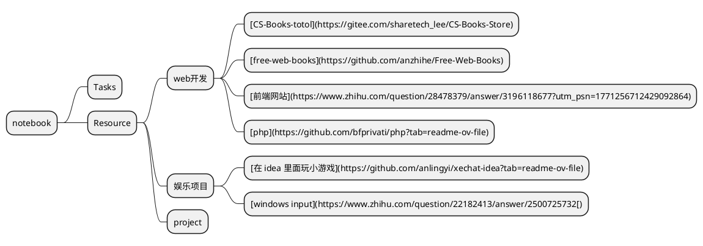

# media

要灵活的使用各种工具，而不能成为工具的奴隶。工具的作用是提高工作效率，而不是考验你的学习能力，尽量使用简单明了的工具，尽可能降低工具的学习成本，有些太过于复杂的工具，虽然可能功能很强大，但是改放弃还是要放弃。记住学习工具的用法是为了使用工具，而不是为了学习工具本身。

## pdf转excel

[参考链接](https://www.cnblogs.com/Yesi/p/17812785.html)

PDF文件是一种静态文档格式，通常难以编辑，而Excel则是一个灵活的表格工具。如果你需要处理PDF表格中的数据，那么将其导出为Excel文件可以大大节省工作时间和精力。Excel提供的强大数据编辑和格式化功能，允许你对转换后的PDF数据进行修改、排序、筛选、计算等操作。同时，你还可以调整单元格大小、更改字体、应用样式等。本文将提供**在Python中将PDF表格转换为Excel文件**的解决方案。

###  环境准备

需要先安装[**Spire.PDF for Python库**](https://www.e-iceblue.cn/Introduce/Spire-PDF-Python.html)来帮助实现PDF转Excel。可以通过以下pip命令安装：（或参考 [如何在 VS Code 中安装 Spire.PDF for Python](https://www.e-iceblue.cn/pdf_python_other/how-to-install-spire-pdf-for-python-in-vs-code.html)）

```
pip install Spire.PDF
```

 

### Python 将PDF转为Excel 实现步骤

1. 加载PDF文档。
2. 创建 **XlsxLineLayoutOptions** 类的对象来指定转换选项。
3. 应用上述设置的转换选项，然后使用 **PdfDocument.SaveToFile()** 将PDF文件保存为Excel xlsx表格。

其中**XlsxLineLayoutOptions**类的构造函数接受以下5个参数:

| **参数**                      | **描述**                                                     |
| ----------------------------- | ------------------------------------------------------------ |
| convertToMultipleSheet (bool) | 表示是否将多个 PDF 页面渲染到一个 Excel 工作表中             |
| rotatedText (bool)            | 表示是否显示旋转的文本                                       |
| splitCell (bool)              | 表示一个包含多行文本的 PDF 表格单元格是否会在 Excel 中被拆分成多行 |
| wrapText (bool)               | 表示是否对 Excel 单元格中的文本进行换行                      |
| overlapText (bool)            | 表示是否显示重叠的文本                                       |

**测试代码：**

```
# 该脚本适用于单页转换
# 多页转换需要参考下面链接（https://www.e-iceblue.com/en/pdf/pdf-to-excel-python.html?gad_source=1&gclid=CjwKCAjwg8qzBhAoEiwAWagLrJtfvbLMmZTchy-zsM7NA3wOXwZLxSqj9WngaXSEJyK7w1spviDjPxoCd48QAvD_BwE）
from spire.pdf.common import *
from spire.pdf import *
 
# 创建PdfDocument对象
pdf = PdfDocument()
 
# 加载PDF文档
pdf.LoadFromFile("数据.pdf")
 
# 创建 XlsxLineLayoutOptions 对象来指定转换选项
convertOptions = XlsxLineLayoutOptions(True, True, False, True, False)
 
# 设置转换选项
pdf.ConvertOptions.SetPdfToXlsxOptions(convertOptions)
 
# 将PDF文档保存为Excel XLSX格式
pdf.SaveToFile("Pdf转Excel.xlsx", FileFormat.XLSX)
pdf.Close()
```

## 音量控制

### 使用PulseAudio音量控制

1. **安装PulseAudio音量控制器**: 首先，安装`pavucontrol`，这是一个用于PulseAudio的图形化音量控制器。打开终端并运行以下命令：

   ```
   sudo apt update
   sudo apt install pavucontrol
   ```

2. **打开PulseAudio音量控制器**: 安装完成后，打开PulseAudio音量控制器。你可以在应用程序菜单中搜索“PulseAudio Volume Control”并打开它，或者在终端中运行：

   ```
   pavucontrol
   ```

3. **调整音量**: 在`pavucontrol`中，导航到“Playback”选项卡，找到正在播放音频的应用程序，并将其音量调高。你也可以在“Output Devices”选项卡中找到输出设备，并将音量调高至超过100%。

## clash

### [clashnode](https://clashnode.github.io/)

免费节点工具

### 设置clash的proxy

```bash
 # 这里用`get`是查看，可以用`set`来进行设置
(base) yang@yang-HP-Pavilion-Laptop-14-dv0xxx:~$ gsettings get org.gnome.system.proxy 
autoconfig-url  ignore-hosts    mode            use-same-proxy  
(base) yang@yang-HP-Pavilion-Laptop-14-dv0xxx:~$ gsettings get org.gnome.system.proxy.http 
authentication-password  enabled                  port                     
authentication-user      host                     use-authentication       
(base) yang@yang-HP-Pavilion-Laptop-14-dv0xxx:~$ gsettings get org.gnome.system.proxy.http host
'127.0.0.1'
(base) yang@yang-HP-Pavilion-Laptop-14-dv0xxx:~$ gsettings get org.gnome.system.proxy.http port
7890
```


## 划词翻译工具

[goldendict](https://github.com/goldendict/goldendict)

A feature-rich dictionary lookup program, supporting multiple dictionary formats (StarDict/Babylon/Lingvo/Dictd) and online dictionaries, featuring perfect article rendering with the complete markup, illustrations and other content retained, and allowing you to type in words without any accents or correct case.

[添加词典](https://www.cnblogs.com/keatonlao/p/12702571.html)

[屏幕取词快捷键](https://blog.csdn.net/robertsong2004/article/details/37922185)

[[GoldenDictOCR ——给GoldenDict添加OCR取词和鼠标取词功能](https://forum.freemdict.com/t/topic/9311)](https://forum.freemdict.com/t/topic/9311)

## 修改文件介绍信息

### 介绍ExifTool

**ExifTool** 是一个功能强大且灵活的命令行工具，用于读取、写入和编辑多种文件格式的元数据，包括图像、音频、视频和PDF文件。由Phil Harvey开发，ExifTool因其灵活性和对多种元数据标准的支持而广泛使用。

### ExifTool的功能

- **读取、写入和编辑元数据**：ExifTool可以处理多种类型的元数据，包括EXIF、GPS、IPTC、XMP、JFIF、GeoTIFF、ICC Profile、Photoshop IRB、FlashPix、AFCP和ID3。
- **支持多种文件格式**：它支持各种文件格式，如JPEG、PNG、TIFF、RAW、PDF、MP4等。
- **批处理**：ExifTool可以一次处理多个文件，使批量元数据操作变得高效。
- **可定制的输出**：用户可以自定义输出格式并选择要显示的元数据字段。
- **高级功能**：包括根据元数据重命名文件、提取嵌入的信息以及在文件之间复制元数据。

### 安装ExifTool

#### 在Debian系系统（如Ubuntu）上：

```bash
sudo apt-get install exiftool
```

### ExifTool的基本使用

#### 查看元数据

要查看文件的元数据，使用：

```bash
exiftool filename.jpg
```

此命令将显示 `filename.jpg` 的所有元数据。

#### 写入元数据

使用 `-tag=value` 格式来写入或修改元数据。例如，设置PDF的作者：

```bash
exiftool -Author="John Doe" document.pdf
```

#### 批处理

通过指定目录或使用通配符来一次处理多个文件：

```bash
exiftool -Author="John Doe" *.pdf
```

#### 复制元数据

从一个文件复制元数据到另一个文件：

```bash
exiftool -TagsFromFile src.jpg dst.jpg
```

#### 重命名文件

可以根据元数据重命名文件。例如，根据拍摄日期重命名图片：

```bash
exiftool '-FileName<CreateDate' -d %Y%m%d_%H%M%S%%-c.%%e *.jpg
```

### 常见用例

#### 更改PDF元数据

更改PDF的标题：

```bash
exiftool -Title="New Title" document.pdf
```

#### 删除元数据

删除文件的所有元数据：

```bash
exiftool -all= filename.jpg
```

#### 提取嵌入信息

从图像中提取嵌入的缩略图：

```bash
exiftool -b -ThumbnailImage -W %d%f_thumb.jpg *.jpg
```

#### 自定义输出

使用 `-p` 选项和格式文件自定义输出格式：

```bash
exiftool -p format.txt filename.jpg
```

### 示例工作流

#### 查看特定标签

如果只想查看特定的标签：

```bash
exiftool -DateTimeOriginal -Model filename.jpg
```

#### 创建备份

ExifTool可以在更改之前创建原始文件的备份：

```bash
exiftool -overwrite_original_in_place -all= filename.jpg
```

### 高级选项

- **-r**：递归处理子目录中的文件。
- **-overwrite_original**：不创建备份，直接覆盖原文件。
- **-ext**：仅处理具有特定扩展名的文件。
- **-if**：应用条件仅处理符合特定条件的文件。

### 总结

ExifTool是任何需要管理文件元数据的人的重要工具。其强大的功能和灵活性使其适用于各种应用，从简单的元数据查看到复杂的批处理和自动化任务。无论你是管理图像元数据的摄影师还是处理文档元数据的档案管理员，ExifTool都能提供所需的工具以简化你的工作流程。

## 文档查询工具(recoll)

### [recoll](https://www.recoll.org/usermanual/usermanual.html)

recoll是一个强大的检索工具，它可以把多种格式的文字数据进行筛选整合以及罗列，是学习的一个利器，但是需要把一些非文字格式的内容转变成文字格式，才能够发挥它强大的威力。

#### [GNUAspell](https://github.com/GNUAspell)

它是一个强大的拼写检查的工具，[这里列出了它的官方的词典](https://ftp.gnu.org/gnu/aspell/dict/0index.html)。

#### jieba

[jieba结巴分词加入自定义词典](https://blog.csdn.net/weixin_43919570/article/details/104333181)

找到 Jieba 词典文件位置

在你的 Python 环境中，运行以下命令来查找 Jieba 的安装目录：

```python
import jieba
print(jieba.__file__)
```

Jieba 是一个流行的中文文本分词工具，广泛用于自然语言处理（NLP）任务。它基于 Python 开发，旨在通过多种分词模式和灵活的定制选项来提供高效的中文分词功能。

[recoll需要使用jieba来操作中文的文件。](https://www.recoll.org/pages/recoll-chinese.html)


## pdf转化成html的工具

### [pdf2htmlEX](https://pdf2htmlex.github.io/pdf2htmlEX/)

pdf2htmlEX renders PDF files in HTML, utilizing modern Web technologies. It aims to provide an accurate rendering, while being optimized for Web display. Text, fonts and formats are natively preserved in HTML. Mathematical formulas, figures and images are also supported.

这个工具需要从github上下载对应的安装包，然后手动下载。亲测这个工具非常好用，以下是效果展示。可以把生成的html再制作成docset，感觉非常舒服。


##  编程文档工具

### [zeal](https://github.com/zealdocs/zeal?tab=readme-ov-file)

**Zeal** 是一个离线文档浏览器，类似于 Dash（用于 macOS）和 Velocity（用于 Windows）。它允许开发者在没有互联网连接的情况下访问大量编程语言、框架和工具的文档。

#### 主要特点

1. **离线访问**：可以在没有互联网连接的情况下查看文档，非常适合在网络不稳定或没有网络的环境中使用。
2. **多种文档支持**：支持数百种编程语言、框架和工具的文档。
3. **快速搜索**：提供快速的全文搜索和即时结果预览。
4. **开源**：Zeal 是开源软件，代码托管在 GitHub 上，任何人都可以贡献和定制。

#### [利用dashing生成docset](https://github.com/technosophos/dashing)（2024/6/8 09:05:34 尝试成功）

##### 安装go以及dashing

```bash
sudo apt install golang-go
# 设置 GOPATH（添加到 .bashrc 或 .zshrc）
echo 'export GOPATH=$HOME/go' >> ~/.bashrc
echo 'export PATH=$PATH:$GOPATH/bin' >> ~/.bashrc
source ~/.bashrc  # 或者 source ~/.zshrc
go install github.com/technosophos/dashing@latest
# 验证安装
dashing --version
```

##### 导航到想要生成docset的html文件夹的目录

##### 用`dashing init`生成需要的配置文件

##### 用`dashing build`生成docset文件

##### 有时候还要改一下生成的plist

```xml
<?xml version="1.0" encoding="UTF-8"?>
<!DOCTYPE plist PUBLIC "-//Apple//DTD PLIST 1.0//EN" "http://www.apple.com/DTDs/PropertyList-1.0.dtd">
<plist version="1.0">
<dict>
	<key>CFBundleIdentifier</key>
	<string>C++ Reference Chinese Version</string>
	<key>CFBundleName</key>
	<string>C++ Reference Chinese Version</string>
	<key>DashDocSetDeclaredInStyle</key>
	<string>originalName</string>
	<key>DashDocSetFallbackURL</key>
	<string>https://zh.cppreference.com/w/%E9%A6%96%E9%A1%B5</string>
	<key>DocSetPlatformFamily</key>
	<string>C++</string>
	<key>isDashDocset</key>
	<true/>
	<key>DashDocSetFamily</key>
	<string>C++</string>
	<key>dashIndexFilePath</key>
	<string>zh/index.html</string>
	<key>isJavaScriptEnabled</key><false/>
</dict>
</plist>
```


#### docset文档生成（这个方法我使用并不成功）

[Docset Generation Guide](https://kapeli.com/docsets#python)

生成 C 语言的 docset 文档，可以使用 Doxygen 来生成 HTML 文档，然后用 `doc2dash` 将其转换为 docset 格式。以下是详细步骤：

##### 安装 Doxygen 和 doc2dash

首先，你需要安装 Doxygen 和 doc2dash：

```sh
sudo apt-get install doxygen
pip install doc2dash
```

#####  生成 Doxygen 配置文件

在你的 C 项目目录下生成 Doxygen 配置文件：

```sh
doxygen -g
```

这将生成一个名为 `Doxyfile` 的配置文件。

##### 配置 Doxygen

编辑 `Doxyfile`，启用 HTML 输出和其他需要的选项：

```sh
# Doxyfile

# 将以下选项设置为 YES
GENERATE_HTML = YES
RECURSIVE = YES

# 设置项目名称和输出目录
PROJECT_NAME = "Your Project Name"
OUTPUT_DIRECTORY = ./docs
HTML_OUTPUT = html
```

##### 生成 HTML 文档

运行 Doxygen 生成 HTML 文档：

```sh
doxygen Doxyfile
```

生成的 HTML 文档将位于 `./docs/html` 目录下。

##### 使用 doc2dash 创建 docset

将生成的 HTML 文档转换为 docset：

```sh
doc2dash -n YourProjectName -I index.html ./docs/html
```

解释每个选项：

- `-n YourProjectName`：指定 docset 的名称。
- `-I index.html`：指定入口文件。
- `./docs/html`：Doxygen 生成的 HTML 文档目录。

##### 移动 docset 到 Zeal 的 docsets 目录

将生成的 docset 移动到 Zeal 的 docsets 目录：

```sh
mv YourProjectName.docset ~/.local/share/zeal/Zeal/docsets/
```

##### 重启 Zeal

重启 Zeal 应用程序以加载新添加的 docset

## ChatGPT类型产品

### [文心一言](https://yiyan.baidu.com/)

### [ChatGPT](https://chat.openai.com/)

### [Gemini](https://gemini.google.com/)

### Grok

grok 是 X 公司研发的一个模型，它有开源的版本

### [kimi](https://kimi.moonshot.cn/)

擅长长文本分析，可以达到二十万字

### [豆包](https://www.doubao.com/chat/)

豆包是字节跳动发布的一个AI模型，这款模型使用起来感觉很不错，比文心一言要好，它在很多细节上下了不少功夫。比如手机端打开app，进入的界面始终都是聊天对话的界面，这也是大多数用户需要的界面。而在电脑端，它又贴心的做了一个[浏览器的插件](https://chromewebstore.google.com/detail/%E8%B1%86%E5%8C%85%EF%BC%8C%E6%B5%8F%E8%A7%88%E5%99%A8-ai-%E5%8A%A9%E6%89%8B/dbjibobgilijgolhjdcbdebjhejelffo?utm_source=web_notsigned)，固定在侧边，十分好用。

## 生成图的工具

### [graphviz](https://graphviz.gitlab.io/doc/info/attrs.html)

## 可视化数据库工具

### [dbeaver](https://dbeaver.io/)

**支持多种数据库**: 包括 MySQL、PostgreSQL、SQLite、Oracle、SQL Server、MariaDB、Sybase、IBM DB2 等。

先从官网下载安装包，但是驱动需要后来打开数据库的时候才会安装，按照导引安装需要的数据库引擎即可。

## adobe DC(pdf的终极解决方案)

试验了很多种把pdf从扫描版转化成文字版的工具，但是最终发现都没有adobe好用，它识别的效果堪称一流，结合recoll搜索的效果堪称一流。[这里是一篇用adobe转化的方法的帖子，可以参考一下。](https://jingyan.baidu.com/article/e5c39bf5648ea478d660333d.html)下面是一张效果图：


## 把扫描版pdf转变成文字版（OCRmyPDF）

**OCRmyPDF**： OCRmyPDF 是一个集成了 PDF 处理和 OCR 功能的工具，可以直接将图片版 PDF 转换为带有文本层的 PDF。

### 安装 OCRmyPDF

```
sudo apt update
sudo apt install ocrmypdf
```

### 使用 OCRmyPDF

```
ocrmypdf -l chi_sim 数学物理方法.pdf 数学物理方法.pdf --force-ocr
```

这个命令会读取 `input.pdf` 并生成一个带有 OCR 文字层的 `output.pdf`。

**注意：**一定要注意使用的语言，如果不对的话默认是英语，扫出来以后用着也不方便。一定要改成想要的语言


## ocr工具

### 安装ocr工具

```bash
sudo apt install tesseract-ocr
apt-cache search tesseract-ocr #找到需要的语言
sudo apt install tesseract-ocr-chi-sim #安装对应的语言
dpkg -L tesseract-ocr-chi-sim #查看语言安装的路径，这里我的是/usr/share/tesseract-ocr/5/tessdata
export TESSDATA_PREFIX=/usr/share/tesseract-ocr/5/tessdata/ #添加这个到~/.bashrc文件
source ~/.bashrc #重新加载.bashrc文件
tesseract --list-langs #查看语言是否安装成功
tesseract ../../Pictures/截图/截图\ 2024-05-09\ 07-25-30.png  output pdf #使用ocr工具进行识别
tesseract output-027.png output-0272 -l chi_sim pdf #注意识别的时候要制定语言，不然默认是英语。
```

### 把图片格式的pdf转化成文字版

```bash
#!/bin/bash

# # 安装必要的软件
# sudo apt-get update
# sudo apt-get install -y poppler-utils 
# sudo apt install pdftk-java

# 将图片格式的PDF转换为图片
pdftoppm 物理学中的群论_马中骐著_7-03-016755-4.pdf output -png

# 进行文本识别并保存为PDF
for file in output-*.png; do
    tesseract "$file" "$(basename "$file" .png)" pdf
done

# 合并文本PDF文件
pdftk output-*.pdf cat output output-text.pdf

mv output-text.pdf ../
# 清理临时文件
rm output-*.png output-*.pdf

echo "转换完成。输出文件为output-text.pdf"

```


## 电子书阅读软件

### okular

#### okular自定义字体颜色以及背景颜色


## 绘制思维导图

### [markmap.js.org](https://markmap.js.org/repl)

## [convert python to c](https://aicodeconvert.com/#google_vignette)


## 转文字

### [图片转文字](https://ocr.wdku.net/)

### [pdf转文字](https://www.pdf2go.com/zh/pdf-to-text)

## [在线颜色表](#在线颜色表)

## 正则表达式

关于正则表达式的标准化文件，目前没有一个单一的全球标准，但是有一些常见的规范和指南可以作为参考。以下是一些常见的正则表达式标准和指南：

1. POSIX 正则表达式标准：
   - POSIX（Portable Operating System Interface）是一个定义了操作系统接口的标准，包括正则表达式。POSIX 正则表达式通常用于 UNIX 和类 UNIX 操作系统中。
2. Perl 正则表达式：
   - Perl 编程语言是一个强大的支持正则表达式的语言，它有一套自己的正则表达式语法和引擎。
3. JavaScript 正则表达式：
   - JavaScript 是一种广泛使用的脚本语言，它也内置了对正则表达式的支持。
   - JavaScript 正则表达式指南：[MDN web 文档 - 正则表达式](https://developer.mozilla.org/zh-CN/docs/Web/JavaScript/Guide/Regular_Expressions)
4. PCRE（Perl Compatible Regular Expressions）库：
   - PCRE 是一种广泛使用的正则表达式库，它兼容 Perl 的正则表达式语法，并提供了丰富的功能。

### [regex101](https://regex101.com/)

### [oschina](https://tool.oschina.net/regex#)

## 文件格式转化工具

### pandoc

#### [官方网站](https://support.typora.io/Install-and-Use-Pandoc/)

#### [教程](https://zhuanlan.zhihu.com/p/542683108)

sudo apt install pandoc

 pandoc --standalone --self-contained --metadata title="Your Document Title" --css ../.config/Typora/themes/github.css resource.md --output resource2.html 

## 浏览器测试工具

[BrowserBench](https://browserbench.org/Speedometer3.0/#running)

谷歌浏览器

edge浏览器

firefox浏览器

## 文字转语音

文字转语音的工具，好用的基本都是收费的，没有很好的免费版本。

一些常见的免费TTS服务和软件可能会提供以下功能和限制：

1. **在线TTS服务**：
   - Google Text-to-Speech：提供免费的文字转语音服务，但可能需要使用Google账号进行访问，并且可能会有一定的使用限制。
   - IBM Watson Text to Speech：提供免费的API服务，但需要注册IBM Cloud账号并获取API密钥，可能会有一定的使用限制。
   - NaturalReader Online：提供免费的在线文字转语音服务，但可能会有一定的使用限制和音质限制。
2. **本地TTS软件**：
   - Balabolka：是一个免费的文字转语音软件，支持多种语音合成引擎，但某些高级功能可能需要购买专业版或者插件。
   - eSpeak：是一个开源的跨平台文字转语音软件，完全免费，但语音质量可能不如商业软件。
   - Festival：也是一个开源的跨平台文字转语音软件，完全免费，但配置和使用可能相对复杂。
3. **程序**：

[edge-tts](#https://www.zhihu.com/question/424950197/answer/3050746876)

2024年5月22日更新

今天我尝试了一个github上的一个开源tts模型，coqui-ai的tts，它的模型使用起来比较简单，可以用conda先创建一个虚拟环境，安装python3.10，然后使用pip安装tts，`pip install TTS`,在下载的过程中还要安装pytorch，可能需要花一定的时间，安装完成之后，可以直接在命令行`tts --text "你好" --model_name "tts_models/zh-CN/baker/tacotron2-DDC-GST" --out_path ./test_speech.wav`,这样就可以把中文文本转化成语音，在第一次使用的时候，会下载一个中文的语音库，大小在600mb左右。下载成功以后就可以正常转化了，也可以使用这个多语言模型，`tts --text "你好" --model_name "tts_models/multilingual/multi-dataset/xtts_v2" --out_path ./test_speech.wav`，不过这个的速度会慢一些。如果不做修改的话，会有转化文字数量的限制，可以从`~/.conda/envs/tts/lib/python3.10/site-packages/TTS/tts/configs/tacotron_config.py`，这个文件夹修改`    max_decoder_steps: int = 10000`,这个值为你想要的更大的值。不过要根据电脑的性能合理考虑，如果文本比较长的话，可能会需要很长时间才可以转化完成。

[更多内容可以参考官方网站](https://github.com/coqui-ai/TTS)，[或者这个知乎上的教程](https://zhuanlan.zhihu.com/p/661291996?utm_campaign=shareopn&utm_medium=social&utm_psn=1776550406338326529&utm_source=wechat_session)。


## video

### mini video

## picture

### [gimp](#gimp)

### 查看svg格式的文件

[svg在渲染中文字体的时候可能会产生问题](https://blog.csdn.net/yydcj/article/details/8489413)

SVG（Scalable Vector Graphics）是一种基于 XML 的矢量图形格式，用于描述二维图形和动画。它是一种开放标准，并且支持伸缩性，因此可以在不同大小的屏幕上保持清晰度和质量。

在 Ubuntu 中，你可以使用以下工具来查看 SVG 文件：

1. **Web 浏览器**：大多数现代的 Web 浏览器（比如 Firefox、Chrome）都支持显示 SVG 文件。你可以直接在浏览器中打开 SVG 文件，进行缩放、导航等操作。
2. **Inkscape**：Inkscape 是一款免费、开源的矢量图形编辑器，支持编辑和查看 SVG 文件。你可以通过 Ubuntu 软件中心或者命令行安装它：`sudo apt install inkscape`。安装完成后，你可以打开 Inkscape 并将 SVG 文件导入到其中查看和编辑。

### [plantuml](https://www.plantuml.com/plantuml/uml/SyfFKj2rKt3CoKnELR1Io4ZDoSa70000)

plantuml可以用来绘制多种格式的图像，包括流程图，思维导图等等




## email

### [google-email](https://mail.google.com/)

## editor（office）

### [office激活](https://www.aichunjing.cn/835.html)

### [libreoffice](https://www.libreoffice.org/download/download-libreoffice/?type=deb-x86_64&version=7.6.6&lang=en-US)

### [TexLive](https://wiki.debian.org/TeXLive)

### [xelatex](https://tug.org/xetex/)

如果直接使用texlive的话，字符编码的问题很难解决，最好的方法还是安装xelatex来解决。

[latex 对中文字体设置的一些解决](https://developer.baidu.com/article/detail.html?id=307422)

[xelatex 的处理中文字体的方法](https://www.cnblogs.com/LitBro/p/12074820.html)

[可以参见stackexchange上面的这个问题，独立解决难度很大，而且费时费力，建议放弃。](https://tex.stackexchange.com/questions/482100/inputenc-unicode-character-not-set-up-for-use-with-latex)

在 Ubuntu 上安装和使用 XeLaTeX 非常简单。以下是安装和使用的步骤：

#### 安装 XeLaTeX：

1. 打开终端。

2. 运行以下命令来安装 Tex Live 发行版，它包含了 XeLaTeX：

   ```
   sudo apt install texlive-xetex
   ```

   这将安装 Tex Live 发行版以及 XeLaTeX。

#### 使用 XeLaTeX 编译 LaTeX 文档：

1. 创建或者打开你的 LaTeX 文档。

2. 在终端中，进入保存 LaTeX 文档的目录。

3. 运行以下命令来使用 XeLaTeX 编译 LaTeX 文档：

   ```
   xelatex your_document.tex
   ```

   这将使用 XeLaTeX 编译名为 `your_document.tex` 的 LaTeX 文档，并生成相应的 PDF 文件。

#### 使用自定义字体：

XeLaTeX 允许你使用系统上安装的任何 TrueType 或 OpenType 字体。要使用自定义字体，可以在 LaTeX 文档的导言区添加 `\setmainfont`、`\setsansfont` 或 `\setmonofont` 命令来设置主要字体、无衬线字体和等宽字体。

例如：

```
latexCopy code\documentclass{article}
\usepackage{fontspec}
\setmainfont{Arial}
\setsansfont{Helvetica}
\setmonofont{Courier New}

\begin{document}

Hello, World!

\end{document}
```

这将在文档中使用 Arial、Helvetica 和 Courier New 字体。

## 文件格式转化

### pandoc

#### 导出模板

pandoc给我们导出的docx或者pdf默认情况下是能够使用的，但很明显学术论文往往有着自己的格式，各大高校也有着各自的样式，所以我们需要自定义自己的模版，你可以使用以下命令来查看默认的word模版：

```bash
pandoc --print-default-data-file reference.docx > custom-reference.docx
```

将在当前目录下的生成一个 `custom-reference.docx` 的模版文件，该文件就是pandoc的默认模版，你可以对各个文字样式、默认表格样式进行修改。Mac 的用户需要注意，使用 Pages 对模板文件进行修改会导致模板失效，需要使用 Office 进行编辑，并使用==兼容模式==进行保存。至于模版如何修改，就根据自身的需求自定义设置了。

模版修改完成之后，可以通过 `--reference-doc=custom-reference.docx`参数来指定模板。例如这里我把导出的custom-reference.docx的字体设置为times new roman，然后通过命令生成一份新的docx文件：

```bash
pandoc --citeproc --bibliography=test.bib --reference-doc=custom-reference.docx test.md -o result.docx
```

然后你就会发现新生成的docx文件的英文字体全部变为了新字体，而其它部分的修改就不一一演示了，感兴趣的话你可以试试用你学校提供的`docx`模版试试效果。

## （解）压缩工具

### zip unzip

zip `name.zip` ./*.c

### tar 

### rar unrar