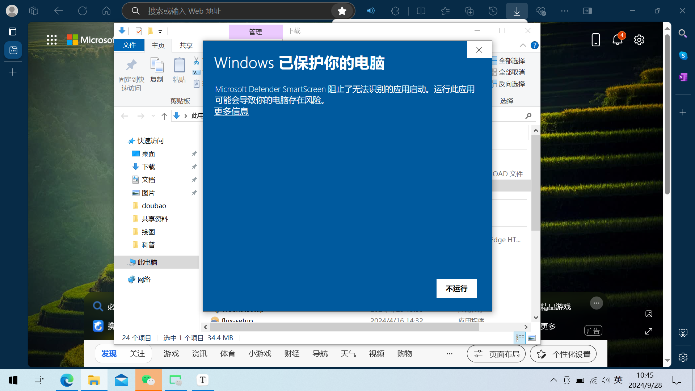
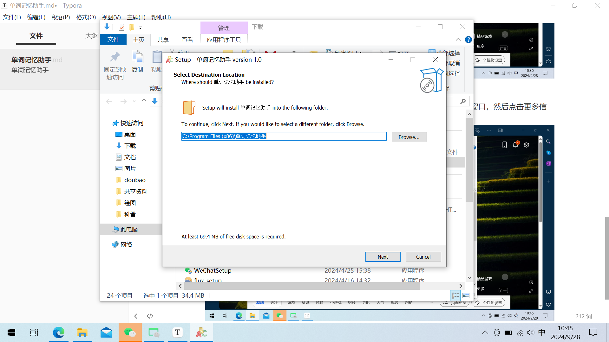
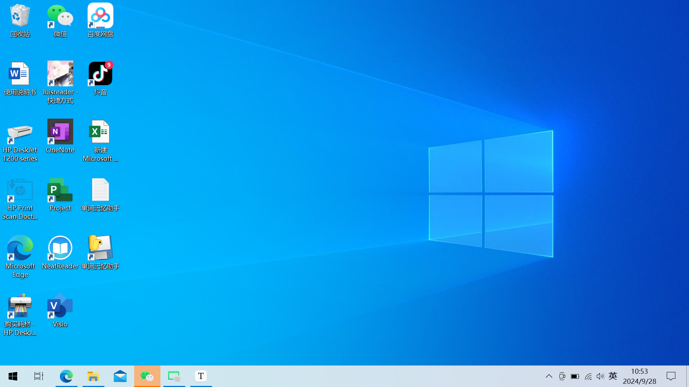
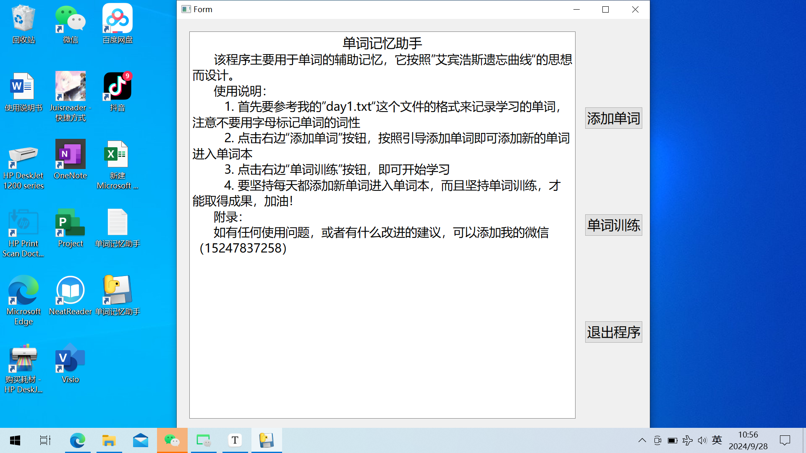
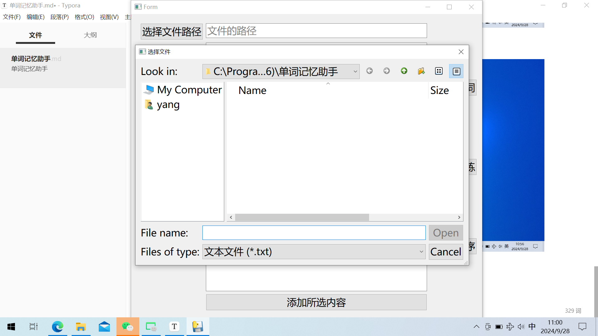
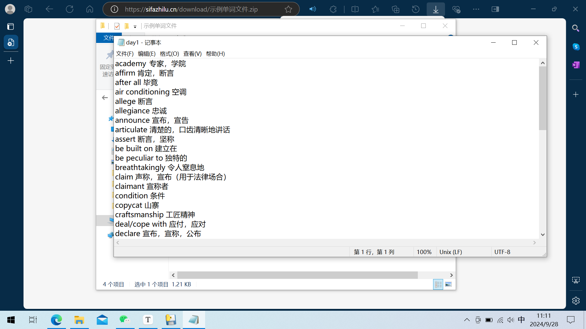
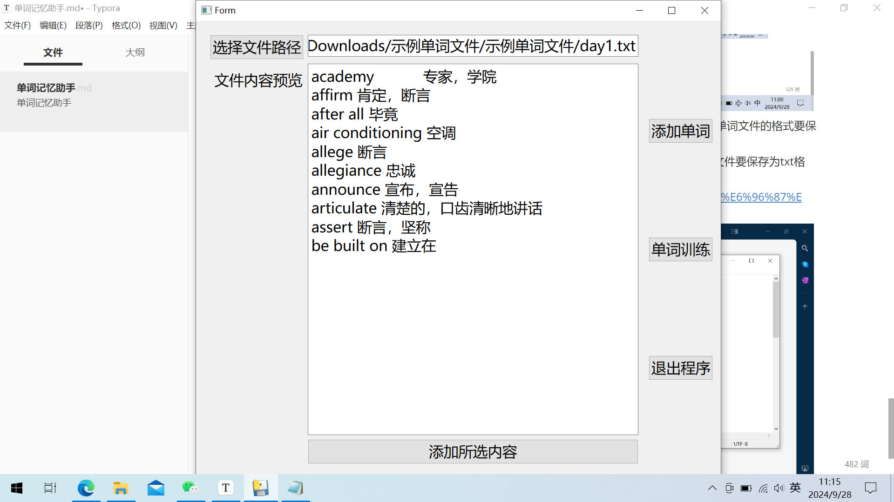
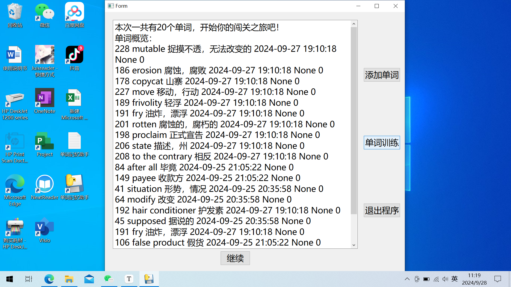
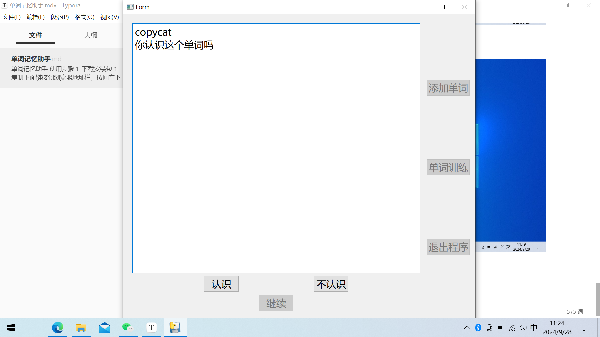
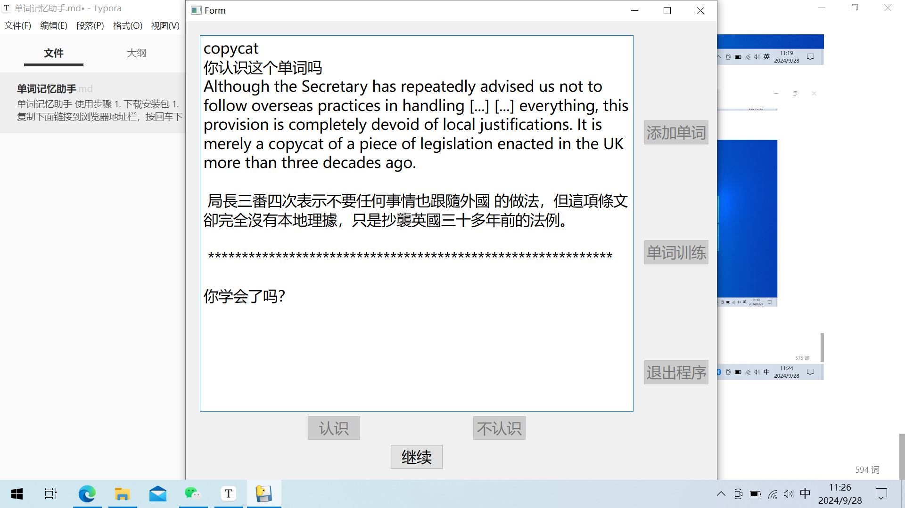

# 单词记忆助手

## 软件介绍

该软件根据”艾宾浩斯遗忘曲线“的思想而设计，应用其记忆思想来制定相应的单词计划，具体如下：

首先需要用户向软件添加单词，在添加单词的时候会记录当天的日期。在进行单词训练时，会先从添加的单词当中选择此次训练的单词，包括下面两个步骤：

1. 从相应日期（今天、昨天、一周前、一个月前）添加的单词中，根据之前的训练正确次数作为参考，各选取 10 个单词，共 40 个单词。
2. 然后还会在所有正确次数小于四个的单词里面再随机选出 10 个单词。

选取单词后会开始单词训练，在训练过程中，会根据用户的学习情况在后台保存相关的记录，从而更好的安排之后的单词训练任务。

## 使用步骤

1. 下载安装包

   1. 复制下面链接到浏览器地址栏，按回车下载该软件安装包，下载中如有提示，按照下图点击保留。
      `http://sifazhilu.cn/download/%E5%8D%95%E8%AF%8D%E8%AE%B0%E5%BF%86%E5%8A%A9%E6%89%8B.exe`
      

   2. 点击页面中的“显示详细信息”
      
   3. 然后点击页面中的"仍然保留"就会开始下载安装包。
      

2. 安装软件
   1. 下载好安装包以后，打开下载的文件夹，然后双击安装包进行安装，会弹出下面窗口，然后点击更多信息，之后点击仍然运行，就会开始安装。
      
   2. 之后按照引导进行安装即可。
      
   3. 安装好以后会在桌面出现“单词记忆助手”的图标，即表示安装完成。
      
3. 添加单词

   1. 点击图标打开软件，然后会进入软件的开始界面，如下图
      
   2. 点击添加单词，然后点击选择文件路径，会出现下面界面。
      
   3. 这时要选择单词 txt 文件添加进去，可以复制下面链接到浏览器下载示例的单词文件，单词文件的格式要保持和下面的图片一致才可以。具体格式:
      前面写单词的英文，后面写单词的翻译（翻译要以中文开头），一行表示一个单词，文件要保存为 txt 格式。
      `http://sifazhilu.cn/download/%E7%A4%BA%E4%BE%8B%E5%8D%95%E8%AF%8D%E6%96%87%E4%BB%B6.zip`
      
   4. 选择好文件之后会出现下面界面，然后点击添加所选内容即可添加成功。
      

4. 单词训练
   1. 点击”单词训练“，界面会展示本组训练的单词，如下图
      
   2. 先大致背诵一下单词，然后点击继续，即进入单词训练模式。
      
   3. 点击认识或不认识之后，会出现如下包含单词的例句的界面，软件会根据所学单词从网络中自动获取相应的例句，而不需要用户自行手动上传单词的例句，这是该软件的优点。
      
